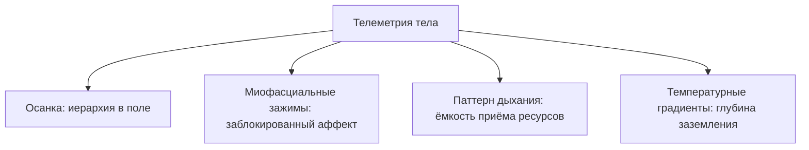

---
title: "Датчики как 3D-карта"
date: "2026-01-26"
tags: ["book", "section-06", "system-reboot"]
excerpt: "Тело не врёт — в отличие от ума, который часами сочиняет, что «всё проработано», пока зажатая грудь молча сливает тебе сделки и отношения. Как читать скрытые баги напрямую с датчиков, в обход красивых отговорок."
category: "book"
author: "john-smith"
media: /images/image.svg
---

# Датчики как 3D-карта

Ум — виртуозный дипломат. Часами, гладкой терминологией, убеждает: «детские травмы закрыты», «обиды отпущены», мышление — на созидание. Складно. С цитатами.

Тем же тоном находит десятки причин, почему переговоры сорвались в последний момент, почему на интервью перехватило дыхание, почему отношения снова уперлись в стену. В отчётах виноваты рынок, подрядчики, погода, «токсичный партнёр». Ни слова о диафрагме, челюсти, ледяных стопах.

Подключи тело — монитор вспыхнет аварийным. Процессор раскалён. В груди — соматический блок десятилетней выдержки. Ум диктует пресс-релиз. Тело отдаёт сырые логи. И именно логи решают банковский счёт и уровень близости, на который ты способен.

Ум охраняет привычный гомеостаз — это его работа. Тело врать не умеет: нет ни органа, ни мотива. Баг, заблокированная эмоция, родовая лояльность записаны в мышцах, фасциях, пульсе прямо сейчас. Задача — читать эту 3D-карту без посредников.

---

## Что читает оператор

В ROOT оператор игнорирует многословные нарративы. Истории ума — беллетристика. Правда — телеметрия. Автономная нервная система выдаёт её за доли секунды до того, как неокортекс соберёт красивое оправдание.

Первый слой — **осанка**. Кто ты на самом деле.

Плечи к ушам — стойка громоотвода: каждую секунду ждёшь удар сверху. Грудина вперёд, лопатки натянуты — годами закрываешь Ядро или тащишь чужую судьбу. С такой осанкой жёсткие переговоры не выигрываются: статус считывают раньше, чем ты откроешь рот.

Обратный вариант — лом в позвоночнике. Не сила — гиперконтроль: кажется, расслабься на миллиметр — мир рухнет. Такая спина жжёт энергию просто чтобы стоять.

Второй слой — **зажимы**. Застрявшие заряды.

Сжатая челюсть, скрежет зубами по ночам — буфер злости. Все разы, когда надо было сказать «нет» заказчику или партнёру — и ты промолчал.

Ком в горле — запертые слёзы бессилия. С таким горлом цену не назовёшь без дрожи.

Окаменевшая поясница, замороженный таз — старый запрет на здоровую агрессию и право занимать место.

Третий слой — **дыхание**. Поверхностное, ключичное, живот втянут — ты извиняешься за каждый кубический сантиметр кислорода. За этим почти всегда дефицит материнского ресурса: страх брать, принимать заботу, впускать крупные контракты и любовь. Рваные паузы на вдохе — детский ужас в диафрагме, которому так и не дали полный выдох.

Четвёртый слой — **температура**. Ледяные ладони, стылые пальцы ног, «не чувствую ног ниже колен» — сознание катапультировалось в абстракции. Периферия без питания. Тело внизу остывает, потому что оператор отсутствует в собственном основании.

---

## Сессия: датчики против железного стартапера

Олег — основатель компании промышленной телеметрии. Высокоточные датчики вибрации для турбин: по спектру находит микротрещину в подшипнике за тысячу километров.

На кресле напротив — человек, чья собственная система шла вразнос.

Запрос стерильный: *«Обычное выгорание. Нужен протокол оптимизации нагрузки, чтобы масштабировать продажи в США»*. Говорил пулемётом — Scrum, unit-экономика, биохакинг. На лице — приклеенная улыбка венчурного питча.

За четыре месяца скорая дважды увозила из офиса с подозрением на прободную язву: желудочный спазм до потери сознания. Гастроскопия — чистая розовая слизистая. «Идеальный желудок. Транквилизаторы и выспитесь».

Ум выдавал доклад о воронке. Тело орало.

Левое плечо судорожно вверх — излом шеи. Пальцы левой руки впились в джинсы над коленкой — белые фаланги. Правая рука безостановочно круговыми движениями тёрла левую сторону грудины — прямо над сердцем, сквозь дорогой свитшот.

> **Терапевт:** Олег, останови отчёт. Замолчи на пять секунд.
>
> **Олег:** *(улыбка даёт сбой и натягивается)* Что-то не так со структурой? Могу в OKR.
>
> **Терапевт:** Посмотри на правую руку. Ты трёшь грудину двенадцать минут. Ткань под пальцами горячая. Что там?
>
> **Олег:** *(рука застывает)* А… шов натирает. Или невралгия, сквозняк в переговорке. Ерунда. Так вот, раунд А…
>
> **Терапевт:** Ты снимаешь спектры с титановых турбин. Сними телеметрию со своей грудины. Ладонь плоско. Всей тяжестью. Глаза закрой. Внимание туда.
>
> **Олег:** У меня с эмоциональным фоном всё в порядке, тесты на депрессию — девять из ста…
>
> **Терапевт:** Не уходи в голову. Ладонь на грудь. Вдохни под ладонь. Что там?
>
> **Олег:** *(неохотно кладёт ладонь, прикрывает веки. Десять секунд. Дыхание рвётся)*
>
> **Терапевт:** Какая форма? Материал? Температура?
>
> **Олег:** *(голос глухой, хриплый)* Железобетонная балка. Холодная, мокрая. Как в сыром подвале. Застряла между рёбер наискосок. Давит на лёгкое. Вдох глубже пяти сантиметров — нельзя.
>
> **Терапевт:** Сколько она там стоит?
>
> **Олег:** *(желваки, холодный пот на виске)* Не знаю. Давно.
>
> **Терапевт:** Тело знает дату. Опустись по балке в тот день, когда её залили. Что произошло?
>
> **Олег:** *(губы мелко дрожат; венчурная улыбка сползает)* Январь. Прошлый год. Морг на окраине Челябинска. Кафель, хлорка, формалин. Старший брат… Дима. Разбился на трассе ночью. Мне отдают его кожаную куртку в пластиковом пакете — засохшая бурая грязь…
>
> **Терапевт:** Что с телом в этом коридоре?
>
> **Олег:** *(крупная дрожь)* Мама упала на колени, кричала так, что стёкла звенели. Отец белый, рука отнялась. Дядя схватил за плечи: «Олег, ты теперь единственный мужчина. Мать не выдержит, если расклеишься. Будь кремнем. Никаких соплей. Держи всё в себе».
>
> **Терапевт:** И что ты сделал?
>
> **Олег:** *(слёзы брызжут)* Прикусил губу до крови… Полный рот солёной крови. Проглотил крик. Почувствовал, как бетон залился в рёбра. Сказал: «Я справлюсь. Я всё решу». Год… ни разу не заплакал! Похороны за сутки. Компанию через месяц. По восемнадцать часов — лишь бы не останавливаться!
>
> **Терапевт:** Твои желудочные приступы — крик Димы, забетонированный в живом мясе. Не язва. Невыплаканный вой по брату, который рвёт внутренности, пока ты рисуешь графики инвесторам. Посмотри на Диму. Он перед тобой.
>
> **Олег:** *(падает вперёд, локти в колени — гулкий, хриплый плач из нутра. Левое плечо бьётся в судорогах и рывками опускается. Тело сбрасывает годовой спазм)*

Десять минут рыданий. Потом — только дыхание. Плечи на одном уровне. Пальцы свободны. Кожа тёплая.

> **Терапевт:** Рука на грудь. Где балка?
>
> **Олег:** *(ощупывает рёбра)* Её нет. Пусто и горячо. Как печь растопили. В желудке отпустило. Я даже не замечал, что живот всё время был притянут к позвоночнику. *(длинный вдох до таза)* Господи, как легко дышать.
>
> **Терапевт:** Как теперь выглядит проект и выход на рынок?
>
> **Олег:** *(тихо)* Мне больше не нужно доказывать, что я кремень, чтобы жить за двоих. Команда задыхалась от моего напряжения. Я перестал быть бомбой. Теперь можно просто работать.

Через две недели приступы прекратились без таблеток. Переговоры в США — контракт. Партнёры отметили: от основателя шла спокойная взрослая сила, а не лихорадочный надрыв загнанного робота.

---

> [!NOTE]
> ## Научный блок: интероцепция и соматические маркеры
>
> Дамасио доказал: тело решает раньше ума. Кожно-гальваника и вентромедиальная префронтальная кора меняются за миллисекунды до рационального вывода. Висцеральный отклик — спазм сосудов, ритм сердца, сжатие диафрагмы — маркирует выбор «опасно / безопасно» до анализа.
>
> Крейг описал контур интероцепции: сигналы от органов и фасций идут в островковую кору. Там сырые параметры складываются в чувство «я существую сейчас».
>
> Отключаешь алерты рационализациями («со мной всё в порядке, это сквозняк») — аппаратная перегрузка никуда не девается. Аффект жрёт такты в скрытом гипертонусе. Масштабировать бизнес или близость на подавленном соматическом крике — путь к отказу оборудования: паника, кризис, перфорация.

---

## Практика: аппаратное сканирование контура

1. **Инициализация.** Сядь устойчиво. Стопы всей подошвой. Глаза закрой. Луч внимания сверху вниз:
   * **Челюстной замок:** сомкнуты ли коренные? Напряжён ли корень языка?
   * **Плечевой пояс:** трапеции у мочек ушей? Мешок на спине?
   * **Диафрагма:** двигается ли живот — или кислород застрял в ключицах?
   * **Периферия:** температура в подушечках пальцев и подошвах?
2. **Изоляция алерта.** Одна зона с наибольшим напряжением или холодом. Ладонь туда. Без интерпретаций ума:
   * Геометрия (ком, штырь, плита, жгут)?
   * Плотность (лёд, дерево, чугун, свинец)?
3. **Прямой опрос:**
   > «Какое невысказанное чувство заблокировано здесь? Кому оно предназначалось?»
   Первый импульс — лицо, фраза, сдавленный крик — без цензуры.
4. **Легализация:**
   > «Я вижу этот сигнал. Больше не маскирую рационализациями. Разрешаю импульсу завершить движение в мышцах».
5. **Сброс.** Девяносто секунд. Жди непроизвольный выдох, зевок, тепло в ладони.

> [!IMPORTANT]
> **Закон главы**
> Телесные датчики транслируют истинное состояние системы без искажений цензуры, и именно их пропускная способность определяет реальный масштаб твоих финансовых и личных результатов.
