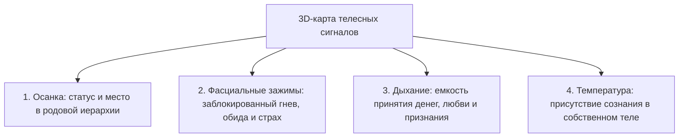

# Тело как 3D-карта: почему ум врёт, а мышцы помнят всё

Человеческий ум — виртуознейший дипломат и непревзойденный сочинитель сказок.

Он способен часами, используя красивую научную и психологическую терминологию, убеждать тебя и окружающих в том, что «все детские гештальты давно закрыты», «старые обиды отпущены», а мышление настроено исключительно на созидание и успех. Всё звучит складно, логично и подкреплено умными цитатами.

Но тем же самым уверенным тоном ум находит десятки внешних оправданий: почему ключевые переговоры внезапно сорвались за минуту до финала, почему на публичном выступлении предательски перехватило дыхание, а многообещающие отношения снова уперлись в глухую стену. 

В отчетах ума всегда виноваты плохой рынок, незрелые партнеры, магнитные бури или кризис. И ни единого слова о сжатых до боли челюстях, заблокированной диафрагме и ледяных подошвах.

Ум изо всех сил охраняет привычный комфорт и защищает эго. 

А тело врать не умеет. У него нет для этого ни специального органа, ни скрытого мотива. Любая подавленная эмоция, невыплаканное горе, древний страх или застарелая семейная тайна прямо сейчас с абсолютной точностью запечатаны в твоих мышцах, в фасциях, в рисунке дыхания и в температуре кожи.

И именно эти телесные сигналы, а вовсе не красивые слова, определяют твой реальный финансовый доход, здоровье и глубину близости, на которую ты способен.

---

> [!NOTE]
> Всемирно известный нейробиолог Антонио Дамасио в своей революционной работе «Ошибка Декарта» экспериментально доказал гипотезу **соматических маркеров**. 
> 
> Наше тело принимает решение за доли секунды до того, как рациональный ум успевает сформулировать первую логическую мысль. Висцеральные реакции — микроспазмы сосудов, изменение сердечного ритма, сжатие кишечника и напряжение диафрагмы — мгновенно маркируют любую входящую ситуацию как «опасную» или «безопасную». 
> 
> Профессор Бад Крейг открыл анатомический контур **интероцепции**: чувствительные нервные пути непрерывно передают сигналы от внутренних органов и глубоких фасций в островковую кору мозга (insula). Именно там из этих сырых физиологических ощущений рождается глубинное чувство «Я существую здесь и сейчас».
> 
> Если человек привык игнорировать сигналы тела, заглушая тревогу алкоголем, кофе или рационализациями («это просто усталость, это сквозняк»), подавленный аффект никуда не исчезает. Он уходит в хронический мышечный гипертонус. Пытаться масштабировать бизнес или строить семью на заблокированном теле — всё равно что разгонять гоночный болид с зажатым ручным тормозом: неизбежно закипит двигатель и сгорят тормозные колодки.

---

## Железобетонная балка в груди инженера

Олег — создатель и руководитель высокотехнологичной компании в области промышленной телеметрии. Его предприятие разрабатывает сверхчувствительные вибродатчики для газовых турбин: по микроскопическому изменению спектра колебаний приборы Олега способны обнаружить микротрещину в лопатке подшипника за тысячи километров.

Но в кресле перед психотерапевтом сидел человек, чья собственная внутренняя конструкция трещала по швам.

Его запрос звучал безупречно сухо и по-деловому: «Обычное сезонное выгорание. Мне нужен четкий протокол оптимизации сна и нагрузок, потому что через месяц мы выходим на международный раунд инвестиций». Олег говорил как из пулемета — жонглировал бизнес-терминами, сыпал показателями конверсий, а на его лице сияла приклеенная, дежурная улыбка успешного стартапера.

Но факты говорили о другом: за последние четыре месяца скорая помощь дважды увозила Олега прямо с совещаний в реанимацию с подозрением на прободную язву желудка — дикий, парализующий спазм скручивал его до потери сознания. Врачи проводили экстренную гастроскопию и разводили руками: «Слизистая оболочка желудка абсолютно розовая и чистая. Идеальное здоровье. Попейте успокоительное и выспитесь».

Ум Олега бодро рапортовал о покорении рынков. А его тело буквально кричало от невыносимой боли.

Левое плечо мужчины было неестественно вздернуто к самому уху, изламывая шею. Пальцы левой руки мертвой хваткой вцепились в джинсы над коленом, побелев в суставах. А правая рука безостановочно, монотонными круговыми движениями растирала левую сторону грудины — прямо над сердцем, сквозь дорогую ткань свитшота.

> **Терапевт:** Олег, остановись на секунду. Замолчи. Сделай паузу.
>
> **Олег:** *(его улыбка на миг дает трещину, но он тут же возвращает маску)* Что-то не так с презентацией? Могу рассказать про финансовую модель подробнее.
>
> **Терапевт:** Посмотри на свою правую руку. Ты трешь себе грудину уже пятнадцать минут без перерыва. Ткань свитера под твоими пальцами буквально горит. Что там болит?
>
> **Олег:** *(рука замирает)* А… Да ерунда. Наверное, шов натирает. Или невралгия межреберная — кондиционер в офисе продул. Пустяки. Так вот, по поводу раунда финансирования…
>
> **Терапевт:** Олег, ты виртуозно умеешь снимать вибрации с титановых турбин. Сними телеметрию с собственного тела. Положи ладонь плоско на грудь. Всей тяжестью. Закрой глаза. Направь всё внимание туда.
>
> **Олег:** Да бросьте, у меня всё отлично с эмоциями, я стрессоустойчивый человек…
>
> **Терапевт:** Не уходи в голову. Положи ладонь на грудь. Сделай вдох прямо под пальцы. Что там?
>
> **Олег:** *(неохотно подчиняется, прикрывает веки; проходит десять секунд тишины — и вдруг его дыхание со свистом срывается)*
>
> **Терапевт:** Какой это предмет? Какая форма, вес, температура?
>
> **Олег:** *(его голос становится хриплым, глухим, надтреснутым)* Балка… Железобетонная строительная свая. Мокрая, ледяная, шершавая. Как из сырого подвала. Она застряла наискосок между ребер. Давит на левое легкое. Мне… мне вдохнуть глубже пяти сантиметров нельзя.
>
> **Терапевт:** Тело помнит дату. Опустись вниманием в тот день, когда этот бетон залили в твою грудь. Что тогда произошло?

Олег судорожно сжал челюсти. По его виску покатилась капля холодного пота. Вся его напускная уверенность бизнесмена осыпалась в прах. Губы мелко задрожали:

— Январь… Прошлый год. Морг на окраине Челябинска. Белый кафель, запах хлорки и формалина… Мой старший брат Дима. Он разбился на обледенелой трассе ночью… Самосвал вылетел на встречку. Мне в коридоре санитары вынесли его кожаную куртку в черном мешке — вся в засохшей бурой глине…

> **Терапевт:** Что происходило в том коридоре морга?
>
> **Олег:** *(его начинает сотрясать крупная дрожь)* Мама рухнула на колени на грязный кафель, закричала так, что зазвенели стеклянные шкафы. У отца отнялась левая рука, он побелел как мел. А дядя… дядя схватил меня за плечи, встряхнул изо всех сил и закричал прямо в лицо: «Олег! Димы больше нет! Ты теперь единственный мужчина в семье! Если ты сейчас расклеишься — мать сойдет с ума и умрет! Ты обязан быть кремнем! Никаких слез! Заткнись и держи всё в себе!»
>
> **Терапевт:** И что ты сделал, Олег?
>
> **Олег:** *(из глаз брызнули слезы)* Я прикусил нижнюю губу до крови… Полный рот горячей соленой крови. Я сглотнул этот крик. Я физически почувствовал, как в мои ребра залили холодный жидкий бетон. Я сказал дяде: «Я справлюсь. Я всё решу». Я организовал похороны за одни сутки. Через месяц открыл компанию. Я пахал по восемнадцать часов в сутки без выходных — лишь бы ни на секунду не останавливаться, лишь бы не слышать этой тишины! Я за весь год ни разу… ни одной слезинки не проронил!
>
> **Терапевт:** Твои желудочные приступы — это не язва, Олег. Это крик по Диме, заживо замурованный в твоем теле. Это невыплаканный вой по погибшему брату, который разрывает твои внутренности, пока ты рисуешь красивые графики инвесторам. Посмотри на Диму. Он здесь.

Олег согнулся пополам, уперся локтями в колени — и из его груди вырвался страшный, хриплый, первобытный рев. 

Его левое плечо забилось в конвульсиях и с каждым толчком плача рывками опускалось на законное место. Мужчина плакал навзрыд двадцать минут, сбрасывая с себя многотонный груз годового оцепенения.

А затем наступила тишина.

Плечи Олега выровнялись. Пальцы расслабленно легли на колени. Кожа потеплела.

> **Терапевт:** Положи руку на грудь. Где бетонная балка?
>
> **Олег:** *(осторожно ощупывает свои ребра, на лице появляется ошеломленное выражение)* Ее нет… Там пусто, просторно и горячо. Будто в груди растопили русскую печь. И в желудке отпустило. Я даже не понимал, что мой живот целый год был намертво втянут и прижат к позвоночнику… *(делает протяжный, глубокий вдох до самого низа живота)* Боже мой… Как же легко дышать.
>
> **Терапевт:** Как теперь выглядит твой проект и выход на международный рынок?
>
> **Олег:** *(тихо, с теплой улыбкой)* Мне больше не нужно никому доказывать, что я кремень. Мне больше не нужно надрываться за двоих. Моя команда задыхалась от моего безумного напряжения. Я перестал быть пороховой бочкой. Теперь можно просто спокойно работать.

Через две недели приступы желудочных колик прекратились навсегда. А переговоры завершились триумфальным подписанием контракта: инвесторы признались, что от Олега исходила спокойная, взрослая, монолитная уверенность мастера.

---

## Четыре слоя телесной карты

### 1. Осанка: кто ты в поле отношений
- **Плечи, вздернутые к ушам:** стойка вечного громоотвода, постоянное ожидание удара сверху.
- **Грудь колесом при втянутом животе:** маска ложной силы, скрывающая внутренний страх разоблачения.
- **Сгорбленная спина:** многолетний груз чужой ответственности, согнувший человека к земле.

### 2. Зажимы: застрявшие эмоции
- **Сжатые челюсти, скрежет зубами по ночам:** запертая здоровая агрессия, непроговоренное «нет».
- **Ком в горле:** проглоченные слезы беспомощности и стыда.
- **Холодный ком под пупком:** замерший детский ужас одиночества.

### 3. Дыхание: объем жизненной силы
- Поверхностное ключичное дыхание свидетельствует о страхе проявляться и занимать место в мире. Человек бессознательно извиняется за каждый глоток воздуха.
- Свободное дыхание животом открывает способность легко принимать крупные деньги, признание и искреннюю любовь.

### 4. Температура: глубина заземления
Ледяные ладони и стопы — верный признак того, что сознание сбежало из физического тела в бесконечную ментальную жвачку. Возвращение тепла в стопы возвращает человеку твердую почву под ногами.

---

## Практика: сканирование собственной карты

Выдели десять минут тишины. Сядь удобно на стул, поставь стопы на пол и закрой глаза:

### 1. Внутренний луч внимания
Медленно проведи лучом внимания по телу сверху вниз:
- **Челюсти:** сомкнуты ли зубы? Напряжен ли корень языка? Разомкни их.
- **Шея и плечи:** опусти плечи вниз, освобождая шею.
- **Грудная клетка:** может ли грудь свободно расширяться на вдохе?
- **Живот:** расслабь брюшную стенку, позволь животу стать мягким и живым.
- **Стопы:** почувствуй надежную опору пола под подошвами.

### 2. Локализация главного сигнала
Найди в теле одну точку наибольшего напряжения или холода. Положи туда теплую ладонь. Опиши ее внутренним взором: форма, вес, температура.

### 3. Прямой вопрос к телу
Спроси зажим напрямую:
- *«Какое невысказанное чувство живет здесь?»*
- *«Кому предназначались эти невыплаканные слезы или сдержанный крик?»*
Прими первый всплывший образ без цензуры и критики.

### 4. Легализация и разрядка
Произнеси вслух:

> *«Я вижу этот сигнал. Я больше не прячу его за красивыми словами. Я признаю эту боль. Я разрешаю этому застрявшему чувству выйти на свободу».*

Сделай глубокий выдох со звуком. Почувствуй, как тепло от ладони мягко проникает вглубь тканей, растворяя старый лед. Твое тело возвращается к жизни.

---

> [!IMPORTANT]
> **Главная мысль главы**  
> Тело — единственный прибор, который транслирует чистую правду без дипломатии ума. Научившись слышать сигналы своих мышц, ты получаешь прямой доступ к штурвалу своей судьбы.

---

> [!TIP]
> **Интерактивный помощник**  
> Если сканирование тела вскрыло тяжелый ком в грудине или комок в горле, который не тает — напиши в диалоговом окне внизу страницы. Мы поможем бережно расшифровать этот сигнал и вернуть свободное дыхание.
