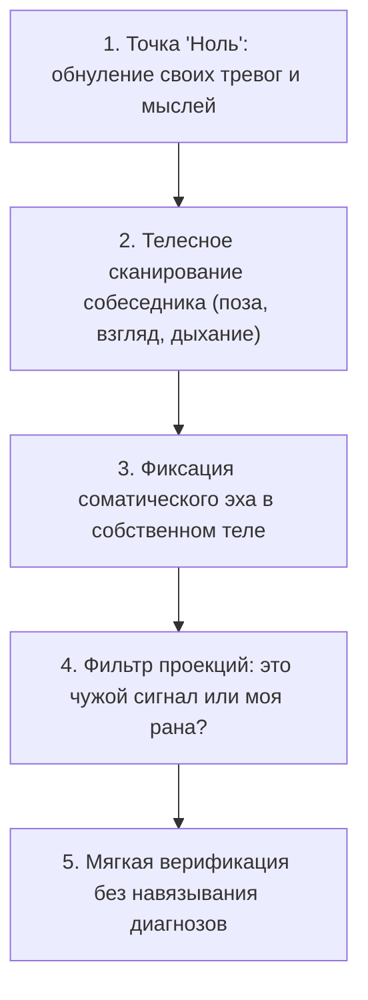

# Сенсорная эмпатия: как слышать другого, не путая его с собой

Почти каждый человек свято убежден в том, что он «прекрасно разбирается в людях» и обладает тонкой интуицией.

Но если присмотреться к тому, как рушатся деловые переговоры, собеседования и первые свидания, вскрывается горькая правда. То, что мы в быту гордо называем проницательностью, в девяти случаях из десяти оказывается нашими собственными незажившими ранами, вывернутыми наизнанку.

**Загрязненная антенна ловит исключительно собственные помехи.**

Человек, выросший с холодным, отвергающим отцом, в каждом строгом взгляде начальника видит смертельную угрозу и начинает защищаться задолго до нападения. Женщина, пережившая предательство, в малейшей естественной усталости партнера чует скорый разрыв и своими подозрениями разрушает искреннюю любовь.

Мы смотрим на человека напротив, а видим лишь кривое зеркало собственной неисцеленной боли.

Истинная сенсорная эмпатия начинается в совершенно другой точке. Прежде чем пытаться расшифровать чужое состояние, необходимо привести свой собственный внутренний приемник в состояние абсолютной тишины и чистоты.

---

> [!NOTE]
> В 1990-х годах итальянские нейрофизиологи Джакомо Риццолатти и Витторио Галлезе совершили фундаментальное открытие, обнаружив в коре головного мозга **зеркальные нейроны**. 
> 
> Когда мы наблюдаем за эмоциями или действиями другого живого существа, в нашей собственной премоторной и теменной коре мгновенно активируются те же самые нейронные цепочки. Наше тело воспроизводит мышечный тонус, микродвижения и дыхательный рисунок собеседника в режиме реального времени. Мы чувствуем другого не абстрактной мыслью, а буквальным висцеральным откликом.
> 
> Однако профессор Таня Зингер в ходе масштабных исследований на базе функциональной МРТ выявила критическую разницу между двумя режимами работы этой системы:
> 
> 1. **Эмпатический дистресс:** чужая боль или страх мгновенно поджигают твои собственные непроработанные травматические очаги (островковую кору и переднюю поясную извилину). Ты не помогаешь другому — ты сам проваливаешься в панику, агрессию или желание немедленно разорвать контакт, чтобы спастись.
> 2. **Сострадательное присутствие:** состояние внутренней стабильности («точка ноль»), при котором активируются вентральный стриатум и орбитофронтальная кора. Вырабатываются окситоцин и дофамин. Человек способен ясно считывать боль другого, не разрушаясь и не проваливаясь в собственные детские обиды.

---

## Исповедь терапевта: ошибка, которая едва не сломала судьбу

Несколько лет назад ко мне на прием пришла женщина тридцати восьми лет. Статная, строгая, коммерческий директор крупной логистической компании. 

Ее запрос звучал как крик отчаяния: она годами тянула на себе младшего брата-игромана, закрывала его многомиллионные долги, оплачивала адвокатов, влезала в кабальные кредиты и тем самым методично разрушала собственный брак.

Я настроил внутреннее внимание, взглянул на нее — и меня буквально накрыло ледяной волной.

Слева за ее спиной мне отчетливо почудилась тяжелая, глухая, мертвенно-холодная женская фигура. Мое собственное горло перехватило колючим спазмом, сердце заколотилось. В голове вспыхнула яростная, железобетонная мысль:

*«Всё ясно! Холодная, бессердечная мать! Она с детства отвергала дочь, внушала ей чувство вины и заставляла заслуживать любовь спасением никчемного младшего брата!»*

Я уже набрал в грудь воздух, чтобы выдать клиентке этот блестящий, карающий диагноз. Мое терапевтическое эго уже праздновало легкую победу.

И в этот критический миг сработал внутренний предохранитель. Я замер на полувдохе. И направил сканер внимания внутрь себя.

В тишине кабинета перед моим внутренним взором внезапно вспыхнул… вчерашний вечер. Одиннадцать часов ночи. Мой собственный тяжелейший разговор по телефону с моей матерью. 

Я вспомнил, как бросил трубку в бессильной ярости с тем самым колючим комком в горле: меня снова не услышали, снова обесценили мои успехи. Этот ядовитый эмоциональный осадок висел во мне со вчерашнего вечера, ожидая повода взорваться.

Я похолодел от ужаса. Я едва не вылил свою собственную детскую обиду в открытую душу доверившейся мне женщины. Я чуть не навязал ей ложный образ матери, чуть не разрушил ее семью ради того, чтобы отомстить собственным призракам.

Я закрыл глаза. Положил руки на колени, сделал три длинных, медленных выдоха до самого пола. Я мысленно отодвинул образ собственной матери в сторону, очистив внутреннее пространство до хрустальной пустоты.

И снова посмотрел на клиентку чистым взором.

И никакой холодной матери за ее спиной больше не было.

Там ощущалась совершенно иная пустота — светлая, щемящая, теплая, полная сиротской тоски. Это был образ отца, трагически погибшего на шахте, когда ее брату было всего три года. Мать не отвергала дочь — мать надрывалась от горя и нищеты. А двенадцатилетняя девочка надела отцовскую куртку и поклялась защищать маленького брата ценой собственной жизни, потому что защитить его было больше некому.

Я помолчал несколько секунд и негромко спросил:

— Скажите… Откликается ли в вашем сердце образ отца, чье место в семье опустело слишком рано?

Женщина вздрогнула всем телом. Ее плечи, державшие многотонный груз вины, медленно опустились. Она закрыла лицо ладонями и зарыдала — горько, светло, освобождающе:

— Папа… Я с двенадцати лет стою на его месте… Я так смертельно устала быть старшим мужчиной в этом доме…

Исцеление состоялось. Но этот случай навсегда научил меня смирению: чистый контакт с чужой душой возможен лишь тогда, когда ты смыл собственную грязь со своего приемника.

---

## Загадка «Сладкая ложь у порога смерти»

> [!TIP]
> **Притча о последней правде**  
> Пожилая женщина лежит в палате реанимации на пороге смерти. Ее пульс угасает. Два дня назад ее единственный любимый сын трагически погиб в автокатастрофе. 
> 
> Умирающая мать с трудом приоткрывает сухие веки и шепчет склонившемуся врачу пересохшими губами: «Доктор… скажите правду… Как мой Алешенька? Он успеет приехать, чтобы попрощаться?»
> 
> Кардиолог предупреждает: если сказать правду — старое сердце разорвется от невыносимой боли, и она уйдет в страшных судорогах. Если сказать утешительную ложь: «Да, он уже едет из аэропорта, вот-вот будет», — женщина уснет тихо, с блаженной улыбкой на лице.
> 
> **Голос Расчета:** Соврать во спасение. Зачем мучить уходящего человека жестокой правдой, которая уже ничего не изменит? Милосердная ложь здесь — единственный гуманный поступок.  
> **Голос Правила:** Сказать правду. Ложь оскорбляет величие человеческого духа перед лицом вечности. Мать имеет святое право встретить смерть лицом к лицу с реальностью своей судьбы.  
> **Голос Души:** Сжать ее холодную руку, взять этот грех на свою совесть и дать человеку уйти в мире и покое.  
> 
> *Вопрос силы:* Имеет ли право человек из своей человеческой жалости лишать другую душу ее подлинной трагедии и последнего контакта с истиной?

---

> [!NOTE]
> **Разбор притчи через чистую эмпатию**  
> Заметь коварную ловушку: все три голоса немедленно заставляют тебя примерить мантию всемогущего судьи. Ты мечешься между абстрактной правдой и жалостливой ложью, но в этой суете ты думаешь исключительно о себе — о своем моральном облике и своем страхе.
> 
> Чистая эмпатия задает принципиально иной вопрос: **какой сигнал транслирует система самой умирающей матери прямо сейчас?**
> 
> Прежде чем раскрыть рот, опытный человек освобождает свое восприятие от морализаторства. Он смотрит на тонус ее лица, на глубину вздоха, на то, как ее пальцы касаются простыни. И спрашивает себя: *«Мое желание сказать правду — это служение истине или мой трусливый детский страх быть пойманным на лжи? Мое желание соврать — это милосердие или неспособность выдержать чужое горе?»*
> 
> И лишь затем он накрывает ее стынущую руку своей теплой ладонью и тихо спрашивает сердцем: *«Чего вы хотите больше всего прямо сейчас?»*
> 
> Тело человека перед смертью отвечает мгновенно. Если ее пальцы судорожно цепляются за врача, требуя подтверждения жизни сына любой ценой, — бросить ей в лицо страшную правду будет актом жестокого нарциссизма. Но если ее веки опущены, а на дне застывших зрачков читается тихое, безмолвное знание трагедии — утешительная сказка станет предательством ее святого материнского горя.
> 
> Сенсорная эмпатия не пользуется шаблонными догмами. Она смывает собственный шум, чтобы дать место подлинной правде другого человека.

---

## Пять шагов точной соматической настройки

### 1. Вход в точку «Ноль»
Сядь устойчиво, ощути стопами пол. Сделай три глубоких выдоха, мысленно выгружая из головы споры, вчерашние обиды и планы на вечер. Твой внутренний сосуд должен стать прозрачным.

### 2. Внимание на человека
Направь спокойный, безоценочный взгляд на собеседника. Обрати внимание на его дыхание (грудь или живот?), на микропаузы перед сложными темами, на то, как напряжены его пальцы.

### 3. Регистрация телесного отклика
Прислушайся к собственному телу: где в ответ возникло ощущение?
- Сжало ли горло?
- Появился ли холод в солнечном сплетении?
- Онемел ли затылок?
Твои зеркальные нейроны уже уловили состояние другого человека за доли секунды до слов.

### 4. Фильтр собственных проекций
Задай себе ключевой вопрос: *«Это ощущение действительно принадлежит человеку напротив, или это отголосок моего вчерашнего страха и обиды?»* При малейшем сомнении сделай глубокий вдох-выдох и вернись в нейтральное присутствие.

### 5. Мягкая верификация
Никогда не ставь собеседнику высокомерных диагнозов («у тебя блок из-за мамы»). Спроси бережно: *«Когда мы коснулись этой темы, в воздухе возникло ощущение тяжести и тревоги… Имеет ли это отношение к тому, что вы чувствуете прямо сейчас?»* Дай человеку пространство выбора. И его тело само подтвердит правду.

---

> [!IMPORTANT]
> **Главная мысль главы**  
> Пока внутри тебя бушуют собственные невыплаканные обиды, ты обречен видеть в каждом собеседнике своих личных призраков. Чистая эмпатия рождается только в тишине исцеленного сердца.

---

> [!TIP]
> **Интерактивный помощник**  
> Если в общении с близкими или коллегами ты постоянно проваливаешься в чужую тревогу или раздражение — напиши в диалоговом окне внизу страницы. Мы поможем бережно откалибровать твой внутренний компас и отделить свои чувства от чужих.
