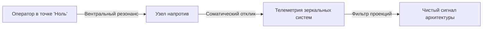

# Сенсорная эмпатия

В прошлой главе ты читал датчики своего тела. Теперь сонар наружу — на человека напротив. Здесь ловушка.

**Грязная антенна ловит только собственные помехи.**

Почти каждый уверен, что «хорошо чувствует людей». На деле бытовая «проницательность» — часто твоя непрожитая боль, выданная за эмпатию.

Так рушатся переговоры, собеседования, свидания. Старый страх отвержения читаешь как «он холоден» — и своими руками ломаешь то, что могло состояться.

Порядок: сначала обнули приёмник. Потом расшифровывай сигнал.

---

## Как работает чистая антенна

Тело — точный приёмник. Когда внутри тихо и внимание на другом — нервная система резонирует с его состоянием.

* **Соматическое эхо.** Внимание на партнёра — и горло сдавливает ледяным спазмом, в глазах сухое жжение. Рассудок: «С чего вдруг? У меня всё стабильно». Тело уже перехватило пакет невыплаканного горя за доли секунды до первого слова.
* **Геометрия поля.** Откалиброванная система чувствует слепые зоны: сквозняк слева за спиной, холод в лопатках — исключённые родовые фигуры.
* **Дешифровка масок.** Собеседник сыплет цифрами и улыбается — антенна ловит высокочастотный скрежет вегетативного перегрева и скрытого отчаяния.

**Чистота сигнала = чистота твоего контура.** Тлеет конфликт с матерью или обида на отца — увидишь тирана в каждом строгом руководителе. Твой баг перекроет реального человека.

Сломанный приёмник не читает эфир. Он транслирует свою поломку.

---

> [!NOTE]
> ## Научный блок: зеркальные системы и эмпатический дистресс
>
> Риццолатти и Галлезе открыли зеркальные нейроны: наблюдаешь чужое действие или эмоцию — в твоём мозге вспыхивают те же премоторные и теменные зоны. Тело воспроизводит микродвижения и спазмы другого в реальном времени.
>
> Зингер на фМРТ разделила два режима. Эмпатический дистресс: чужая боль зажигает твою сеть боли — островковую долю и поясную кору. Ты не считываешь — заражаешься, проваливаешься в свою травму, хочешь защититься или разорвать контакт.
>
> Сострадательное присутствие из точки нуля включает другой контур — вентральный стриатум, орбитофронтальную кору. Дофамин, окситоцин. В инженерии грязная антенна — loopback на `127.0.0.1`: адаптер шлёт пакеты сам себе. Чистая — сниффер: чужие пакеты читает, на своём процессоре не исполняет.

---

## Протокол сканирования: чтение чужой системы

Чистая антенна без порядка — самоуверенность. На практике — с клиентом, на переговорах, в личном разговоре:

1. **Оптическая телеметрия.** Корпус развёрнут к тебе или смещён к выходу? Дыхание — ровная волна или спазмы ключиц на финансовых цифрах? Микропауза перед ответом — там мозг строит маску. Это факты, доступные внимательному взгляду.
2. **Интероцептивный отклик.** Не логикой — резонансом в теле. Где отозвалось: солнечное сплетение, холод в пальцах, онемение затылка? Зеркальные нейроны уже декодировали статус за двести миллисекунд до речи.
3. **Фильтр проекции.** *«Этот холод в животе — человека напротив или эхо моего вчерашнего страха перед кассовым разрывом?»* Тень сомнения — три длинных выдоха, напряжение в пол, перезапуск.
4. **Мягкий запрос.** Не диагноз («у вас блок на деньги из-за отца»), а: *«В теле возникло сжатие в горле, словно трудно назвать настоящую цифру — имеет ли это отношение к вашему опыту?»* Пространство выбора. Защиты не вспыхивают.
5. **Верификация.** Может сказать «всё отлично» — и в ту же секунду вздрогнет веко, сожмёт ручку, дыхание замрёт. Слова — декорация. Вегетатика не фальсифицирует.

---

## Загадка «Сладкая ложь»

> [!TIP]
> **Загадка**
> Пожилая мать в реанимации на грани ухода. Единственный сын погиб в аварии два дня назад. Она шепчет врачу пересохшими губами: «Как мой мальчик? Он успеет попрощаться?» Доктор предупреждает: правда убьёт её за секунды в судорогах. Ложь «Да, он выехал из аэропорта» даст уйти тихо, с улыбкой.
>
> **Голос Расчёта:** Сказать ложь. Правда принесёт лишь бессмысленные муки разрушенному сердцу. Милосердная ложь здесь — единственный разумный поступок.
>
> **Голос Правила:** Сказать правду. Ложь оскверняет сознание перед лицом вечности. Мать имеет право встретить смерть лицом к лицу с реальностью своей судьбы.
>
> **Голос Души:** Сжать её руку, взять грех лжи на свою душу и облегчить переход уходящему человеку.
>
> *Вопрос силы:* Имеешь ли ты право своей жалостью лишать человека его подлинной трагедии и последнего контакта с истиной?

> [!NOTE]
> **Разбор чистой антенны**
> Заметь западню: все три голоса сразу ставят тебя судьёй — метаться между правдой и жалостливой ложью. Это не диагностика чужой системы. Это проекция **твоего** этического невроза на тело умирающего.
>
> Чистая антенна ставит другой вопрос: **какой запрос транслирует система матери прямо сейчас?**
>
> Сначала — оптика (глубина вздоха, тонус лица, положение ладони) и соматический отклик в своём теле. Потом фильтр: *«Желание выпалить правду — служение истине или мой детский ужас перед ложью? Желание соврать — забота о ней или трусость выдержать чужое горе?»*
>
> Лишь затем контакт: накрыть её стынущую руку тёплой ладонью. *«Я здесь. Я с вами. Чего ваше сердце просит больше всего прямо сейчас?»*
>
> Тело у порога смерти отвечает мгновенно. Ладонь вцепляется, требуя подтверждения жизни сына любой ценой — жёсткая правда станет нарциссическим садизмом. Веки опущены, дыхание замирает, в глазах безмолвное знание катастрофы — утешительная ложь станет побегом от её горя. Чистая антенна не выбирает из моральных рецептов. Она смывает свой шум, чтобы дать место истине чужой системы.

---

## Личный лог: как я чуть не взломал чужую систему

Собственный провал. Навсегда отучил верить первому импульсу ума.

Несколько лет назад — сессия с коммерческим директором логистического холдинга. Статная женщина тридцати восьми. Запрос: тянет на себе брата-игромана, закрывает его миллионные долги, разрушает собственную семью.

Настроил пространство. Соматические маркеры. И сразу — волна. Слева за её спиной — ледяная, глухая фигура. Горло — колючий спазм. Сердце. В висках мысль: *«Холодная, отвергающая мать! Обесценивала дочь, заставляла выслуживать любовь спасением никчёмного брата!»*

Уже набрал воздуха для готового диагноза. Внутренний гуру торжествовал: попадание!

Предохранитель сработал. Замер. Направил сканер внутрь.

В тишине — вчерашний вечер, одиннадцать. Тяжёлый разговор с собственной матерью. Трубку положил с тем же колючим комком: снова не признали, снова обесценили. Заряд висел в буфере со стопроцентным приоритетом прерывания.

Я чуть не залил свой токсичный осадок в открытую систему клиентки. Чуть не выломал её опоры своей незажившей раной.

Минута неподвижности. Образ собственной матери — в сторону. Выдох в стопы. Приёмник — до пустоты. Снова взгляд на поле.

Никакой ледяной матери. За левым плечом — тонкая, полупрозрачная, тёплая пустота. Отец, погибший в шахте, когда брату было три. Не отвержение — сиротство. В двенадцать она надела отцовскую шинель и поклялась защищать брата. Больше защитить было некому.

Пауза. Негромко:

— Откликается ли вам образ отца, чьё место в семье оказалось пустым слишком рано?

Вздрогнула всем телом. Плечи, державшие тонну, опустились. Закрыла лицо. Зарыдала — чисто, без ярости:

— Папа… Я с двенадцати стою на его месте. Я так устала быть старшим мужчиной в этом доме.

Разрядка сотрясла тело. Баг найден. Прорыв случился только потому, что за секунду до удара оператор смыл собственный мусор с антенны.

---

## Практика: обнуление приёмного контура

1. **Точка «Ноль».** Сядь ровно. Опора седалищных бугров. Стопы на полу. Три удлинённых выдоха через рот. Выгрузи незаконченные диалоги, претензии, планы на вечер.
2. **Инициализация сонара.** Фокус на человеке напротив (или образ). Внимание — в собственное тело.
3. **Регистрация отклика.** Без логики. Где изменилась плотность: сжатие в грудине, пульсация в висках, ком в животе, тепло в плечах?
4. **Фильтр проекций:**
   > «Этот сигнал — входящий трафик или фонит моя нерешённая задача?»
   Сомнение — цикл выдохов. Прозрачность.
5. **Тест гипотезы:**
   > «Если ощущение отражает [подавленную вину / страх слабости / потребность в опоре] этого узла — пусть нервная система подтвердит мягким выдохом».
   Волна тепла или расслабление диафрагмы — контакт аутентичен. Молчание датчиков — сотри гипотезу. Верни тишину.

Сначала чистота. Потом считывание. Настрой приёмник так, чтобы слышать дыхание Сети, а не треск своих повреждённых файлов.

> [!IMPORTANT]
> **Закон главы**
> Грязная антенна неизбежно проецирует на собеседника шум собственных неисправностей, тогда как обнуление приёмника позволяет считывать истинную геометрию чужой системы без искажений.
