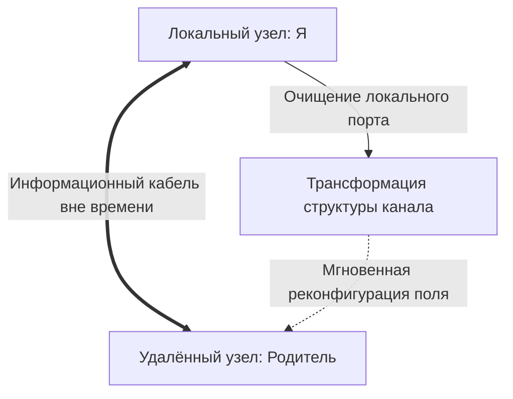

# Связь не зависит от расстояния

Два сервера на разных континентах. Между ними — тысячи километров оптоволокна по чёрному дну океана, где никогда не бывает солнца. Географическая пропасть. На прикладном уровне — одна точка: запись в базе на одном — и реплика на втором обновляется в ту же миллисекунду. Решает не расстояние. Решает целостность интерфейса.

С людьми то же — и аналитическому уму это даётся тяжелее всего.

**Между связанными узлами нет километров. Отклик мгновенный.** Океаны, границы, десятилетия молчания — пустые переменные. Связь либо активна, либо повреждена. «Далеко» и «в прошлом» в полевой структуре психики не существуют.

---

## Океан ничего не решает

Рассудок привязан к карте. Родитель в Москве, ты в Нью-Йорке или Дубае, девять часовых поясов, закрытые перелёты, заблокированные карты, новостной фон — значит, страница перевёрнута, можно начать с чистого листа.

Спасительная иллюзия. И беспомощная.

В глубоких слоях психической Сети нет категорий расстояния и времени. Контуры — родитель и ребёнок, партнёры в точке зачатия, жертва и агрессор — игнорируют метрику пространства. Однажды сформированные, они держат соматическое напряжение годами, даже если развести людей по полушариям. Провод проложен. Эмиграция над ним не властна.

Два вывода.

**Первый.** Физический контакт не нужен. Чтобы пересобрать повреждённый узел отца, исчезнувшего тридцать лет назад или уже ушедшего, не нужны детективы и могила. Вызови образ во внутреннем пространстве — интерфейс, который никуда не девался, активируется. Связь не прерывалась. Она была заморожена.

**Второй.** Правка на твоём конце кабеля сразу меняет параметры всего канала. Снял с родителя детский обвинительный приговор, перестал требовать запоздалой компенсации, вернул законное место — структура обмена обновляется на обоих концах без звонка и сообщения.

И здесь граница, за которую в ROOT не заходят. **Связь — не инструмент принуждения.**

Узнал про нелокальную связь — первое желание: использовать как лом. Заставить бывшего тосковать. Продавить инвестора. Дистанционно подчинить ребёнка.

Это взлом чужого суверенитета. Ответка прилетает быстро: по здоровью, голове, ресурсам.

Калибровка — **только на собственной стороне провода.** Внутри собственного тела и собственного Ядра. Единственный экологичный протокол.

---

> [!NOTE]
> ## Научный блок: привязанность и нелокальная связь
>
> Боулби и Эйнсворт описали внутренние рабочие модели: ранний контакт с родителем строит нейрональные ансамбли в правой префронтальной коре и орбитофронтальном кортексе. Километры эти модели из памяти не выгружают. Активация даёт те же вегетативные сдвиги, кортизол или окситоцин, что и присутствие рядом.
>
> Шор и Холл показали: дистанция в психике — не метры, а качество резонанса и аллостатическая нагрузка. Подавленный гештальт с фигурой привязанности — и правое полушарие непрерывно шлёт тормозящие сигналы симпатике.
>
> В инженерии — реплицируемое хранилище. Сокет остаётся `ESTABLISHED` даже без активной передачи. Повреждена локальная таблица маршрутизации — связь зависает и жжёт циклы на `SYN_SENT`. Чистка локального буфера не требует доступа к чужой ОС. Исправил свой конец — интерфейс возвращается в рабочее русло.

---

## Быль: кукла через двадцать один год

В 1972 году Лев собрал один кожаный чемодан и улетел на симпозиум в Париж.

Маше было шесть.

В зале вылета Шереметьево он опустился на корточки, взял её лицо в ладони, пахнущие хорошим табаком:

— Я вернусь очень быстро, Машка. Привезу настоящую французскую куклу. С закрывающимися голубыми глазами и шёлковыми волосами.

Она прижала ладони к его пальцам и кивнула. Верила безоглядно.

---

Лев не вернулся.

Через три недели радиостанции: советский физик попросил политического убежища во Франции. Железный занавес захлопнулся со звуком гильотины. В Москве на семью обрушился молот госбезопасности. Маша получила клеймо «дочери изменника родины».

В двенадцать — сирота при живом отце: мать не выдержала допросов на Лубянке, травли на партсобраниях, умерла от обширного инсульта. В комсомол не брали. Одноклассники плевали в портфель. Университеты захлопнулись. Швея-мотористка на трикотажной фабрике в три смены. Промёрзшая полуподвальная комната, ржавая вода с потолка, наледь на стекле до конца апреля.

В Париже у Льва кипела жизнь. Лаборатория. Европейские гранты. Вилла на Лазурном берегу. Приёмы в посольствах.

Письма раз в три-четыре года через туристов — дорогая парфюмерия и беззаботное солнце: *«Машенька, я совершил важнейшее открытие. Скоро границы откроют, и мы будем вместе»*. Маша смотрела на глянцевые пальмы из сырой каморки — и внутри умирало последнее живое тепло. Отца не было. Был сытый призрак из параллельной вселенной.

Для Льва время летело как один день: казалось, уехал недавно.

В Москве для брошенной девочки каждая зима длилась как геологическая эпоха.

---

Осень 1993. Советский Союз прекратил существование.

Лев взял первый рейс Париж — Москва. Чемоданы с одеждой и деликатесами. Во внутреннем кармане шерстяного пальто — та самая кукла. Французская, фарфоровая, глаза цвета морской волны. Купил в Galeries Lafayette в ноябре семьдесят второго, на второй день после бегства. Возил через все квартиры и континенты двадцать один год. Как охранную грамоту. Как доказательство, что долг ещё можно вернуть.

По старому адресу — чужие люди. Сутки поисков через морги и адресные столы. Отделение паллиативной онкологии районной больницы.

Маше двадцать семь. От недоедания, фабричной пыли, нищеты и тоски выглядела измождённой пятидесятилетней с сухими прозрачными пальцами.

Лев распахнул дверь палаты. Холёное лицо исказилось. Рухнул на колени на облупленный линолеум. Трясущимися руками — коробка с куклой:

— Машенька… Доченька, прости! Я вернулся. Я привёз её! Забираю в Париж, в лучшую клинику, профессора спасут, я всё оплачу, все миллионы, начнём сначала, клянусь!

Маша медленно повернула голову на мокрой подушке.

Посмотрела на кашемировое пальто. На золотые запонки. На куклу в кружевах — неестественный румянец, стеклянные глаза, которые захлопываются при наклоне.

В выцветших глазах — ни ненависти, ни гнева. Гнев живёт там, где ещё есть раненая надежда. В Маше всё выгорело до холодного лунного пепла.

— Ты купил её в семьдесят втором, — ровно. Без вопроса. Без интонации.

Лев замер.

— Папа, — сухой голос едва различим. — Мне было шесть, когда вы улетели за своей великой физикой. Мне было двенадцать, когда маму вынесли в цинковом гробу. Мне было четырнадцать, когда я отморозила пальцы на фабрике, читая ваше письмо про Лазурный берег. Мне было двадцать два, когда я наконец перестала ждать шагов у двери.

Взгляд в окно — ледяной ноябрьский дождь.

— Фарфоровую куклу с закрывающимися глазами ждала маленькая Маша в шесть лет. Я — больше не она. Мне не нужна ваша кукла. И вы мне больше не нужны.

Закрыла глаза. Отвернулась к белёной кирпичной стене.

Лев простоял на коленях до вечера, пока санитарки не вывели его под руки в промозглый коридор.

Вышел на сырую московскую улицу. Колючая снежная крупа. У больничной ограды прижимал к груди коробку с нелепой французской куклой и понимал: можно обмануть спецслужбы, выстроить карьеру, заработать миллионы, переписать законы физики. Время вернуть нельзя. То, что украл у собственного ребёнка, не хранится в банковской ячейке. Его не привезёшь в чемодане двадцать лет спустя.

Оно исчезло навсегда. На другом конце провода — неизлечимая, мёртвая тишина.

---

## Личный лог: провод через девять часовых поясов

Я улетел в марте 2022. На седьмой день после начала катастрофы.

Решение не зрело месяцами — ночью звонок старого товарища, короткая фраза, и стало ясно: если не пересечь границу сейчас, «потом» может быть аннулировано навсегда. Два наспех собранных чемодана. Бессонная ночь за ноутбуком. В семь утра — номер матери.

Сняла после первого гудка:

— Ты улетаешь?

Вязкая слюна:

— Да, мам. Билет на дневной рейс.

Три секунды — стальная проволока в мембране телефона:

— Правильно. Так надо.

Сухое «правильно» полоснуло страшнее любых рыданий.

В Шереметьево — гул исхода: очереди к пограничникам, растерянные лица, плачущие дети, горы чемоданов. Мать у металлоискателя. Маленькая, в привычном бежевом драповом пальто со студенческих лет. Обнялись у барьера. Не заплакала — порода внутренней стойкости, которую я безуспешно пытаюсь вырастить в себе. Сжала предплечья. В воротник куртки:

— Береги себя. И звони.

Турникет. Обернулся. Она за стеклом терминала среди бушующей толпы медленно подняла раскрытую ладонь.

Помахал. Отвернулся. К гейту. Одна раскалённая мысль: она осталась на той стороне. Я ухожу сюда. Никто не знает, на сколько десятилетий растянется этот разрыв.

---

В Нью-Йорке — чужая синтетическая весна. Манхэттен пах жареным арахисом, выхлопом и океанской солью. Ни капли талой подмосковной земли. Ни тополиных почек.

Первые недели звонил ежедневно. Съёмная в Бруклине, грохот сабвея, безумные цены в органик-маркетах. Она слушала, улыбалась в трубку. На заднем плане — тревожные позывные теленовостей с её кухни. Оба делали вид, что не замечают.

Интервалы расползались. Девять часовых поясов стали удобной стеной: у меня час после работы — в Москве три ночи. Контракты, счета, беглый английский, суета адаптации. Ум рапортовал: «Справляешься отлично».

Под сердцем — непрерывная ноющая тяга. Будто в грудную клетку впаяли микроскопический приёмник на аварийной частоте. Не глушится ни фитнесом, ни виски.

Ноябрь. Восемь месяцев. Ночь абсолютной бессонницы. Четыре утра. Полицейские сирены за окнами Бруклина. Чужой белый потолок. Новостные сводки.

Вопрос: *«А что она делает прямо сейчас?»* Не дежурное «как здоровье» — кинематографическое видение её утра. Понедельник, восемь, промозглый ноябрь на востоке Москвы.

Картина с фотографической резкостью: узкая кухня, шерстяной жилет поверх халата. Чай с лимоном из массивной керамической кружки с отбитым краем — «удобная, зачем тратить лишнее». Тёмное кухонное окно. Заснеженные тополя. Телевизор выключен: устала бояться новостей.

Знание, что самый близкий человек сидит в одиночестве на тёмной кухне за десять тысяч километров, пробило броню.

Сел на пол. Скрестил ноги. Впервые за восемь месяцев эмиграции посмотрел на свой конец провода.

Боже, сколько грязи. Жгучая вина за то, что уехал и оставил её стареть одну. Липкий стыд за звонок перед самым вылетом. Ужас, что однажды телефон ответит короткими гудками. Под всем — чистая тоска. По её рукам. По скрипу кухонной табуретки. По голосу.

Сидел и проживал поток. Без жалоб. Без отвлечения. Чистил кабель от накипи.

В половине пятого открыл мессенджер:

*«Мам. Я проснулся и думаю о тебе. Всё хорошо. Просто очень тебя люблю».*

Ответ через семнадцать минут:

*«Я знаю, сынок. Я как раз заварила чай. Иди спать, у тебя глубокая ночь. Я всегда рядом».*

Две строчки на экране. И железный обруч, стягивавший грудь восемь месяцев, лопнул. Тёплое глубокое расслабление. Сигнал прошёл. Чисто. Без искажений.

Провод через океан работал каждую миллисекунду. Со стороны матери он никогда не отключался. Это я намотал на штекер тонны вины, занятости и ментального мусора. Навёл порядок на своей стороне — целостность Сети восстановилась сама.

---

## Практика: юстировка связи на дистанции

Если контакт с физически недосягаемым узлом (эмиграция, разрыв, уход из жизни) даёт соматическую боль или ощущение оборванного кабеля:

1. **Инициализация.** Сядь устойчиво. Живот расслаблен. Глаза закрыты. Образ человека. Не форсируй — зафиксируй натяжение жгута в теле (тяжесть в эпигастрии, горло, тепло в ладонях).
2. **Аудит помех.** Чем засорён твой конец: обидой («ты мне недодал»), виной («я тебя предал»), спасательством («я обязан вытащить»), претензией? Признай: это локальные сбои.
3. **Очистка локального порта:**
   > «Я работаю только со своей стороны провода. Не нарушаю твоих границ. Не претендую на управление твоей жизнью. Смываю со своего штекера вину, обиды и иллюзии спасательства. Возвращаю тебе достоинство и судьбу. Себе забираю силу и ответственность. Мой конец связи чист».
4. **Телесный отклик.** Глубокий вдох. Длинный выдох. Отпусти образ. Отпустило ли диафрагму? Потеплело ли в грудине?

Связи работают вне пространственных координат. Содержи в чистоте собственный терминал.

> [!IMPORTANT]
> **Закон главы**
> Информационная связь между узлами не зависит от физического расстояния и времени, а любая коррекция возможна исключительно на собственном конце провода.
