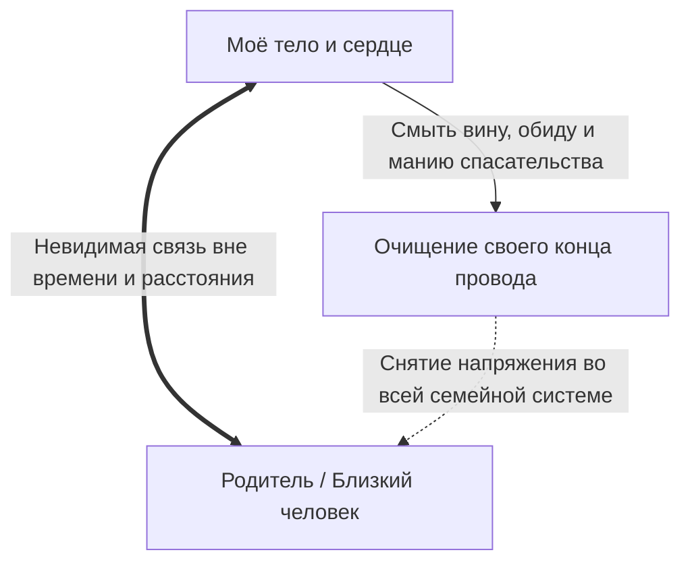

# Связь сквозь километры и время

Наш аналитический рассудок слепо верит географической карте.

Тебе кажется: если собрать чемодан, купить билет на самолёт и улететь за десять тысяч километров — в другую страну, на другой континент, за девять часовых поясов, — страница перевёрнута. Прошлое осталось позади. Обиды на родителей растворились в шуме чужого мегаполиса, а старая невыносимая боль запечатана закрытыми границами.

Это удобная, спасительная — и абсолютно беспомощная иллюзия.

В глубоких слоях человеческой психики и нервной системы категорий физического расстояния не существует. Контуры, однажды связавшие тебя с родителями, с любимым человеком или с теми, кто причинил тебе невыносимую боль, игнорируют метрику пространства. Этот невидимый нервный кабель проложен раз и навсегда. Эмиграция, смена паспорта и десятилетия молчания над ним не властны.

Связь либо жива и наполнена чистым теплом, либо захламлена виной, обидой и страхом. И отклик по ней приходит мгновенно — прямо в твоё тело.

---

## Невидимый кабель сквозь материки

Ум отчаянно цепляется за внешние декорации. Родители остались в промозглой зимней квартире на другом краю света, а ты сидишь на солнечной террасе в Дубае или шагаешь по Бродвею. Но почему в груди стоит тот же самый удушливый ком? Почему при каждом телефонном звонке с незнакомого номера сердце срывается в галоп, а горло сжимает ледяной спазм?

Потому что информационный провод между вами вибрирует каждую миллисекунду.

Из этого закона следуют два ключевых вывода, которые переворачивают привычные представления о психологии:

**1. Физическое присутствие не требуется.**  
Чтобы примириться с отцом, исчезнувшим тридцать лет назад или уже ушедшим из жизни, не нужно нанимать детективов или рыдать на кладбище. Достаточно вызвать его образ во внутреннем пространстве — и живой интерфейс активируется мгновенно. Связь никогда не прерывалась. Она была заморожена под толщей твоего детского ужаса.

**2. Любая перемена на твоём конце провода мгновенно меняет весь канал.**  
Когда ты перестаёшь судить мать за её ошибки, когда прекращаешь играть роль высокомерного благодетеля для стареющих родителей и снимаешь с них груз детских претензий — характер всей связи трансформируется. На обоих концах. Без единого звонка, без скандалов и без долгих нравоучений.

Но здесь пролегает строжайшая этическая граница: **связь — это не инструмент тайного насилия**.

Узнав о нелокальной связи, человек часто испытывает соблазн использовать её как лом: дистанционно заставить бывшего партнёра страдать, внушить чувство вины коллеге или подчинить повзрослевшего ребёнка. Это грубое вторжение в чужой суверенитет. И возмездие за него настигает мгновенно — соматическими срывами, паническими атаками и крахом ресурсов.

Единственный честный и безопасный путь — наводить порядок **исключительно на собственной стороне провода**. Внутри своего тела, своего дыхания и своего сердца.

---

> [!NOTE]
> ## Нейробиология привязанности и нелокальный резонанс
>
> Основоположники теории привязанности Джон Боулби и Мэри Эйнсворт доказали: опыт раннего эмоционального контакта с матерью и отцом формирует устойчивые нейронные ансамбли в правой префронтальной и орбитофронтальной коре ребёнка. Эти «внутренние рабочие модели» не стираются расстоянием. Мысленная активация образа родителя даже спустя сорок лет запускает точно такие же вегетативные бури — всплески кортизола или окситоцина, — как если бы он стоял в полуметре от тебя.
>
> Профессор Аллан Шор показал, что истинная психологическая дистанция измеряется не километрами, а качеством межмозгового резонанса и уровнем аллостатической нагрузки. Непрожитая обида на отца или мать заставляет вегетативную нервную систему годами жить в режиме фоновой боевой тревоги.
>
> Это напоминает сетевой протокол: соединение остаётся активным, но забито потерянными пакетами. Локальный процессор перегревается, сжигая тонны жизненной энергии вхолостую. Чтобы вернуть системе покой, не нужно взламывать удалённый сервер — достаточно очистить собственную таблицу маршрутизации.

---

## Быль: фарфоровая кукла через двадцать один год

В ноябре 1972 года подающий большие надежды советский физик-ядерщик Лев собрал потертый кожаный портфель и отправился на научный симпозиум в Париж.

Его единственной дочери Маше было шесть лет.

В холодном, пропахшем керосином зале вылета аэропорта Шереметьево Лев опустился перед дочерью на колени. Его пальцы пахли крепким табаком и дорогим одеколоном. Он бережно взял маленькое личико Маши в ладони:

— Машенька, я вернусь очень скоро. Привезу тебе из Франции настоящую куклу. С шёлковыми золотыми кудрями и большими голубыми глазами, которые закрываются, когда укладываешь её спать. Обещаю.

Шестилетняя девочка обхватила его пальцы своими ручонками и доверчиво кивнула. Она верила отцу больше, чем Богу.

---

Лев не вернулся.

Через три недели по заграничным «голосам» объявили: советский учёный попросил политического убежища во Франции. Железный занавес захлопнулся за его спиной с глухим скрежетом гильотины. В Москве на семью немедленно опустился тяжёлый молот государственной безопасности. Мать вызывали на бесконечные ночные допросы на Лубянку. На партсобраниях коллеги отворачивались и клеймили «семью предателя родины».

Через шесть лет сердце матери не выдержало травли — она умерла от обширного инфаркта в сорок два года. Двенадцатилетняя Маша осталась круглой сиротой при живом и здоровом отце.

В комсомол её не приняли. Одноклассники исподтишка плевали в портфель и обзывали дочерью изменника. Дорога в университет оказалась наглухо закрыта. В шестнадцать лет Маша пошла работать швеёй-мотористкой на чулочно-трикотажную фабрику — в три смены, за грошовую зарплату. Ей выделили крошечную угловую комнату в промёрзшем полуподвале: с потолка капала ржавая вода, а ледяная корка на одинарном оконном стекле не таяла до середины мая. От постоянной сырости и пыли ткань её лёгких медленно разрушалась.

А в Париже у Льва кипела ослепительная жизнь. Лаборатория в Сорбонне, международное признание, гранты, просторная вилла с видом на лазурные волны Средиземного моря, приёмы в посольствах.

Раз в несколько лет через редких французских туристов до Маши долетали его открытки — с фотографиями залитых солнцем пальм, пахнущие изысканными духами:  
*«Машенька, моя наука требует жертв. Но верь: скоро границы падут, и мы обязательно будем вместе»*.

Маша смотрела на эти открытки из своей сырой каморки, растирая онемевшие от холода пальцы, — и внутри неё медленно умирала последняя детская надежда. Живого отца больше не было. Был сытый, самодовольный призрак из недосягаемого измерения.

Для Льва двадцать лет пролетели как одна неделя в упоительном научном азарте.  
Для брошенной девочки в промозглом подвале каждая зима тянулась как бесконечная геологическая эпоха.

---

Осень 1993 года. Советский Союз рухнул. Границы распахнулись.

Лев прилетел первым же рейсом Париж — Москва. Семь огромных кожаных чемоданов с заграничной одеждой, лекарствами и деликатесами. А во внутреннем кармане его кашемирового пальто лежала коробка. Та самая французская фарфоровая кукла в кружевах с закрывающимися глазами, которую он купил в галерее Лафайет на второй день после своего побега в ноябре семьдесят второго года. Он возил эту коробку за собой через все квартиры и континенты двадцать один год. Как талисман. Как индульгенцию. Как вещественное доказательство того, что украденную детскую жизнь можно просто купить назад.

По старому адресу жили чужие люди. После трёх дней лихорадочных поисков через адресные бюро и больницы след привёл Льва в отделение паллиативной помощи на окраине Москвы.

Маше было всего двадцать семь лет. Но от тяжелейшего труда, многолетнего недоедания, фабричной химии и неизлечимого туберкулёза она выглядела измождённой старухой с сухими, прозрачными пальцами и седыми прядями в волосах.

Лев распахнул дверь палаты. Его холёное, загорелое лицо побелело от ужаса. Он рухнул на колени прямо на грязный больничный линолеум, задыхаясь от слёз. Дрожащими руками он протянул ей коробку:

— Машенька… Доченька, родная, прости меня! Я вернулся. Я привёз её тебе, посмотри! Я забираю тебя в Париж, в лучшую клинику, светила медицины спасут тебя, я оплачу любые палаты и лекарства, мы всё начнём с чистого листа, клянусь памятью мамы!

Маша очень медленно, с видимым трудом повернула голову на выцветшей подушке.

Она посмотрела на его роскошное пальто. На массивные золотые часы. На нелепую куклу в кружевах с застывшим кукольным румянцем.

В её потухших серых глазах не было ни злости, ни упрёка, ни слёз. Гнев и обида живут лишь там, где ещё тлеет раненая любовь. В душе Маши всё выгорело до холодного пепла.

— Ты купил её в семьдесят втором году, — тихо произнесла она. Без вопроса. Смертельно ровно.

Лев замер на полу, не смея поднять глаз.

— Папа, — её сухой, слабый голос с трудом пробивался сквозь хрип в груди. — Мне было шесть лет, когда ты бросил меня ради великой физики. Мне было двенадцать, когда маму вынесли вперёд ногами в цинковом гробу. Мне было четырнадцать, когда я отдирала окровавленные пальцы от станка на фабрике, читая твои письма про Лазурный берег. И мне было двадцать два года, когда я наконец заставила себя перестать вздрагивать от каждого шороха за дверью.

Она повернула лицо к мутному окну, по которому стекали ледяные струи ноябрьского дождя:

— Эту фарфоровую куклу ждала маленькая шестилетняя девочка. Но та девочка давно умерла от холода и голода в подвале. А взрослой женщине перед тобой твоя кукла не нужна. И ты мне больше не нужен. Уходи.

Маша закрыла глаза и отвернулась к облупленной казённой стене.

Лев простоял на коленях до глубокой ночи, пока пожилая санитарка не вывела его под локоть в тёмный коридор.

Он вышел на промозглую ноябрьскую улицу. Падал мокрый, колючий снег. Прислонившись к ржавой больничной решётке, старик прижимал к груди коробку с французской куклой и сквозь рыдания осознавал страшную истину:  
Можно обмануть государственные границы, сколотить капитал и завоевать мировое признание. Но время вернуть невозможно. Украденное детство собственного ребёнка не возместить чемоданами денег. На том конце провода навсегда воцарилась глухая, ледяная тишина.

---

## Личный опыт: ночной провод через океан

Я улетал в эмиграцию в марте 2022 года. На седьмой день после начала тектонического слома привычного мира.

Решение не принималось месяцами — ночной звонок старого друга, две короткие фразы, и стало кристально ясно: если не сесть в самолёт прямо сейчас, окно захлопнется навсегда. Два наспех собранных чемодана. Бессонная ночь за компьютером. В семь утра я набрал номер матери.

Она подняла трубку после первого же гудка:

— Ты улетаешь?

Горло перехватило вязкой судорогой:

— Да, мам. Билет на дневной рейс.

В телефонной мембране повисла пятисекундная тишина, натянутая как стальная струна. А затем раздался её тихий, спокойный голос:

— Правильно. Улетай. Так надо.

Это сухое материнское «так надо» полоснуло по живому больнее любых рыданий и упрёков.

В Шереметьево стоял гул человеческого исхода: бесконечные очереди, заплаканные глаза, горы брошенных вещей. Мать стояла у стеклянной рамки терминала. Маленькая, хрупкая, в своём бессменном шерстяном пальто, которое она бережно носила ещё с институтских времён. Мы крепко обнялись. Она не уронила ни единой слезинки — удивительная стать старой закалки, которую я так тщетно пытаюсь отыскать в самом себе. Она лишь крепко сжала мои предплечья и прошептала в воротник куртки:

— Береги себя, сынок. И пожалуйста, звони.

Я прошёл паспортный контроль. Обернулся у турникета. За толстым звуконепроницаемым стеклом, среди сотен мечущихся пассажиров, она медленно подняла раскрытую ладонь.

Я помахал ей в ответ и зашагал к гейту. И в голове пульсировала одна-единственная оглушительная мысль: она осталась там. А я ухожу в неизвестность. И никто на этой планете не знает, увидимся ли мы когда-нибудь снова.

---

В Нью-Йорке бушевала чужая, синтетическая весна. Улицы Манхэттена пахли жареными орехами в карамели, горячим асфальтом и едким океанским бризом. В этом воздухе не было ни намёка на родной запах талой подмосковной земли и распускающихся тополей.

Первые недели я звонил матери каждый вечер. Съёмная крошечная комната в Бруклине, грохот поездов метро под окнами, бешеные счета, незнакомый язык. Мать слушала меня, улыбалась в трубку. А на заднем плане с её кухни доносились тревожные позывные теленовостей. Мы оба делали вид, что не замечаем этого фона.

Но недели шли, и паузы между звонками стали расползаться. Девять часовых поясов превратились в удобное алиби: когда у меня заканчивался рабочий день, в Москве было четыре часа утра. Новые контракты, адаптация, бег по кругу. Мой рассудок гордо докладывал: «Смотри, ты отлично справляешься с эмиграцией».

Но под сердцем неотступно ныл тупой, горячий узел. Словно в грудную клетку вживили аварийный маяк, работающий без пауз. Его не глушили ни тренировки до седьмого пота, ни бокал крепкого скотча перед сном.

Ноябрь. Восемь месяцев разлуки. Ночь абсолютной, глухой бессонницы. Четыре часа утра. За окнами Бруклина завывают полицейские сирены. Я лежал на матрасе и тупо смотрел в чужой белый потолок.

И вдруг в голове вспыхнул вопрос: *«А что она делает прямо сейчас?»*

Не вежливое дежурное «как твоё самочувствие», а почти фотографическое, осязаемое видение её утра. Понедельник. Девять утра промозглого московского ноября за окном.

Я увидел эту картину так отчётливо, словно стоял в дверях: тесная кухня, на плечах старый вязаный жилет. Она наливает кипяток в массивную глиняную кружку со сколотым краем — той самой, которую она не выбрасывала годами, потому что «она удобная и греет руки». За окном раскачиваются голые чёрные тополя. Телевизор выключен: она устала бояться новостей.

Осознание того, что самый родной человек на земле прямо сейчас сидит в полном одиночестве на холодной кухне за тысячи километров от меня, смахнуло всю мою взрослую спесь.

Я сполз с матраса на холодный паркет. Скрестил ноги. И впервые за восемь месяцев честно заглянул в свой конец провода.

Господи, сколько там накопилось накипи. Жгучая детская вина за то, что я бросил её одну навстречу старости. Липкий стыд за поспешный звонок перед вылетом. Животный страх однажды услышать длинные гудки без ответа. А глубже всего этого лежала чистая, невыносимая тоска по её сухим рукам, скрипу кухонной половицы и родному голосу.

Я сидел на полу и просто дышал сквозь эту боль. Без жалоб. Без попыток отвлечься на телефон. Я смывал с контакта накопленный яд.

В половине пятого утра я открыл мессенджер и набрал:

*«Мамуль, привет. Я проснулся посреди ночи и думаю о тебе. У меня всё хорошо. Я просто очень сильно тебя люблю».*

Ответ пришёл через двенадцать минут:

*«Я знаю, сыночек. Я как раз только что заварила чай. Ложись спать, у тебя же глубокая ночь. Я всегда рядом с тобой».*

Всего две строчки на мерцающем экране смартфона. Но чугунный обруч, давивший мне на рёбра восемь долгих месяцев, со звоном лопнул. По телу разлилось мягкое, глубокое и живое тепло. Сигнал прошёл без помех.

Этот провод через океан работал каждую секунду. Со стороны матери он ни на миг не выключался. Это я сам навесил на штекер тонны вины, суеты и страха. Но стоило навести порядок на своей стороне — и целостность любви восстановилась мгновенно.

---

## Практика: наведение порядка на своём конце провода

Если образ человека, который находится далеко (в эмиграции, после тяжёлого расставания или даже после ухода из жизни), отзывается в теле тупой болью, тревогой или чувством ледяной пустоты:

1. **Вход в устойчивость.** Сядь прямо, поставь стопы на пол. Расслабь челюсти и живот. Сделай три глубоких вдоха и длинных выдоха через рот. Пригласи образ человека во внутреннее пространство. Не принуждай себя ни к чему — просто отметь, где в теле отозвался этот контакт (тяжесть под ложечкой, спазм в горле, холод в затылке).
2. **Инвентаризация помех.** Посмотри честно: чем загрязнён твой конец провода?
   - Горькой обидой: «Ты должен был поступить иначе»?
   - Разъедающей виной: «Я предал тебя, бросил, не спас»?
   - Высокомерием спасателя: «Ты слаб, без меня ты пропадёшь»?
   Признай: всё это твои личные искажения.
3. **Очищение контакта:**  
   Положи ладонь на центр груди и произнеси мысленно или вслух:
   > «Я признаю нашу неразрывную связь. Но с этой секунды я остаюсь строго на своей стороне провода.  
   > Я не пытаюсь управлять твоей судьбой и не сужу твои поступки.  
   > Я смываю со своего сердца вину, детские обиды и иллюзию того, что я могу тебя спасти.  
   > Я возвращаю тебе твоё достоинство и твою силу нести свою жизнь.  
   > А себе я забираю право на собственную судьбу, радость и зрелость.  
   > Мой конец провода чист и открыт для любви».
4. **Телесная интеграция.** Сделай глубокий вдох животом и длинный, свободный выдох со звуком «х-х-а-а». Обрати внимание, как изменились ощущения в теле: разжались ли плечи? Потеплело ли в груди? Растаял ли ком в горле?
5. **Закрепление тишины.** Отпусти мысленный образ с благодарностью. Твой приёмник настроен на чистоту.

---

> [!IMPORTANT]
> **Главная мысль главы**  
> Между связанными сердцами не существует километров, границ и часовых поясов. Любая попытка изменить или подчинить другого человека на расстоянии разрушительна. Но стоит тебе очистить свой конец провода от вины и обид — и покой возвращается в жизнь обоих.

---

> [!TIP]
> **Интерактивный помощник**  
> Если тебя мучает незавершённый разговор с родителями, ушедшими близкими или бывшими партнёрами — напиши нам в строке ниже. Мы поможем бережно найти нужные слова и снять напряжение с твоего внутреннего контура связи.
