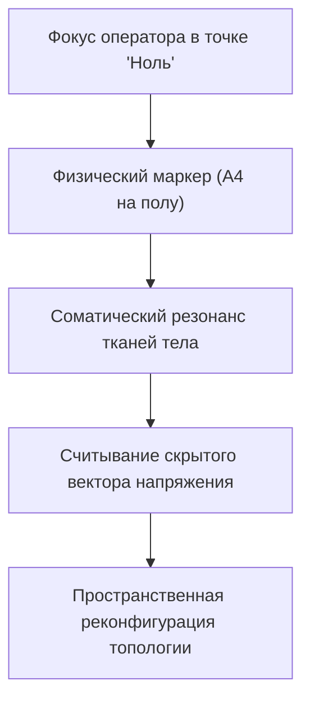

# Инструментарий оператора: маркеры

Чтобы вскрыть и перенастроить повреждённые алгоритмы собственной жизни, не нужны групповые тренинги, залы с приглушённым светом и толпа незнакомцев, играющих «твой финансовый потолок», «твою мать» или «твой симптом». Не нужна запись за полгода.

Весь фасад заменяется пачкой офисной бумаги А4 — той, что в принтере. Эти физические якоря — **маркеры**. Самый доступный и строгий инструмент автономной отладки.

---

## Как бумага становится интерфейсом

Чистый лист — целлюлоза. В ту секунду, когда ты пишешь на нём «Отец», «Бизнес», «Симптом» и кладёшь на пол — он становится портом доступа к Сети.

Фонарь на тёмном складе не создаёт стеллажи. Он делает видимым то, что стояло десятилетиями. Маркер — то же: выводит скрытую топологию из хаоса ментальных интерпретаций в трёхмерное пространство. Конфликт переезжает из черепа под стопы. Там его читают фасции, мышцы, вегетатика.

Три масштаба:

1. **Полноразмерная карта (листы А4).** Разложенные по комнате — архитектура в масштабе 1:1. Встаёшь ногами на лист — подключаешься к свойствам узла через интероцептивные датчики.
2. **Настольный микроинтерфейс.** Гостиничный номер, столик в аэропорту, салон поезда — монеты, ключи, канцелярские зажимы. Граф сверху. Перемещаешь узлы пальцами. Следишь за микрооткликами в дыхании.
3. **Соматические якоря.** Чтобы новая архитектура не рассыпалась под старыми нейронными привычками — фиксация на теле: ладонь на грудину, глубокий выдох с расслаблением плеч, щелчок пальцев. Без якоря ум откатит конфигурацию к привычному дефициту за пару часов.

В листах нет эзотерики. Мощь — в сфокусированном внимании и законах Сети. Спартанский инструментарий: глубокая диагностика в одиночку, в любой точке планеты.

---

## Карта поз: Stack Trace

Маркеры разложены. Оператор встаёт на лист в тишине. Тело — **терминал низкоуровневой отладки**. Каждое непроизвольное движение, наклон, траектория взгляда — не случайность. Это `stack trace`, который Сеть выводит на физиологию.

### Вектор взгляда: куда утекает ресурс

* **Взгляд в пол под ноги.** Связь с фигурой, стёртой или погибшей: умерший брат, нерождённый ребёнок, забытый предок. Внимание стянуто в небытие. Движение вперёд блокировано.
* **Расфокус «сквозь стены».** Шок или диссоциация. Аварийный режим оцепенения — или прямо перед тобой исключённый узел, контакт с которым был смертельно опасен.
* **Избегание прямого взгляда.** Родовая вина, финансовый стыд, семейная тайна, о которой поколениями нельзя было говорить вслух.
* **Взгляд снизу вверх, подбородок запрокинут.** Детская позиция поиска всемогущего родителя. Партнёр, клиент, супруг неосознанно делаются опекунами. Ответственность за выживание — им.

### Вертикаль иерархии: вес и нагрузка

* **Старшая фигура за спиной.** Естественная поддержка. Трапеции опускаются. Диафрагма делает полный вдох. Родовой поток прикрывает тылы.
* **Младший закрывает старшего грудью.** Парентификация. Ребёнок встал на место родителя. Фундамент рушится под непосильной ношей — хронические боли в пояснице, банкротства.
* **Фигура на полу.** Истощение, статус жертвы насилия, либо репрессированный предок без права на имя и память.
* **Тяжёлое нависание сверху.** Тиран или агрессор. Блокирует право на волю и распоряжение ресурсами.

### Геометрия взаимодействия: маршруты потоков

* **Плечом к плечу, лицом к горизонту.** Равноправное партнёрство. Векторы сложены. Ресурсы — на внешнюю цель, не на взаимное выяснение отношений.
* **Третий узел между парой.** Триангуляция. Ребёнок или общий бизнес — буфер, гасящий короткое замыкание между супругами.
* **Спина к спине.** Разрыв канала. Замороженная обида; под ней почти всегда — ранняя довербальная разлука с матерью.
* **Вис на чужом каркасе.** Созависимый симбиоз. Нет собственного заземления: попытка дышать чужими лёгкими.

---

> [!NOTE]
> ## Научный блок: тело хранит карту
>
> Ван дер Колк показал: травма кодируется не связным рассказом в зоне Брока, а мышечными паттернами, висцеральными спазмами, моторными программами в базальных ганглиях, миндалине, двигательной коре. Вербальная терапия часто бессильна — неокортекс маскирует рану интеллектуализациями. Шаг на маркер активирует скрытую проприоцептивную схему. Моторная кора воспроизводит заблокированную позу. Напряжение обнажается сразу.
>
> Левин в топологической психологии доказал: поведение задаётся геометрией психологического поля — векторы притяжения, отталкивания, скрытые барьеры.
>
> В инженерии то же: ищешь скрытый сбой — перестаёшь читать текстовые логи и рисуешь схему связей. Разложенное по плоскости показывает то, чего не видно в списке: замкнутые круги, забытые контуры. Маркеры на полу переводят отношения из разговора в геометрию.

---

## Сессия: кибербезопасник и лист под радиатором

Денис руководил Red Team в международной компании по кибербезопасности. Взламывал контуры центробанков за трое суток. Мыслил машинным кодом, буферами, протоколами.

Вошёл с едкой усмешкой скептика:

— Сразу: я атеист, материалист, инженер до мозга костей. Шаманства с бумагой — развлечение для скучающих домохозяек. Если бы не ультиматум жены и тупик в доходах — на пушечный выстрел бы не подошёл.

— В чём тупик инженера?

Пальцы забарабанили по столу:

— В абсурде. Я нахожу уязвимости нулевого дня. Час должен стоить тысячу долларов. Но стоит контракту перевалить за полмиллиона и потребовать публичного подписания от моего имени — срываю дедлайн или сливаю клиента партнёрам за копеечный процент. Работаю из тени через чужие юрлица. Деньги — как радиоактивная грязь: быстрее распихать по карманам и в бункер, пока не накрыло спецназом.

— Никакой психологии. Аудит топологии. Четыре листа А4. Узлы: «Денис», «Деньги», «Отец», «Мать». Разложи, как диктует внутренняя карта.

Скривился. Подписал. Подошёл к центру.

«Мать» — прямо перед собой, широким барьером. «Денис» — вплотную за ней.

Потом — странное.

Лист «Отец» — к чугунной батарее у окна. Ногой затолкнул в щель между рёбрами радиатора и стеной — в пыль и паутину. «Деньги» скомкал и швырнул под мусорную корзину надписью вниз.

Вернулся. Растерянно замер:

— Бред. Я не хотел. Рука сама.

> **Терапевт:** Забудь логику. Встань на «Деньги» под корзиной. Перенеси вес. Соединись с узлом.
>
> **Денис:** *(наступает — и могучий плечевой каркас заламывается вниз. Голова в плечи. Челюсть мелко дрожит. Кулаки)*
>
> **Терапевт:** Телеметрия. Что на датчиках?
>
> **Денис:** *(голос падает на октаву)* Холодно… Ледяной цемент. Запястья ломит — будто калёное железо. Во рту — ржавчина. Смотрю в пол. Не смею поднять глаза. Стыдно, что существую. Хочу провалиться, лишь бы не вывели на свет.
>
> **Терапевт:** Выйди. Шаг назад. Выдохни. Теперь — к радиатору. Перед задвинутым «Отцом».
>
> **Денис:** *(дыхание прерывистое, синие вены на шее)*
>
> **Терапевт:** Кто там лежит, в пыли за решёткой?
>
> **Денис:** *(хватается за чугунную секцию; циничная маска трещит — лицо десятилетнего мальчика)* Отец…
>
> **Терапевт:** Что с ним случилось?
>
> **Денис:** *(горячие злые слёзы)* Девяносто второй. Отец — ведущий радиоинженер на оборонном заводе. Завод встал. Открыл кооператив, продал квартиру — микропроцессоры. Бандиты в погонах. Сфабриковали хищение. Приехали с автоматами. Положили лицом в пол на моих глазах. Наручники… Мать орала на весь подъезд: «Будь ты проклят со своими деньгами, ты вор, ты опозорил семью!»
>
> **Терапевт:** Куда его дели?
>
> **Денис:** *(кулаки по чугуну)* Четыре года. Вернулся сломанным стариком, с туберкулёзом. Мать не пустила в спальню. Рваный ватник в прихожей на полу, за вешалкой с пальто, возле обувной полки! Два года. Умер во сне. Каждое утро она мне: «Смотри на него. Вот к чему приводят большие деньги. Не высовывайся, будь как все, иначе сгниёшь на параше!»

Звенящая тишина. Только прерывистое хриплое дыхание.

> **Терапевт:** Двадцать пять лет процессор крутил одну программу: `ДЕНЬГИ = НАРУЧНИКИ, ПОЗОР И СМЕРТЬ В ПЫЛИ ЗА ВЕШАЛКОЙ`. Контракт превышал порог безопасности — аварийная катапульта. Спасала от ментовских автоматов и материнского проклятия. Ты прятал деньги под мусорку ровно так, как мать задвинула отца в угол прихожей.
>
> **Денис:** *(на корточках перед батареей, лицо в руках)* Господи… Я сам задвинул его туда. Предал отца, чтобы выслужиться перед матерью.
>
> **Терапевт:** Достань его. Своими руками.

На колени. Пальцы в тёмную щель. Запылившийся помятый лист. Расправил углы ладонями.

Поднялся. Положил «Отца» справа от себя — на открытое пространство.

> **Терапевт:** Встань рядом. Плечом к плечу.
>
> **Денис:** *(спина распрямляется с сухим хрустом позвонков)*
>
> **Терапевт:** Скажи ему. От инженера — инженеру. От сына — отцу.
>
> **Денис:** *(голос дрожит, но звенит металлом)* Папа. Я вижу вас. Больше не прячу вас за батарею и не стыжусь вашего имени. Мама боялась вашей смелости, а я повторил её страх. Но вы были первопроходцем. Ваша инженерная кровь течёт во мне. Я принимаю ваш дар, вашу смелость и ваше право рисковать. Буду зарабатывать открыто — в память о вас. Ваша честь восстановлена.
>
> **Терапевт:** Вытащи «Деньги» из-под корзины. Положи перед собой.

Поднял. Расправил. Положил по курсу. Встал обеими ногами.

Грудная клетка мощно расширилась. Краска на лице. Руки перестали трястись — плотное тяжёлое тепло.

— Что с наручниками?

Посмотрел на раскрытые ладони:

— Их нет. Цемент исчез. Под ногами — монолитный гранит. Деньги — не позорная грязь. Энергия отцовских процессоров. Чистая вычислительная мощность.

Правая рука на солнечное сплетение. Длинный освобождающий выдох. Якорь встал намертво.

Через три недели — совет директоров швейцарского финансового конгломерата. Контракт на аудит инфраструктуры: триста двадцать тысяч евро. От своего имени. Без посредников. Без соматического саботажа. Листы на полу сняли блокировку, перед которой пасовали годы интеллектуального анализа.

---

## Практика: куда смотрит твоя цель

Четыре листа: «Я», «Цель», «Отец», «Мать». Разложи, не раздумывая. Потом посмотри.

Один честный вопрос: **куда смотрит твоя цель?**

У большинства — боком или отвёрнута. У многих между «Я» и «Целью» стоит кто-то из родителей. У некоторых один из родителей за дверью комнаты — рука сама уносит лист туда.

Не диагноз. Не приговор. Карта того, куда уходит ресурс, пока ты считаешь, что идёшь к цели.

Встань на «Я». Полминуты. Тело скажет быстрее любого анализа.

> [!IMPORTANT]
> **Закон главы**
> Пространственная проекция узлов на физические маркеры мгновенно проявляет скрытые конфликты, освобождая телесную память от бессознательного воспроизведения чужих травм.
