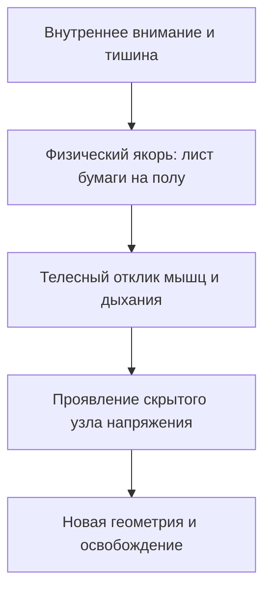

# Инструментарий оператора: маркеры

Чтобы вскрыть и перестроить повреждённые узлы собственной жизни, не нужны многолюдные тренинги, полутёмные залы и десятки незнакомцев, по очереди изображающих «твой финансовый потолок», «твою мать» или «твой симптом». Не нужна очередь на полгода вперёд.

Весь этот фасад с успехом заменяется пачкой обычной офисной бумаги формата А4 — той самой, что лежит в лотке принтера. Эти физические якоря называются **маркерами**. Самый строгий, спартанский и доступный инструмент честной внутренней работы.

---

## Как бумага становится интерфейсом

Сам по себе чистый лист — просто древесная целлюлоза. Но в ту секунду, когда ты выводишь на нём маркером: «Отец», «Моё дело», «Симптом» — и кладёшь его на пол, он превращается в пространственный порт доступа к внутренней реальности.

Фонарь на тёмном складе не создаёт ящики и стеллажи. Он лишь выхватывает из мрака то, что стояло там десятилетиями. Маркер работает точно так же: он выносит скрытую топологию отношений из тумана ментальных рассуждений в трёхмерный физический мир. Конфликт перестаёт крутиться в черепной коробке и ложится прямо под стопы. А там его моментально начинают считывать фасции, мышцы, связки и вегетативная нервная система.

Работать можно на трёх уровнях масштаба:

1. **Полноразмерная карта комнаты (листы А4).** Разложенные по полу листы разворачивают архитектуру ситуации в масштабе один к одному. Вставая ногами на лист, ты физически подключаешься к свойствам этой роли через глубокие интероцептивные ощущения тела.
2. **Настольный микроинтерфейс.** Гостиничный номер, столик в аэропорту, полка купе — когда нет места для шагов, маркерами становятся монеты, ключи, канцелярские зажимы или чайные чашки. Ты смотришь на расстановку сверху, двигаешь предметы пальцами и чутко отслеживаешь малейшие отклики в собственном дыхании.
3. **Соматические якоря.** Чтобы найденная гармония не рассыпалась под напором старых нейронных привычек, её нужно закрепить в теле: плотное прикосновение ладони к грудине, глубокий выдох с опусканием плеч, короткий щелчок пальцев. Без такого телесного якоря рассудок уже через пару часов вернёт всё на круги своя — к привычному дефициту и тревоге.

В самих листах бумаги нет никакой мистики. Вся сила — в сфокусированном человеческом внимании и законах системной памяти. Это инструмент абсолютной автономии: глубочайшая диагностика в одиночку, в любой точке земного шара.

---

## Язык тела: как пространство обнажает правду

Когда маркеры разложены, человек встаёт на лист бумаги в полной тишине. Тело не умеет лгать. Рассудок может сочинять оправдания годами, но физиология — скелет, мышцы, фасции, дыхание — мгновенно выдаёт скрытую правду. Каждое непроизвольное движение, наклон головы, траектория взгляда — это овеществлённая карта внутренних связей.

### Вектор взгляда: куда утекает жизненная сила

* **Взгляд упёрт в пол под ноги.** Непрерывная внутренняя связь с кем-то, кто ушёл слишком рано или был вычеркнут из семейной памяти: погибший старший брат, нерождённый ребёнок, забытый предок. Внимание намертво привязано к небытию. Движение вперёд заблокировано.
* **Расфокусированный взгляд «сквозь стены».** Оцепенение или глубинная травматическая диссоциация. Психика включает защитный анабиоз, потому что прямо перед глазами находится фигура, контакт с которой когда-то грозил уничтожением.
* **Неспособность смотреть прямо.** Застарелая вина, семейный стыд или тайна, о которой поколениями запрещалось говорить вслух.
* **Взгляд снизу вверх с запрокинутым подбородком.** Застрявшая детская позиция в поиске всемогущего взрослого. Партнёр, начальник или клиент бессознательно назначаются родителями, и на них перекладывается вся тяжесть выживания.

### Вертикаль иерархии: вес и опора

* **Старшая фигура за спиной.** Естественный порядок вещей. Трапециевидные мышцы опускаются, диафрагма расправляется для глубокого вдоха. Сила рода надёжно прикрывает тыл.
* **Младший закрывает старшего своей грудью.** Парентификация. Ребёнок встал на место защитника собственных родителей. Позвоночник надрывается под чужой ношей — отсюда хронические боли в пояснице и необъяснимый финансовый крах.
* **Фигура, лежащая на полу.** Предельное истощение, опыт насилия или репрессированный предок, лишённый права на могилу и доброе имя.
* **Тяжёлое нависание сверху.** Непреодолённое давление тирана или агрессора, парализующее личную волю и право распоряжаться ресурсами.

### Геометрия взаимодействия: взаимное расположение

* **Плечом к плечу, лицом к открытому горизонту.** Зрелое партнёрство равных. Усилия объединены. Энергия направлена во внешний мир, на общее созидание, а не на выяснение отношений.
* **Третий между двоими.** Триангуляция. Ребёнок или общий бизнес используется супругами как громоотвод, смягчающий постоянное напряжение между ними.
* **Спина к спине.** Замороженная обида и взаимная глухота; под этим почти всегда лежит давняя, довербальная боль отвержения.
* **Опора на чужое тело.** Созависимость. Отсутствие собственной устойчивости и отчаянная попытка дышать чужими лёгкими.

---

> [!NOTE]
> ## Научный фундамент: тело хранит карту памяти
>
> Бессел ван дер Колк убедительно показал: травматический опыт запечатлевается не в форме связного связного рассказа в речевых центрах коры, а в виде мышечных спазмов, висцеральных зажимов и заблокированных двигательных программ в базальных ганглиях и моторной коре. Разговорная психотерапия часто годами буксует на месте — неокортекс виртуозно маскирует боль интеллектуальными рассуждениями.
>
> Но стоит человеку физически шагнуть на маркер, как проприоцептивная схема оживает сама. Мышцы непроизвольно воспроизводят застывшую позу, и глубинное напряжение обнажается за секунды.
>
> Курт Левин в своей топологической психологии показал, что поведение человека определяется геометрией психологического поля — скрытыми векторами притяжения, отталкивания и невидимыми барьерами. Перенося отношения из головы на плоскость пола, мы превращаем абстрактные муки в ясную пространственную задачу.

---

## Живая история: специалист по кибербезопасности и лист под батареей

Денис руководил командой этичных хакеров в крупной международной компании. Он взламывал защиту центробанков за считанные дни, мыслил ассемблером, сетевыми пакетами и уязвимостями нулевого дня.

На встречу он пришёл с язвительной усмешкой убеждённого скептика:

— Сразу договоримся: я материалист, атеист и сухарь до кончиков ногтей. Всякие шаманские танцы с бумажками считаю цирком для скучающих бездельников. Если бы не ультиматум жены и дурацкий тупик с деньгами, я бы на пушечный выстрел к вам не подошёл.

— А в чём заключается тупик инженера?

Денис нервно постучал костяшками пальцев по столу:

— В полнейшем абсурде. Я нахожу дыры в безопасности глобальных систем. Мой час должен стоить тысячу долларов. Но стоит контракту перевалить за полмиллиона и потребовать личного подписания от моего имени — я будто схожу с ума. Заваливаю дедлайн. Или в последний момент сливаю клиента субподрядчикам за жалкие копейки. Работаю из тени, через подставные фирмы. Большие деньги для меня — как радиоактивный груз: хочется быстрее распихать по карманам и забиться в бункер, пока не накрыло спецназом.

— Никаких психологических теорий. Просто разложим факты на полу. Вот четыре чистых листа бумаги. Напиши на них: «Денис», «Деньги», «Отец», «Мать». И положи их в комнате так, как подсказывает твоё внутреннее ощущение.

Денис скривился, но быстро подписал листы. Вышел на середину комнаты.

Лист «Мать» он положил прямо перед собой — широким глухим барьером. Лист «Денис» приткнул вплотную сзади, словно прячась за её спиной.

А дальше произошло странное.

Лист с надписью «Отец» Денис отнёс к старой чугунной батарее у окна. И носком ботинка с силой затолкнул его в узкую пыльную щель между стеной и рёбрами радиатора — прямо в паутину. Затем взял лист «Деньги», скомкал его в комок и швырнул под мусорную корзину, надписью в пол.

Отошёл на шаг. Растерянно посмотрел на свои руки:

— Бред какой-то. Я не хотел. Рука сама дёрнулась.

— Забудь пока про логику, — предложил я. — Подойди к корзине и встань обеими ногами на скомканный лист «Деньги». Перенеси вес тела. Что происходит?

Денис наступил на лист — и его мощный борцовский каркас мгновенно обмяк. Плечи втянулись, голова ушла в ключицы. Нижняя челюсть мелко и часто задрожала, пальцы сжались в побелевшие кулаки.

— Что с дыханием? Что чувствует тело?

— Холодно… — его голос упал на октаву и стал сухим, надтреснутым. — Ледяной цемент. В запястьях адская боль, будто железо врезалось в надкостницу. Во рту вкус ржавчины. Я смотрю в пол и боюсь поднять глаза. Мне стыдно за то, что я вообще дышу. Хочу сквозь землю провалиться, лишь бы меня не вытащили на свет.

— Сделай шаг назад. Выдохни. А теперь иди к батарее. Туда, куда ты задвинул лист с отцом.

Денис подошёл. Его дыхание стало частым и хриплым, на шее вздулись синие жгуты вен.

— Кто там лежит, в пыли за чугунной решёткой?

Он ухватился за горячее ребро батареи. Его циничная взрослая маска треснула — передо мной стоял насмерть перепуганный десятилетний мальчик:

— Отец…

— Что с ним произошло, Денис?

По щекам взрослого мужчины покатились злые, обжигающие слёзы:

— Девяносто второй год. Отец был ведущим радиоинженером на оборонном НИИ. Когда всё рухнуло, завод встал. Он открыл кооператив, продал нашу квартиру, закупил партию микропроцессоров. И пришли бандиты в милицейских погонах. Сфабриковали хищение в особо крупных размерах. Выбили дверь с автоматами. Положили нас лицом в пол прямо на кухне. Наручники… А мать кричала на весь подъезд: «Будь ты проклят со своими проклятыми миллионами, ты вор, ты нас опозорил!»

— Что было дальше?

Денис ударил кулаком по чугуну:

— Четыре года колонии. Он вернулся оттуда сгорбленным, больным туберкулёзом стариком. Мать даже не пустила его в спальню. Бросила ему рваный ватник прямо в прихожей на пол — за вешалкой с пальто, у обувной полки! Он прожил так два года и тихо умер во сне. И каждое утро мать твердила мне: «Смотри на него! Вот к чему приводят твои грязные деньги. Не высовывайся, будь тише воды, иначе сгниёшь на нарах!»

В кабинете повисла гулкая, тяжёлая тишина. Только Денис хрипло переводил дух.

— Двадцать пять лет твоя нервная система послушно держала детский закон: *деньги — это наручники, позор и смерть в прихожей на грязном ватнике*. Как только сумма контракта превышала планку безопасности, тело било в набат и срывало сделку. Оно спасало тебя от автоматов и материнского проклятия. И ты спрятал отца за батарею в пыль точно так же, как мать когда-то выбросила его в угол прихожей.

Денис опустился на колени перед батареей и закрыл лицо ладонями:

— Боже мой… Я сам задвинул его туда. Я предал отца, чтобы мама не выгнала меня следом.

— Достань его. Своими руками.

Он запустил пальцы в тёмную щель за радиатором, вытащил запылённый лист и бережно расправил помятые углы.

Поднялся на ноги. Положил лист «Отец» справа от себя — на свободное, открытое пространство пола.

— Встань рядом с ним. Плечом к плечу.

Денис встал. Его позвоночник с сухим хрустом распрямился, грудная клетка наполнилась воздухом.

— Скажи ему. От мужчины — мужчине. От сына — отцу.

Денис сглотнул ком в горле, но заговорил — и в его голосе прорезалась твёрдая сталь:

— Папа. Я вижу тебя. Я больше не прячу тебя за батарею и не стыжусь твоего имени. Мама боялась твоей смелости, а я тридцать лет послушно повторял её страх. Но ты был инженером от Бога. Твоя кровь течёт во мне. Я принимаю твоё достоинство, твой ум и твоё право рисковать. Я буду зарабатывать открыто — в память о твоей чести.

— А теперь достань лист «Деньги» из-под корзины.

Денис подошёл, поднял комок, бережно разгладил его на коленях и положил перед собой — по курсу движения вперёд. Шагнул на него обеими ногами.

Его плечи широко расправились. К лицу прилила здоровая краска. Дрожь в руках сменилась ровным, плотным теплом.

— Что с наручниками?

Он посмотрел на свои раскрытые ладони:

— Их нет. И ледяного цемента нет. Под ногами твёрдая опора. Деньги — это больше не позорная грязь. Это энергия отцовских идей. Чистая созидательная сила.

Денис прижал ладонь к солнечному сплетению и сделал глубокий, освобождающий выдох. Новый якорь встал на своё место.

Через три недели он лично вёл совет директоров швейцарского финансового холдинга. Контракт на аудит безопасности инфраструктуры был подписан на триста двадцать тысяч евро. От его собственного имени. Без посредников и без панического саботажа. Обычные листы бумаги сняли блок, перед которым годами пасовали книги и уговоры рассудка.

---

## Практика: куда направлена твоя цель

Возьми четыре листа бумаги: «Я», «Моя цель», «Отец», «Мать». Подпиши их и разложи в комнате, не раздумывая ни секунды — повинуясь первому телесному импульсу.

А затем сделай шаг назад и посмотри на получившуюся картину со стороны.

Задай себе один предельно честный вопрос: **куда на самом деле смотрит твоя цель?**

У большинства людей лист с целью оказывается развёрнут боком или направлен строго в стену. У многих между собой и целью обнаруживается фигура одного из родителей, закрывающая весь горизонт. А у кого-то лист отца или матери рука сама уносит за порог комнаты или прячет под край шкафа.

Это не приговор и не повод для самоедства. Это точная и беспощадная карта того, куда уходят твои силы прямо сейчас — пока голова уверяет, что ты изо всех сил идёшь к успеху.

Встань ногами на лист «Я». Постой тридцать секунд в тишине. Твоё тело расскажет правду быстрее любых теорий.

> [!IMPORTANT]
> **Главная мысль**
> Пространственная проекция внутренних отношений на простые физические маркеры мгновенно обнажает скрытые конфликты, освобождая телесную память от бессознательного повторения чужих трагедий.
