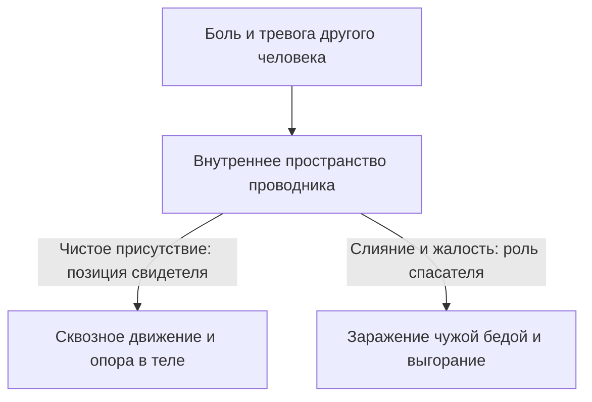

# Техника безопасности оператора

У врачей инфекционных госпиталей есть незыблемое правило: перед входом в «красную зону» ты надеваешь защиту не потому, что брезгуешь больными, а потому, что мёртвый или заражённый врач уже никому не сможет помочь. Малейшая небрежность в шлюзе — и спасатель сам превращается в пациента.

Во внутреннем пространстве человека — когда ты искренне открываешь сердце чужой беде, застарелым семейным трагедиям и разорванным судьбам — это правило перестаёт быть аллегорией. Это базовое условие душевного и физического выживания.

Где пролегает граница между целительным состраданием и слепым заражением чужой разрушительной болью?

---

## Четыре рубежа внутренней защиты

Глубокое соприкосновение с чужой болью — это прямой контакт с концентрированным, токсичным зарядом неотработанного горя и страха. По закону сообщающихся сосудов этот заряд мгновенно стремится выровнять давление и перетечь в твой собственный контур. Если у тебя нет внутренней автономии, за считанные месяцы ты превращаешься в выгребную яму, куда близкие, клиенты или друзья бессознательно сбрасывают свои непереносимые аффекты.

Четыре правила помогают сохранить равновесие:

1. **Суверенная вертикаль (укоренённость в себе).** Ты присутствуешь рядом из самого глубокого, спокойного и взрослого центра своей личности. Ты ясно видишь шторм чужой судьбы, слышишь каждый стон — но твоё тело и твоя нервная система не имеют права тонуть вместе с другим. Если ты разрыдался от бессилия вместе с тем, кто просит помощи, или сжал кулаки в слепой ярости к его обидчикам — ты перестал быть опорой. Ты стал вторым утопающим на тонущем судне.
2. **Завершение контакта.** Любое тяжёлое взаимодействие должно иметь точку полного закрытия. Образы, эмоции, чужие слезы и драмы нужно выгружать из себя без остатка. Чужая тревога не должна ночевать в твоей постели и садиться за один обеденный стол с твоими детьми.
3. **Телесное заземление.** Сразу после тяжёлого разговора сознание необходимо вернуть в плотную биологическую ткань: умыть лицо и запястья ледяной проточной водой, потянуться всем телом, босыми ногами ощутить твёрдый пол, выпить чашку горячего чая с лимоном. Нужно физически вернуться в своё собственное тело.
4. **Уважение к своей ёмкости.** Глубокое человеческое присутствие требует колоссальных биохимических затрат. Голодный, невыспавшийся, истощённый человек мгновенно теряет плотность личных границ. Его нервная система начинает жадно впитывать чужой эмоциональный шторм — лишь бы чужим адреналином и чужой трагедией заглушить собственную внутреннюю пустоту.

---

## Яд жалости и величие сострадания

Большинство людей путает жалость с милосердием. Но на тонком психологическом уровне жалость — одно из самых высокомерных и разрушительных чувств.

Когда ты склоняешься над чужой бедой с мокрыми глазами и причитаниями, внутри мгновенно выстраивается кривая и опасная иерархия: **«Я — большой и сильный, а ты — маленький, жалкий и беспомощный»**. Каким бы бархатным ни был твой голос, бессознательно другой слышит: *«Ты слаб. Ты не выдержишь ударов своей судьбы. У тебя не хватит сил справиться самому»*.

Такая жалость унижает человеческое достоинство. Под маской «доброты» ты кастрируешь волю другого человека к преодолению.

Фокусируясь на чужой беспомощности, ты подкармливаешь в человеке позицию жертвы. Он расслабляет мышцы: зачем мобилизовать собственный дух, если рядом сердобольный спасатель, готовый тащить его крест на собственном горбу? Жалость консервирует бессилие. Временная трудность под её воздействием превращается в пожизненную инвалидность.

Истинное сострадание выглядит совершенно иначе. Оно смотрит на человека не сверху вниз, а глаза в глаза: *«Я вижу твою боль. Я знаю, как тебе тяжело. Но я верю в силу твоего духа. Я побуду рядом, пока ты собираешься с силами, но нести твою ношу я за тебя не стану — потому что это твоя жизнь и твоя победа»*.

---

> [!NOTE]
> ## Научный фундамент: сострадательная усталость и маятник травмы
>
> Чарльз Фигли подробно описал синдром «сострадательной усталости» (*compassion fatigue*): длительный эмоциональный резонанс с травмированными людьми без вегетативного разделения запускает системное воспаление и истощение надпочечников. Мозг начинает воспринимать чужое горе как прямую угрозу собственному биологическому выживанию.
>
> Питер Левин сформулировал два фундаментальных закона исцеления: **титрацию** и **пендуляцию**. Подобно химику, капающему концентрированную кислоту в раствор по капле, зрелый практик дозирует соприкосновение с болью микроскопическими порциями, непрерывно возвращая внимание в безопасные, ресурсные зоны тела.
>
> Это колебание маятника между эпицентром боли и островком телесного покоя позволяет нервной системе завершить заблокированную реакцию без повторного потрясения.

---

## Быль: отец Михаил и восемь лет исповедей

Отец Михаил сам подал архиерею прошение о назначении тюремным священником.

Ему было тридцать два года. Он служил во влажном деревянном храме под Рязанью и искренне тяготился тихим приходским покоем среди бабушек в платочках. Ему казалось, что настоящее пастырское служение должно совершаться там, где земля пропитана кровью, гарью и человеческим отчаянием — где страдание обнажено до открытого нерва.

Свою первую исповедь в следственном изоляторе он помнил до мельчайших подробностей. Промозглое ноябрьское утро. Серый кабинет следователя: решётка на окне, ободранный стол, въедливый запах мокрых овчинных тулупов, дешёвой махорки и хлорки. Напротив — мужчина пятидесяти лет, бригадир дорожных рабочих, в пьяной драке забивший топором напарника. Он говорил глухо, сухо, глядя в бетонный пол, без пафоса и без единой слезинки — монотонно рассказывал, как хрустели кости, как остывала лужа на половицах и как он двое суток просидел в избе рядом с остывающим телом, боясь толкнуть дверь.

Отец Михаил слушал. Спазм всё сильнее перехватывал горло, в лёгких кончался воздух. А в юной душе бушевал романтический экстаз: *«Вот оно. Я заберу эту тьму себе. Я пережгу её силой своей молитвы, чтобы несчастному стало легче дышать»*.

Когда исповедь закончилась, он вышел во внутренний двор тюрьмы и опустился на мокрую скамью у проходной. Он физически не мог подняться на ноги. Ноги стали чугунными, пальцы мелко дрожали, а перед глазами плыл липкий серый туман.

— Ничего, — шептал он пересохшими губами, дрожащей рукой осеняя себя крестом. — Так и должно быть. Я взял его крест на свои плечи.

О том, насколько это было слепой гордыней, он узнал лишь спустя годы.

---

Шли месяцы. Тюремный замок стал его вторым домом: три дня в неделю, с утра до вечера. Грабители, насильники, обезумевшие от горя матери с передачами, озлобленные надзиратели. Он тайно гордился тем, что ни от кого не отворачивается и пропускает через своё сердце каждую трагедию.

К концу третьего года у него начался непрекращающийся тремор кистей. Он списывал это на крепкий чай. Потом намертво разрушился сон: стоило задремать на полтора часа, как он просыпался от удушья в холодном липком поту. В кошмарах за ним тянулись бесконечные тюремные коридоры, и он стоял на коленях перед суровым судьёй, не в силах вымолвить ни слова в своё оправдание.

А затем из его жизни ушёл свет.

Стоя перед алтарём на воскресных литургиях, отец Михаил с ужасом понимал, что механически бубнит слова молитв, совершенно не чувствуя их смысла. Он смотрел на прихожан, на матерей с младенцами, на стариков — и внутри него отзывалась лишь глухая, мертвенная свинцовая пустота. Дети перестали подходить к нему под благословение: они чуяли исходящий от него могильный холод и жались к подолам матерей.

На пятый год такого служения он поехал в монастырь — к девяностолетнему духовнику, схиархимандриту Серафиму. Упал на колени перед старой деревянной скамьёй и разрыдался сухими, воспалёнными глазами:

— Отче… Я больше не слышу Бога. Моё сердце мертво. От меня ничего не осталось. Я напитался той же скверной, которой дышат тюремные камеры. Я стал таким же убийцей — только топор в руки не брал.

Старец долго молчал, перебирая потертые чётки. В келье пахло ладаном и сушёной мятой. Наконец он поднял строгий взгляд:

— А куда ты деваешь то, что принимаешь на исповедях, Миша?

— Куда?.. Несу в себе. Предстою перед Господом с их грехами.

Старец горько покачал головой:

— Глупец ты, Миша. Гордец и слепец. Возомнил себя спасителем? Решил, что твои тщедушные человеческие плечи выдержат то, что под силу лишь Христу? Превратил храм своей души в помойную яму и назвал это великим подвигом! Запомни: ты — не резервуар. Ты — водосточная труба. Обычная медная труба под крышей храма. Через неё во время ливня льются потоки мутной, грязной воды — но внутри самой трубы ничего не должно оставаться! Она должна быть чистой, пустой и сквозной. Вода уходит в землю. А ты натолкал внутрь камней, устроил запруду и теперь плачешь, что тебя разорвало зимним льдом!

Старец наложил строгую епитимью: полгода никакого тюремного служения и никаких исповедей. Физический труд на монастырском огороде. Колка берёзовых дров. Полное молчание.

Эти полгода отец Михаил вспоминал как тяжёлое чистилище. Из его тела слоями выходила накопленная радиация чужих грехов: чужой ужас, чужая похоть, чужой смрад и крики. Случались дни, когда его выворачивало жёлчью. Он часами лежал лицом на сырой осенней земле монастырского яблоневого сада, пока прохладная влага почвы буквально не вытягивала из мышц последние остатки яда.

И только тогда до него дошла жестокая правда: все эти годы он служил не Богу и не людям. Он упивался сладким ядом собственной исключительности — тайной уверенностью, что «никто, кроме меня, не выдержит эту пропасть».

Когда епитимья закончилась, он вернулся в тюремный замок совершенно другим человеком.

Каждый раз перед тем, как переступить порог тюремного КПП, он клал раскрытую ладонь на шершавую гранитную кладку стены и произносил про себя: *«Господи, я лишь пустая трость в Твоих руках. Никакой чужой грязи я себе не присваиваю. Я — сквозной проводник Твоего света, а не накопитель тьмы»*.

А после смены он сразу выходил на берег реки, разувался, ступал босыми ногами по снегу или траве, делал медленные выдохи и долго держал руки под струёй чистой холодной воды.

Он прослужил в изоляторе ещё пять лет и ушёл на покой со спокойным, открытым взглядом, крепким сном и миром в душе.

В предисловии к своим дневникам о тюремном служении он записал слова, ставшие абсолютным правилом внутренней гигиены:

*«Жалость — это замаскированная гордыня, уверенная в бессилии ближнего. Сострадание — это знание величия его бессмертного духа и тихое, уважительное присутствие рядом»*.

---

## Чеклист оператора: внутренняя гигиена

Сделай эти простые шаги своей железной привычкой перед любым глубоким контактом — с клиентом, с близким человеком или с собственной болью.

1. **Входной фильтр:**
   Три длинных, неторопливых выдоха. Ощути вес своего тела на стуле, твёрдость пола под ногами. Произнеси про себя:
   > «Я вхожу в позицию свидетеля. Мой суверенитет неприкосновенен. Я — чистое стекло, сквозь которое проходит свет, а не сосуд для чужих страданий. Судьба другого человека принадлежит только ему».
2. **Маркеры опасности:**
   Немедленно сделай паузу и выйди из контакта, если замечаешь у себя:
   * Ощущение оторванности от тела («руки не мои, комната плывёт, голос звучит как из бочки»);
   * Внезапный приступ липкого озноба или подступающую тошноту;
   * Яростное, нестерпимое желание «немедленно спасти» человека, взвалив его бремя на себя.
3. **Разрыв контакта:**
   Физически сделай шаг назад от места разговора. Мысленно или вслух:
   > «Контакт завершён. Я выхожу из чужой истории. Все чужие боли, вину, страхи и программы я оставляю их истинным владельцам с уважением к их силе. Я остаюсь в своём теле, в своём дне и со своей жизнью. Моё пространство чисто».
4. **Физическое заземление:**
   Энергично встряхни кистями рук, словно стряхиваешь капли воды. Сильно топни стопами по полу. Тщательно вымой лицо и руки до локтей холодной водой. Выпей стакан воды медленными, осознанными глотками.

Оставь романтику жертвенности. Сила того, кто помогает другим, заключается в чистоте и несокрушимой целостности его собственных границ.

> [!IMPORTANT]
> **Главная мысль**
> Помощь из жалости и высокомерия парализует силы другого человека, тогда как внутренняя гигиена сохраняет устойчивость через уважительное сострадание равного к равному.
