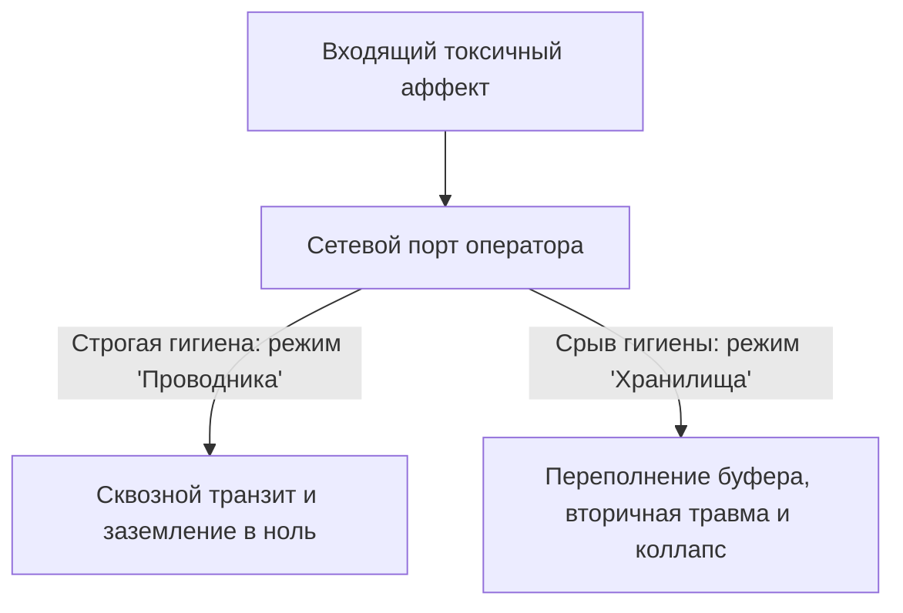

# Техника безопасности оператора

У инженеров критической инфраструктуры есть аксиома: любой входящий поток по умолчанию враждебен, пока не прошёл санитарную фильтрацию. Строка без валидации — SQL-инъекция или переполнение буфера ядра.

В пространстве Сети — когда настраиваешь приёмник на чужую боль, семейные трагедии, застарелые травмы — это уже не метафора. Это условие физического и психического выживания.

Где водораздел между сострадательным присутствием и заражением чужим разрушительным зарядом?

---

## Четыре рубежа защиты

Соприкосновение с чужой системой — прямой контакт с сырыми, высокотоксичными массивами неотработанного аффекта. По закону сообщающихся сосудов заряд стремится выровнять давление и хлынуть в твой контур. Без изоляции за месяцы превращаешься в полигон, куда клиенты, близкие, партнёры неосознанно сбрасывают отходы.

1. **Суверенная вертикаль (Position of Self).** Работа — из верхнего незамутнённого слоя Ядра. Ты регистрируешь шторм чужой системы, калибруешь частоту — но моторика и гормоны не имеют права сливаться с чужим процессом. Зарыдал вместе с клиентом или сжал кулаки от ярости к его обидчикам — перестал быть навигатором. Стал второй жертвой на тонущем судне.
2. **Изоляция сессии (Session Teardown).** Любое взаимодействие заканчивается полным разрывом. Образы, роли, эмоциональные пакеты — выгрузить из памяти. Чужая тревога не ночует в твоей спальне и не садится за стол с твоими детьми.
3. **Физиологический сброс (Hardware Grounding).** Сразу после глубокой работы — в осязаемую материю. Контрастное умывание ледяной водой. Протряска суставов. Босые стопы на полу. Горячий чай с лимоном. Сознание катапультируется из тонких полей в плотный биологический каркас.
4. **Учёт пропускной способности (Rate Limiting).** Полевая работа жрёт АТФ и требует устойчивых миелиновых оболочек. Истощённый, невыспавшийся, голодный оператор теряет плотность границы. Нервная система начинает впитывать чужой заряд — лишь бы чужим адреналином заткнуть собственную висцеральную пустоту.

---

## Жалость сверху: яд высокомерия

Большинство путает жалость с добротой. На уровне Сети жалость — один из самых разрушительных сигналов, которые можно направить другому.

Встал над чужой бедой с мокрыми глазами — и в ту же миллисекунду выстроился перекос: **«Я — большой и сильный, ты — маленький и никчёмный»**. Каким бы мягким ни был голос, на частоте Сети звучит: *«Ты не выдержишь своей судьбы. У тебя нет ресурсов. Твоих сил недостаточно»*. Это попрание достоинства взрослого. «Добротой» кастрируешь чужую волю к преодолению.

Фокус на чужой беспомощности активирует **энергию краха**. Профиль жертвы получает питание. Человек рядом расслабляет мышцы: зачем мобилизовать Ядро, если рядом спасатель, готовый тащить на горбу? Жалость бетонирует бессилие. Временная трудность становится хронической инвалидностью.

---

> [!NOTE]
> ## Научный блок: титрация, пендуляция и вторичный травматический стресс
>
> Фигли описал compassion fatigue: долгий резонанс с чужой травмой без вегетативной сепарации запускает нейровоспаление и истощение надпочечников. Организм начинает воспринимать рассказ о чужой трагедии как прямую угрозу собственному гомеостазу.
>
> Левин дал два закона стабилизации: **титрацию** и **пендуляцию**. Как химик капает кислоту по капле, оператор дозирует прикосновение к аффекту микропорциями и возвращает внимание в ресурсные зоны тела. Маятник между вихрем травмы и островком телесной безопасности позволяет нервной системе завершить заблокированную моторную реакцию без ретравматизации.
>
> Карпман описал треугольник: Спасатель неизбежно скатывается в преследование или жертвенность. В администрировании незащищённый эмпатический контакт — открытый UDP без брандмауэра. Слепо глотаешь все входящие пакеты — DoS. Потом падение ОС.

---

## Быль: отец Михаил и восемь лет исповедей

Отец Михаил сам подал прошение о назначении тюремным священником.

Тридцать два. Влажный деревянный храм под Рязанью. Томился приходским покоем. Казалось: настоящее апостольское служение — там, где земля пропитана кровью и гарью, где боль обнажена до нерва.

Первая исповедь в СИЗО — промозглое ноябрьское утро. Кабинет следователя: решётка, серые стены, запах сырых овчинных тулупов, дешёвой махорки, хлорной извести. Мужчина пятидесяти лет, бригадир дорожных рабочих, забивший топором собутыльника. Говорил глухо, сухо, в пол. Без слёз. Без пафоса. Механически: как хрустели кости, как стыла лужа на досках, как два дня сидел рядом с трупом, не в силах открыть дверь.

Отец Михаил слушал. Горло перехватывало сильнее. В лёгких кончался воздух. Думал с юношеским экстазом: *«Вот оно. Заберу эту тьму себе. Пережгу верой, чтобы ему стало легче дышать»*.

Вышел во двор. Сел на мокрую лавку у КПП. Не мог встать. Ноги — чугун. Руки тряслись. Перед глазами — липкий серый туман.

— Ничего, — шептал пересохшими губами, крестясь. — Так и должно. Я взял его крест на плечи.

Роковая ошибка. Понял годы спустя.

---

Месяцы. Изолятор — второй дом: три дня в неделю, по шесть-восемь часов. Грабители, насильники, сломленные матери с передачами, озлобленные конвоиры. Гордился: ни от кого не отворачивается, принимает каждого в сердце.

К концу третьего года — непрекращающийся тремор кистей. Списывал на крепкий чай. Потом разрушился сон: два часа — и удушье, ледяной пот. В кошмарах — камеры, коридоры, он на коленях перед невидимым судьёй, не в силах вымолвить слово.

Затем из жизни ушёл свет.

На воскресных службах ловил себя: механически читает молитвы, не понимая смысла. Смотрел на матерей с младенцами, на стариков — внутри глухая свинцовая пустота. Дети перестали подходить под благословение: чувствовали могильный холод, жались к юбкам.

На пятый год — монастырь, девяностолетний духовник, схиархимандрит Серафим. Упал на колени. Зарыдал сухими воспалёнными глазами:

— Отче… Я больше не слышу молитвы. Сердце мертво. Ничего не осталось от священника. Наполнился той же скверной, что сидит в камерах. Стал таким же убийцей — только без топора.

Старец молчал, перебирая чётки. Ладан. Сухая мята. Поднял глаза:

— А куда ты сливаешь то, что принимаешь на исповедях, Миша?

— Куда сливаю?.. Храню перед Богом. Несу в себе.

Старец покачал головой:

— Глупец ты, Миша. Гордец и слепец. Возомнил себя хранилищем чужих грехов? Решил, что твои немощные плечи крепче плеч Христа? Превратил тело в выгребную яму и назвал это святостью! Ты — не резервуар. Священник — водосточная труба. Простая медная труба. Через неё льются тонны грязной дождевой воды — внутри ничего не должно застревать. Она должна быть пустой и чистой. А ты забил трубу камнями, устроил запруду и удивляешься, почему тебя разорвало изнутри.

Епитимья: полгода без тюрьмы. Запрет на исповедь заключённых. Физический труд на огороде. Колка дров. Молчание.

Эти полгода он вспоминал как чистилище. Слоями выходила накопленная радиация чужих судеб: чужой ужас, чужая кровь, чужие нераскаянные крики. Рвало желчью. Часами лежал лицом на мёрзлой земле монастырского сада, пока ледяная влага почвы не вытянула из мышц остатки яда.

Понял правду: все эти годы служил не Христу и не заключённым. Обслуживал тайное упоительное тщеславие Спасателя — уверенность, что «никто, кроме меня, не выдержит эту бездну».

Епитимья кончилась. Вернулся в изолятор другим человеком.

Перед входом касался ладонью гранитной стены и произносил вслух: *«Господи, я лишь пустая трость в Твоих руках. Никакой чужой грязи себе не присваиваю. Я — проводник, а не сосуд»*.

После смены — на воздух, разувался на снег или траву, глубокие выдохи, руки под ледяной струёй уличного крана до локтей. Прослужил ещё пять лет и ушёл сам — со светлыми глазами, крепким здоровьем, внутренним миром.

В предисловии к рукописи о тюремном служении написал слова, ставшие золотым стандартом оператора:

*«Жалость — это тайная гордыня, уверенная в бессилии ближнего. Сострадание — это знание величия его духа и молчаливое присутствие рядом»*.

---

## Чеклист оператора: протокол безопасности

Введи эти правила перед любой глубокой работой — с собой, с клиентом, с партнёром.

1. **Входной фильтр (Firewall):**
   Три длинных выдоха. Вес таза на опоре. Соматическая формула:
   > «Я вхожу в режим свидетеля. Мой суверенитет неприкосновенен. Я — проводник информации, а не резервуар для чужого аффекта. Чужая боль остаётся чужой судьбой».
2. **Маркеры аварийного прерывания (Red Flags):**
   Немедленно останови процесс и выйди из сессии, если на датчиках:
   * Острая соматическая диссоциация («тело чужое, комната уплывает, звуки как из-под воды»);
   * Внезапный некупируемый озноб или тошнота;
   * Навязчивое желание спасти человека любой ценой, забрав его боль себе.
3. **Протокол разрыва сессии (Session Teardown):**
   Шаг назад от маркеров. Вслух:
   > «Сессия закрыта. Информационный контур разорван. Все чужие проекции, программы, вину и страхи возвращаю их носителям. Это не мой код. Я остаюсь в своём теле, в своём времени и в своей силе. Мой контур автономен и чист».
4. **Физическая дезактивация:**
   Интенсивно встряхни кисти от кончиков пальцев к запястьям. Протопай стопами по полу — отдача в кости. Ополосни лицо и шею холодной водой. Выпей полный стакан минеральной воды мелкими глотками.

Оставь упоение мученичеством. Эффективность проводника держится на чистоте и целостности. Склад заполняется до критической отметки и взрывается — увлекая за собой всё здание.

> [!IMPORTANT]
> **Закон главы**
> Работа из позиции превосходства и жалости парализует чужую волю к преодолению, тогда как операторская гигиена сохраняет устойчивость через сострадательное присутствие равного с равным.
