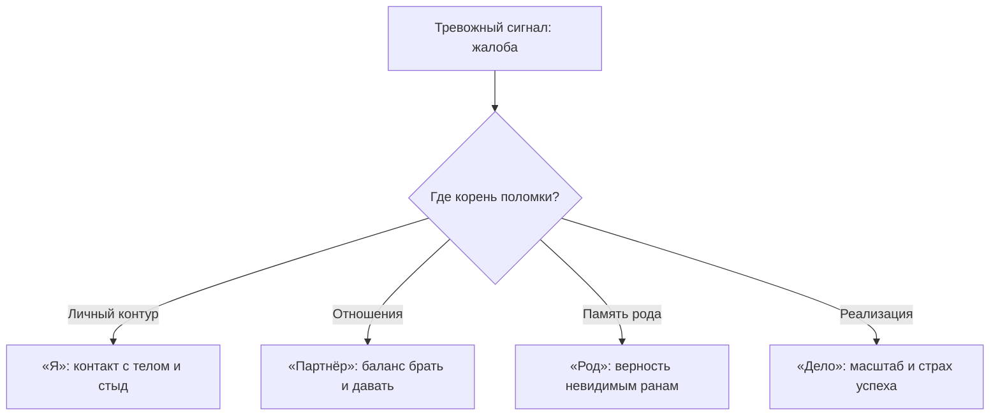

# Диагностика: увидеть скрытый корень проблемы

Произнеси вслух свою главную боль. Прямо сейчас. В пустую, тихую комнату.

Прислушайся к тому, что отозвалось внутри. Это подлинная причина — или всего лишь тревожная надпись на приборной панели?

«Деньги уходят сквозь пальцы». «Меня постоянно предают близкие». «Перед важным выступлением перехватывает дыхание».

Большинство людей годами воюет с лампочкой на приборной панели. Они пытаются заглушить её аффирмациями, курсами ораторского искусства, жестким тайм-менеджментом или таблетками. Это ничем не отличается от попытки заклеить чёрной изолентой датчик перегрева двигателя. В салоне становится тихо и спокойно. Но через пятьдесят километров поршни пробивают блок цилиндров.

Бессмысленно поливать монитор водой, если на нём горит картинка пожара. Нужно найти источник сигнала. Нужно точно знать, где именно заклинило шестерни.

---

## Четыре пространства человеческой боли

Любая жалоба — это лишь внешний шум на выходе. Сама же поломка всегда гнездится в одном из четырёх базовых пространств:

* **Пространство «Я».** Потерян контакт с собственным телом. Глубокий, разъедающий стыд за сам факт своего существования. Руки, которые бессознательно наказывают и саботируют себя же.
* **Пространство «Партнёр».** Разрушен здоровый баланс между способностью брать и отдавать. Близость вызывает панический ужас. Поиск опекуна и родителя вместо взрослого равного спутника. Отчаянная попытка удерживать то, что давно умерло.
* **Пространство «Род».** В твоей сегодняшней жизни продолжают звучать чужие незавершённые катастрофы. Ты бессознательно стоишь на стороне вычеркнутых или погибших. Бедность, одиночество и болезни становятся тайной клятвой верности семейному горю.
* **Пространство «Дело».** Необъяснимый стеклянный потолок в доходе. Самосаботаж накануне масштабного прорыва. Публичность воспринимается телом как смертная казнь на эшафоте. Большой успех на подсознательном уровне пахнет гибелью.

Когда пространство определено, нужно найти **застывший кадр**: тот самый телесный спазм, то самое чувство, замурованное в мышечной ткани, и то детское правило, которое записалось в нервную систему в момент шока.

---

> [!NOTE]
> ## Научный фундамент: нейроцепция и короткий путь страха
>
> Стивен Порджес в поливагальной теории описал механизм нейроцепции: ствол головного мозга непрерывно и бессознательно сканирует окружающую среду в поисках угроз за доли секунды до того, как неокортекс успевает оформить первую мысль. Малейший знакомый отголосок древней опасности — и тело мгновенно проваливается в одну из защитных реакций: нападение, бегство или оцепенение.
>
> Джозеф Леду открыл так называемую «низкую дорогу» аффекта: импульс от таламуса устремляется напрямую в миндалевидное тело, минуя кору полушарий. Амигдала перехватывает штурвал физиологии в тот момент, когда сознание ещё пытается мыслить рационально.
>
> Именно поэтому финансовый или творческий саботаж не лечится тренингами уверенности. Пока в мышечной памяти жив древний триггер опасности, рассудок будет лишь придумывать красивые оправдания своей капитуляции. Сначала нужно слушать тело, а не теории.

---

## Живая история: Дмитрий и телефонный провод

Дмитрий работал коммерческим директором крупного федерального дистрибьютора сложного медицинского оборудования. Ему было сорок лет. Это был высокий, представительный мужчина с безупречными манерами, но о своей проблеме он говорил с глухим стыдом:

— Сделки до десяти миллионов рублей я закрываю легко и виртуозно. Но стоит переговорам коснуться поставок магнитно-резонансных томографов на сотни миллионов — со мной творится что-то неладное. Горло намертво перехватывает спазмом. Голос становится сиплым, жалким. Я начинаю заикаться. А за сутки до решающего подписания контракта я сам — словно под гипнозом — отправляю не ту спецификацию или заваливаю оформление банковской гарантии. Я потратил целое состояние на ораторские курсы и коучей. Все твердят про «синдром самозванца». Но это не самозванец. Это животный ужас.

Мы не стали разбирать бизнес-модели и регламенты переговоров. Я попросил его встать на ноги посреди кабинета.

— Сделай шаг вперёд. Расправь плечи и скажи вслух: «Я выигрываю главный государственный тендер. Я выхожу на сцену перед инвесторами. Я забираю пятьдесят миллионов рублей чистой прибыли».

Дмитрий набрал воздуха в грудь, сделал шаг — и буквально застыл на полувдохе. Лицо стало пепельно-серым, пальцы судорожно вцепились в воротник дорогой рубашки, словно пытаясь разорвать ткань.

— Что сейчас в теле? Ничего не анализируй. Опиши физические ощущения.

Из его горла вырвался свистящий, сдавленный хрип:

— Горло… Будто стальной трос затянули на кадыке. Ни глотка воздуха. В грудине раскалённый металлический штырь. В ушах звон.

— Не пытайся дышать глубже. Не борись со спазмом. Погрузи всё внимание в этот трос. Сколько лет этому удушью? В каком возрасте твоё тело впервые испытало точно такой же ужас?

Зрачки Дмитрия расширились. Взгляд остекленел, уходя глубоко внутрь себя.

— Октябрь… девяносто восьмой год, — его голос вдруг стал тонким, срывающимся, детским. — Мне десять лет.

— Что происходит вокруг?

Дмитрия начало мелко трясти, колени подкосились:

— Ночь. Наша старая двухкомнатная квартира. Мой отец — заведующий отделением нейрохирургии, кристально честный человек, взяток в жизни не брал. Но в тот месяц отделение выиграло международный грант на переоснащение операционных, и валюта лежала в домашнем сейфе. Трое амбалов в чёрных вязаных шапках с прорезями для глаз выбили входную дверь монтировкой. Меня схватили прямо в кровати, поволокли на кухню и привязали спиной к раскалённой чугунной батарее толстым чёрным шнуром от дискового телефона. Провод врезался прямо в горло…

— Что делали с отцом?

По щекам Дмитрия хлынули слёзы, челюсть свело судорогой:

— Утюг… Они поставили раскалённый утюг ему на грудь, требуя шифр от сейфа. Отец кричал так страшно, что звенели гранёные стаканы в серванте. А один из бандитов натянул телефонный провод у меня на шее так, что я захрипел, и приставил тесак прямо к моему правому глазу: «Пикнешь хоть раз, сучонок, — папаше горло перережем прямо на твоих глазах! Молчи, мразь!» И я вжался в батарею, обжигая спину, и поклялся себе: ни единого звука. Только бы папа остался жив.

— Что было дальше, Дима?

Он опустился на колени, уронив голову на грудь:

— Отец отдал шифр. Бандиты забрали сумку с деньгами, но перед уходом избили отца обрезками водопроводных труб. Он остался инвалидом. У него отнялась речь. Через два года он умер от повторного инсульта. А я… я двадцать пять лет думал, что я просто плохой оратор и трусливый продавец.

Двадцать пять лет нервная система взрослого топ-менеджера послушно хранила выжженное насилием правило: **большие деньги — это выбитая дверь, раскалённый утюг на отцовской груди, телефонный провод на горле и смерть близкого**.

Стоило сумме контракта приблизиться к смертельно опасной черте, как тело мгновенно активировало аварийный тормоз: перекрыть дыхание, сорвать голос, перепутать цифры в документах — лишь бы та страшная кухонная расправа никогда не повторилась.

— Дима, посмотри на свои руки. На них сейчас есть телефонный провод?

— Нет, — прошептал он, глядя на пустые ладони.

— Тебе сейчас десять лет?

— Нет. Мне сорок.

— Положи обе ладони на своё горло. Согрей его. И скажи в полный голос: «Бандиты девяносто восьмого года мертвы или сгнили в тюрьме. Та страшная ночь закончилась. Отец вынес свою судьбу сам. Мой голос свободен. Большие деньги больше не убивают меня и моих близких».

Он повторил эти слова трижды. На третий раз в глубине его гортани раздался отчётливый сухой щелчок. Зажатая диафрагма дрогнула и раскрылась. Огромный объём прохладного свежего воздуха свободно вошёл в лёгкие.

— Я могу дышать… — прошептал он, ощупывая шею. — Горло свободное. Внутри словно открылось окно.

Через три недели Дмитрий блестяще провёл решающий раунд переговоров и подписал контракт на двести восемьдесят миллионов рублей. Его голос звучал глубоко, уверенно и спокойно. То, с чем годами не могли справиться тренинги и методики, ушло за сорок минут точной диагностики истинного корня боли.

---

## Практика: поиск истинного адреса симптома

Сегодня мы ничего не чиним и не исправляем. Наша единственная задача — найти подлинную причину в теле.

1. **Сигнал на панели.** Запиши свою привычную жалобу на бумаге («не растут доходы», «рушатся отношения», «панический страх критики»). Под ней напиши фразу: *«Это всего лишь лампочка на приборной панели. Что на самом деле происходит под капотом?»*
2. **Телесный скан.** Закрой глаза. Вспомни самый острый, болезненный момент своей проблемы. Обрати внимание не на мысли, а на физическое тело:
   * где именно зарождается спазм (горло, солнечное сплетение, сжатые челюсти, холод в животе, окаменевшие лопатки);
   * какого характера это ощущение (ледяной холод, свинцовая тяжесть, натянутая колючая проволока, полное онемение);
   * что тело хочет сделать инстинктивно (свернуться калачиком, замереть без дыхания, броситься бежать).
3. **Отделение шума.** Запиши все привычные логические объяснения своего ума («сложный рынок», «партнёр с трудным характером», «мне не хватает дисциплины»). Признай: это поверхностный шум рассудка.
4. **Вопрос в прошлое.** Положи ладонь на место спазма в теле и спроси себя:
   > «Когда моё тело впервые испытало в точности такое ощущение? От какой страшной беды этот спазм защитил меня в детстве?»
   Зафиксируй первый же спонтанный образ: сколько тебе лет, какое время года, чей голос звучит рядом.
5. **Формула истинного корня:**
   Запиши найденную связь одной честной строкой:
   > **«Моя проблема с [внешняя жалоба] — это защита в пространстве [Я / Партнёр / Род / Дело]: тело защищает меня от [опасность из прошлого] с помощью спазма в [конкретный орган или мышца]».**

Прочти эту строку вслух. Если по телу пробежала горячая волна, а грудь сама собой сделала глубокий облегчённый выдох — корень найден точно. Теперь систему можно исцелять.

> [!IMPORTANT]
> **Главная мысль**
> Бороться со следствиями проблемы вместо поиска истинного спазма в теле — всё равно что пытаться починить закипевший двигатель с помощью изоленты на приборной панели.
