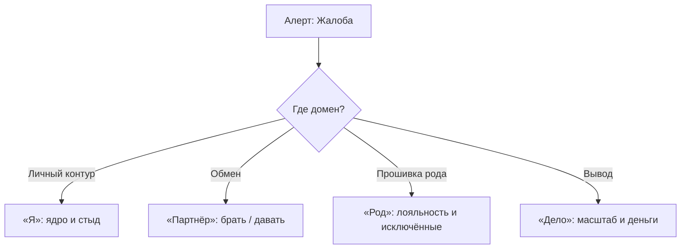

# Диагностика: вывести скрытый баг на экран

Скажи вслух свою главную беду. Прямо сейчас. В пустую комнату.

Послушай, что вернулось. Это причина — или только надпись на приборной панели?

«Деньги не растут». «Меня предают». «Перед сценой трясёт».

Лампочка `Check Engine`. Не двигатель. Заклеить её аффирмациями, тайм-менеджментом, курсом ораторского мастерства — то же, что изолентой закрыть датчик перегрева. Тихо. Красиво. Через пятьдесят километров поршни выходят из блока.

Воду на монитор лить бесполезно. Нужны логи. Нужен адрес.

---

## Четыре домена

Жалоба — шум на выходе. Поломка сидит в одном из четырёх мест:

* **«Я».** Потерял контакт с телом. Стыд за то, что существуешь. Руки, которые бьют себя же.
* **«Партнёр».** Баланс сломан. Близость пугает. Ищешь опекуна вместо равного. Держишься за то, что давно кончилось.
* **«Род».** Чужие катастрофы живут в тебе. Стоишь на стороне вычеркнутых. Нищета и болезни как клятва верности.
* **«Дело».** Потолок дохода. Саботаж на пороге роста. Публичность как казнь. Успех пахнет смертью.

Нашёл домен — ищи **зависший кадр**: спазм, чувство, замурованное в мышце, и правило, которое тогда записалось.

---

> [!NOTE]
> Стивен Порджес назвал это нейроцепцией: ствол мозга непрерывно сканирует мир быстрее, чем ты успеваешь подумать. Чуть знакомый запах опасности — и тело уже в бою, бегстве или обмороке. Джозеф Леду показал «низкую дорогу»: сигнал идёт от таламуса к миндалине, минуя кору. Амигдала хватает руль, пока ум ещё сочиняет оправдания. Поэтому финансовый саботаж не лечится курсом переговоров. Пока в теле жив старый триггер, голова будет врать красиво. Сначала слушай ткань, не лозунг.

---

## Дмитрий и телефонный провод

Дмитрий — коммерческий директор. Сорок лет. Федеральный дистрибьютор медицинского оборудования. Жалоба, которую он сам стыдился:

— До десяти миллионов я веду переговоры блестяще. Когда на столе томографы на сотни миллионов — горло схлопывается. Голос садится. Я заикаюсь. За сутки до сделки сам шлю не ту спецификацию или срываю банковскую гарантию. Потратил миллионы на ораторские школы и коучей. Ум твердит: «комплекс самозванца».

Мы не разбирали бизнес-кейсы. Поставили его на ноги.

> **Терапевт:** Шагни вперёд. Скажи: «Я выигрываю главный тендер. Выхожу на сцену. Забираю пятьдесят миллионов чистыми».
>
> **Дмитрий:** *(вдох — и замирает. Лицо сереет. Пальцы вцепляются в ворот)*
>
> **Терапевт:** Что в теле? Не думай. Отчитывайся датчиками.
>
> **Дмитрий:** *(свистящий хрип)* Горло… трос на кадыке. Воздуха ноль. В грудине — раскалённое железо. В ушах звон.
>
> **Терапевт:** Держись в горле. Не дыши «правильно». Сколько лет этому тросу? Где тело уже знало этот спазм?

Зрачки расширились. Взгляд ушёл внутрь.

> **Дмитрий:** *(голос — детский, захлёбывающийся)* Октябрь… девяносто восьмой. Мне десять.
>
> **Терапевт:** Что видишь?
>
> **Дмитрий:** *(трясёт, ноги подкашиваются)* Ночь. Двухкомнатная. Отец — заведующий нейрохирургией, взяток не брал. В тот месяц — международный грант, в сейфе наличные на оборудование. Трое в вязаных масках выбили дверь. Меня повалили на кухне. Привязали спиной к горячей батарее чёрным телефонным шнуром. Шнур врезался в шею…
>
> **Терапевт:** Что с отцом?
>
> **Дмитрий:** *(слёзы, челюсть сведена)* Утюг. На грудь. Ключ от сейфа. Отец кричал так, что звенели стаканы. Один натянул провод на моём горле и приставил тесак к глазу: «Пикнешь — папаше горло от уха до уха. Молчи, тварь!» Я вжался в батарею. Поклялся: ни звука. Лишь бы папа жил.
>
> **Терапевт:** Дальше?
>
> **Дмитрий:** *(на коленях)* Отец отдал всё. Его били обрезками труб. Инвалид. Потерял речь. Через два года умер. А я… думал, что я плохой продавец.

Двадцать пять лет нервная система держала правило: **крупные деньги = бандиты, утюг, провод, смерть отца**. Сумма близко к порогу — перекрыть трахею, сорвать голос, испортить бумагу. Лишь бы казнь не повторилась.

> **Терапевт:** На руках сейчас есть шнур?
>
> **Дмитрий:** Нет.
>
> **Терапевт:** Тебе десять?
>
> **Дмитрий:** Нет. Сорок.
>
> **Терапевт:** Обе руки на горло. В полный голос: «Бандиты девяносто восьмого мертвы или сидят. Тот год кончен. Отец заплатил свою цену сам. Мой голос свободен. Большие деньги меня больше не убивают».

Три раза. На третьем — сухой щелчок в гортани. Диафрагма открылась. Горячий воздух вошёл сам.

— Я могу кричать, — прошептал он. — Горло… пустое. Прохладный воздух.

Через три недели он подписал контракт на двести восемьдесят миллионов. Голос на переговорах был ровный. То, чего не взяли годы тренингов, ушло за сорок минут точной диагностики.

---

## Практика: трассировка симптома

Сегодня не чиним. Только находим адрес.

1. **Алерт.** Запиши жалобу как обычно («рушатся отношения», «не поднимаю чек», «тревога»). Ниже: *«Это лампочка. Что под капотом?»*
2. **Скан тела.** Закрой глаза. Вызови худший момент проблемы. Не мысли — зажим:
   * где (горло, диафрагма, челюсть, таз, лопатки);
   * каково (холод, свинец, проволока, онемение);
   * что тело хочет (сжаться, замереть, бежать).
3. **Ложные логи.** Запиши оправдания ума («рынок», «партнёр нарцисс», «я ленивый»). Это шум панели.
4. **Вопрос во времени.** Ладонь на спазм:
   > «Когда тело впервые узнало эту плотность? Какую беду этот зажим тогда отвёл?»
   Запиши первый кадр: возраст, запах, картинка, звук.
5. **Строка диагноза:**
   > **«Мой симптом [жалоба] — защита домена [Я / Партнёр / Род / Дело]: бережёт меня от [угроза из прошлого] через блок в [орган/мышца]».**

Прочти вслух. Если сердце на секунду споткнулось и выдох пришёл сам — адрес найден. Можно ставить патч.

> [!IMPORTANT]
> **Закон главы**
> Лечить жалобу вместо бага в теле — всё равно что заклеивать лампочку перегревающегося двигателя.
