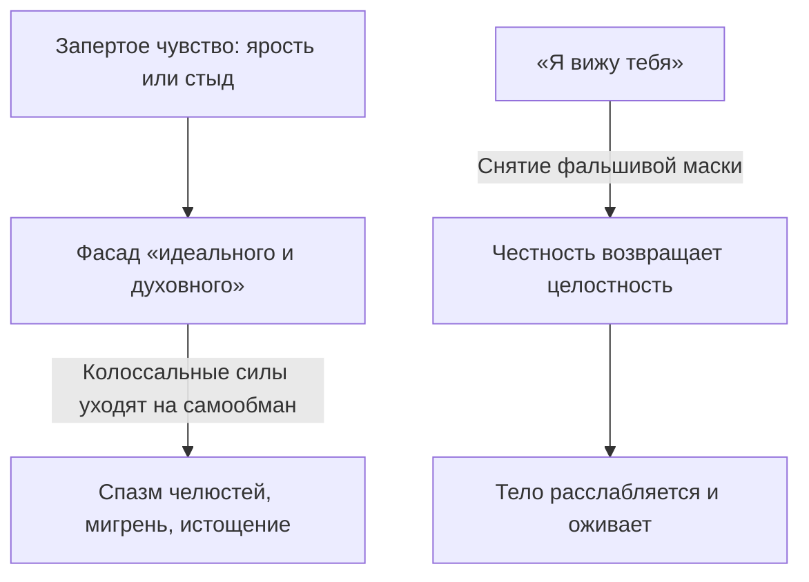

# Плата за невидимость: почему признание возвращает силы

Корень проблемы найден. Но прежде чем бросаться что-то исправлять, нужно сделать один простой шаг, без которого любые техники окажутся пустой тратой времени. Этот шаг — тихий, негероический и предельно взрослый.

Всё, с чем ты воюешь внутри собственной души, высасывает жизненные силы до тех пор, пока ты упорно отворачиваешься и делаешь вид, что этого не существует.

Этот шаг называется **легализацией**. Три честных слова:

*«Я тебя вижу»*.

---

## Куда на самом деле уходит жизненная сила

На словах это кажется элементарным. Никакой мистики: просто признай, что нечто существует. Но именно в этой точке ломается хребет большинства психологических защит.

Запертое в глубине чувство истощает человека вовсе не потому, что оно злое или разрушительное. Почти вся жизненная энергия уходит не на само чувство, а на его **маскировку**.

Круглосуточно, без перерывов на сон, человек держит перед миром и собой фальшивый фасад: «Я осознанный и мудрый лидер», «Я давно всех простила», «Я выше мелочных обид», «У меня осталась только светлая грусть».

Внутри всё кипит от напряжения. Виски пульсируют, зубы сжаты до скрежета, а полезного действия в жизни — ноль. Вся мощность психики расходуется на охрану красивой иллюзии.

Стоит произнести вслух: *«Я вижу тебя. Ты здесь. Ты реально существуешь в моём теле прямо сейчас»* — как служба внутренней цензуры капитулирует. И заблокированная сила мгновенно возвращается в твои руки.

Это правило работает для любой запертой части личности:

* **Для собственного страха:** «Я вижу свой животный ужас перед бедностью. Он здесь. Он ледяным комом ворочается в моём животе, и я больше не притворяюсь смелым».
* **Для отношений:** «Я признаю, как сильно я завишу от этого человека. Хватит изображать из себя неприступную снежную королеву».
* **Для памяти семьи:** «Я вижу невыплаканное горе раскулаченного прадеда. Оно существует, и это его реальная судьба».
* **Для дела и карьеры:** «Я вижу свою жгучую зависть к успеху коллеги. Хватит называть её равнодушным спокойствием».

Признать правду вовсе не значит пойти всё крушить. Слова «Я вижу свою ярость к матери» не означают, что нужно бросаться в драку. Они означают лишь одно: ты прекращаешь лгать собственной нервной системе. Нельзя исцелить то, чьё существование ты отрицаешь. Сначала нужно назвать вещь своим именем.

---

> [!NOTE]
> ## Научный фундамент: цена подавления и алекситимия
>
> Дональд Винникотт подробно описал феномен «Ложного Я»: если родители в детстве не способны выдержать гнев, несогласие или слёзы ребёнка, малыш надевает удобную, улыбчивую маску благополучия, пряча свою живую суть глубоко под кожу.
>
> Алис Миллер показала, как прилежные отличники хоронят собственную душу ради капли родительской похвалы.
>
> Джеймс Гросс экспериментально измерил физиологическую цену эмоционального подавления: когда человек скрывает свои подлинные чувства, у него подскакивает артериальное давление, сужаются периферические сосуды и нарастает гиперактивация миндалевидного тела. Питер Сифнеос ввёл термин «алекситимия» — неспособность распознавать и называть свои чувства — и доказал прямую связь этого состояния с тяжёлыми соматическими заболеваниями.
>
> Назвать чувство своим именем — значит закрыть зависший эмоциональный счёт и вернуть телу спокойный гомеостаз.

---

## Живая история: Светлана и разбитая спаржа

Светлана занимала пост вице-президента по персоналу в крупном инвестиционном банке. Ей было тридцать пять лет. Она носила безупречные шёлковые костюмы пастельных тонов, говорила мягким бархатным голосом и регулярно летала на випассаны и ретриты молчания. Её речь пестрела словами: «принятие», «благодарность за бесценные уроки» и «светлая тишина внутри».

При этом её физическое тело буквально разваливалось на куски.

От ночного бруксизма зубы были стёрты почти до дентина. Специальные швейцарские капы, защищающие эмаль, она перекусывала за две недели. Три-четыре раза в неделю её накрывали жестокие мигрени — с ощущением, будто раскалённый металлический штырь медленно вкручивают через левый висок прямо в глазницу.

— Мне кажется, мне нужно глубже проработать принятие мамы, — мягко улыбнулась она, грациозно сложив руки на коленях. — Я давно на неё не обижаюсь. Она была заслуженным педагогом по классу фортепиано. Ей, конечно, было невероятно сложно с таким обычным, средним ребёнком, как я. У меня к ней осталась только чистая дочерняя любовь.

Пока она произносила эти благостные фразы, её ухоженные пальцы с идеальным французским маникюром впились в кожаный подлокотник кресла с такой чудовищной силой, что костяшки побелели, а кожа натянулась.

— Света, посмотри на свои пальцы. Ты сейчас разорвёшь кожаную обивку. Твои губы рисуют улыбку, а желваки на скулах ходят ходуном. Что произошло в теле, когда ты произнесла слово «фортепиано»?

Улыбка Светланы мгновенно застыла, превратившись в восковую маску:

— Ничего особенного. Обычный спазм сосудов. У меня вегетососудистая дистония с детства.

— Сколько жизненных сил уходит на то, чтобы изображать святую великомученицу? — спросил я спокойно. — Что произошло в прошлые выходные, когда мать приезжала к тебе в гости?

И благостный фасад с треском раскололся.

Светлана трое суток драила трёхкомнатную квартиру до операционной стерильности. Купила огромный букет белых лилий. Приготовила на ужин дикого лосося со свежей спаржей на пару.

Мать переступила порог, даже не поздоровавшись, брезгливо провела пальцем по плинтусу у входа и бросила через плечо:

*«Бедненько тут у тебя, Светочка, но хоть чистенько. Цветы вульгарные — прямо как на кладбище. А спаржа водянистая и безвкусная, будто из совхозной столовой. Впрочем, ты всегда была бездарностью во всём. Вот теперь и компенсируешь угодничеством перед чужими людьми»*.

Вечером того же дня вице-президент банка с кроткой улыбкой подала матери травяной чай, спустилась проводить её до такси и поцеловала в щёку. А потом вернулась в квартиру, заперлась в прачечной, сунула в зубы махровое полотенце и сжимала челюсти до тех пор, пока изо рта не потекла кровь.

— Назови то, что ты прятала в полотенце. Назови вслух.

— Нет… — зашептала она, и её губы задрожали. — Хорошие, любящие дочери не должны так думать…

— Хватит врать себе, Света. Скажи правду.

Светлана вскочила на ноги. Её лицо побагровело, вены на тонкой шее вздулись, и из неё вырвался крик, копившийся три десятка лет:

— Я НЕНАВИЖУ ЕЁ! Ненавижу её сухие пальцы! Ненавижу её долбаные гаммы по шесть часов подряд! Ненавижу её змеиный, ядовитый рот! Я мечтала схватить это тяжёлое фарфоровое блюдо со спаржей и разбить его о её седую голову! Я тридцать лет ползала перед ней на брюхе ради одного доброго слова! Я хочу топором в щепки разнести её драное немецкое пианино!

Она кричала пять минут подряд, срывая голос, молотя кулаками по диванным подушкам. По лицу ручьями текла тушь, размазывая лоск топ-менеджера. Памятник безупречной дочери рухнул и превратился в труху.

Когда силы иссякли, она опустилась прямо на ковёр, уронив руки ладонями вверх.

— Как твоя челюсть, Света?

Она осторожно пошевелила ртом:

— Разомкнулась… Мягкая. И штырь в левом виске… он пропал. Голова лёгкая и прохладная.

— Положи ладонь на грудь и скажи: «Я вижу свою ярость. Она горячая, живая и настоящая. И я признаю за ней право быть».

Она вздохнула полной грудью — глубоко, как не дышала много лет:

— Я вижу свою ненависть к матери. Это моя правда. И я больше не буду прятать её под фальшивой любовью.

Через два дня мать снова позвонила ей по телефону — с привычным ушатом шпилек про «одинокую бабу к сорока годам».

Светлана спокойно подошла к окну, глядя на вечерний город:

— Мама, остановись. Мне тридцать пять лет, и у меня прекрасная жизнь. Если ты хочешь говорить со мной уважительно — я готова общаться. Если нет — я вешаю трубку прямо сейчас.

В трубке воцарилась гробовая тишина. Мать впервые за тридцать лет не нашлась, что ответить. Чувство, которое перестали прятать в чулане, вернуло женщине её достоинство и голос.

---

## Практика: честный внутренний манифест

Вспомни чувство, от которого ты старательнее всего отворачиваешься: тайная зависть к успеху близкого друга, ярость на постаревших родителей, стыд за собственную слабость или тайное отвращение к делу, которым занимаешься.

1. **Имя правде.** Без прикрас и оправданий ответь себе на два вопроса:
   * Какое «неприличное» чувство я годами маскирую показным благородством?
   * Где именно в теле я удерживаю эту маску (стиснутые зубы, зажатое дыхание, каменные плечи, сжатые кулаки)?
2. **Прямой взгляд.** Поставь обе стопы на пол. Положи ладонь на место зажима и скажи вслух:
   > «Я вывожу тебя на свет. Война окончена. Ты здесь. Ты — моя [ярость / зависть / слабость / страх]. Я больше не стыжусь тебя. У тебя есть законное место в моей человеческой природе».
3. **Пауза тишины.** Побудь полторы минуты в полной тишине. Не пытайся успокоиться. Не пытайся «исправиться». Просто позволь телу пережить снятие многолетнего запрета.
4. **Возвращение ресурса.** Обрати внимание на тело. Разомкнулись ли челюсти? Сделала ли грудь свободный вдох? Разлилось ли тепло по спине? Запомни это ощущение: это вернулась твоя собственная сила.

Честность перед собой — это не слабость. Это зрелое мужество, которое освобождает душу от тяжести пожизненного лицемерия.

> [!IMPORTANT]
> **Главная мысль**
> Подавленное чувство пожирает силы на собственную маскировку; признанное вслух — возвращает тебе жизненную энергию.
