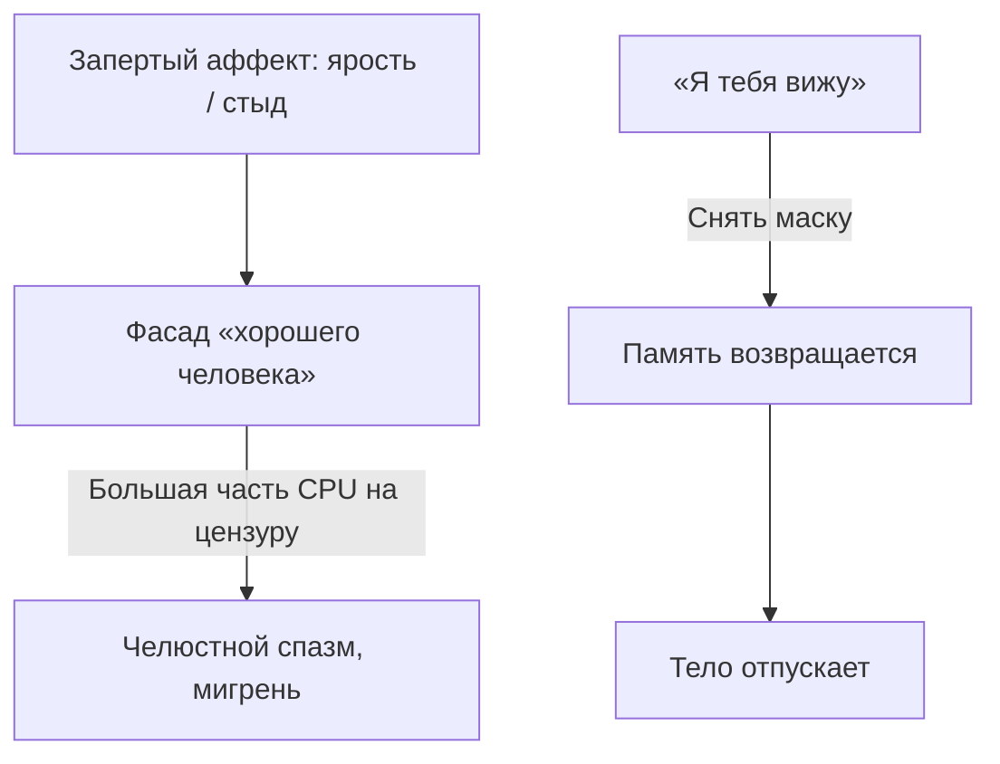

# Процесс в диспетчере: налог на невидимость

Адрес бага найден. До патча — один шаг, без которого код не ляжет. Тихий. Некрасивый. Взрослый.

Всё, с чем ты воюешь внутри, жрёт память, пока ты отказываешься открыть диспетчер и посмотреть ему в лицо.

**Легализация.** Три слова:

*«Я тебя вижу»*.

---

## Куда уходит память

Звучит слишком просто. Никакого героизма. Просто признать: это есть. И именно здесь ломается хребет сопротивления.

Скрытый процесс жрёт ресурс не от злости. Почти вся мощность уходит на маскировку.

Круглосуточно пишутся фальшивые логи. На лице — фасад: «я осознанный руководитель», «я всё простила», «я выше обид», «у меня светлая грусть».

Процессор раскалён. Вентиляторы воют. Полезной работы — ноль. Вся энергия — охрана иллюзии.

*«Я вижу тебя. Ты здесь. Ты реально есть в моём теле»* — и служба маскировки гаснет. Мощность падает тебе в руки.

Для любого узла:

* **Аффект:** «Я вижу свой животный страх нищеты. Он здесь. Он бьётся в животе и имеет право на это место».
* **Пара:** «Я признаю зависимость от этого человека. Хватит изображать гордую независимость».
* **Род:** «Я вижу ужас раскулаченного прадеда. Он реален — и это его история».
* **Дело:** «Я вижу зависть к успеху конкурента. Хватит звать её безразличием».

Признать — не значит разрушить. «Я вижу ярость к матери» не значит идти крушить отношения. Значит — перестать врать нервной системе. Пока файл «скрытый», его не открыть. Сначала — имя. Потом — правка.

---

> [!NOTE]
> Дональд Винникотт описал Ложное Я: если взрослый не выдерживает детский гнев и отказ, ребёнок надевает улыбчивую маску и прячет живое под кожу. Алис Миллер показала, как «отличник» хоронит душу ради материнской любви. Джеймс Гросс измерил цену: подавление эмоции поднимает давление, сужает сосуды, бесит миндалину. Питер Сифнеос назвал неумение назвать чувство алекситимией — и связал её с болезнями тела. В инженерии это зависший процесс: работа кончилась, статус не считали, память занята. Назвал вслух — дескриптор закрылся. Ресурс вернулся.

---

## Светлана и разбитая спаржа

Светлана — вице-президент по персоналу в инвестиционном банке. Тридцать пять. Шёлковые костюмы. Грудной голос. Ретриты молчания. Слова: «принятие», «благодарность за уроки», «светлая грусть».

Тело сыпалось.

Бруксизм стёр зубы до дентина. Швейцарские капы трескались за две недели. Три раза в неделю — мигрень: будто штырь сквозь левый висок в глазницу.

— Мне нужно доработать принятие мамы, — улыбнулась она. — Я давно простила. Она была выдающимся педагогом по фортепиано. Ей было трудно с обычным ребёнком. У меня к ней только любовь.

Пока она говорила, ногти впились в подлокотник так, что кожа побелела.

> **Терапевт:** Посмотри на пальцы. Ты вырвешь обивку. Губы улыбаются — желваки ходят. Что случилось в теле, когда прозвучало «фортепиано»?
>
> **Светлана:** *(улыбка застывает)* Ничего. Спазм сосудов. ВСД с детства.
>
> **Терапевт:** Сколько энергии уходит на святую? Что было в прошлые выходные, когда мать приезжала?

Фасад треснул.

Трое суток она готовила квартиру под стерильность. Белые лилии. Лосось со спаржей. Мать вошла, не поздоровавшись, провела пальцем по плинтусу:

*«Бедненько, но чистенько. Цветы вульгарные — похоронные. Спаржа водянистая, как в совхозной столовой. Ты всегда была бездарностью, Светочка. Вот и компенсируешь прислужничеством»*.

Вечером вице-президент улыбнулась, подала десерт, проводила до такси. Потом заперлась в прачечной, сунула в рот полотенце и сжимала зубы, пока изо рта не пошла кровь.

> **Терапевт:** Назови процесс. Вслух.
>
> **Светлана:** Нет… Хорошие дочери так не чувствуют…
>
> **Терапевт:** В диспетчер. Сейчас.
>
> **Светлана:** *(вскакивает, багровеет, вопит)* Я НЕНАВИЖУ ЕЁ! Её пальцы! Её гаммы по шесть часов! Её ядовитый рот! Я мечтала разбить блюдо со спаржей о её седую голову! Тридцать лет ползала за одну сраную похвалу! Хочу топором её фортепиано!

Пять минут крика. Подушка. Диван. Макияж смыли слёзы. Памятник идеальной дочери рухнул.

Она села на ковёр. Ладони открыты.

> **Терапевт:** Челюсть?
>
> **Светлана:** Открылась. Мягкая. Штырь в виске растаял.
>
> **Терапевт:** «Я вижу свою ненависть. Она горячая. У неё есть право быть».
>
> **Светлана:** *(ровно, глубоко)* Я вижу свою ненависть. Это моя правда. Больше не прячу её под любовью.

Через два дня мать снова позвонила — привычный яд про «неудавшуюся личную жизнь».

Светлана смотрела в окно:

— Мама, остановись. Мне тридцать пять. Моя жизнь удалась. Хочешь говорить со мной — без яда. Невозможно — разговор окончен.

В трубке тишина. Мать впервые за тридцать лет не нашла слов. Процесс, вынесенный на стол, перестал жрать жизнь.

---

## Практика: внести процесс в лог

Возьми чувство, от которого отворачиваешься сильнее всего: зависть к другу, ярость к родителям, отвращение к работе, стыд происхождения.

1. **Имя демона.** Без цензуры:
   * какое «грязное» чувство я маскирую благородством?
   * где тело держит (зубы, дыхание, кулаки)?
2. **Диспетчер.** Стопы на полу. Ладонь на зажим:
   > «Я вывожу тебя из скрытого. Война кончена. Ты здесь. Ты — моя [ярость / зависть / слабость / страх]. У тебя есть место».
3. **Девяносто секунд.** Не оправдывайся. Не чини. Дай телу прожить снятие запрета.
4. **Профит.** Челюсть отпустила? Глубокий вдох? Тепло по спине? Запомни: энергия вернулась тебе.

Легализация — не слабость. Это зрелость, которая возвращает мощность.

> [!IMPORTANT]
> **Закон главы**
> Подавленный процесс жрёт мощность на маскировку; названный вслух — отдаёт энергию обратно.
