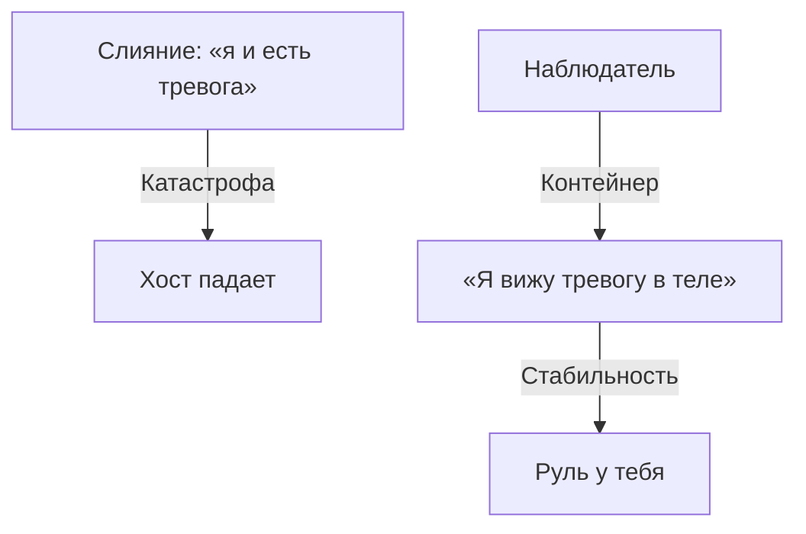

# Ты — это не твоя ошибка

Процесс назван. Теперь — манёвр, без которого дальше буксуешь: понять, что этот процесс — не ты.

Актриса восемь вечеров играла героиню, бросающуюся под поезд на заснеженном полустанке. На девятый роль не выключилась: запах мазута, ледяные рельсы, ком в горле — дома. Она мыла тарелки у раковины и задыхалась чужой бедой. Не сошла со сцены после поклона.

Большинство людей десятилетиями играют чужие аварийные сценарии — написанные перепуганными предками — и считают этот код собой. Третий шаг — **растождествление**. Ты не программа. Ты платформа, на которой она временно крутится.

---

## Шаг назад

Пока слияние живо — «я нищий», «я паникёр», «я неудачник» — чинить нечего. Ты внутри транзистора и пытаешься увидеть плату.

Нужна позиция наблюдателя. Кто смотрит — отдельно. Что смотрит — отдельно.

> *Есть погода — и есть небо. Гроза рвёт облака, хлещет ливнем, бьёт молнией. Небо остаётся небом. Вмещает бурю. Не становится ею.*

Сдвиг в речи — уже сдвиг в контуре:

* «мне страшно» → «я замечаю импульс страха: под диафрагмой, холодный, пульс учащён»;
* «я во всём виноват» → «я вижу старый скрипт вины, вшитый в детстве»;
* «я обязан спасти проект ценой здоровья» → «я отслеживаю паттерн Спасателя».

В первом случае ты в горящей стойке. Во втором — за стеклом диспетчерской.

> [!WARNING]
> Растождествление — не диссоциация и не побег. Сказать «это не я злюсь, это скрипт» до того, как гнев прожит в теле, — трусость ума: файл просто спрячут глубже. Сначала легализация. Потом, на выдохе прожитого, — отделение. Порядок священен.

---

> [!NOTE]
> Роберто Ассаджиоли сформулировал просто: у меня есть тело — я не тело; есть эмоции — я не эмоции; есть ум — я не ум. Я — центр, который это видит. Ричард Шварц в IFS показал части: Защитники, Менеджеры, Изгнанники. Прорыв — когда Self отделяется от части и смотрит на неё с ясностью. Стивен Хайес в ACT назвал это когнитивным расцеплением: из «я-как-содержание» в «я-как-контекст». В инженерии — гипервизор: контейнер падает, хост даже не вздрагивает.

---

## Холодный подъезд и пакеты

Ноябрь. Пятница. Подмосковный подъезд: сырая пыль, мокрые собачьи пальто, жареный лук с третьего.

Я поднималась на пятый пешком — лифт снова застрял. В руках пакеты на неделю. Ручки врезались до кровоподтёков. Плечи выламывало. По воротнику текла ледяная жижа.

Подбородок — вверх. Надменность каменная.

На четвёртом открыла тётя Клава в пуховом платке:

— Деточка! Куда столько? Давай хоть один донесу!

Пружина щёлкнула. Голос — сталь:

— Спасибо, не надо. Я справлюсь сама.

Пятый. Ключ. Дверь. Спиной к ней.

Пальцы разжались. Пакеты грохнулись. Один лопнул — апельсины покатились по линолеуму в темноту. Я сползла вниз в пальто и мокрых сапогах. Лбом в колени.

Из груди:

— Зачем рявкнула на старуху? Почему никогда не просишь помощи?

В темноте вспыхнул кадр.

Семь лет. Хрущёвка. Зима. Маму привезли после тяжёлой операции: белая, губы потрескались, стонет от любого движения, до стакана не дотягивается. Отец в запое неделю.

Девочка двигает стул к плите, в носках, спичкой зажигает конфорку, варит жидкую гречку, моет полы ледяной водой. Ночью держит мамину стынущую руку и клянётся: *«Не заплачу. Не буду обузой. Буду железной. Всё выдержу сама»*.

Тридцать лет эта девочка таскала мешки, правила компаниями, отказывалась от мужской руки, разбивала суставы — и верила: ослабишь спину — мать умрёт.

Я сидела среди апельсинов. Слёзы горячие. Смывали караул.

Ладонь на грудину:

— Я вижу тебя. Я замечаю процесс «Железной Девочки» — ту ночь, тридцать лет назад. Ты спасла нас. Но я — больше не этот процесс. Я не броня. Не обязана тащить мир. Мама выжила. Я выросла. Могу быть слабой. Могу просить. Могу просто быть.

В позвоночнике что-то расцепилось. Тяжесть ушла с лопаток. Под бронёй проявилось живое ядро.

---

Через два дня Жора — тот, что по ночам кружил перед выключенным терминалом — дочитал сюда.

Остановился посреди комнаты. Посмотрел на дрожащие руки. Впервые за тридцать четыре года сказал в пустоту:

*«Я замечаю процесс Невидимки. Это не я молчу перед начальством и матерью. Это скрипт мальчика под одеялом. Я — не мой страх. Я — тот, кто на него смотрит»*.

Стены не рухнули. Небо не раскололось. В комнате стало на одного живого человека больше.

---

## Практика: растождествление

Только после того, как зажим найден и признан.

1. **Слияние.** Вслух:
   > «Прямо сейчас я слит с процессом [Жертва / Спасатель / Контролёр / Страх нищеты]».
2. **Выдох.** Вдох носом. Медленный выдох ртом. Живот мягкий. Почувствуй границу: тело — здесь, конструкция — рядом.
3. **Формула:**
   > «Я регистрирую процесс [имя]. Это защита каркаса. Код — не я. Я — пространство, где он крутится. Я возвращаюсь в статус оператора».
4. **Девяносто секунд.** Смотри на симптом как на объект: границы, температура, плотность — когда ты больше не кормишь его собой.

> [!IMPORTANT]
> **Закон главы**
> Отделившись от защитной роли, ты снова управляешь процессами — вместо того чтобы быть ими.
