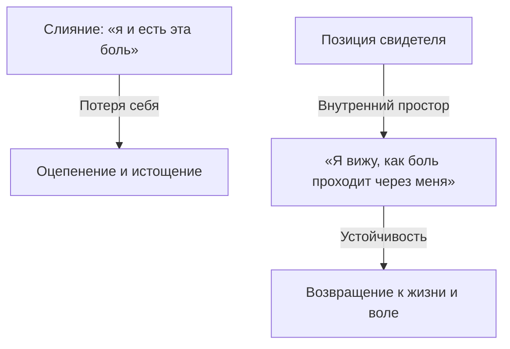

# Ты — это не твоя рана

Чувство названо. Но теперь наступает момент, без которого любое исцеление заходит в тупик: нужно осознать, что это переживание — не ты.

Актриса восемь вечеров подряд играла на сцене героиню, бросающуюся под поезд на заснеженном полустанке. На девятый день роль отказалась выключаться. Запах мазута, ледяные рельсы, невыносимая горечь в горле преследовали её дома. Она стояла у кухонной раковины, мыла тарелки и задыхалась от чужого горя. Она просто забыла сойти со сцены после финального поклона.

Большинство людей десятилетиями живут точно так же: играют роли из чужих трагедий, написанных перепуганными родителями или предками, и искренне верят, что этот сценарий и есть их собственная суть.

Следующий шаг к свободе — **растождествление**. Ты — не твоя защитная маска. Ты — то живое пространство, в котором эта маска временно существует.

---

## Шаг назад от пылающей сцены

Пока живо слепое слияние — «я нищий», «я трус», «я вечная жертва» — изменить ничего невозможно. Ты находишься внутри шестерёнки и пытаешься разглядеть весь часовой механизм.

Нужна точка опоры вне драмы. Тот, кто наблюдает за болью, и сама боль — это не одно и то же.

> *Есть погода — и есть небо. Гроза рвёт тучи, хлещет ледяным ливнем, крушит ветви вековых деревьев молниями. Но небо всегда остаётся небом. Оно способно вместить в себя любую бурю, ни на секунду не превращаясь в неё.*

Даже простое изменение внутренних слов мгновенно меняет состояние тела:

* Вместо «мне страшно» — «я замечаю холодную волну страха под диафрагмой и учащённый пульс».
* Вместо «я во всём виноват» — «я вижу детскую привычку брать на себя вину за чужое настроение».
* Вместо «я обязан спасти всех ценой здоровья» — «я отслеживаю свою старую роль Спасателя».

В первом случае ты горишь в самом центре пожара. Во втором — стоишь за надёжным стеклом и видишь пламя со стороны.

> [!WARNING]
> Растождествление — это не холодное бегство от чувств и не заносчивое высокомерие. Сказать: «Это не я злюсь, это всего лишь психологический паттерн», пока ярость клокочет в горле, — это трусливая уловка рассудка, которая лишь глубже загонит боль внутрь.
>
> Сначала нужно честно прожить и назвать чувство. И лишь затем, на длинном выдохе облегчения, сделать шаг назад. Последовательность неприкосновенна.

---

> [!NOTE]
> ## Научный фундамент: психосинтез и когнитивное расцепление
>
> Роберто Ассаджиоли сформулировал базовую максиму психосинтеза: у меня есть тело, но я — не тело; у меня есть эмоции, но я — не эмоции; у меня есть мысли, но я — не мысли. Я — центр чистого самосознания и воли.
>
> Ричард Шварц в системной семейной терапии субличностей (*IFS*) показал: в каждом из нас живут Менеджеры, Защитники и Изгнанники. Подлинное исцеление наступает в тот момент, когда глубинное взрослое Я (*Self*) выходит из слияния с защитной частью и начинает смотреть на неё с состраданием и спокойным пониманием.
>
> Стивен Хайес в терапии принятия и ответственности (*ACT*) назвал это явление «когнитивным расцеплением»: человек перестаёт воспринимать себя как содержание своих мыслей и открывает себя как бесконечный контекст, вмещающий любой жизненный опыт.

---

## Живая история: холодный подъезд и рассыпанные апельсины

Ноябрь. Вечер пятницы. Сырой, промозглый подмосковный подъезд: запах застарелой побелки, мокрой собачьей шерсти и жареного лука из чужих квартир.

Я поднималась на пятый этаж пешком — лифт в очередной раз застрял между этажами. В обеих руках — неподъёмные полиэтиленовые пакеты с продуктами на всю неделю. Тонкие пластиковые ручки врезались в ладони до багровых кровоподтёков. Плечи буквально выворачивало из суставов, под капюшон пальто затекла ледяная морось.

Но подбородок задран вверх, а на лице — привычная маска каменной несокрушимости.

На площадке четвёртого этажа скрипнула дверь. Выглянула соседка, тётя Клава, в старом пуховом платке:

— Ой, деточка! Куда ж ты столько на себе тащишь? Давай хоть один пакет помогу донести, надорвёшься ведь!

Внутри меня словно сжалась тугая стальная пружина. Голос прозвучал сухо, холодно, резко, как удар хлыста:

— Спасибо, не нужно. Я всегда справляюсь сама.

Пятый этаж. Щёлкнул замок. Я шагнула в тёмную прихожую, захлопнула дверь и прислонилась к ней спиной.

Пальцы наконец разжались. Тяжёлые пакеты с глухим грохотом рухнули на пол. Один лопнул — и спелые, ярко-оранжевые апельсины весело покатились по пыльному линолеуму во все стороны, исчезая под вешалкой.

И в эту секунду меня прорвало. Я медленно сползла по дверному полотну на пол — прямо в мокром, испачканном пальто и грязных сапогах. Обхватила колени руками и уткнулась в них лбом.

Из груди рвался глухой, захлёбывающийся стон:

— Зачем ты рявкнула на добрую старуху? Почему ты никогда, ни при каких обстоятельствах не способна попросить о помощи?

И в темноте перед глазами вспыхнуло далёкое детское воспоминание.

Мне семь лет. Маленькая хрущёвка. Январский мороз за окном. Маму только что привезли из больницы после тяжелейшей полостной операции: она белая как полотно, потрескавшиеся губы шепчут от боли, она не может даже дотянуться до стакана с водой на тумбочке. А отец ушёл в запой и не появлялся уже неделю.

И маленькая семилетняя девочка в шерстяных носках пододвигает тяжёлый табурет к плите, дрожащими пальцами зажигает спичку, варит пустую жидкую гречку и моет полы в прихожей ледяной водой из-под крана. А ночью сидит на корточках у маминой кровати, держит её слабеющую руку и исступлённо клянётся: *«Я никогда не заплачу. Я никогда не буду обузой. Я стану железной. Я всё выдержу сама»*.

Тридцать долгих лет эта маленькая девочка таскала неподъёмные тяжести, управляла проектами, надрывала связки, отвергала мужскую заботу — потому что свято верила: стоит ей хоть на секунду расслабить спину, и мама умрёт.

Я сидела на полу среди рассыпанных апельсинов, и горячие слёзы наконец смывали эту тридцатилетнюю караульную службу.

Я положила ладонь на грудину:

— Я вижу тебя, маленькая Железная Девочка. Я вижу ту страшную январскую ночь тридцать лет назад. Ты была настоящей героиней. Ты спасла нас тогда. Но я — больше не эта замерзающая девочка. Я не обязана быть бронёй для всего мира. Мама выжила. Я выросла. Теперь я взрослая женщина. Я имею право уставать. Имею право просить о помощи. Имею право просто быть живой.

В позвоночнике что-то с щелчком отпустило. Невыносимая свинцовая тяжесть сползла с лопаток. Под треснувшей бронёй открылось тёплое, мягкое, дышащее человеческое сердце.

---

Через два дня Жора — тот самый инженер, который годами кружил по ночам перед экраном выключенного монитора, не решаясь заявить о себе, — читал эти строки.

Он остановился посреди своей тихой холостяцкой комнаты. Посмотрел на свои ладони. И впервые за тридцать четыре года произнёс вслух:

*«Я вижу тебя, испуганный мальчик под одеялом. Но я — это не ты. Я — не мой страх перед начальником. Я — тот взрослый мужчина, который способен его выдержать»*.

Стены квартиры не рухнули. Небо за окном не раскололось. Просто в этой комнате стало на одного живого человека больше.

---

## Практика: шаг из чужой роли

Выполняй этот шаг только после того, как скрытое чувство было найдено, прожито и признано.

1. **Честное признание роли.** Произнеси вслух:
   > «Прямо сейчас я слит с ролью [Жертвы / Спасателя / Железного Человека / Беспомощного Ребёнка]».
2. **Физический выдох и граница.** Сделай глубокий вдох носом и длинный, свободный выдох через рот. Почувствуй физические границы своего тела: кожу, вес, тепло. Скажи себе: «Моё тело — здесь. А роль — это всего лишь маска».
3. **Слова освобождения:**
   > «Я вижу эту роль. Она защищала меня много лет. Но этот сценарий — не я. Я — то живое пространство, в котором он разворачивается. Я возвращаюсь в своё подлинное Я».
4. **Минута тишины.** Посмотри на свой симптом со стороны: как на старый костюм, снятый и висящий на спинке стула. Обрати внимание: когда ты перестаёшь отдавать ему всю душу, он теряет свою разрушительную власть.

> [!IMPORTANT]
> **Главная мысль**
> Сделав шаг назад из заученной защитной роли, ты возвращаешь себе свободу выбирать свои поступки — вместо того чтобы быть марионеткой старых детских клятв.
