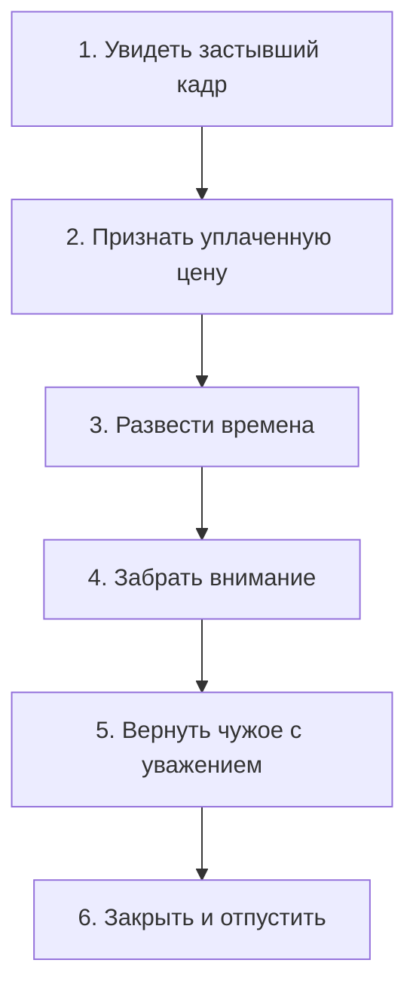

# Исцеляющая фраза: как разорвать внутренний узел

Корень проблемы обнаружен. Чувство названо. Шаг назад из привычной роли сделан. Теперь наступает решающий момент — **исцеляющая фраза**.

Не поверхностное замазывание трещин. Не попытка притвориться кем-то другим. А точное, честное слово, направленное прямо в эпицентр телесного спазма.

— Я три года подряд каждое утро стоял перед зеркалом и твердил: «Я открываюсь денежному изобилию, я достоин миллионов Вселенной», — с горечью признавался один предприниматель. — Стикеры на холодильнике, медитации на золотой свет, дыхательные практики. А долги тем временем только росли, приближая кассовый разрыв. Почему эти хвалёные аффирмации не работают?

— Потому что наивная аффирмация — это детская надпись цветным фломастером на разбитом мониторе. Ты разрисовываешь треснувшее стекло, а внутри процессора по-прежнему крутится прежний сигнал тревоги. Чтобы нервная система действительно приняла новое решение, слово должно ударить точно в тот спазм, который удерживает старую детскую клятву.

**Разрешающие фразы** — это не аутотренинг и не самовнушение. Это слова предельной, обнажённой правды, которую тело моментально узнаёт и встречает глубоким физическим облегчением.

---

## Шесть шагов освобождения

В момент шока или невыносимой боли детская психика намертво склеивает совершенно разные вещи: прошлое с настоящим, образ строгой матери с лицом жены, большой финансовый успех — со смертельной опасностью.

Чтобы разорвать эту слепую склейку, исцеляющее движение проходит через шесть последовательных шагов:

1. **Увидеть.** Не «со мной ничего плохого не случилось», а прямое признание: «Я вижу этот страшный день».
2. **Признать цену.** Трагедия уже состоялась в прошлом. Попытки спорить с историей лишь сжигают твои сегодняшние силы. Цена была страшной — но она уже оплачена сполна.
3. **Развести времена.** «Тогда я был маленьким и беспомощным ребёнком. Но сегодня я взрослый человек. То событие осталось во вчерашнем дне. Мы больше не одно целое».
4. **Забрать внимание.** Вернуть себе ту жизненную силу, которой ты годами кормил застарелый страх.
5. **Вернуть чужое.** Страхи, вину и боль родителей с глубоким сыновним или дочерним почтением оставить им — не пытаясь спасать предков задним числом.
6. **Закрыть и отпустить.** Поставить точку. Снять многолетний караул. Освободить пространство для новой жизни.

---

## Притча: завещание блудного сына

> [!TIP]
> **Притча**
> Умирающий глава большого фермерского хозяйства собирает сыновей для оглашения завещания.
>
> Старший сын двадцать пять лет без отпусков и выходных пахал от зари до зари, ухаживал за парализованным отцом и не завёл собственной семьи, положив молодость на алтарь семейного дела. Младший сын в юности сбежал в столицу, влез в криминальные долги, проигрался в карты и вернулся в родной дом лишь тогда, когда бандиты пригрозили ему расправой.
>
> Отец объявляет волю: восемьдесят процентов хозяйства переходит младшему сыну — чтобы покрыть долги и спасти его от гибели. Старшему остаётся лишь двадцать.
>
> **Голос Расчёта:** «Хозяйство должно достаться старшему. Он умеет пахать и приумножать. Младший промотает родовую землю за три месяца, и семья пойдёт по миру».
>
> **Голос Справедливости:** «Честный труд требует заслуженной награды. Отдать плоды двадцатипятилетнего пота безответственному моту — это плевок в лицо морали и здравому смыслу».
>
> **Голос Любви:** «Отцовское сердце не торгуется на рынке заслуг. Родительская душа стремится спасти слабого и погибающего — даже если он сам кругом виноват».
>
> *Вопрос на зрелость:* Обязана ли родительская любовь подчиняться человеческой справедливости и табелю о трудовых заслугах?

> [!NOTE]
> **Разбор притчи**
> Главная ловушка заключается в том, что все три голоса бросаются судить поступок отца: прав он был или неправ. Но стоит тебе втянуться в этот моральный суд — и ты сам оказываешься во власти чужой обиды.
>
> У старшего брата внутри образовалась опасная склейка: **«родительская любовь равна доле в завещании»**. Пока эта склейка жива, любая несправедливость внешнего мира будет ранить его в самое сердце — в бизнесе, в дружбе, в браке.
>
> Исцеление для старшего сына звучит просто: *«Я склеил отцовскую любовь с гектарами земли и счетами в банке. Я разрываю эту склейку. Завещание — отдельно. Любовь отца — отдельно. Моё мужское достоинство не зависит от решения старика»*.
>
> А как «исправить» отца? Никак. Чужую душу с чужой судьбой невозможно переделать из своего угла. Единственный адрес для исцеления — собственный телесный спазм.

---

> [!NOTE]
> ## Научный фундамент: реконсолидация памяти
>
> В 2000 году нейробиолог Карим Надер совершил переворот в науке о мозге: он доказал феномен реконсолидации эмоциональной памяти. Оказалось, что давний след травмы не зафиксирован в мозгу намертво. Если активировать старое болезненное воспоминание и в этот же момент предъявить организму принципиально новый, опровергающий опыт, синапсы переходят в лабильное состояние на окно в четыре–шесть часов.
>
> Брюс Эккер в концепции когерентной терапии показал, как этот механизм работает в кабинете психолога: травматический след не просто «приглушается» поверхностным торможением — он физически перестраивается на уровне синаптических белков.
>
> Точная разрешающая фраза, произнесённая в момент телесного проживания старого ужаса, буквально переписывает нейронный след былой трагедии.

---

## Живая история: Дмитрий и подписание контракта

Через неделю после первой встречи Дмитрий вернулся в кабинет. Тот самый коммерческий директор. И тот же фантомный чёрный провод на шее.

На полированном столе перед ним лежала кожаная папка с государственным контрактом на двести восемьдесят миллионов рублей. В правой руке — тяжелая перьевая ручка.

— Вчера я сел в офисе за стол, чтобы поставить подпись, — его голос дрожал. — И снова всё по новой. Вкус ржавчины на языке. Горло словно залили жидким свинцом. Перед глазами — те трое в вязаных масках. Пальцы одеревенели, ручка выпала из руки. Я вскочил и выбежал из кабинета на улицу. Я понимаю причину умом. Но как разорвать этот ад в теле?

— Положи папку с контрактом себе на колени, — сказал я спокойно. — Правую ладонь положи прямо на горло. Закрой глаза. Вызови ту старую кухню девяносто восьмого года. Отец на полу. Раскалённый утюг. Чёрный телефонный провод врезается в шею десятилетнего мальчика.

Дмитрий окаменел. Из груди снова вырвался тот страшный свистящий хрип:

— Они стоят прямо передо мной… Тесак у моего глаза.

— Не беги. Не отворачивайся. Посмотри в чёрные прорези их масок глазами сорокалетнего сильного мужчины. И направь каждое слово прямо в свой кадык:

— Я вижу вас, — хрипло, но с нарастающей твёрдостью произнёс Дмитрий. — Вы были самым страшным кошмаром моего детства. Я признаю ту нечеловеческую цену, которую заплатил мой дом.

— Разрывай склейку.

— Большие деньги — отдельно! Бандитский налёт — отдельно! Мой триумф и успех — отдельно! Пытка утюгом и насилие — отдельно!

— Верни чужое их владельцам.

— Я возвращаю вам ваше насилие, вашу грязь и вашу подлость! — голос Дмитрия окреп, заполняя кабинет мощным басом. — Это ваш грех, и он навсегда останется в вашем проклятом времени! А отцу я возвращаю его мужество и его судьбу. Он принял тот страшный удар на себя и спас мою жизнь. И я не обязан медленно умирать вместе с ним!

— Закрой эту дверь, Дима.

— Девяносто восьмой год кончился! Тот ноябрь остался двадцать пять лет назад! Вы сгнили в прошлом веке! А я — жив, и я стою здесь! Моё горло свободно! Мой голос принадлежит мне! Я забираю своё законное право на победу, на богатство и на радость жизни!

В ту же секунду в тишине комнаты раздался странный звук — словно в глубине его тела с сухим щелчком лопнула натянутая струна.

Дмитрий судорожно вдохнул и широко, сладко зевнул. Затем зевнул ещё раз — до хруста в челюстных суставах. По его лицу покатились слёзы мгновенного, глубокого телесного расслабления. Свистящий хрип испарился без следа. Его лёгкие расправились, наполняясь воздухом до самого низа живота, а шея и плечи потеплели, наливаясь живой силой.

Он открыл глаза, посмотрел на свои тёплые руки, взял ручку и уверенным, размашистым росчерком поставил подпись на последней странице контракта. Ни один палец не дрогнул.

Через сорок дней первый авансовый платёж — восемьдесят пять миллионов рублей — поступил на расчётный счёт его компании. Дмитрий долго смотрел на светящиеся зелёные цифры в банковском приложении. В его горле было свободно и прохладно.

Деньги больше не пахли гарью и кровью.

---

## Аптечка исцеляющих фраз

Это не заклинания и не абстрактные формулы. Это точные слова человеческого достоинства. Произноси их не в пустоту, а направляя звук прямо в физический спазм.

### Пространство «Я»

1. **Легализация:** «Я вижу в себе этот страх (стыд, ярость). Я снимаю маску спокойствия. Ты имеешь полное право жить в моём теле».
2. **Разделение времён:** «То страшное событие было тогда. А я живу сейчас. Тогда я был беспомощен. Сейчас я взрослый. Я оставляю ту беду в её далёком времени».

### Пространство «Партнёр»

3. **Снятие проекции:** «Я бессознательно искал в тебе свою мать (своего отца). Но ты — не мой родитель. Ты — мой партнёр. Я снимаю с тебя эту непосильную роль и наконец вижу тебя настоящего».
4. **Обнуление счетов:** «Я прекращаю требовать от тебя компенсации за мои детские обиды. Прежний долг закрыт. Мы начинаем с чистого листа».

### Пространство «Род»

5. **Уважение к чужой судьбе:** «Мама (папа), я вижу твою тяжёлую боль. Это твоя судьба. С глубоким почтением я оставляю её тебе. А себе я выбираю жизнь».
6. **Освобождение от лояльности:** «Дорогие предки, вы терпели лишения, чтобы род не угас. Моя нищета никого из вас не спасёт. Пожалуйста, смотрите на меня с теплом и благословением, когда я счастлив, богат и свободен».
7. **Возвращение исключённого:** «Я вижу тебя. Ты был в нашей семье до меня. У тебя есть своё законное место. Без тебя не было бы меня. Я возвращаю тебе твоё доброе имя».
8. **Иерархия поколений:** «Ты — большой, а я — маленький. Ты пришёл в этот мир раньше. Твоя ноша мне не по плечу. Я с любовью оставляю твоё бремя тебе».

### Пространство «Дело и деньги»

9. **Разделение склеек:** «Я по ошибке склеил деньги (близость, творчество) со смертельной опасностью (предательством, отвержением). Я разрываю этот узел. Деньги — отдельно. Опасность — отдельно».
10. **Завершение спасательства:** «Я глубоко сочувствую твоей беде, но не стану тонуть вместе с тобой. Твоя жизнь принадлежит тебе. Я остаюсь на своём месте».

---

## Практика: создание собственной фразы

Любые слова останутся пустым звуком, если они не соединяются с телом. Исцеляющая фраза должна точно ложиться в телесный зажим.

1. **Определение склейки.** Что именно срослось в твоей голове? «Большие деньги = смертельная опасность». «Любовь = унижение». «Собственный выбор = предательство мамы».
2. **Тишина и заземление.** Сделай три неторопливых выдоха. Почувствуй стопами пол. Направь всё внимание в точку напряжения в теле.
3. **Произнесение вслух:**
   > «Я вижу то давнее событие и признаю его цену — она уже оплачена до последней копейки.
   > Я разрываю старую слепую склейку: [первое] — отдельно, [второе] — отдельно.
   > Я забираю свои силы и своё внимание из прошлого.
   > Чужие страхи, вину и долги я с почтением возвращаю их истинным владельцам — в их время.
   > То событие завершилось. Оно осталось позади. Я свободен для собственной жизни».
4. **Слушание отклика.** Наблюдай за телом. Разомкнулись ли челюсти? Случился ли глубокий спонтанный зевок? Расслабился ли живот? Разлилось ли тепло по позвоночнику? Когда тело отзывается вздохом облегчения — это значит, что узел развязан.

> [!IMPORTANT]
> **Главная мысль**
> Исцеляющая фраза обретает силу только тогда, когда слова попадают точно в телесный спазм и тело отвечает глубоким вздохом освобождения.
