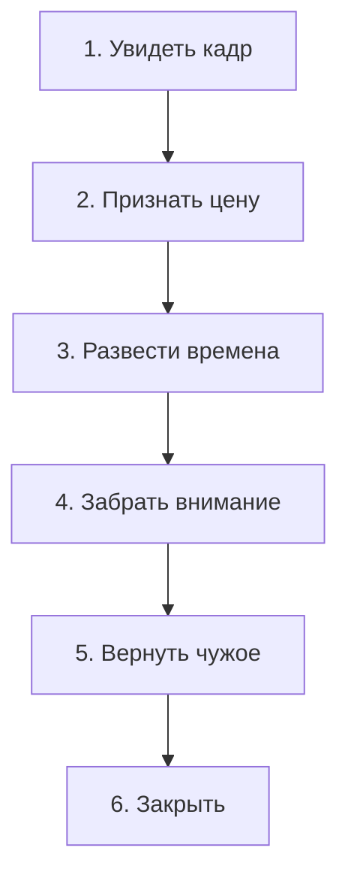

# Инженерия патча: как переписать сбой

Баг найден. Процесс назван. Отделение сделано. Теперь — **патч**. Не изолента. Не переименование ошибки. Точная фраза в точный спазм.

— Три года каждое утро у зеркала: «Я открываюсь изобилию, я достоин миллионов». Стикеры на холодильнике. Золотой свет. Дыхание маткой. Баланс ползёт к кассовому разрыву. Почему не работает?

— Потому что аффирмация — детская надпись маркером на треснувшем экране. Ты краскаешь стекло, а база на сервере та же. Чтобы нервная система приняла команду, фраза должна попасть в тот спазм, который держит аварийный скрипт.

**Разрешающие фразы** — не аутотренинг. Это команды, которые тело узнаёт как правду.

---

## Шесть фаз

В шоке нервная система склеивает разное: прошлое с настоящим, мать с женой, успех со смертью.

Чтобы разорвать склейку, патч идёт по шести шагам:

1. **Увидеть.** Не «со мной этого не было» — «я вижу этот файл».
2. **Признать цену.** Трагедия уже случилась. Переиграть прошлое — жечь процессор вхолостую. Цена была страшной. Она уплачена.
3. **Развести времена.** Я — взрослый сейчас. Кадр — архив. Мы не одно.
4. **Забрать внимание.** Тот ресурс, которым ты годами кормил защиту.
5. **Вернуть чужое.** Страхи родителей, вина предков — им. С уважением к их судьбе.
6. **Закрыть.** «Процесс завершён». Сектор в архив. Память свободна.

---

## Загадка «Наследство блудного сына»

> [!TIP]
> **Загадка**
> Умирающий глава фермерского клана делит завещание. Старший двадцать пять лет пахал без отпусков, ухаживал за парализованным отцом, не завёл семьи. Младший сбежал в столицу, влез в долги к криминалу, промотал деньги и вернулся, когда бандиты пригрозили расправой.
>
> Отец отдаёт младшему восемьдесят процентов — закрыть долг и спасти от пули. Старшему — двадцать.
>
> **Голос Расчёта:** Хозяйство должно быть у старшего. Он умеет. Младший промотает землю за три месяца.
>
> **Голос Правила:** Справедливость требует награды за труд. Отдать активы паразиту — преступление перед моралью.
>
> **Голос Души:** Отцовская любовь не торгуется на рынке. Сердце идёт к слабому и погибающему — даже если он виноват.
>
> *Вопрос силы:* Обязана ли родительская любовь следовать человеческой справедливости и рыночным заслугам?

> [!NOTE]
> **Разбор**
> Ловушка: все три голоса судят отца — «правильно ли он поступил». Соскользнул в спор — баг уже в тебе, не в нём.
>
> У старшего склейка: **«любовь = размер наследства»**. Пока она жива, любая несправедливость мира будет доказательством отверженности — в бизнесе, в браке, в партнёрстве.
>
> Патч старшему: *«Я склеил любовь с метрами и счётом. Рву склейку. Наследство — отдельно. Любовь — отдельно. Моё достоинство не меряется завещанием»*.
>
> Патч отцу? Его нет. Чужую систему с твоего терминала не править. Учить мёртвого справедливости — снова маркер на мониторе. Единственный адрес — твой спазм.

---

> [!NOTE]
> Карим Надер в 2000-м показал: эмоциональная память можно переписать, если активировать старую схему и дать опыт, который ей противоречит. Открывается окно на четыре–шесть часов. Брюс Эккер довёл это до клиники. Старый страх не «угасает рядом с новым тормозом» — он меняется на уровне белков в синапсе. Отсюда слово «патч»: инженеры правят живой сервер на лету. Точная фраза в открытое окно — то же самое. Жизнь при этом не останавливается.

---

## Дмитрий и контракт

Через неделю после диагностики Дмитрий вернулся. Тот же директор. Тот же фантомный провод из девяносто восьмого.

На столе — контракт на двести восемьдесят миллионов. В руке — перьевая ручка.

— Вчера сел подписывать. Снова вкус ржавчины. Трахея — свинец. Трое в масках. Пальцы одеревенели. Бросил ручку и сбежал. Диагноз знаю. Как переписать?

> **Терапевт:** Контракт на колени. Ладонь на горло. Вызови ту кухню. Отец на полу. Утюг. Провод на детской шее.
>
> **Дмитрий:** *(каменеет, свистящий хрип)* Они здесь. Нож у глаза.
>
> **Терапевт:** Не убегай. Смотри в прорези маски взрослыми глазами. Каждую букву — в спазм.
>
> **Дмитрий:** *(хрипло, но твёрдо)* Я вижу вас. Вы были кошмаром моего детства. Я признаю цену, которую заплатил мой дом.
>
> **Терапевт:** Разорви склейку.
>
> **Дмитрий:** Большие деньги — отдельно. Бандитский налёт — отдельно. Триумф дела — отдельно. Смерть и утюг — отдельно!
>
> **Терапевт:** Верни чужое.
>
> **Дмитрий:** *(голос крепнет)* Я возвращаю вам насилие и кровь. Это ваш грех — в вашем времени. Отцу возвращаю его мужскую судьбу. Он принял удар и защитил меня. Я не обязан умирать вместо него.
>
> **Терапевт:** Закрой.
>
> **Дмитрий:** Девяносто восьмой кончен! Тот ноябрь — двадцать пять лет назад. Вы в прошлом веке. Я — здесь. Горло свободно. Голос мой. Я забираю право на победу, на богатство и на жизнь.

Щелчок — как лопнувшая струна. Зевок. Ещё. Ещё. Слёзы разгрузки. Свист ушёл. Вдох до таза. Шея тёплая.

Он взял ручку и поставил подпись без дрожи.

Через сорок дней аванс — восемьдесят пять миллионов — пришёл на счёт. Дмитрий смотрел на экран клиент-банка. В горле было просторно. Деньги больше не пахли гарью.

---

## Аптечка патчей

Человеческие фразы. Не спецификации. Говори в спазм, не в воздух.

### «Я»

1. **Легализация:** «Я вижу в себе этот страх (гнев, стыд). Снимаю маску. Ты имеешь право быть в теле».
2. **Времена:** «То было тогда. Сейчас — сейчас. Тогда я был беззащитен. Сейчас я взрослый. Оставляю то событие в его времени».

### «Партнёр»

3. **Проекция:** «Я искал в тебе мать (отца). Ты не родитель. Ты партнёр. Снимаю с тебя эту роль. Вижу тебя».
4. **Долг:** «Перестаю ждать от тебя плату за старую боль. Счета обнулены. Прежний контакт закрыт».

### «Род»

5. **Чужая судьба:** «Я вижу твою боль, мама (папа). Это твоя судьба. С почтением оставляю груз тебе. Себе беру жизнь».
6. **Лояльность:** «Предки, вы страдали, чтобы род выжил. Моя нищета вас не спасёт. Смотрите на меня тепло, когда я счастлив, богат и свободен».
7. **Исключённый:** «Я вижу тебя. Ты был до меня. У тебя есть место. Без тебя не было бы меня. Возвращаю тебе твоё место».
8. **Маленький — большой:** «Ты большой, я маленький. Ты пришёл раньше. Мне не по силам твоя ноша. Оставляю тебе твоё».

### «Смыслы»

9. **Расклейка:** «Я склеил деньги (близость) с опасностью (смертью). Разделяю. Деньги — отдельно. Опасность — отдельно».
10. **Слив:** «Я сочувствую — и не сливаюсь. Твой процесс — твой. Закрываю трубу. Остаюсь рядом на своём месте».

---

## Практика: свой патч

Слова без тела — пустой звук. Патч кладётся в узел.

1. **Склейка.** Что срослось? «Большие деньги = насилие». «Любовь = предательство». «Свой выбор = смерть мамы».
2. **Ноль.** Три длинных выдоха. Стопы на полу. Внимание — в спазм.
3. **Вслух:**
   > «Я вижу этот кадр и признаю его цену — уже уплаченную.
   > Разделяю то, что склеилось: [первое] — отдельно, [второе] — отдельно.
   > Забираю внимание и силу из архива.
   > Чужие страхи и долги возвращаю авторам — в их время.
   > Процесс завершён. Закрыто. Я свободен для следующего шага».
4. **Отклик.** Челюсть отпустила? Зевок? Диафрагма мягкая? Тепло по спине? Тело сказало «да».

> [!IMPORTANT]
> **Закон главы**
> Патч работает только когда фраза попадает в точный спазм и тело отвечает выдохом.
