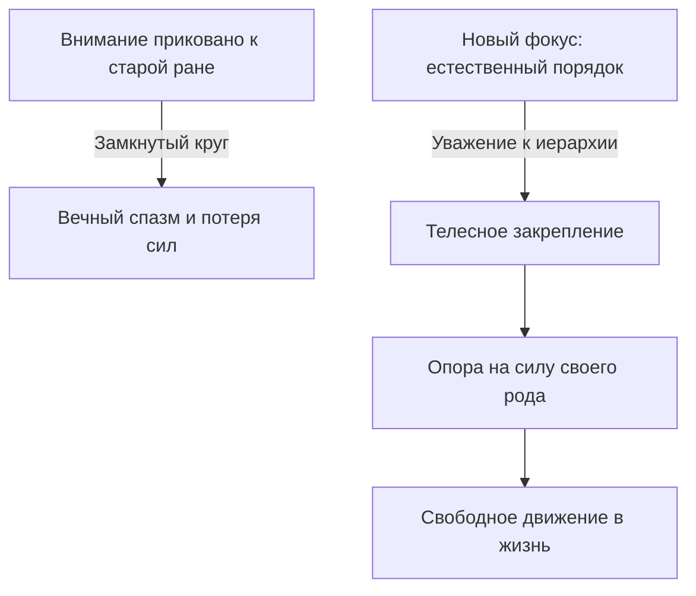

# Новый порядок: как закрепить изменения

Исцеляющие слова найдены и произнесены. Теперь наступает решающий этап — **закрепление нового порядка**.

Это не просто пробный черновик. Это твёрдая внутренняя фиксация, после которой возвращаться к прежнему болезненному сценарию становится физически бессмысленно и неестественно.

В сложнейших часовых механизмах порой достаточно сдвинуть одну крошечную шестерёнку на долю миллиметра. И замершие стрелки, стоявшие неподвижно десятилетиями, вдруг начинают плавный, ровный и уверенный ход.

Ничего во внешнем мире не разрушено. Прошлое не переписано грубой силой. Изменился лишь угол сцепления деталей — и вся жизненная энергия потекла совершенно по новому руслу.

После точной диагностики, искреннего признания правды и шага назад из заученной роли человеку необходимо **утвердить истинный порядок вещей** и **надёжно закрепить его в собственном теле**.

---

## Прошлое нельзя стереть — можно изменить фокус

Популярная психология нередко обещает наивную сказку: «Мы сотрём твою детскую травму без следа». Словно химчистка: принесём старое запятнанное воспоминание, перекрасим его в нежные пастельные тона — и пойдём по жизни с чистого листа, без единого шрама.

Давай будем честными и взрослыми. Память — не мягкий детский пластилин. То, что произошло в реальности, произошло навсегда. Никакая медитация и никакой гипноз не отменят гибель близких, предательство или холодное детство. Тот, кто обещает начисто стереть прошлое, просто продаёт дешёвую иллюзию.

Но в твоей абсолютной власти находится другое: **куда именно направлен твой взгляд прямо сейчас**.

До сегодняшнего дня твоё внимание было намертво приковано к ране. К обиде. К несправедливости. К вычеркнутым из памяти людям. Годы душевных сил уходили на то, чтобы обслуживать старую детскую претензию. А попытка наклеить на эту зияющую пропасть лозунг «Я излучаю любовь и свет» — это всё тот же цветной маркер на разбитом стекле.

Закрепление нового порядка — это осознанный перенос взгляда на здоровые законы жизни:

* **Принадлежность:** каждый, кто был вычеркнут или забыт, возвращается на своё законное место в семейной памяти.
* **Иерархия поколений:** жизнь течёт строго в одном направлении — сверху вниз, от старших к младшим, как чистая горная река.
* **Баланс отношений:** взаимные детские долги признаны закрытыми, а груз чужой вины возвращён предкам с сыновним поклоном.

---

> [!NOTE]
> ## Научный фундамент: синаптическая пластичность и теория Хебба
>
> Дональд Хебб сформулировал фундаментальное правило нейробиологии: нейроны, которые активируются одновременно, связываются между собой устойчивыми синаптическими цепями. Если человек годами привык соединять любой намёк на успех или любовь с ожиданием катастрофы, в мозгу формируется глубокая нейронная колея.
>
> Нобелевский лауреат Эрик Кандель исследовал механизмы долговременной потенциации и доказал: когда человек переживает эмоциональное освобождение и подкрепляет его новым телесным опытом, в мозгу за считанные часы начинают расти новые синаптические отростки.
>
> Старый след памяти не исчезает с диска мозга, но он навсегда теряет управляющую власть. Перенося внимание и закрепляя его новым физическим действием, мы направляем нервный импульс в обход старой ямы. Боль становится тихой архивной памятью, а не штурвалом, управляющим твоим поведением.

---

## Живая история: бархатный альбом и вырезанный брат

Максим занимался разработкой сложнейших платёжных шлюзов для международных банков. Ему было тридцать четыре года. Он с лёгкостью оперировал архитектурами, способными обрабатывать миллионы транзакций в секунду.

Но его собственная жизнь походила на временную стоянку неприкаянного бродяги.

Он годами жил на съёмных квартирах, даже не распаковывая вещи из картонных коробок. Отказывался от доли в бизнесе и опционов компании, предпочитая лишь краткосрочные временные контракты. При малейшем намёке на сближение с женщинами он мгновенно рвал отношения.

— У меня внутри постоянное ощущение, что я здесь чужой, — признался он, глядя в пол запавшими глазами. — Будто я занял чужое место за чужим праздничным столом. Вот-вот распахнется дверь, войдет настоящий хозяин этого стула, а меня с позором выставят на мороз. А под рубашкой, прямо посреди грудины, — ледяная сквозная дыра с рваными краями.

На вторую встречу он принёс старый семейный фотоальбом — в выцветшем бордовом бархате с потемневшими латунными уголками.

Он открыл двадцать третью страницу. Посередине листа зияла аккуратная овальная пустота: кто-то тонкими маникюрными ножницами бережно и безжалостно вырезал лицо маленького младенца.

Максим коснулся пальцем бумажного края. Его рука заметно дрожала:

— В десять лет я случайно нашёл в пыльной кладовке пожелтевшее свидетельство о рождении. Леонид. Он родился за два года до меня. Прожил всего три месяца и умер от врождённого порока сердца. Когда я прибежал на кухню и спросил маму, кто это, её лицо побелело, а губы посинели от ужаса. Она вырвала бумагу из моих рук и сожгла её прямо над кухонной раковиной. А потом закричала: «Никогда не произноси это имя! Ты наш первый и единственный сын! Мы родили тебя только для того, чтобы навсегда перечеркнуть ту трагедию!» А вечером достала ножницы и вырезала Лёню из всех семейных фотографий.

Тридцать четыре года Максим жил не своей жизнью. Он был живой заплаткой на незатянувшейся ране родителей. Аварийной копией умершего первенца. В его детскую душу намертво въелся страшный бессознательный закон: *«Я ненастоящий. Настоящий лежит в сырой земле. Если я осмелюсь жить по-настоящему, радоваться, пускать корни и любить — меня настигнет его смерть»*.

— Положи ладонь на грудь, — сказал я. — Туда, где зияет твоя ледяная дыра. Закрой глаза. Представь перед собой маленького Лёню.

Максим судорожно перевёл дыхание:

— Я вижу его… Совсем крошечный. Завёрнут в голубое байковое одеяльце. Полупрозрачный, невесомый. Никем не замеченный в этом мире.

— Посмотри на него глазами взрослого мужчины. Верни ему его законное имя.

Максим заговорил шёпотом, и по его щекам покатились крупные, светлые слёзы:

— Лёня… Мой старший брат. Ты был первым. Ты пришёл в этот мир раньше меня и принял на себя страшный удар болезни. Твоя короткая жизнь и твоя ранняя смерть принадлежат только тебе. Я склоняю голову перед твоей судьбой.

— А теперь назови своё настоящее место.

В позвоночнике Максима что-то звонко щёлкнуло. Он распрямил плечи:

— А я — второй. Я твой младший брат. Я — не твоя замена. Я — не твоя копия. Моё сердце бьётся само по себе. Я забираю своё собственное имя и своё место в жизни. А тебе я возвращаю твоё священное право быть первым сыном наших родителей. Твоё имя навсегда вписано в историю нашей семьи.

И в ту же минуту в его груди словно растаял вековой ледник. По телу хлынула плотная, обжигающая волна тепла. Дыра в грудине наполнилась живой мышечной плотностью. Он сделал вдох — такой глубокий, протяжный и лёгкий, какого его лёгкие не знали со дня рождения.

— Затянулась… — прошептал Максим, с изумлением прижимая руку к рубашке. — Дыры больше нет. Мне больше не нужно исчезать, чтобы уступать место мёртвым. Я здесь. Я живой.

Через три месяца Максим купил свою первую собственную квартиру — с огромными окнами, выходящими на реку. Картонные коробки были наконец распакованы. Он подписал долгосрочный контракт управляющего партнёра фонда.

Одно простое признание правды в семейной иерархии закрыло бездну, которая высасывала его жизнь тридцать четыре года.

---

## Практика: закрепление нового порядка

Выполняй эту практику только тогда, когда старое чувство прожито, слова освобождения найдены, а стопы прочно стоят на земле.

1. **Старый образ.** Сядь удобно. Закрой глаза. Вспомни привычное ощущение своего бессилия («я брошенный», «я виноватый», «я самозванец»). Обрати внимание, где застыло твоё тело.
2. **Истинный порядок.** Мысленно разверни правильную картину мира:
   * Все забытые и вычеркнутые люди приняты в сердце и стоят на своих местах;
   * Твои родители и предки стоят за твоей спиной — как взрослые источники жизни, передавшие тебе огонь существования;
   * Ты стоишь на своём собственном месте — по праву своего рождения;
   * Впереди тебя — открытое, свободное пространство твоей будущей жизни.
3. **Слова утверждения:**
   Произнеси вслух, спокойно и твёрдо:
   > «Я окончательно отзываю своё внимание из старых разрушительных историй.
   > Я утверждаю естественный порядок любви и жизни.
   > Каждый в моём роду занимает своё истинное место.
   > Старшие — позади меня, младшие — впереди.
   > Жизнь свободно течёт ко мне сквозь поколения.
   > Это моё законное место. Это моя жизнь. И я выбираю жить её во всю силу».
4. **Ожидание отклика.** Посиди две минуты в тишине. Дождись физического подтверждения от тела: ровное глубокое дыхание, тепло в пояснице, чувство устойчивой плотности в стопах и ладонях.

Прошлое осталось позади. Но изменился твой внутренний компас — и вся жизнь начинает перестраиваться легко, уверенно и бесповоротно.

> [!IMPORTANT]
> **Главная мысль**
> Прошлое невозможно стереть, но перенос внимания на истинный порядок отношений перестраивает всю траекторию человеческой судьбы.
