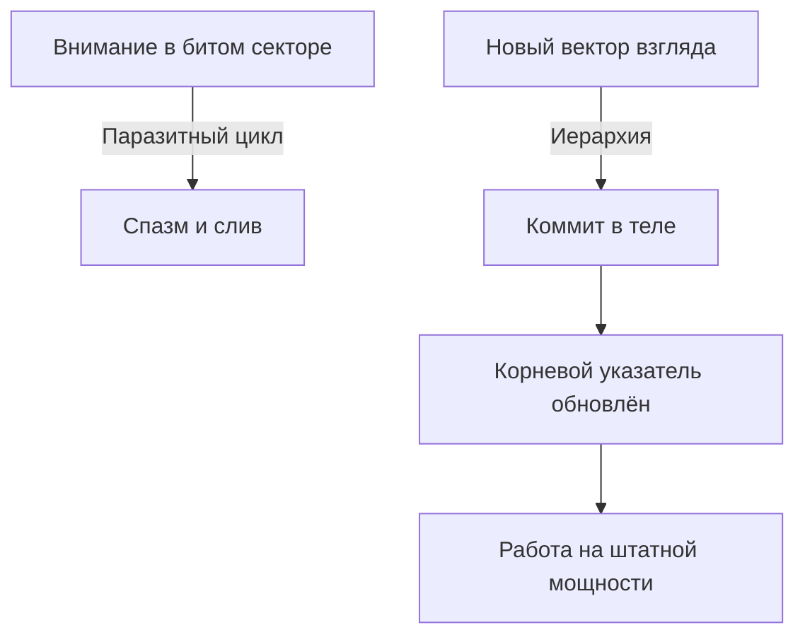

# Перезапись: один символ меняет всё

Патч собран. Теперь — **коммит**. Не черновик. Запись, после которой откат старого сценария дороже, чем жить по-новому.

В конфиге на сотни тысяч строк ломает один символ. Лишняя косая. Точка с запятой не там. Перевёрнутый бит.

Махина на миллионы пользователей уходит в цикл: интерфейсы висят, транзакции откатываются, сервисы падают.

Инженер находит байт. Меняет ноль на единицу. Сохраняет. Та же железная коробка. Те же логи. И система дышит, будто сбоя не было.

Железо то же. Прошлое не тронуто. Изменился только вектор чтения строки. Поток пошёл иначе.

С человеком — то же. После диагностики, легализации и отделения нужно **переписать правило** и **закрепить его в теле**.

---

## Прошлое не стереть — можно перевести взгляд

Популярная психология обещает «стереть травму добела». Как химчистка: выведем пятно, перекрасим воспоминание в пастель — и жить без шрама.

Честнее жёстче. Память — не пластилин. То, что случилось, случилось в физическом мире. Медитация это не отменит. Кто обещает стереть прошлое — продаёт иллюзию.

В твоей власти другое: **куда смотрит внимание сейчас**.

До этой секунды процессор крутился вокруг битого сектора. Предательство. Вычёркивание. Вина. Годы — на обслуживание обиды. Лозунг «я излучаю позитив» поверх аварии — снова фломастер на стекле. Сервер рисунки на мониторе не читает. Он читает код.

Перезапись — перенос фокуса на живой порядок:

* **Принадлежность:** исключённые возвращены в память. Имена на месте.
* **Иерархия:** жизнь течёт сверху вниз — от старших к младшим.
* **Баланс:** взятое и отданное уравнены. Взаимные претензии обнулены.

---

> [!NOTE]
> Дональд Хебб: нейроны, которые разряжаются вместе, связываются вместе. Травма годами держит проторенную петлю — успех или близость мгновенно гонят ток в панику. Эрик Кандель показал долговременную потенциацию: новый опыт при эмоциональной разрядке растёт синаптическими шипиками, а старый путь без сигнала теряет силу. Прошлое на диске остаётся. Меняется указатель. Внимание с телесным подтверждением — и маршрутизация идёт мимо дыры. Боль становится архивом, не пультом.

---

## Бархатный альбом и вырезанный брат

Максим строил платёжные шлюзы в европейском финтехе. Тридцать четыре. Архитектуры на миллионы транзакций в секунду.

Своя жизнь — гостевой аккаунт.

Съёмные апартаменты. Вещи в нераспакованных коробках. Отказ от опционов. Только короткие контракты. Любой намёк на брак — стоп.

— Меня в любую секунду отзовут, — говорил он в пол. — Флаг временного пользователя. Чужое место за столом. Сейчас войдёт настоящий — и вышвырнут. Под галстуком — ледяная дыра с рваными краями.

Он принёс семейный альбом: бордовый бархат, латунные уголки.

На двадцать третьей странице — аккуратная овальная дыра. Кто-то маникюрными ножницами вырезал детское лицо.

Максим коснулся края. Дрожь.

— В десять нашёл в кладовке свидетельство. Леонид. За два года до меня. Три месяца. Порок сердца. Спросил маму — губы посинели. Она сожгла бумагу над раковиной: «Забудь имя! Ты первый и единственный! Мы родили тебя, чтобы вычеркнуть ту трагедию!» Потом достала ножницы и вырезала его из всех фотографий.

Тридцать четыре года Максим был дубликатом. Заплаткой. Аварийной копией первенца. Правило: *«Я не настоящий. Настоящий на кладбище. Заявлю право на жизнь — настигнет его смерть»*.

> **Терапевт:** Ладонь на грудь. Туда, где дыра. Выведи Леонида.
>
> **Максим:** *(дыхание перехватывает)* Трёхмесячный. Синее одеяло. Полупрозрачный. Невидимый для мира.
>
> **Терапевт:** Взрослыми глазами. Верни адреса.
>
> **Максим:** *(шёпот, слёзы)* Лёня… Ты был первым. Ты принял удар порока. Твоя судьба, твоя смерть — оставляю тебе со скорбью.
>
> **Терапевт:** Назови свой номер.
>
> **Максим:** *(позвоночник щёлкнул)* Я — второй. Младший. Не замена. Не дубликат. Сердце бьётся само. Забираю имя и место. Тебе — статус первенца. Ты в семье навсегда. Имя вписано.

В грудине что-то разорвалось — и хлынуло тепло. Дыра заполнилась плотностью. Вдох такой глубокий, какого лёгкие не знали с рождения.

— Затянулась, — прошептал он. — Дыры нет. Мне больше не нужно исчезать, чтобы освободить место мёртвому. Я здесь.

Через три месяца — квартира с окнами на реку. Коробки распакованы. Пятилетний контракт партнёра. Один символ в иерархии закрыл дыру, которая жрала тридцать лет.

---

## Практика: перезапись

Только когда аффект отработан, патч сформулирован, стопы на земле.

1. **Битый сектор.** Сядь. Вызови старую картину («брошенный», «наказанный», «задвинутый»). Где застрял взгляд?
2. **Эталон рядом.** Не вытесняя факта:
   * исключённые на местах;
   * старшие за спиной — источники;
   * ты на своём месте по праву рождения;
   * поток идёт к тебе.
3. **Коммит вслух:**
   > «Отзываю внимание из старого сценария.
   > Записываю верный порядок связей.
   > Каждый узел рода на своём месте.
   > Старшие выше, младшие ниже.
   > Поток жизни открыт.
   > Это моя законная конфигурация. Коммит поставлен».
4. **Две минуты.** Жди тела: выдох сам, тепло в пояснице, плотность в грудине.

Данные прошлого те же. Топология взгляда — новая. Жизнь пересобирается без насилия над собой.

> [!IMPORTANT]
> **Закон главы**
> Прошлое не стереть — но перенос внимания на верную иерархию переписывает траекторию жизни и денег.
