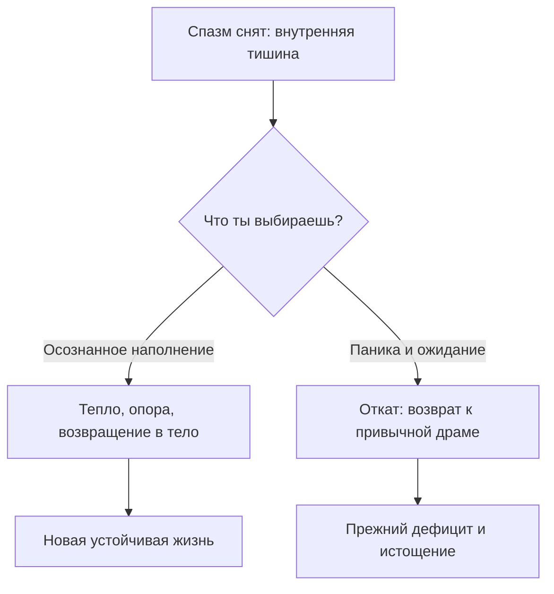

# Тишина после бури: как выдержать пустоту

Тело наконец сказало «да». И именно здесь человека подстерегает самый незаметный и опасный поворот.

Освободившееся внутреннее пространство нужно немедленно наполнить собственным присутствием. Иначе в образовавшийся вакуум неизбежно затянет прежний эмоциональный хлам.

— Я сделала всё, о чём мы говорили, — жаловалась одна женщина. — Нашла истинный корень боли, честно признала свою ярость, разорвала удушающую связь с матерью. Внутри стало так тихо… А через пять дней на меня накатила такая чёрная тоска и беспричинная паника, какой я не знала годами! Руки буквально сами потянулись устроить скандал с мужем и снова броситься всех спасать. Почему случился этот жуткий откат?

— А чем ты заполнила то место внутри себя, где раньше круглосуточно кипела тревога?

— Ничем… А разве нужно было?

На этой развилке спотыкается почти каждый.

Когда с корабля срезают старый балласт, судно не просто становится легче — оно на время теряет привычную остойчивость. Его начинает опасно качать на каждой волне, пока трюмы не наполнятся новым грузом.

Это состояние называется **окном перестройки**.

Ты снял многолетний мышечный спазм — и внутри образовалась звенящая тишина. Нервная система, годами жившая на пределе адреналина и кортизола, вдруг оказывается в абсолютной невесомости. И ствол мозга впадает в тихий ужас: *«Опасности нет? Войны нет? Тишина? Значит, нас сейчас убьют из засады! Немедленно верните старую привычную тревогу!»*

И человек, сам того не осознавая, тянется к телефону, чтобы спровоцировать конфликт или взвалить на себя чужую беду. Потому что старый, обжитой ад кажется психике намного безопаснее незнакомой свободы.

---

> [!NOTE]
> ## Научный фундамент: аллостатическая нагрузка и ломка привычки
>
> Брюс Макьюэн ввёл понятие аллостаза: организм, годами находящийся под гнетом стресса, принимает повышенный уровень гормонов тревоги за свою базовую норму гомеостаза. Стоит устранить внешний или внутренний конфликт, как биохимический фон резко падает — и подкорковые структуры мозга бьют ложную тревогу, воспринимая спад напряжения как угрозу коллапса.
>
> Джозеф Леду доказал: миндалевидное тело способно генерировать фантомные приступы паники исключительно ради того, чтобы вернуть организм в привычный режим гормональной мобилизации.
>
> Физиология не терпит пустоты. Если освобождённый участок телесной памяти не занять новым опытом безопасности и тепла, подсознание моментально активирует прежние защитные рефлексы. Пустоту необходимо наполнять осознанно.

---

## Три способа наполнить пустоту

Не наивными ментальными аффирмациями. А глубоким телесным присутствием.

1. **Тёплая ладонь.** Положи руку прямо на то место, где ещё недавно жил спазм — на низ живота, солнечное сплетение или горло. Ощути физический вес ладони, её сухое тепло. Это понятный для нервной системы сигнал: *«Это место занято мной. Опасность миновала. Здесь живёт взрослый хозяин»*.
2. **Зримый образ плотности.** Наш мозг мыслит телесными образами быстрее, чем словами. Представь тяжёлый, светящийся шар в глубине таза, монолитную каменную колонну вдоль позвоночника или мягкое золотистое сияние в груди. Удерживай это ощущение без суеты.
3. **Слова суверенного права:** *«Это пространство свободно от чужого горя и чужих страхов. Я наполняю его собственной спокойной силой и радостью жизни. Моё место принадлежит мне»*.

---

## Живая история: кухня у открытого холодильника

Марина шестнадцать лет работала старшей операционной медсестрой в отделении экстренной хирургии. Вся её жизнь была подчинена роли всесильного Спасателя: парализованная после инсульта мать, требующая ежеминутного внимания, безработный муж, годами лежащий на диване перед телевизором, бесконечные ночные дежурства за заболевших коллег. Она спала по четыре часа в сутки и периодически падала в голодные обмороки от железодефицитной анемии.

Внутри неё безостановочно молотил один и тот же железный поршень: *«Стоит мне остановиться хоть на миг — и все вокруг погибнут. Моя жизнь принадлежит чужому страданию»*.

На первой же встрече мы разобрали этот узел. Марине удалось вернуть матери ответственность за её собственное здоровье, перестать нянчить сорокалетнего мужа как младенца и разжать ледяной обруч, сковывавший её грудь шестнадцать лет.

Первые три дня она буквально летала: словно с её плеч наконец сбросили двухпудовый мешок с мокрым песком.

А в четверг наступило окно перестройки.

Смена в больнице закончилась в семь вечера. Марина подошла к двери своей квартиры. Сырой подъезд. За дверью — тяжёлый запах вчерашних жареных котлет и мерцающий синий отсвет телевизора. Муж в растянутых спортивных штанах сидел на продавленном диване перед экраном, рядом стояла пустая кружка.

— Привет, — тихо сказала она.

— Угу, — буркнул он, даже не повернув головы.

Марина прошла на кухню, щёлкнула чайником. И в эту секунду её с головой накрыла ледяная волна паники.

Рука сама, словно намагниченная, полезла в карман медицинской куртки за телефоном. Пальцы судорожно жаждали набрать номер матери — спросить про давление, выслушать привычную часовую порцию жалоб на соседей. Или позвонить старшей медсестре: «Леночка, я могу выйти сегодня в ночь за Свету, мне всё равно делать нечего!»

Пальцы мелко тряслись, пульс подскочил до ста тридцати ударов в минуту.

Но это не была забота о близких. Это была яростная ломка застарелой вины: *«Ты стоишь и спокойно пьёшь чай?! Ты бросила больную мать?! Ты не бежишь спасать мужа?! Бессердечная, эгоистичная дрянь! Ты пустое место, если не приносишь себя в жертву каждую секунду!»*

Её нервная система отчаянно требовала привычной дозы страдания.

Марина с силой швырнула телефон на кухонный стол. Медленно сползла спиной по белой дверце холодильника прямо на пол. Подтянула колени к подбородку. Из глаз брызнули злые, отчаянные слёзы, ногти впились в старый линолеум.

Сквозь её рёбра гулял ледяной сквозняк. Старая опора в виде мученичества была выломана с корнем, а новая ещё не успела окрепнуть.

Но она не побежала к дивану мужа. И не стала набирать номер матери.

Она положила обе тёплые ладони на низ своего живота, закрыла глаза и прошептала в кухонную темноту:

— Нет. Я больше не отдам своё тело старому аду. Эта тишина — не смерть. Это место для моей собственной жизни. Я имею право просто дышать. Я имею право не спасать весь мир своей кровью.

Она просидела на полу около сорока минут. С каждым выдохом дыхание опускалось всё глубже, согревая внутренности.

Под её ладонями зародилось плотное, живое, сухое тепло. Оно медленно разлилось по животу, поднялось к пояснице, мягко расправило лопатки и согрело затылок. Это было тепло её собственного, живого, исцелённого существа.

Марина поднялась на ноги, умыла лицо прохладной водой. Муж всё так же сидел перед телевизором. Она не стала метаться по кухне и готовить ему разносолы. Не стала читать нотаций.

Она заварила себе душистый чай с чабрецом, устроилась в мягком кресле и открыла книгу, к которой полгода не смела прикоснуться из-за разъедающей вины.

Окно перестройки было пройдено. Новая жизнь выстояла.

---

## Практика: наполнение ресурсом и телесный якорь

Делай эту практику сразу после снятия любого спазма — или в тот момент, когда накатывает непривычная пустота и тревога.

1. **Внимание к тишине.** Найди в теле ту зону, где раньше жил спазм. Ощути прохладную, спокойную пустоту. Не пугайся её: это чистое пространство, готовое принять новую силу.
2. **Три шага наполнения:**
   * **Прикосновение:** накрой это место ладонью. Дыши прямо под пальцы, согревая ткани.
   * **Образ:** представь плотный, спокойный свет или тепло, наполняющее этот объём.
   * **Слова права:**
     > «Это пространство свободно от старой боли. Я наполняю его своей спокойной силой, теплом и законным правом на жизнь. Это место принадлежит мне. Чужой тревоге сюда входа нет».
3. **Телесный якорь:**
   * На самом пике ощущения тепла и покоя плотно соедини подушечки большого и безымянного пальцев левой руки.
   * Удерживай это прикосновение пятнадцать секунд, напитываясь чувством устойчивости.
   * Разомкни пальцы, сделай мягкий выдох и вернись к своим обычным делам.
   * Повтори эту связку четыре раза подряд.
4. **Проверка связи:** через некоторое время в спокойной обстановке снова соедини те же пальцы. Если по телу пробежит знакомая волна тепла, а грудь сделает лёгкий вдох — якорь закрепился надёжно.

> [!IMPORTANT]
> **Главная мысль**
> Освобождённое внутреннее пространство не терпит вакуума: если ты не наполнишь его собственным присутствием и покоем, его немедленно захватит прежний привычный ад.
