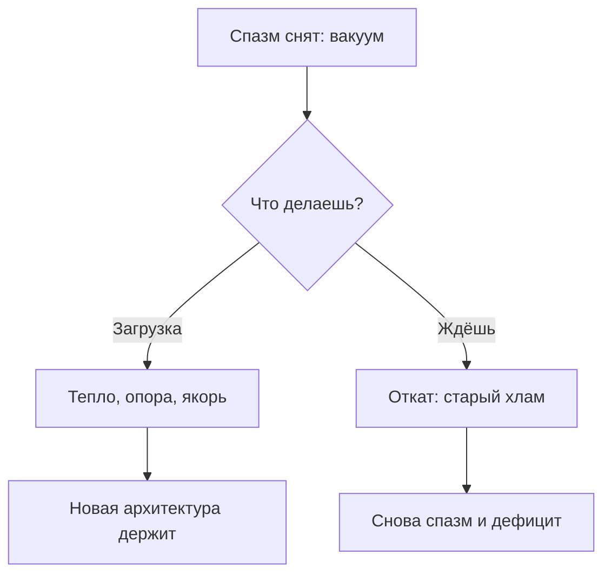

# Пустота и откат

Тело сказало «да». И тут — самый опасный участок.

Освободившееся место нужно занять сразу. Иначе туда затянет привычный мусор.

— Я всё сделала: нашла корень, легализовала ярость, разорвала симбиоз с матерью. Стало тихо… А через пять дней — чёрная тоска и тревога, каких не было годами. Руки сами потянулись к скандалам и контролю. Почему откат?

— Чем ты заполнила то место, где крутился аварийный процесс?

— Ничем… А разве нужно?

На этом спотыкаются почти все.

После крупного обновления сервер уходит в перезагрузку: экраны гаснут, порты закрываются. Новичок колотит по стойке: «Сломалось!» Опытный пьёт кофе. Идёт инициализация.

Это **окно перезагрузки**.

Ты разжал спазм — внутри пустота. Нейронам нужна активность. Не заполнишь сам — затянет прежний шлак.

Тревога и вина годами держали адреналин. Убрал спазм — ломка: *«Защиты нет! Тишина — значит, сейчас убьют! Верните старые файлы!»*

Рука сама тянется к телефону устроить конфликт. Знакомый ад привычнее незнакомой тишины.

---

> [!NOTE]
> Брюс Макьюэн описал аллостаз: организм, годами живший на кортизоле, принимает высокий уровень за норму. Убрал конфликт — биохимия падает, ствол мозга орёт «коллапс». Джозеф Леду показал: амигдала может гнать фантомную тревогу просто чтобы вернуть привычную химию. Якорь — жест, связанный с безопасностью — строит новый контур через островковую кору. В памяти то же: освободил страницу и не затёр — Use-After-Free. Любой фоновый поток читает грязь. Место нужно заполнить сразу.

---

## Три канала загрузки

Не аффирмациями. Телом.

1. **Ладонь.** На то место, где был спазм — живот, горло, сердце. Тепло кожи. Вес руки. Сигнал коре: *«Кластер занят. Опасности нет. Здесь взрослый»*.
2. **Образ.** Мозг ест картинку быстрее слов. Плотный шар в тазу. Колонна вдоль позвоночника. Прохладный свет в груди. Держи без суеты.
3. **Фраза права, не долга:** *«Это пространство свободно от чужого шума. Я загружаю сюда свою спокойную силу. Место занято»*. Работает только поверх первого или второго канала.

---

## Кухня у открытого холодильника

Марина шестнадцать лет — старшая операционная медсестра неотложки. Жизнь выкроена под Спасателя: мать после инсульта, муж без работы на диване у телевизора, ночные смены за заболевших. Сон — четыре часа. Обмороки от анемии. Двигатель гудел: *«Остановлюсь — все погибнут. Жизнь принадлежит чужой боли»*.

На сессии контур разобрали. Матери вернули её болезнь. С мужа сняли роль младенца. Обруч в груди разжали.

Три дня летала: с плеч сняли мешок мокрого песка.

В четверг — окно перезагрузки.

Смена кончилась в девятнадцать. Дверь квартиры. Сырость. Вчерашние котлеты. Синий свет телевизора. Муж в трениках. Пустая пивная кружка.

— Привет.

— Угу.

Кухня. Чайник. И ледяная волна.

Рука сама полезла в карман за телефоном. Набрать матери. Проверить пульс. Час жалоб на соседей. Позвонить старшей: «Лена, выйду в ночь за Светку?»

Пальцы тряслись. Сердце в горле — сто тридцать.

Это была не тревога за близких. Это была ярость на себя. Липкий стыд: *«Пьёшь чай?! Бросила мать?! Не спасаешь мужа?! Бессердечная тварь! Ты пустое место, если никому не служишь!»*

Система требовала дозу привычного ада.

Телефон на стол. Сползла по дверце холодильника на пол. Колени к груди. Сухие яростные всхлипы. Ногти по линолеуму.

Сквозь рёбра свистел ветер. Старая опора выломана. Новой ещё нет.

Не побежала к мужу. Не набрала мать.

Обе ладони на низ живота. В темноту:

— Нет. Старому мусору не отдам. Пустота — не смерть. Это место для моей жизни. Имею право дышать. Имею право не спасать мир своей кровью.

Сорок минут на полу. Дыхание опускалось глубже рёбер.

Под ладонями — плотное золотистое тепло. Заполнило живот. Согрело спину. Расправило лопатки. Тепло её собственного ядра.

Поднялась. Умылась. Муж всё так же перед экраном. Ужин ему не готовила. Нотаций не читала.

Чай с чабрецом. Кресло. Книга, к которой полгода не смела прикоснуться из-за вины. Окно пройдено. Горизонт удержался.

---

## Практика: загрузка и якорь

Сразу после снятия зажима — или при первом накате пустоты.

1. **Кластер.** Найди место, где было напряжение. Прохладная тишина. Не паникуй: это чистая память, готовая к записи.
2. **Три канала:**
   * **Ладонь:** накрой зону. Дыши под пальцы.
   * **Образ:** плотный поток тепла или спокойной силы.
   * **Фраза:**
     > «Сектор свободен от старого кода. Загружаю сюда свою плотность, тепло ядра и право на жизнь. Место занято. Чужому шуму доступа нет».
3. **Якорь:**
   * На пике тепла сомкни большой и безымянный пальцы левой руки.
   * Пятнадцать секунд. Держи силу в теле.
   * Разомкни. Выдох. Вернись вовне.
   * Повтори связку четыре раза.
4. **Проверка:** через пять минут в нейтрали сомкни те же пальцы. Тёплая волна и мягкая диафрагма — якорь стоит.

> [!IMPORTANT]
> **Закон главы**
> Освобождённое место не терпит пустоты: не заполнишь присутствием — затянет старый мусор.
