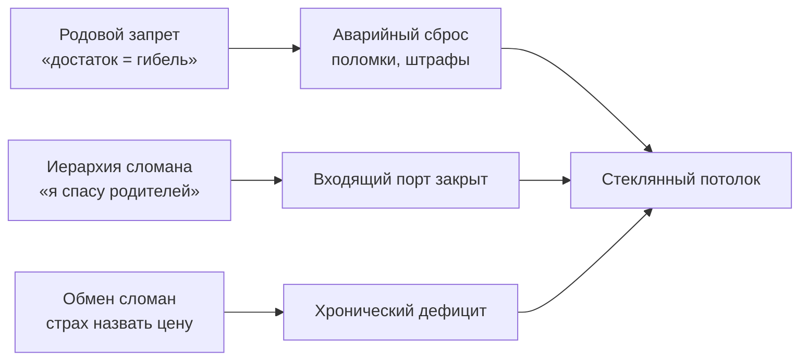

# Деньги: где утекает поток

Сняли проекции с людей — следующий рубеж. Деньги.

С ними ты обходишься так же, как с близкими. Пока на них чужая текстура — страх раскулачивания, вина перед бедными, детский запрет высовываться — поток уходит в ноль, сколько ни пахай.

Можно без выходных, с дорогими маркетологами, с вылизанной воронкой — а на счету месяц за месяцем минимум. Или приходят крупно и тут же испаряются: коробка передач, штрафы, срочный стоматолог.

Дело не в грамотности и не в рынке. Деньги здесь — **поток**. Те же законы, что у жизненной силы и привязанности. Сломан узел — система сбрасывает напряжение, чтобы не сгореть.

---

## Загадка «Одинаковый продукт»

> [!TIP]
> **Загадка**
> Два эксперта запускают один и тот же продукт: качество, аудитория, бюджет — совпадают. Через год один в прибыли и масштабирует. Второй на грани банкротства, по шестнадцать часов в сутки.
>
> **Голос Расчёта:** У второго слабее оффер и конверсия.
>
> **Голос Правила:** Он нарушает норму обмена: не называет цену, работает в долг — рынок наказывает.
>
> **Голос Души:** Он отсекает входящее там, где маркетинг бессилен: внутри стоит запрет на достаток.
>
> *Вопрос силы:* Где шлюз, который не откроет таргетированная реклама?

> [!NOTE]
> **Ответ**
> Маркетинг гонит внешний трафик. Пропускная способность — внутри: входящий и удерживающий порты. Блок почти всегда в иерархии (стоишь «выше» родителей-спасателем), в обмене (ужас назвать цену) или в лояльности роду (достаток = предательство семьи). Реклама этих разрывов не видит. Диагностика — видит адрес утечки.

---

## Три протокола потока

**1. Иерархия.** Ресурс идёт сверху вниз — от предков к потомкам. Встал «выше» родителей: поучаешь мать, содержишь отца из жалости, усыновляешь собственных предков — полярность переворачивается. Вход закрыт.

**2. Баланс.** Работа за бесценок, страх рыночной цены, бесплатная раздача экспертизы — спазм в гортани на входе. Обратный перекос — брать без отдачи — заканчивается исками, штрафами, потерями.

**3. Принадлежность.** В памяти рода богатство = гибель (раскулачивание, лагеря, грабёж девяностых) — рост счёта читается как смертельная угроза. Чтобы остаться «таким же бедным и чистым, как деды», организм устраивает слив: болезни, аварии, сомнительные инвестиции.

Личные фильтры бьют не слабее: **страх быть видимым** (заметный = мишень), **скидка до вопроса клиента**, **зависшие долги**, склейка **«деньги — грязь»**.

> [!NOTE]
> Рэйчел Йегуда показала: травма предков — голод, репрессии, угроза за достаток — метилирует ген FKBP5 у потомков. Накопление ресурса тело читает не как безопасность, а как сигнал гибели. В нейроэкономике (Камерер, Зак) удержание прибыли сталкивает центр награды с островковой корой — той, что кодирует боль и отвержение. Чтобы снять жар, мозг сбрасывает: импульсивные траты, «роковые» поломки, спасательство родни. Селигман назвал это выученной беспомощностью: организм заранее капитулирует перед невидимым барьером семьи. Как маршрутизатор, который при росте потока не расширяет окно, а дропает пакеты. Перепрошивка — снять этот сброс.

---

## Тридцать первое

Нина вела арбитраж хирургически: железные формулировки, доказательная база, гипноз перед коллегией. Тридцать девять. Старший партнёр фирмы. Доход с шестью нулями — без запинки на совете.

Каждый месяц — тридцать первое.

Утро. Вибросигнал банка: **дивиденды**. Громадная сумма. Вместо триумфа — тошнота в солнечном сплетении. Обруч на горле.

К обеду — перевод матери. Не потому что нужны лекарства. Потому что иначе орёт хор: *«Зазналась. Барыня. Забыла, в каких обносках тебя растили»*. Треть дохода. Пальцы леденеют на подтверждающем коде.

К вечеру — чат коллег: сбор на проект, в который она не верила. Скинула втрое («чтобы не сочли высокомерной»). В 23:40 — дорогой курс по квантовой медитации. Глаза режет. Внутри — дыра.

Утром первого — на накопительном дежурный ноль. Как в студенчестве.

Деньги не исчезали сами. Нина расстреливала баланс с точностью. Каждый слив — под маской долга: помочь, загладить, откупиться от зависти.

---

## «Ты стала как чужая»

Суббота. Голос матери — ровный, сухой, пропитанный обидой:

— Нина, ты в этом месяце не перевела. Проблемы? Или вычеркнула нас?

— Мам, всё в порядке. Распределяю бюджет на инвестиции.

Тишина в трубке — как сырая земля.

— Понятно. Инвестиции. Ты стала чужая, Нина. Как те сытые морды по телевизору, которые забыли, откуда вылезли. Мы в твоём возрасте на макаронах сидели и людям последнее отдавали.

Слово «чужая» вошло под рёбра. Воздух выбило. Нина положила телефон. На экране банка светилась сумма, которую вчера силой оставила на брокерском счёте — прервав ритуал самоуничтожения.

Дошла до ванной. Сползла по кафелю на ледяной пол. Озноб. Желудок в спазме. К горлу — рвота. Стыд отвержения. Клеймо предательницы рода. Девочка из заводского барака посмела стать богатой и не отдать всё.

Рука потянулась к телефону. Открыть. «Перевести всё». Смыть ад привычной жертвой — один клик.

Пальцы дрожали. Ноготь стучал по стеклу.

Зажмурилась. Длинный выдох в живот. Заблокировала экран.

Три ночи — кошмары: мать спиной в тёмной комнате, стук молотка судебного исполнителя. Просыпалась в поту: «Переведи, не зли, вернись в семью».

Выдержала. Стыд не испарился. Переплавился из паралича в плотную границу. Деньги остались на счёте.

---

## Сессия

Нина пришла с идеальной укладкой. Трапеции — камень. Челюсти сведены.

— Карьеру выстроила. А внутри — в рваных колготках на табуретке в хрущёвке. Вымаливаю прощение за то, что мне тепло.

Попыталась назвать сумму капитала. На слове «миллион» связки перехватило. Голос сорвался. Тело отказывалось озвучивать право владеть.

Блок не про экономику. На стыке кривого баланса и слепой лояльности: удержать достаток = предать память предков, выживавших в нищете.

— Ладонь на солнечное сплетение. Холод под рёбрами. Посмотри на родителей. Медленно:

*«Мама, папа. Я вижу ваш голод и страх выделяться. С уважением отношусь к вашей судьбе. Навсегда остаюсь вашей дочерью. Но больше не предам плоды своего труда, чтобы доказать любовь. Мой достаток не делает вас меньше. Разрешаю себе удерживать то, что честно создано мной. В другое время. На другой глубине».*

Воздух со свистом вошёл. Плечи упали. Спазм в диафрагме растворился горячей волной до пальцев. Беззвучные слёзы.

Через две недели мать позвонила. Нина перевела фиксированную сумму заботы — ту, что определила сама, без вины. Мать долго молчала. Потом впервые за годы — не яд, а тихое: «Спасибо, дочка». Без манипуляций. На равных.

Деньги на брокерском больше не жгли руки. Стали тем, чем должны были быть: опорой взрослой жизни.

---

## Незакрытый обмен: Марк

В [главе о дисбалансе обмена](/25-bug-09-exchange-disbalance) — сценарий Марка. Здесь — его финансовый шлюз.

Марк — эксперт по корпоративному праву. Четырнадцать часов за столом. Личные счета пусты: бесплатные консультации знакомым, чужие дела на себя, стыд выставлять инвойсы холдингам — ставки стажёра годами.

В корне — вина: двадцать лет назад испугался и не вступился за школьного друга в драке под мостом. С тех пор бессознательное закрывало мнимый долг крови: вечный неоплачиваемый должник для мира. Брать плату — чувствовать себя преступником.

На сессии впервые посмотрел на образ друга:

*«Закрываю этот счёт. Больше не расплачиваюсь жизнью за то, что был тринадцатилетним испуганным мальчиком. Труд имеет цену. Разрешаю себе брать справедливую плату за каждый шаг».*

Кулак раскрылся. Диафрагма расправилась. Через месяц поднял ставку вчетверо. Клиенты не ушли — стали уважать заключения сильнее. Поток выровнялся, когда узел перестал стравливать давление через дыру непрощённой вины.

---

## Практика: проверка потока

1. **Аварийный слив.** Три года финансов. При какой сумме на счёте система устраивает сброс — авария, болезнь, срочная просьба родни? Запиши цифру. Это потолок узла.
2. **Иерархия.** Встань перед родителями. Ты младший. Прекрати покровительство из высокомерия спасателя: *«Вы — большие, я — меньший. Принимаю жизнь по полной цене. Не покупаю вашу любовь и не искупаю вашу боль своими деньгами»*.
3. **Баланс.** Назови вслух справедливую, повышенную цену часа. Где спазм — гортань, челюсть, желудок? Держи внимание до непроизвольного выдоха.
4. **Мнимые долги.** Где до сих пор иррациональная вина? *«Тот счёт закрыт. Обязательства исчерпаны. Выхожу из вечной компенсации»*.
5. **Родовая лояльность.** Рука на грудь: *«Чту память предков и тяжесть вашей доли. Мой достаток — не отрицание вашей памяти, а продолжение жизни, которую вы передали. Разрешаю себе удерживать ресурс»*. Опора в стопах. Тепло в ладонях.

> [!IMPORTANT]
> **Закон главы**
> Деньги утекают там, где удержание достатка бессознательно равно предательству рода или сломанному обмену.
