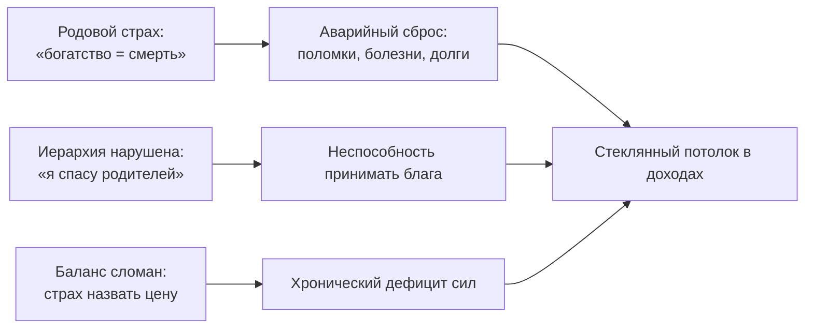

# Деньги: куда на самом деле утекает достаток

Мы сняли чужие маски с близких людей. Теперь перед нами следующий рубеж, о который разбиваются миллионы судеб. Деньги.

С деньгами человек обходится в точности так же, как со своими самыми глубокими привязанностями. Пока на них налипла родовая боль — ужас раскулачивания, жгучая вина перед нищими родителями или детский страх выделиться из серой массы, — любые попытки разбогатеть будут заканчиваться крахом, сколько бы ты ни вкалывал.

Можно работать без праздников и выходных, нанимать лучших бизнес-консультантов, выстраивать безупречные продажи — а на банковском счёте из месяца в месяц будет оставаться дежурный ноль. Или деньги будут приходить крупными волнами и тут же испаряться с пугающей скоростью: внезапные поломки машины, штрафы, срочные дорогостоящие операции, долги родственников.

Дело здесь не в финансовой неграмотности и не в жестокости рынка. Деньги подчиняются тем же фундаментальным законам, что и жизненная энергия. Если нарушен глубинный душевный порядок, организм устраивает аварийный сброс средств — лишь бы спастись от воображаемой гибели.

---

## Притча: одинаковый продукт

> [!TIP]
> **Притча**
> Два эксперта запускают абсолютно одинаковый образовательный проект: уровень знаний, качество материала, размер аудитории и рекламный бюджет совпадают до копейки.
>
> Через год первый получает солидную чистую прибыль и уверенно масштабирует бизнес. Второй работает по шестнадцать часов в сутки, балансируя на грани банкротства и нервного срыва.
>
> **Голос Расчёта:** «У второго просто слабее рекламная подача и хромает конверсия на сайте».
>
> **Голос Справедливости:** «Он нарушает законы рынка: боится называть реальную стоимость своих услуг, раздаёт консультации в долг — и мир наказывает его за мягкотелость».
>
> **Голос Души:** «Он собственными руками отсекает входящий поток там, где бессилен любой маркетинг: в его теле стоит железный запрет на сытую жизнь».
>
> *Вопрос на зрелость:* Где находится та невидимая плотина, которую не способна пробить никакая реклама?

> [!NOTE]
> **Разбор притчи**
> Реклама лишь привлекает внешний интерес. Но способность принять и удержать достаток определяется внутренним состоянием человека.
>
> Блок почти всегда лежит в нарушении одного из трёх базовых законов: в искажении семейной иерархии (когда ребёнок пытается быть высокомерным спасателем для своих родителей), в сломанном обмене (животный страх назвать достойную цену за свой труд) или в слепой родовой лояльности (когда достаток бессознательно приравнивается к предательству нищих предков).
>
> Рекламные агентства этих ран не видят. Честная внутренняя диагностика точно указывает место утечки.

---

## Три закона денежного потока

1. **Иерархия поколений.** Жизненная сила и ресурсы текут строго сверху вниз — от старших к младшим. Если ты встаёшь «выше» своих родителей: снисходительно поучаешь мать, содержишь взрослого отца из жалости, превращаясь в родителя для собственных предков, — естественное русло переворачивается. Входная способность принимать блага блокируется.
2. **Баланс брать и отдавать.** Работа за гроши, страх поднять чек, бесконечная бесплатная раздача профессиональных советов — всё это рождает мышечный спазм в горле. А попытка хапать без отдачи неизбежно оборачивается судебными исками, предательством партнёров и внезапными потерями.
3. **Лояльность родовой боли.** Если в семейной памяти предков богатство означало неминуемую смерть (раскулачивание, лагеря, грабежи голодных лет или бандитский рэкет девяностых), то рост банковского счёта считывается телом как смертный приговор. Чтобы остаться «хорошим, чистым и честным, как дедушка», подсознание устраивает скрытый саботаж: сомнительные инвестиции, автокатастрофы, внезапные болезни.

К этим системным узлам добавляются личные страхи: паника перед видимостью (быть заметным — значит стать мишенью), готовность дать скидку ещё до того, как клиент открыл рот, и детская брезгливость: «деньги — это грязь».

---

> [!NOTE]
> ## Научный фундамент: трансгенерационная травма и нейроэкономика
>
> Профессор психиатрии Рэйчел Йегуда в исследованиях эпигенетики доказала: пережитый предками экстремальный травматический опыт (голод, геноцид, репрессии) приводит к метилированию гена *FKBP5*, регулирующего реакцию на глюкокортикоиды. Этот эпигенетический след передаётся через поколения. В результате накопление материальных ресурсов воспринимается нервной системой потомков не как признак безопасности, а как сигнал приближающейся катастрофы.
>
> В нейроэкономике (исследования Колина Камерера и Пола Зака) показано: процесс удержания прибыли сталкивает прилежащее ядро (центр вознаграждения) с островковой корой, отвечающей за физическую боль и страх социального отвержения. Чтобы заглушить эту боль, мозг бессознательно провоцирует импульсивные траты и финансовые потери.
>
> Мартин Селигман назвал это состояние выученной беспомощностью: психика заранее капитулирует перед невидимым барьером, не позволяя себе перешагнуть через семейный предел достатка.

---

## Живая история: тридцать первое число

Нина вела сложнейшие арбитражные споры с хирургической точностью. Ей было тридцать девять лет. Старший партнёр крупной юридической фирмы: стальной взгляд, безупречно выверенная доказательная база, гипнотическое влияние на судейскую коллегию. Её ежемесячный доход легко исчислялся миллионами рублей.

Но каждый месяц наступало роковое тридцать первое число.

Утро. Короткая вибрация смартфона: выплата партнёрских дивидендов. Огромная сумма на экране. Но вместо радости и гордости за свой титанический труд Нину накрывала липкая тошнота в солнечном сплетении и ледяной обруч на шее.

К обеду она отправляла солидный денежный перевод матери. Не потому, что матери не хватало на жизнь или лекарства. А потому, что в голове начинал истошно орать знакомый с пелёнок обвиняющий хор: *«Зазналась! Барыня выискалась! Забыла, в каких обносках тебя вырастили, неблагодарная!»* Треть честно заработанных денег улетала в один клик.

К вечеру в рабочем чате кто-то объявлял сбор на сомнительный стартап знакомых. Нина скидывала сумму втрое больше остальных — «лишь бы не сочли высокомерной богачкой». А в полночь покупала очередной баснословно дорогой онлайн-курс по «квантовому расширению сознания», который никогда не откроет.

Утром первого числа на её накопительном счёте оставался привычный, знакомый со студенческих времён ноль.

Деньги не исчезали сами по себе. Нина расстреливала собственный баланс с методичностью снайпера. И каждый слив совершался под благородной маской долга: помочь родным, загладить невидимую вину, откупиться от зависти окружающих.

---

## «Ты стала нам чужой»

В одну из суббот раздался телефонный звонок. Голос матери был сухим, надтреснутым, сочащимся ледяным упрёком:

— Нина, ты в этом месяце не прислала денег. У тебя проблемы? Или ты решила окончательно вычеркнуть нас из своей сытой жизни?

— Мама, у меня всё в порядке. Я просто распределила бюджет на долгосрочные инвестиции.

В трубке повисла тишина — тяжёлая и промозглая, как сырая могильная земля.

— Понятно. Инвестиции… Ты стала совсем чужой, Нина. Точь-в-точь как те лоснящиеся морды по телевизору, которые стыдятся своих корней. Мы в твоём возрасте сидели на пустых макаронах и людям последнее отдавали. А ты гребёшь под себя.

Слово «чужая» вошло под рёбра Нины словно ржавый штык. Воздух из лёгких выбило до капли. Она медленно положила телефон на стол. На экране банковского приложения светилась сумма, которую она вчера нечеловеческим усилием воли оставила на счёте, прервав привычный ритуал финансового самосожжения.

Она едва дошла до ванной комнаты. Сползла по кафельной стене на холодный плиточный пол. Её колотил жестокий озноб, желудок скрутило спазмом, к горлу подступила желчная тошнота.

Это был всепоглощающий ужас отвержения. Невыносимый позор «предательницы рода». Девочка из рабочего барака посмела стать богатой и сытой — и не отдала всё до последней нитки.

Её пальцы судорожно потянулись к смартфону. Открыть приложение. Нажать кнопку «Перевести всё». Смыть этот кромешный ад привычной жертвой — одно движение пальца, и мама снова сменит гнев на милость!

Пальцы мелко дрожали, ноготь стучал по сенсорному стеклу.

Нина зажмурилась до кровавых кругов перед глазами. Сделала длинный, протяжный выдох в самый низ живота. И заблокировала экран.

Следующие три ночи были наполнены кошмарами: мать, стоящая спиной в тёмной комнате, стук молотка судебного пристава, конфискующего имущество. Она просыпалась в липком поту с одной мыслью: «Переведи, не зли их, вернись в бедность, вернись в семью!»

Она выдержала. И стыд не убил её. За эти трое суток он переплавился из детского паралича в плотную, несокрушимую взрослую границу. Деньги впервые остались на её счёте.

---

## Исцеление: право владеть плодами своего труда

На встречу Нина пришла в строгом деловом костюме, но её плечи были словно высечены из гранита, а челюсти судорожно сжаты.

— Я построила блестящую карьеру, — сказала она с горечью. — А внутри по-прежнему сижу в рваных детских колготках на скрипучем табурете в нашей хрущёвке. И вымаливаю у родителей прощение за то, что мне в этой жизни тепло и сытно.

Я попросил её назвать вслух размер своего капитала. На слове «миллион» её голосовые связки намертво перехватило. Голос сорвался на сиплый шёпот. Физическое тело отказывалось озвучивать право на владение благами.

— Положи ладонь на солнечное сплетение, Нина. Почувствуй этот ледяной ком под рёбрами. Посмотри на образы своих родителей. И скажи им из самой глубины своей женской силы:

— Мама, папа, — заговорила она медленно, с трудом проталкивая слова сквозь зажатое горло. — Я вижу ваш голодный страх. Я вижу, как тяжело вам доставался каждый кусок хлеба. Я с глубоким трепетом и почтением отношусь к вашей судьбе. Я навсегда остаюсь вашей дочерью. Но я больше не стану уничтожать плоды своего честного труда, чтобы доказать вам свою любовь. Мой достаток не делает вас меньше. Я разрешаю себе владеть тем, что я создала своими руками и своим умом. В другое время. В другой реальности.

Воздух со свистом ворвался в её грудь. Окаменевшие плечи с видимым облегчением опустились вниз. Спазм в диафрагме растворился горячей, живой волной, докатившейся до самых кончиков пальцев. По щекам потекли беззвучные, тёплые слёзы.

Через две недели мать позвонила снова. Нина спокойно перевела ей фиксированную сумму сыновней заботы — ровно столько, сколько сама посчитала нужным, без страха и чувства вины.

Мать долго молчала в трубку. А затем впервые за долгие годы произнесла не ядовитую шпильку, а тихое, искреннее: «Спасибо тебе, доченька».

Они впервые поговорили как две взрослые женщины. На равных.

Деньги на счёте Нины перестали жечь ей руки. Они наконец стали тем, чем и должны были быть с самого начала: надёжной, спокойной опорой свободной человеческой жизни.

---

## Практика: проверка денежного потока

1. **Порог аварийного сброса.** Проанализируй свои финансы за последние три года. При достижении какой суммы на счёте в твоей жизни регулярно случается внезапная беда — авария, поломка техники, болезнь или срочная мольба о помощи от родни? Запиши эту цифру. Это твой бессознательный потолок безопасности.
2. **Восстановление иерархии.** Мысленно встань перед родителями. Ты — младший. Перестань играть в снисходительного благодетеля:
   > «Вы — большие, а я — меньший. Я принимаю от вас дар жизни по полной цене. Я больше не пытаюсь купить вашу любовь и не искупаю ваши страдания своими деньгами».
3. **Цена своего труда.** Назови вслух справедливую, повышенную стоимость часа своей работы. Обрати внимание, где в теле возникает спазм (горло, челюсти, живот). Дыши прямо в это место, пока не наступит спонтанный выдох.
4. **Обнуление мнимых долгов.** Вспомни, перед кем ты годами испытываешь иррациональную вину:
   > «Тот старый счёт закрыт. Я больше не расплачиваюсь своей жизнью за ошибки прошлого. Мой труд имеет честную цену».
5. **Родовое благословение на достаток.** Положи руку на сердце:
   > «Дорогие предки, я чту память о вашей тяжёлой доле. Мой достаток — это не предательство вашей памяти. Это продолжение той жизни, которую вы передали мне сквозь века. Я разрешаю себе жить в сытости, достатке и безопасности».
   Почувствуй твёрдую опору под стопами и живое тепло в ладонях.

> [!IMPORTANT]
> **Главная мысль**
> Деньги утекают сквозь пальцы там, где обладание достатком бессознательно приравнивается к предательству семьи или нарушению честного баланса.
