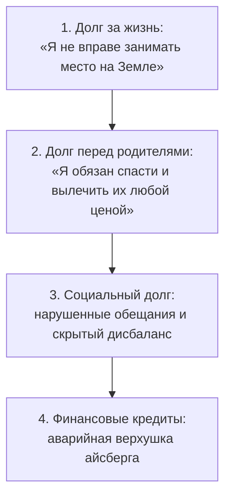

# Долги: почему мы арендуем родительскую опору у банков

— Я зарабатываю больше полумиллиона в месяц, — голос Артёма дрожал от сдерживаемого бешенства и бессилия. — И всё до последней копейки уходит на проценты. Карты, рассрочки, займы у партнёров. Вечный, непрекращающийся минус. Стоит мне закрыть один кредит или получить крупную премию — в ту же неделю клинит двигатель в машине, сгорает рабочий сервер или налоговая блокирует счета. Это какая-то проклятая карусель!

Он говорил лихорадочно, на коротких рваных выдохах, нервно теребя ремешок часов. Под его запавшими глазами темнели синяки от хронической бессонницы.

— Какую задачу в твоей жизни на самом деле решает этот долг?

— Никакую! — Артём сорвался на крик, и на его бледной шее вздулись вены. — Он душит меня! Каждую ночь в четыре утра я просыпаюсь в липком ледяном поту, с комом в горле, хватаю телефон и в темноте пересчитываю минимальные платежи на калькуляторе. Какая тут может быть польза?!

— Очень точная. Пока этот ком в горле держит тебя за горло — твоя психика воспроизводит детский алгоритм выживания. Долг занял священное, но пустующее место за твоей спиной. Он имитирует суровое, карающее присутствие взрослого, которого тебя лишили в детстве.

В комнате повисла тишина. За окном шелестел кондиционер. Артём замер, не решаясь вздохнуть. Ком в горле, о котором он только что кричал, проявился как осязаемый, раскалённый шар.

Хроническая долговая яма почти никогда не бывает следствием глупости или неумения вести бюджет. Долг — это психологический балласт. Тяжёлый чугунный якорь, который человек бессознательно вешает себе на шею, чтобы не провалиться в ледяную пустоту за спиной или заглушить жгучую вину перед своей бедной семьёй.

Долг безжалостно давит на плечи. Но пока он давит — у тебя есть иллюзия опоры. Тебе кажется: ты заземлён, ты под присмотром, кто-то большой и грозный непрерывно следит за каждым твоим шагом.

---

## Четыре глубинных уровня долговой воронки

Внешний мир видит только верхний слой — сухие банковские выписки и графики платежей. Но жизненную энергию выкачивают куда более глубокие подземные тектонические разломы.

### 1. Долг за право дышать
Самый глубокий и разрушительный уровень. Человек бессознательно чувствует себя вечным преступником, случайно родившимся на свет: «Мама чуть не умерла в родах», «Из-за меня распалась семья», «Родители положили молодость на моё воспитание». В ответ психика саботирует любой личный успех и здоровье, выплачивая невидимую дань годами собственной жизни.

### 2. Долг перед родителями
Попытка вернуть долг за подаренную жизнь тем, кто её дал. Но этот долг невозможно вернуть назад родителям — жизненный поток течёт только вперёд: к твоим собственным детям, книгам, проектам и ученикам. Когда взрослый ребёнок пытается финансово «удочерить» свою мать или оплачивает долги отца ценой своего будущего, он оформляет ипотеку с бесконечной процентной ставкой.

### 3. Социальный дисбаланс
Забытые долги старым друзьям, уклонение от налогов, использование чужого труда за копейки или привычка брать ценные знания «на халяву». Каждый такой неоплаченный счёт остаётся открытой брешью в твоём энергообмене, через которую утекает спокойствие.

### 4. Финансовая кредитная петля
Микрозаймы, овердрафты и потребительские кредиты на статусную мишуру. Это лишь следствие разрывов на трёх нижних этажах. Пытаться закрыть финансовые дыры одной лишь силой воли и экономией на еде — сизифов труд. Система мгновенно создаст новую внезапную поломку, болезнь или судебный иск, чтобы вернуть привычное фоновое давление.

---

> [!NOTE]
> ## Когнитивный налог дефицита: нейробиология долгового туннеля
>
> Профессора Сендхил Муллайнатан из Гарварда и Эльдар Шафир из Принстона экспериментально описали феномен **когнитивного налога дефицита** (bandwidth tax). Постоянный стресс от нехватки денег и долгового прессинга сужает фокус внимания человека в узкий, панический тоннель.
>
> Миндалевидное тело (amygdala) непрерывно бомбардирует нервную систему сигналами смертельной опасности. В результате префронтальная кора, отвечающая за самоконтроль и долгосрочные стратегии, теряет до 14 пунктов подвижного интеллекта — человек буквально глупеет на фоне стресса. Рабочая память перегружена паническими расчётами выживания: «Чем заплатить через пять дней?». Человек совершает новые кабальные займы просто для того, чтобы на несколько часов снять физический спазм в груди.
>
> В программировании создатель концепции wiki Уорд Каннингем описал схожее явление — **технический долг**: попытка замазать сложную архитектурную дыру кривым костылём даёт сиюминутное облегчение, но начисляет огромные проценты на каждый последующий релиз. Без генерального исцеления ядра система неизбежно рушится.

---

## Притча: кровные деньги и ловушка спасателя

> [!TIP]
> **Притча**  
> Финансовый директор благотворительного фонда годами тайно переводил доли процентов с донорских счетов на покупку экспериментальных зарубежных лекарств для безнадёжно больных детей — то, чего не разрешали строгие государственные медицинские регламенты.
>
> **Голос Расчёта:** «Детские жизни спасены. Сухая буква закона ничего не значит перед лицом детской смерти».  
> **Голос Закона:** «Это уголовное преступление и хищение. Система требует абсолютной прозрачности. Вор должен понести наказание».  
> **Голос Сердца:** «Он действовал из святого сострадания. Защити благородного человека, спасающего слабых».  
>
> *Вопрос на зрелость:* Что выбрать — формальную безупречность перед законом или тайный грех ради спасения умирающего?

> [!NOTE]
> **Разбор притчи**  
> «Благородное преступление» — коварная ловушка раздутого духовного эго.  
> Когда человек самовольно перекраивает чужие финансовые потоки, он ставит себя выше системы и объявляет себя единственным праведным судьёй. В этот миг рождается скрытый системный долг: чистый баланс обмена сломан.  
> Истинная сила заключается не в тайном воровстве и не в бюрократическом равнодушии, а в смелости открыто заявить о дефиците перед советом фонда и создать прозрачный, легальный механизм помощи. Тайный долг всегда взимает со спасателя страшную плату — его собственным здоровьем, семьёй и репутацией.

---

## Терапевтическая сессия: как Артём перестал арендовать отца у банка

Артём стоял посреди кабинета, уронив плечи. Его тело казалось неестественно прямым, будто внутри был вбит лом, но эта прямота держалась на запредельном напряжении мышц спины.

— Давай проведём пространственную диагностику, — предложил я. — Выбери в комнате любой предмет, который будет символизировать твой «Банковский Долг». И поставь его туда, где твоё тело сильнее всего ощущает его присутствие.

Артём без малейших колебаний подошёл к тяжёлому кожаному пуфу, стоящему в углу, и придвинул его вплотную к своей спине. Он упёрся лопатками в плотную кожу. Ровно туда, где у человека, чувствующего родительскую поддержку, ощущается тёплая и надёжная отцовская ладонь.

— Обрати внимание, — сказал я. — Ты буквально держишь свой позвоночник за счёт кредитов. Долг подпирает тебя сзади. А теперь сделай один медленный шаг вперёд. Отойди от пуфа на метр. Повернись ко мне. Что происходит в теле?

Артём шагнул вперёд. Закрыл глаза. В ту же секунду его лицо приобрело мертвенно-серый оттенок. Дыхание перехватило.

— Ужас… — выдохнул он хриплым, сдавленным шёпотом. — Сзади… чёрная, ледяная пропасть. Земля уходит из-под ног. Я падаю спиной в пустоту. Лопатки свело ледяным судорогой.

— Твой отец ушёл из семьи, когда тебе было пять лет. За твоей спиной осталась зияющая дыра. Никто не прикрывал твой тыл. Никто не сказал: «Сынок, я с тобой, ты в безопасности». Детская психика не выдержала этого падения. И взрослый Артём нашёл гениальный, но кабальный выход: он взвалил себе на плечи неподъёмный Долг. Пока на тебе висят кредиты, ты не брошен. У тебя есть «Отец-Банк». Да, он строгий, безжалостный, он начисляет пени и шлёт коллекторов. Но он есть! Он стоит за спиной и держит тебя в тонусе.

По щекам Артёма покатились крупные, горячие слёзы. Его широкие плечи мелко задрожали.

— Повернись к этому пуфу, — тихо произнёс я. — Убери с него вывеску банка. Поставь на это место живого, реального отца — того растерянного, слабого мужчину, который тридцать лет назад собрал чемодан и хлопнул дверью. Посмотри ему прямо в глаза. И скажи ему вслух:

> *«Папа. Ты ушёл и не смог дать мне мужской защиты и опоры.  
> Это была твоя слабость, твоя трагедия и твой выбор. Я с уважением оставляю их в твоей судьбе.  
> Я снимаю твоё лицо с кредитных договоров и банковских карт. Мои долги — это не ты.  
> Я возвращаю тебе твоё место позади меня — пусть даже оно останется навсегда пустым.  
> Я соглашаюсь с этим холодным сквозняком за спиной.  
> Я уже взрослый мужчина. Я выдержу эту пустоту сам.  
> Мне больше не нужно покупать твоё присутствие в рассрочку у чужих людей».*

Вдоль позвоночника Артёма прокатилась мощная, неуправляемая судорожная дрожь — это разжимались глубокие паравертебральные мышцы, которые тридцать лет были скованы страхом падения в бездну. А затем по его спине разлилась горячая, пульсирующая волна тепла. Он выпрямился — на этот раз опираясь на собственные стопы и таз.

За следующие восемь месяцев Артём закрыл больше семидесяти процентов своих кредитных обязательств. Без унизительной экономии на спичках. Просто у его психики исчезла бессознательная потребность платить банку за иллюзию отцовского плеча.

Он до сих пор вспоминает вечер, когда внёс последний платёж по самой тяжёлой кредитке. Была пятница. Рука по многолетней привычке потянулась к телефону — проверить остаток лимита, как наркоман судорожно проверяет карман в поисках дозы. Он остановил палец. Сел на диван и прижался спиной к голой штукатурке стены.

За спиной не было грозного надзирателя. Там была просто стена. Внутри на мгновение поднялась паническая волна: «Возьми новый кредит, иначе ты упадёшь!» Но он не побежал к компьютеру. Он остался сидеть. Дышал медленно и глубоко, пропуская тревогу сквозь грудь прямо в пол.

К полуночи бездна за спиной растаяла. Пустота перестала быть врагом. Она превратилась в чистое, просторное пространство его собственной взрослой свободы.

---

## Практика: честный аудит долгового узла

Сядь на устойчивый стул. Поставь стопы параллельно друг другу на пол. Расправь плечи, сделай три глубоких вдоха через нос и длинных выдоха через приоткрытый рот. Возьми чистый лист бумаги и выпиши точную сумму всех своих текущих финансовых обязательств до рубля. Не отводи взгляд.

1. **Телесная локализация.** Представь эту сумму как осязаемый физический груз перед собой. Где в твоём теле отзывается эта цифра?  
   - Камень в солнечном сплетении?  
   - Сжатые до боли челюсти?  
   - Холодная тяжесть на плечах?  
   Положи тёплую ладонь прямо на это место.
2. **Встреча с правдой.** Задай себе честный вопрос:  
   *«Если бы завтра утром по волшебству все мои долги обнулились до копейки — с какой звенящей внутренней пустотой я останусь один на один? Какую детскую дыру в безопасности закрывает этот гнёт?»*  
   Не придумывай логических ответов — жди отклика тела.
3. **Разделение контуров:**  
   Сделай глубокий вдох и произнеси вслух:
   > «Я отделяю свою безопасность от кредитных обязательств.  
   > Я возвращаю тревоги, нищету и страхи моих предков в их историческое время.  
   > Я признаю свои внутренние дефициты и больше не закрываю их финансовой кабалой.  
   > Мой обмен с миром отныне честен, прозрачен и равновесен».
4. **Первый взрослый шаг.** Почувствуй плотную опору седалищных костей на стуле и устойчивость стоп. Сделай глубокий выдох животом. Составь трезвый, реалистичный план погашения долгов — без самобичевания и без иллюзий «чудесного обогащения за один день».

---

> [!IMPORTANT]
> **Главная мысль главы**  
> Хронический долг — это не финансовая безграмотность, а аренда родительской фигуры ценой растраты собственной жизни. Деньги возвращаются в баланс только тогда, когда человек находит смелость опереться на собственные ноги и выдержать сквозняк за спиной.

---

> [!TIP]
> **Интерактивный помощник**  
> Если тебя годами не отпускает тревога из-за кредитов, долгов или страха остаться без копейки — напиши об этом в диалоговом поле. Мы поможем обнаружить, какую именно фигуру из прошлого замещает этот финансовый пресс в твоей жизни.
