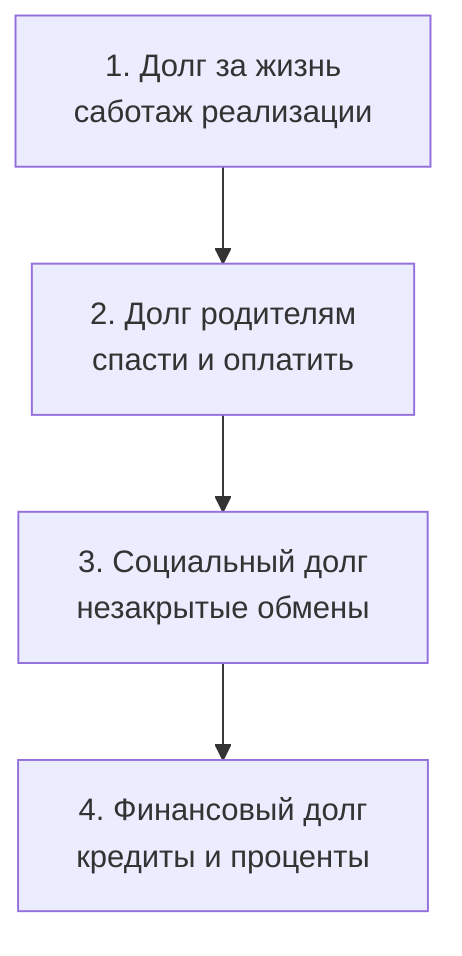

# Долги: аренда чужой опоры

— Я отлично зарабатываю. Всё уходит на проценты. Карты. Рассрочки. Долги перед партнёрами. Вечный минус. Закрою один транш — клинит двигатель, сгорает сервер, налоговая блокирует счёт. Карусель.

Говорил лихорадочно, на коротком выдохе — будто отчитывался перед приставом. Глаза запавшие. Пальцы теребят ремешок часов.

— Какую задачу на самом деле решает этот долг?

— Никакую! — чуть не сорвался. — Он душит! В четыре утра — ледяной пот, ком в горле, в темноте считаю минимальные платежи на калькуляторе! Какая задача?!

— Точная. Пока ком в горле жив — система крутит детский алгоритм выживания на краю. Долг занял вакантное место. Он имитирует тяжёлое, карающее родительское присутствие, которого тебя лишили.

Он замолчал. Дыхание перехватило. За окном гудел кондиционер. Ком, о котором он только что орал, проступил как физический объект.

Хронический долг почти никогда не про нехватку денег. Это балласт. Груз, который психика навешивает сама — чтобы не встретиться с пустотой за спиной или с виной перед неблагополучной семьёй. Долг давит на плечи. Но пока давит — есть гравитация. Иллюзия: ты заземлён. Кто-то большой смотрит. Кто-то надзирает.

---

## Четыре уровня

Снаружи — цифры в банке. Энергию качают слои ниже.



**1. Долг за жизнь.** Самый глубокий. Дар существования получен — реализацию хоронишь. Гул: «не имею права занимать место». Плата — здоровьем и годами.

**2. Долг родителям.** Попытка вернуть плату за жизнь. Жизнь назад источнику не вернуть — только передать дальше: детям, проектам, миру. «Спасаешь» родителей, оплачиваешь их кредиты ценой своего будущего — ипотека с бесконечным процентом.

**3. Социальный долг.** Неоплаченные налоги. Нарушенные контракты. Забытые долги знакомым. Чужую экспертизу — даром. Каждая такая сделка — висящий процесс. Заморозка.

**4. Финансовый долг.** Карты. Микрозаймы. Овердрафты. Поверхностный интерфейс нижних разрывов. Гасить цифры, не трогая контур внизу — сизифов труд: система создаст новую поломку или штраф, чтобы вернуть привычное давление.

---

## Загадка «Кровные деньги»

> [!TIP]
> **Загадка**
> Финансовый директор благотворительного фонда годами тайно перенаправляет доли процентов с донорских счетов на экспериментальные лекарства для безнадёжно больных детей — то, чего не покрывают официальные протоколы.
>
> **Голос Расчёта:** Детские жизни спасены. Буква закона ничто перед смертью.
>
> **Голос Правила:** Это хищение. Нужен аудит. Факт — на свет.
>
> **Голос Души:** Защити соратника. Братство и спасение слабых выше сухой бумаги.
>
> *Вопрос силы:* Что выбрать — безупречность перед законом или совесть перед умирающим ребёнком?

> [!NOTE]
> **Разбор**
> «Благородное преступление» — ловушка эго. Самовольно гоняешь чужие потоки — присваиваешь себе роль судьи над системой. Рождается скрытый долг: прозрачность обмена сломана. Решение не в тайном воровстве и не в цинизме чиновника — в открытом предъявлении дефицита совету фонда и в легальном целевом коридоре. Тайный долг всегда берёт со спасателя плату его собственным разрушением.

---

## Налог дефицита

> [!NOTE]
> Элдар Шафир и Сендхил Муллайнатан измерили «когнитивный налог дефицита»: постоянная нехватка и долговой прессинг сужают внимание в туннель. Миндалина орёт — префронтальная кора теряет до четырнадцати пунктов подвижного интеллекта. Рабочая память занята расчётами выживания. Долгосрочное планирование умирает. Новые кабальные займы — чтобы на секунду снизить тревогу в теле. Уорд Каннингем назвал то же в коде техническим долгом: кривой костыль гасит аварию сейчас и начисляет проценты на каждый следующий релиз. Без рефакторинга ядра серверы жгут мощность на поддержку костылей — до коллапса. Освобождение — не латать дыры. Закрыть брешь внизу.

---

## Сессия. Артём

Артём пришёл с тем, что сам назвал «пожизненной кредитной удавкой». IT-директор. Больше полумиллиона в месяц. На руках после траншей — около тридцати тысяч. Любой скачок дохода синхронно поднимал обязательства. Невидимый контролёр следил, чтобы баланс не превысил студенческий минимум.

Пространственная расстановка:

— Назначь любой предмет фигурой «Долга». Найди телом его место относительно себя.

Не колеблясь схватил тяжёлый кожаный пуф и придвинул вплотную к спине. Лопатками в жёсткую поверхность. Ровно туда, где у укоренённого человека ощущается отец.

— Зафиксируй. Ты опираешься позвоночником на долги. Теперь шаг вперёд. Отойди на метр. Что в теле?

Шагнул. Закрыл глаза. Кожа посерела. Дыхание оборвалось.

— Ужас… — хриплый шёпот. — Чёрная ледяная бездна за спиной. Земля уходит. Лечу вниз головой. Лопатки — лёд.

— Отец ушёл, когда тебе было пять. За спиной пусто. Никто не подхватит. Система не вынесла. Написала костыль: тяжёлый Долг на плечи — иллюзия, что сзади кто-то есть. Большой. Суровый. Пока есть кредиты — ты не один. У тебя есть «Отец-Банк». Он строгий. Контролирует каждый шаг. Шлёт уведомления о платежах. Но он есть. Он за спиной.

Артём стоял. Крупные слёзы. Плечи вздрагивали.

— Развернись к пуфу. Убери банк. Поставь настоящего отца — того слабого человека, который хлопнул дверью тридцать лет назад. В глаза. Вслух:

*«Отец. Ты ушёл и не дал мужской защиты. Это твоя слабость, твоя судьба, твой выбор — оставляю тебе. Снимаю твою фигуру с кредитных договоров. Мои долги — это не ты. Возвращаю тебе место позади меня — пусть даже пустое. Соглашаюсь со сквозняком. Я достаточно взрослый, чтобы выдержать эту пустоту. Мне больше не нужно покупать присутствие отца в рассрочку у банка».*

```status
Связка «кредит = отцовская защита» снята.
Дрожь вдоль позвоночника.
Своя ось возвращается.
```

Мощная неуправляемая дрожь — сброс мышц спины, которые тридцать лет цепенели от страха падения. Потом — ровный жар.

За полгода закрыл большую часть кредитных линий. Без режима нищеты. Просто отпала нужда платить за аренду отцовского присутствия.

Первый вечер без платежа врезался навсегда. Пятница. Рука по привычке потянулась к мобильному банку — проверить лимиты, как зависимый проверяет дозу. Остановил палец. Сел на диван. Лопатками к холодной штукатурке. За спиной не было грозного банка. Была стена. Паника: «Оформи хоть сто тысяч — иначе разобьёшься!» Не сдвинулся. Дышал. Пропускал ледяной холод через диафрагму в стопы. К утру бездна отступила. Пустота перестала быть врагом. Стала чистым местом его свободы — и это всё ещё болело. Просто уже можно было дышать.

---

## Практика: аудит долга

Устойчивый стул. Стопы на полу. Спина прямая. Выпиши сумму всех обязательств. Не отводи взгляд.

1. **Локализация.** Представь сумму как объект в пространстве. Где вес в теле — яремная впадина, плечи, желудок? Ладонь туда.
2. **Пустота.** *«Если завтра все долги обнулятся до копейки — с какой звенящей дырой останусь один на один? Какую детскую дыру в безопасности закрывал этот пресс?»* Жди ответа тела. Не глуши умом.
3. **Формула:**

> «Отделяю безопасность от кредитных договоров. Возвращаю долговые обязательства, вину и страхи предков в их время. Признаю внутреннюю нехватку и перестаю закрывать её кабалой. Мой обмен с миром — прозрачный, равновесный, мой».

4. **Интеграция.** Вдох шире. Диафрагма ниже. Устойчивость в крестце. Первый реальный шаг: трезвая реструктуризация текущих обязательств — без романтики «всё сжечь».

> [!IMPORTANT]
> **Закон главы**
> Кредитный долг часто арендует родительскую фигуру — и держит тебя от встречи с пустотой ценой бесконечной растраты жизни.
