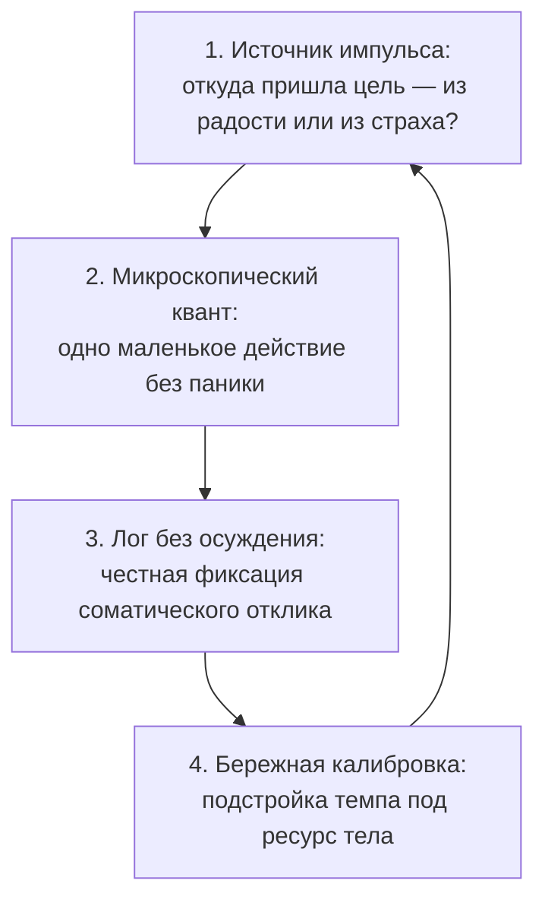

# Цели: почему наши планы разбиваются к пятнице

Каждый из нас хотя бы раз в жизни проживал этот мучительный сценарий.

Наступает долгожданный понедельник. Куплен красивый ежедневник с тиснением, расчерчены аккуратные таблицы в трекере привычек, составлен список грандиозных задач на квартал. Внутри разливается обманчивая волна вдохновения: «Ну всё, с этой недели начинается совершенно другая, осознанная и продуктивная жизнь!»

Но уже к среде внутри поднимается вязкое, непреодолимое сопротивление. Подъём по будильнику превращается в пытку. К полудню пятницы грандиозный список мёртв: тело наотрез отказывается садиться за рабочий стол, голова наливается свинцовой тяжестью, а единственное непреодолимое желание — выключить телефон, задернуть шторы и залезть под одеяло.

А следом накатывает привычная удушливая волна стыда и самобичевания: «У меня нет силы воли. Я ленивый неудачник. Другие строят компании и покоряют вершины, а я не могу выдержать даже пяти дней по расписанию». Человек покупает новый марафон продуктивности, читает книги по тайм-менеджменту и с понедельника снова затягивает гайки.

Но дело здесь вовсе не в слабости характера и не в отсутствии дисциплины.

Когда ты давишь педаль газа в пол, а машина отчаянно буксует на месте — бесполезно хлестать руль ремнём. В твоей психике повреждён сам **контур целеполагания**. Ты наивно полагаешь, что командуешь своими намерениями, но рычаги управления давно приватизированы чужими голосами из твоего далёкого прошлого.

---

## Загадка «Идеальный понедельник»

> [!TIP]
> **Притча-парадокс**  
> Человек покупает дорогой курс по повышению эффективности, расписывает свой день с точностью до пятнадцати минут и с горящими глазами бросается в бой.  
> 
> К середине недели его организм буквально парализует усталость. К концу недели проект заброшен, а выходные сгорают в токсичном чувстве вины и бессилия.
>
> **Голос Расчёта:** «Ему выгодно притворяться слабым. Прокрастинация — это скрытая вторичная выгода, позволяющая безопасно лежать на диване».  
> **Голос Дисциплины:** «Нужно переломить лень через колено. Поставить жесткие штрафы за срыв дедлайнов и заставить себя работать силой воли».  
> **Голос Сердца:** «Это не его истинная цель. Мудрое тело спасает человека от выгорания, отказываясь тащить на себе чужой, мёртвый груз».  
>
> *Вопрос на зрелость:* Почему железная сила воли всегда терпит крах, когда тело объявляет забастовку?

> [!NOTE]
> **Разбор парадокса**  
> Сила воли префронтальной коры — это крошечный карманный фонарик на слабой батарейке. А древняя вегетативная нервная система и лимбический мозг управляют мощнейшей электростанцией всего организма. Главная задача тела — не ваши социальные медали, а физическое выживание.  
>
> Если цель продиктована детской жаждой доказать родителям свою ценность, страхом отвержения или попыткой искупить вину перед семьёй, нервная система считывает такую сверхнагрузку как смертоносный яд.  
> Саботаж — это не дефект характера. Это аварийный предохранитель. Он выбивает пробки в щитке ровно за секунду до того, как тонкие провода вашей психики сгорят дотла.

---

> [!NOTE]
> ## Почему воля истощается к среде: нейробиология ритма
>
> Выдающийся социальный психолог Рой Баумейстер экспериментально доказал феномен **истощения эго** (ego depletion). Ресурс произвольного внимания и тормозного контроля в лобных долях мозга ограничен строгим метаболическим лимитом глюкозы и кислорода.  
>
> Когда человек пытается реализовывать навязанную, «чужую» цель, передняя поясная кора вынуждена непрерывно подавлять сигналы поведенческой системы торможения (BIS Джеффри Грея), которая сигналит: «Здесь нет радости! Энергия сливается впустую!». К середине недели запасы дофамина в полосатом теле падают до нуля. Волевой нажим иссякает, и наступает глубокая апатия.
>
> Профессор Нью-Йоркского университета Питер Голлвитцер показал, что абстрактные лозунги («я начну новую жизнь») не работают без соматической привязки к конкретному контексту («если наступает событие X, моё тело делает простое действие Y»).  
> В технике это похоже на диспетчер операционной системы: если запустить тяжелейший фоновый процесс без выделенной памяти, процессор зависает намертво. Срыв в пятницу — это срабатывание защитного сторожевого механизма.

---

## Почему конвейер убивает живое: четыре такта живого ритма

Жёсткие системы планирования создавались во времена индустриальной революции для заводских конвейеров, где рабочий рассматривался как бездушный винтик, не знающий ни усталости, ни детских ран. Пытаться натянуть эти казарменные схемы на живую человеческую душу — верный путь в клинику неврозов.

Вместо насилия над собой нам необходим **живой природный ритм**, состоящий из четырёх последовательных тактов.

### Такт 1. Проверка источника: чей голос звучит в цели?
Прежде чем вносить пункт в ежедневник, произнеси задуманное вслух и прислушайся к телу.  
Если цель действительно твоя — в груди появляется свободный объём, дыхание углубляется, а в ладонях возникает приятное нетерпение.  
Если же в ответ спазмирует горло, каменеет желудок, а плечи ползут к ушам — ты пытаешься обслуживать чужой заказ: заслужить мамино одобрение, утереть нос школьным обидчикам или доказать отцу, что ты не пустое место.

### Такт 2. Микроскопический квант движения
Не пытайся планировать «по два часа английского каждый вечер до конца жизни». Твоя нервная система моментально пугается такого масштаба и заранее парализует мышцы.  
Разреши себе квант: один абзац текста за десять минут. Пять минут разминки. Один звонок клиенту. Телефон в авиарежиме, вкладки браузера закрыты. Десять минут — и честный отдых.

### Такт 3. Наблюдение без чувства вины
Когда сервер даёт сбой, системный администратор не бьёт экран кулаком и не рыдает от стыда. Он открывает системный журнал ошибок и смотрит факты.  
Если ты отложил задачу — не смей называть себя ничтожеством. Запиши в блокнот факты: «Сел за отчёт в 14:00. В ту же секунду сдавило лопатки холодом и мелькнула мысль: начальник решит, что я глуп». Это ценнейшая диагностическая информация, а не повод для наказания.

### Такт 4. Бережная калибровка темпа
Не пытайся ломать себя об колено. Если шаг оказался слишком велик — уполовинь его. Сделай паузу, выпей тёплого травяного чая, перенеси работу на утро, выйди на короткую прогулку. Научись относиться к своей нервной системе как к драгоценному, тонко настроенному инструменту, а не как к рабу на галерах.

---

## История Ларисы: студия дизайна и материнский приговор

Ларисе исполнилось сорок два года. И последние двенадцать лет её жизнь напоминала бег по замкнутому кругу: она отчаянно мечтала открыть собственную студию интерьерного дизайна.

У Ларисы был редкий природный дар: стоило ей зайти в самую унылую, захламлённую комнату, как её внутренний взор мгновенно видел гармонию света, фактуру дерева и чистоту линий. Но каждый раз её начинания разбивались об один и тот же сценарий: она покупала мощный компьютер, чертила первые эскизы, открывала сайт для регистрации ИП — и в панике захлопывала крышку ноутбука, обливаясь ледяным потом.

На первой сессии я попросил её встать и произнести вслух простую фразу: «Я открываю свою собственную студию».

Слова застряли у неё в горле, будто колючая проволока. Грудь свело спазмом, подбородок задрожал:

— Перед глазами сразу всплывает лицо мамы… — прошептала Лариса. — Её презрительный прищур и слова, которые она повторяла всё моё детство: «Ну давай, попробуй, опозорься на весь город! Спусти последние копейки, а потом приползай ко мне на коленях просить на хлеб».

Валентина Андреевна, мать Ларисы, звонила ей каждое воскресенье. Она никогда не устраивала шумных истерик. Она наносила удары куда более изощрённо — ядовитой жалостью. Мать хвалила Ларису исключительно тогда, когда та приносила себя в жертву: «Какая ты у меня заботливая, безотказная. Не то что эти бессовестные карьеристки, которые бросают матерей ради наживы».

В детской прошивке Ларисы закрепилась железная связка:  
*«Мой успех и радость означают предательство мамы, которая всю жизнь страдала и надрывалась на трёх работах. Иметь свои деньги и славу — значит быть бессердечной неблагодарной тварью».*  
Тело Ларисы блокировало любой запуск, спасая её от ужаса быть отвергнутой матерью.

---

Переломный момент наступил во вторник. Лариса выделила себе ровно два утренних часа на верстку портфолио. Отключила мессенджеры, налила кофе.

В 11:15 раздался резкий телефонный звонок. Мать:

— Ларочка, ты же дома? Срочно всё бросай. У тёти Любы опять подскочило давление. Надо съездить на другой конец города за редкими каплями, а потом заехать ко мне на дачу и полить рассаду в теплице…

Лариса почувствовала, как её горло перехватывает привычный спазм повиновения. Но на этот раз она сделала медленный выдох, уперлась пятками в пол и тихо, но отчетливо произнесла:

— Мама, я не смогу поехать. У меня рабочий блок. Я верстаю эскизы для запуска своей студии.

В трубке повисла тяжелая, леденящая пауза. А затем раздался тихий, ядовитый вздох Валентины Андреевны:

— Какая студия в сорок два года, господи помилуй? Старые больные люди задыхаются без лекарств, а ты всё витаешь в облаках и тешишь своё самолюбие. Я не знала, что вырастила такую черствую эгоистку.

Раздались короткие гудки.

Руки Ларисы тряслись мелкой дрожью. В желудке разлилась горькая желчь. К горлу подступила удушливая детская тошнота: всё бросить, вызвать такси, мчаться через весь город, упасть перед матерью на колени и заслужить её прощающий взгляд.

Но Лариса осталась сидеть на стуле.

Она положила ладонь на солнечное сплетение. Начала глубоко, размеренно дышать. Слёзы градом капали на чертёжные листы и клавиатуру, но её пальцы продолжали медленно выводить контуры будущих комнат. На дачу она не поехала.

Мать объявила жестокую телефонную забастовку на три долгие недели. По ночам Ларису накрывали кошмары, горели скулы, казалось, что земля уходит из-под ног. Но её взрослая граница устояла.

На следующей расстановочной сессии Лариса развернулась к мысленному образу матери:

> *«Мама. Я всем сердцем уважаю твою трудную судьбу, твои лишения и твою тревогу.  
> Я навсегда остаюсь твоей любящей дочерью.  
> Но мой талант, моя студия и моё право на радость — это не бунт против тебя. Это продолжение той жизни, которую ты мне дала.  
> Я больше не буду ампутировать свой масштаб и притворяться нищей неудачницей, чтобы доказать тебе преданность.  
> Я разрешаю себе созидать и сиять».*

В этот миг диафрагма Ларисы дрогнула, из груди вырвался глубокий, свободный всхлип облегчения. Тяжелейший зажим в плечах, который она носила тридцать лет, растаял.

Спустя месяц мать позвонила первой. Голос Валентины Андреевны звучал непривычно сдержанно:  
— Лариса… Ну как продвигаются твои чертежи?  
Лариса ответила спокойно, без торжества и без заискивания:  
— Двигаюсь, мама. Завтра сдаю первый авторский проект.  
И в её голосе звенела спокойная стать взрослого, свободного мастера.

---

## Практика: живой ритм вместо насилия над собой

Выдели три дня на освоение экологичного рабочего цикла:

1. **Диагностика импульса.** Возьми задачу, которую ты откладываешь неделями. Произнеси вслух: *«Я хочу сделать это для того, чтобы…»* Прислушайся к соматическому эху: если в теле возникает легкость и простор — цель твоя. Если каменеют челюсти или сжимается живот — спроси себя: *«Кому я пытаюсь доказать свою нужность этой задачей?»*.
2. **Квант десяти минут.** Запусти таймер ровно на десять минут. Убери телефон в другую комнату. Сделай одно предельно простое действие: напиши один абзац, начерти одну линию, сделай пять приседаний. По звонку таймера немедленно остановись и поблагодари своё тело за работу.
3. **Журнал без осуждения.** Если случился срыв — категорически запрети себе ругательства. Зафиксируй в блокноте сухие факты:  
   - Время и ситуация;  
   - Зона зажима в теле (горло, диафрагма, затылок);  
   - Автоматическая пугающая мысль.
4. **Мягкая настройка.** Отрегулируй нагрузку: сократи время спринта до пяти минут, перенеси встречу, добавь больше сна и тёплой воды. Помни: нервная система расцветает от заботы, а не от ударов хлыста.

---

> [!IMPORTANT]
> **Главная мысль главы**  
> Саботаж планов — это не дефект твоей воли. Это мудрый предохранитель тела, защищающий нервную систему от выгорания, когда навязанные чужие цели сталкиваются с твоим подлинным природным ресурсом.

---

> [!TIP]
> **Интерактивный помощник**  
> Если твои планы регулярно рушатся к середине недели, а самобичевание забирает последние силы — поделись в диалоговом окне своей ситуацией. Мы поможем бережно отделить твои истинные мечты от чужих программ и нащупать твой естественный ритм движения.
