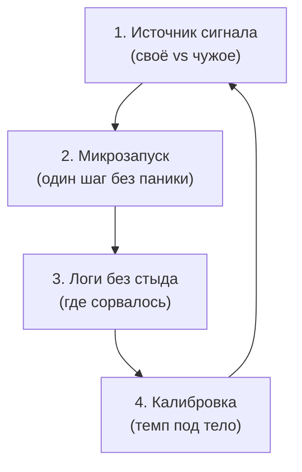

# Цели: почему план срывается к пятнице

Понедельник. Новый трекер. Колонки ровные, цели сверкают. Внутри шепчет: «Вот теперь всё».

К среде — липкое сопротивление. К пятнице список мёртв. Тело не садится за стол. Хочется выключить телефон и залезть под одеяло.

Дальше привычная ловушка: «мне не хватает дисциплины». Новый ежедневник. Курс по продуктивности.

Нет. Характер тут ни при чём. Сломан **контур управления**. Ты жмёшь «старт» — а пульт давно в чужих руках. Голоса из детства. Они до сих пор решают, что тебе можно хотеть.

---

## Загадка «Идеальный понедельник»

> [!TIP]
> **Загадка**
> Человек покупает курс по тайм-менеджменту, расписывает квартал по минутам и рвётся в бой. К среде тело отторгает работу. К пятнице всё стоит. Выходные сгорают в стыде. **Голос Расчёта:** «Ему выгодно оставаться беспомощным — так он экономит силы». **Голос Правила:** «Надо переломить себя и наказывать за прокрастинацию». **Голос Души:** «Это не его цель. Тело отказывается тащить чужой файл».
> *Вопрос силы:* Почему воля бессильна, когда тело саботирует?

> [!NOTE]
> **Ответ живого ритма**
> Воля коры — короткий импульс. Контур безопасности тела смотрит дальше: выжить. Если цель из вины перед семьёй, страха отвержения или жажды доказать свою ценность — лимбика читает задачу как опасный паразит. Саботаж — не лень. Это предохранитель. Он гасит процесс, пока ты не сгоришь.

---

## Почему силы кончаются к среде

> [!NOTE]
> **Истощение эго и планировщик тела**
> Рой Баумейстер показал: исполнительный контроль коры сидит на жёстком лимите глюкозы и кислорода. Когда цель чужая — интроецированная — передняя поясная кора всё время давит систему торможения Грея (BIS), которая орёт: «смысла нет, не трать энергию». К середине недели дофамин в стриатуме падает. Воля гаснет. Питер Голлвитцер доказал: абстрактное «я хочу» рушится без телесной связки — *если X в месте Y, делаю шаг Z*. В архитектуре ОС это диспетчер задач: тяжёлый поток без ресурса вешает всё (priority inversion, deadlock). Watchdog убивает зависшее, чтобы процессор не сгорел. Срыв пятницы в ROOT — тот же сторожевой таймер. Только живой.

---

## Почему жёсткие схемы убивают живое

Жёсткое планирование придумано для конвейера: исполнитель без страха, стыда и усталости. На психику с незакрытыми дырами такие шаблоны не встают. Отказ на первом витке.

Нужен не конвейер. Нужен **живой цикл** из четырёх тактов.

**Такт 1: Чьё это.** До трекера спроси тело. Произнеси цель вслух. В груди объём, дыхание глубокое, спина упругая — твоё. Ком в горле, камень в животе, плечи к ушам — чужой заказ: заслужить любовь, доказать, откупиться от вины.

**Такт 2: Один квант.** Не «два часа каждый день до конца жизни». Материнка пугается такой шины и гасит всё заранее. Один абзац за десять минут. Пять приседаний. Телефон в авиарежим. Вкладки закрыты.

**Такт 3: Лог, не приговор.** Когда сервер падает, инженер не бьёт монитор. Он читает syslog. Срыв — данные. Запиши: «Отложила трижды. При старте — холод под лопатками и мысль: меня высмеют». Это золото.

**Такт 4: Подкрути параметры.** Не ломай волю. Уполовинь шаг. Сдвинь слот. Убери раздражитель. Синхронизируй темп с батареей тела — не с чужой лентой.

Спазм при озвучивании цели — маркер чужого процесса. Срыв спринта — лог ошибки. Стереть его из стыда — гарантировать вечный рестарт того же бага.

---

## История Ларисы

Ларисе сорок два. Двенадцать лет она пыталась открыть студию интерьерного дизайна. Вкус у неё редкий: глянет на захламлённую комнату — и уже видит свет и объём. Цикл один и тот же: купила станцию, начертила эскизы, открыла файл регистрации — и захлопнула ноутбук от ужаса.

На консультации произнесла вслух: «Я открываю свою студию». Слова застряли колючей проволокой. Грудь сдавило. На внутреннем экране — лицо матери: «Ну давай, опозорься на весь город. Спусти последние копейки и вернись на коленях».

Валентина Андреевна звонила по воскресеньям. Скандалов не устраивала. Хвалила только тогда, когда Лариса жертвовала собой: «Какая ты самоотверженная. Не то что эти карьеристки».

В прошивке закрепилось: *свой успех = предательство матери, всю жизнь положившей на тяжёлый быт*. Тело блокировало любой запуск, который выводил её из роли «хорошей страдающей девочки».

Во вторник она поставила два утренних часа на портфолио. В 11:15 зазвонил телефон:

— Ларочка, ты же дома? Срочно: отвези тёте Любе лекарства и полей рассаду, у неё опять давление…

— Мама, не могу. У меня рабочий блок. Я запускаю студию.

Ледяная пауза. Тихий ядовитый вздох:

— Какая студия в сорок два? Пожилые задыхаются без помощи — а ты в облаках. Не знала, что вырастила эгоистку.

Звонок оборвался. Руки тряслись. В желудке горечь. К горлу подкатила детская тошнота: захлопни крышку, сорвись на вокзал, заслужи прощение.

Она осталась. Вжалась стопами в паркет. Ладонь на диафрагму. Медленный выдох. Слёзы на клавишах — пальцы чертили разрезы стен. На дачу она не поехала.

Мать объявила телефонную блокаду на две недели. По ночам горели скулы. Снились похороны и брошенные дома. Граница устояла.

На сессии Лариса развернулась к образу матери:

*«Мама. Я уважаю твою судьбу, твои лишения и твою тревогу. Я навсегда твоя дочь. Но студия, талант и моя реализация — не вызов тебе. Это плоды моей жизни. Я больше не ампутирую свой масштаб, чтобы доказать верность. Я разрешаю себе созидать».*

Диафрагма дрогнула. Воздух вошёл свободно. Спазм в плечах, который копился десятилетиями, отпустил.

Через месяц мать позвонила сама. Настороженно: «Как… твои чертежи?» Лариса ответила ровно, без заискивания: «Двигаюсь. Сдаю первый объект». В голосе не было вызова. Была плотность взрослого мастера.

---

## Практика: живой цикл

Три дня. Один рабочий цикл без насилия над собой:

1. **Чей сигнал.** Возьми задачу, которую месяцами откладываешь. Вслух: *«Я делаю это ради того, чтобы…»* Слушай тело: простор в лёгких или сжатие в челюсти и желудке? Есть спазм — спроси, кому ты это доказываешь.
2. **Десять минут.** Таймер. Телефон за дверью. Одно действие: строка кода, абзац, один чертёж.
3. **Лог без критики.** Сорвалось — не ругай себя. В блокнот: время, зона спазма (шея, грудь, живот), мысль, давление от 1 до 10.
4. **Калибровка.** Пять минут вместо десяти. Тёплое питьё. Другая поза. Обращайся с нервной системой как с точным прибором, а не как с врагом.

> [!IMPORTANT]
> **Закон главы**
> Срыв плана — не дефект воли. Это лог ошибки: чужая директива столкнулась с реальным ресурсом тела.
