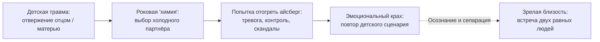

# Отношения: почему мы стучимся к родителям через любимых

— Три мужчины подряд — и каждый раз один и тот же адский сценарий, — с горькой усмешкой говорила Марина, судорожно заламывая пальцы. — Сначала бурная страсть, охапки роз, клятвы в вечной любви, поездки к морю. А ровно через полгода — глухая стена, ледяное молчание и внезапный побег. Мне просто фатально не везёт. Видимо, на мне какой-то родовое проклятие или венец безбрачия.

— А как у тебя было с отцом?

Марина раздражённо вскинула подбородок:

— При чём здесь вообще отец? Он хлопнул дверью и ушёл к другой женщине, когда мне едва исполнилось восемь лет. В детстве он только прятался за газетами и никогда не смотрел в мою сторону. Я давно вычеркнула его из памяти и не вспоминаю годами.

— А когда рядом с тобой оказывается по-настоящему надёжный, открытый, заботливый мужчина — что происходит в твоём теле?

Марина поморщилась, словно от зубной боли:

— Смертная тоска. Он кажется мне пресным, душным, невыносимо предсказуемым. Между нами нет искры! А вот если мужчина смотрит сквозь меня, пропадает на трое суток без объяснений, если его надо отвоёвывать у всего мира — о, тогда мой пульс подскакивает до ста сорока, в коленях дрожь, дыхание перехватывает, и весь мир сужается в одну точку!

Вот и вся разгадка так называемой «роковой любви».

Наша нервная система с пугающей математической точностью сканирует окружающих и безошибочно выбирает именно тех людей, с которыми можно **заново проиграть неразрешённую детскую травму**. Прямой доступ к родителю давно заблокирован болью — и тогда наш партнёр превращается в неосознанного посредника. В живой экран. Через мужа или жену мы годами отчаянно колотим кулаками в запертую родительскую дверь, надеясь наконец вымолить любовь там, где её никогда не было.

---

## Стук в заколоченную дверь детства

Когда сепарация от родителей оборвалась или прошла через насилие, психика не может успокоиться. Она строит обходной маршрут.

Детский вопль: *«Посмотри на меня! Обними меня! Скажи, что я нужна тебе!»* изначально предназначался холодной матери или ушедшему отцу. Но во взрослой жизни этот отчаянный счёт предъявляется живому человеку рядом — мужу, жене или любовнику.

Мы находим свои «мишени» с поразительной точностью:
- Дочь эмоционально отсутствующего, замороженного отца выходит замуж за трудоголика-айсберга и следующие двадцать лет бьётся в кровь о его глухую эмоциональную стену.
- Сын властной, вечно недовольной матери женится на требовательной домашней судье — чтобы в ежедневных изматывающих скандалах доказывать своё право быть мужчиной.

Но в этой схеме заложена неизбежная трагедия: у твоего партнёра физически нет ключей от твоего детства. Он — совершенно отдельный человек со своими собственными травмами, дефицитами и страхами. Он не может стать для тебя «идеальной мамой» или «любящим отцом». Рано или поздно оба партнёра выгорают дотла, а дом превращается в полигон бесконечных упрёков.

---

---

> [!TIP]
> **Притча-парадокс о «холодной искре»**  
> Перед женщиной появляются два поклонника.  
> Первый — внимательный, заботливый, надёжный. Рядом с ним тепло и спокойно, но её ум кричит: «Он скучный, между нами нет никакой химии!»  
> Второй — эмоционально нестабилен, отвечает на звонки через раз, полон тайн и насмешек. Рядом с ним сердце выпрыгивает из груди, а ладони становятся влажными: «Вот она, настоящая, судьбоносная страсть!»
>
> **Голос Расчёта:** «Классическая сцепка тревожной и избегающей привязанности. Психоанализ описал это сто лет назад».  
> **Голос Романтики:** «Сердцу не прикажешь, любовь должна обжигать огнём».  
> **Голос Души:** «Её нервная система узнала знакомый с пелёнок холод отвержения и приняла детскую панику за любовь».  
>
> *Вопрос на зрелость:* Почему человеческое тело склонно путать смертельную тревогу с романтическим экстазом?

> [!NOTE]
> **Разбор притчи: биохимия любовной западни**  
> То, что в популярной культуре называют «бабочками в животе» и «сногсшибательной искрой», в девяти случаях из десяти является массированным выбросом адреналина и кортизола в ответ на угрозу быть покинутым.  
> Если в родительском доме любовь нужно было вымаливать примерным поведением или терпеть унижения ради капли ласки, состояние покоя и безопасности считывается мозгом как непривычное, подозрительное и смертельно скучное. Холодный партнёр даёт привычный наркотик: непредсказуемое, редкое подкрепление. Всякий раз, когда он снисходит до тёплого взгляда, в мозгу взрывается дофаминовая буря. Это не любовь. Это биохимическая зависимость от эмоционального голода.

---

> [!NOTE]
> ## Теория имаго и нейробиология привязанности
>
> Основоположник терапии имаго Харвилл Хендрикс и создательница эмоционально-фокусированной терапии (EFT) Сью Джонсон экспериментально подтвердили: в подсознании каждого человека запечатлён обобщённый образ значимых взрослых, со всеми их достоинствами и травмирующими дефектами.  
>
> Когда партнёр отдаляется или замыкается в себе, миндалевидное тело взрослого человека запускает примитивную реакцию паники привязанности (attachment panic) — точно такую же, какую испытывает оставленный в тёмной комнате младенец. Рассудок отключается: человек начинает бомбардировать партнёра сотнями сообщений, устраивать допросы и истерики.  
>
> Пытаться вылечить эту боль новыми претензиями — всё равно что тушить костёр бензином. Единственный путь к свободе — осознать, чьё лицо из прошлого наложено на живого партнёра, и снять эту непосильную ношу с любимого человека.

---

## Дисбаланс обмена: когда один отдаёт всё, а второй только берёт

В отношениях существует и второй губительный перекос: нарушение баланса «брать и отдавать».

Нередко один из партнёров берёт на себя роль святого спасателя. Он угадывает любые желания, закрывает чужие долги, готовит, выслушивает, жертвует карьерой и сном. А второй занимает позицию капризного, вечно недовольного потребителя.

Кажется: «Я буду любить его ещё сильнее, окружу ещё большей заботой — и его сердце растает».  
Это опаснейшая иллюзия.

Между взрослыми людьми возможен только **горизонтальный, равноправный обмен**: доброе действие порождает благодарный встречный шаг, укрепляя союз.  
Когда ты бесконечно вливаешь свои ресурсы в человека, который ничего не отдаёт взамен, ты не приближаешь близость — ты разрушаешь её.  
Твоя жертвенность порождает в другом человеке бессознательное чувство вины и унижения. Чтобы спастись от этого груза долга, он начинает обесценивать твои дары, злиться и в конце концов уходит к тому, перед кем он не чувствует себя вечным должником.

---

## Терапевтическая сессия: как Катя вернула мужа из тени отца

Кате исполнился тридцать один год. Главный бухгалтер крупной аудиторской компании: безупречная осанка, строгий костюм, математическая точность формулировок. Её муж Андрей — инженер-конструктор: спокойный, глубокий, преданный мужчина, который искренне берёг семью.

Они прожили вместе четыре года и подошли к краю развода.

— Андрей замечательный человек, — говорила Катя, нервно сжимая платок. — Он никогда не повышает голос, заботится обо мне, помнит все даты. Но рядом с ним я просто медленно умираю от тоски! Мне не хватает воздуха, нет страсти. Меня непреодолимо тянет к токсичным, жёстким, нестабильным мужчинам. Неужели я способна любить только тех, кто вытирает об меня ноги?

— Давай заглянем внутрь твоего тела, — предложил я. — Вспомни самый обычный тихий вечер с Андреем. Вот вы вдвоём дома. Что ты чувствуешь?

Катя прикрыла глаза. Её веки мелко задрожали:

— Позавчера… Он сидел за чертежами за столом, я листала ленту на диване. В комнате стояла полная тишина. И вдруг у меня внутри всё закипело: сердце заколотилось в горле, в животе закружились пресловутые «бабочки». Я смотрела на его спокойный профиль и думала: «Ну почему ты молчишь?! Я заставлю тебя посмотреть на меня, я пробью этот айсберг!»

— Прислушайся к этим «бабочкам» прямо сейчас, Катя. Это нежность и предвкушение счастья? Или это что-то другое?

В комнате повисла долгая, звенящая пауза. Пальцы Кати до побеления впились в подлокотники кресла. Её дыхание стало хриплым и частым:

— Это ужас… — выдохнула она сквозь зубы. — Ледяной, тошнотворный спазм под рёбрами. Меня буквально выворачивает наизнанку. Это чувство… будто меня сейчас выведут на казнь.

— Вот она, правда твоего тела. Твой мозг двадцать лет наклеивал романтическую этикетку «любовная искра» на смертный ужас отвержения. Где ты впервые в жизни испытала этот ледяной ком в животе?

Катя вздрогнула всем телом, и по её щекам брызнули слёзы:

— Мне пять лет. Наша старая хрущёвка, синие зимние сумерки за окном. Отец сидит за кухонным столом, курит вонючие сигареты и читает газету. Я вбегаю на кухню с новым рисунком, прыгаю вокруг него: «Папочка, папочка, посмотри, какую собаку я нарисовала!» А он даже не опускает газету. Сухо цедит сквозь зубы: «Катя, отойди. Не мельтеши перед глазами. Я устал». Пол подо мной проваливается в ледяную бездну. Я чувствую себя абсолютным нулём. Пустым местом.

Она разрыдалась — глубоко, по-детски, горько.

— Побудь с той пятилетней девочкой, Катя. Обними её мысленно. А теперь посмотри на своего отца и скажи ему прямо:

> *«Папа. Мой детский крик о любви и внимании был адресован только тебе.  
> Ты был замороженным, далёким и не смог согреть меня своим теплом. Я с болью признаю это.  
> Я оставляю твой холод тебе. Это твоя судьба, а не моя вина.  
> Я снимаю с Андрея обязанность быть твоей копией.  
> Андрей — это не ты. Он не мой отец. Он не обязан искупать передо мной твоё равнодушие.  
> Я закрываю этот старый туннель войны за любовь».*

На словах «Андрей — это не ты» в груди Кати что-то мягко оборвалось. Она сделала судорожный, глубокий вдох, её окаменевшие плечи опустились, а дыхание впервые за сессию опустилось глубоко в живот.

Вечером дома повторилась та же сцена: тишина, Андрей за рабочим ноутбуком доделывает сложный узел конструкции. Катя отложила телефон. Подошла к нему сзади и тихо положила тёплую ладонь на его напряжённое плечо.

Андрей вздрогнул, повернулся и поднял на неё глаза — не холодные, остекленевшие глаза её отца из детства, а усталые, любящие и живые глаза её мужа:

— Катюша… Прости, меня сегодня на работе завалили срочными правками. Я очень устал. Хочешь, я заварю нам мятный чай с мёдом и мы просто посидим рядом в тишине?

Катя тихо опустилась к нему на колени и уткнулась лицом в его тёплую шею. В её груди было тихо. Не пусто — а глубоко, спокойно и надёжно. Иллюзорная «искра» детской паники умерла. На её месте родилась настоящая человеческая близость.

---

## Практика: возвращение партнёру его собственного лица

Если в твоих отношениях регулярно вспыхивают бури на пустом месте или тебя непреодолимо тянет к эмоционально недоступным людям:

1. **Распознавание триггера.** Зафиксируй момент, когда внутри поднимается бешеная буря обиды или роковая тяга. Что это за чувство на самом деле? Тоска по вниманию? Панический страх быть брошенным? Невыносимость тишины?
2. **Поиск первоисточника.** Задай себе честный вопрос:  
   *«Чьё признание и чью любовь я пытаюсь выбить из этого человека? На кого из моих родителей он похож своей холодностью или претензиями?»*  
   Позволь образу матери или отца ясно проявиться во внутреннем взоре.
3. **Формула разделения ролей:**  
   Положи руку на грудь и произнеси мысленно или вслух:
   > «Дорогой партнёр, я признаю, что долгое время смотрел на тебя сквозь призму своего детского горя.  
   > Я требовал от тебя родительского тепла, которого у тебя физически нет и быть не должно.  
   > Я снимаю с тебя маску моего [отца / матери].  
   > Дорогой [папа / мама], твой холод и неспособность любить принадлежат только тебе. Я с уважением оставляю их в твоём прошлом.  
   > А тебе, мой любимый человек, я возвращаю право быть просто собой — со своими усталостями, ошибками и живым сердцем».
4. **Проверка баланса обмена.** Посмотри трезво на ваш союз:  
   - Не превратился ли ты в вечного благодетеля и спасателя?  
   - Получаешь ли ты равную эмоциональную отдачу на свои усилия?  
   Если в отношениях игра идёт в одни ворота — сделай шаг назад. Останови поток спасательства и дай партнёру пространство сделать встречный шаг.
5. **Телесное закрепление.** Почувствуй тепло в ладонях и свободу в области сердца. Близость — это не удушающий узел, а свободное дыхание двух зрелых людей.

---

> [!IMPORTANT]
> **Главная мысль главы**  
> Пока партнёр служит бессознательным экраном для проекции детских обид на родителей, подлинная любовь невозможна. Сними с любимого человека чужое лицо — и ты впервые встретишься с живым сердцем рядом с собой.

---

> [!TIP]
> **Интерактивный помощник**  
> Если ты снова и снова наступаешь на одни и те же грабли в отношениях, выбирая холодных или ранящих партнёров — опиши свою ситуацию в окне ниже. Мы поможем распутать клубок детских привязанностей и вернуть покой в твоё сердце.
