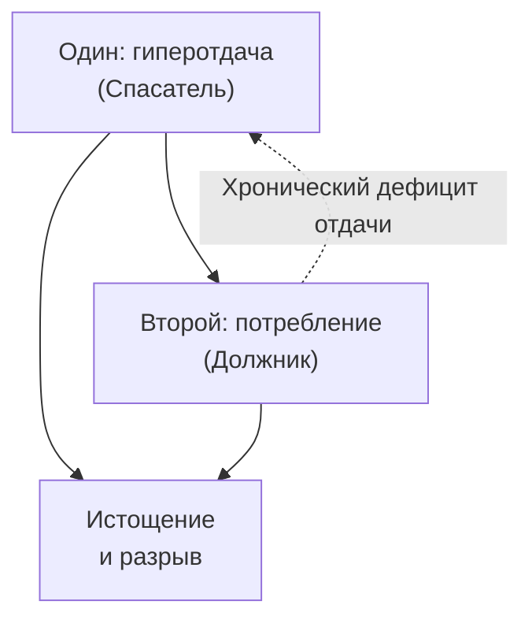
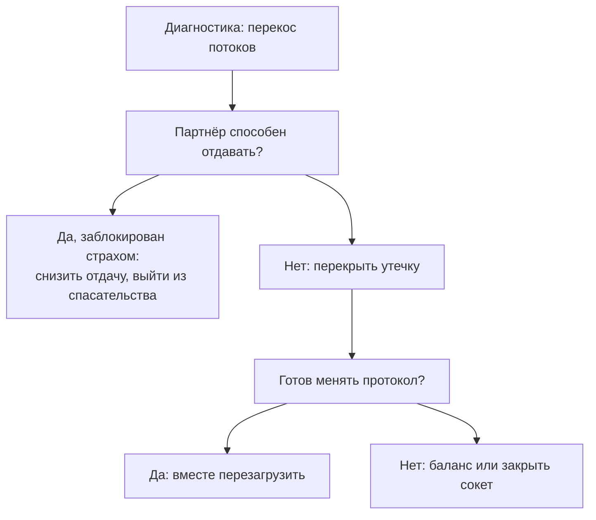

# Отношения: партнёр как прокси

— Три мужчины подряд — и сценарий один. Сначала страсть, клятвы, подарки. Через полгода — стена, молчание, побег. Мне фатально не везёт. Видимо, венец безбрачия.

Она говорила с горькой усмешкой, заламывая пальцы.

— А с отцом как было?

— При чём здесь отец? Он хлопнул дверью, когда мне было восемь. Читал газеты и не смотрел в мою сторону. Я его почти вычеркнула.

— А когда рядом надёжный, открытый, тёплый — что в теле?

— Тоска смертная. Пресный. Скучный. Нет искры. А если смотрит сквозь меня, игнорит по двенадцать часов — пульс под сто сорок, колени дрожат, мир сужается в точку.

Вот и весь романтический мистицизм. Нервная система сканирует поле и выбирает тех, с кем можно **доиграть** детский конфликт с родителем. Прямой канал к нему закрыт болью — и любой партнёр становится посредником. **Прокси.** Через него ты снова и снова стучишься туда, где давно офлайн.

---

## Стук в офлайн-сервер

Сепарация оборвалась — психика не успокаивается. Строит обходной сокет. Запрос «заметь меня, полюби меня, подтверди, что я имею право жить» адресован отцу или матери. А уходит на мужа или жену.

Мы выбираем с жуткой точностью. Дочь эмоционально мёртвого отца выходит за ледяного трудоголика и годами бьётся лбом о его мерзлоту. Сын деспотичной матери связывает жизнь с домашним обвинителем — чтобы в скандалах доказать своё «я».

Трагедия простая: у прокси нет пакета «родительское благословение». Он — отдельный человек. Со своими дырами. Запрос висит в очереди. Пара выгорает. В телах обоих — зажимы.

---

## Загадка «Холодная искра»

> [!TIP]
> **Загадка**
> Два претендента. Первый внимателен, открыт, надёжен — рядом спокойно, но ум орёт: «Скучно, нет искры». Второй холоден, не отвечает сутками, исчезает — сердце колотится, дыхание срывается: «Вот она, настоящая любовь!» **Голос Расчёта:** «Тревожный тип к избегающему. Механика прозрачна». **Голос Правила:** «Сердцу не прикажешь». **Голос Души:** «Нервная система узнала детскую боль отвержения и приняла её за любовь».
> *Вопрос силы:* Почему организм путает тревогу с любовью?

> [!NOTE]
> **Ответ прокси**
> «Безумная химия» на биохимии — адреналин на знакомую угрозу быть покинутым. Безопасность читается как скука: в родительском доме любовь была дефицитом, её вымаливали страданием. Холодный партнёр — повторная попытка взломать родительский узел.

---

## Теория имаго и обратный прокси

> [!NOTE]
> **Имаго, привязанность и reverse proxy**
> Харвилл Хендрикс (теория имаго) и Сью Джонсон (EFT) описали одно и то же: в памяти лежит композит значимых взрослых — первый опыт отвержения. Во взрослом возрасте стриатум и прилежащее ядро дают дофамин не на заботу, а на нерегулярное подкрепление холодного партнёра. Островковая кора читает адреналиновый спазм как «роковую страсть». Партнёр отдаляется — миндалина запускает attachment panic, как у брошенного младенца. Ты бомбардируешь претензиями, пытаясь выбить признание у отсутствующего родителя. В сетях это reverse proxy с loopback: клиент стучится во внешний шлюз, ожидая ответа от хоста, который давно offline. Прокси не выдаёт сертификат доверия. Снова и снова — 504 Gateway Timeout. Выход в ROOT: рвать прокси-туннель. Закрывать невалидные сокеты прошлого.

---

## Перекос обмена: один отдаёт, второй только берёт

Есть и второй сбой. Один заваливает гиперопекой и односторонней работой. Второй — пассивный потребитель.



Бывает наоборот: ты готов принимать — а партнёр только на входе. «Любить сильнее» тут бессмысленно. Сколько ни лей — `204 No Content`.

Между равными обмен горизонтальный: *я тебе — ты мне*.

Если одна сторона заблокирована, твоя готовность брать **не заставляет** другого отдавать. Чем больше льёшь в пустой бак — тем сильнее его давит долг. Или он привыкает брать. В обоих случаях связь гниёт.



Две стратегии, которые гарантируют крах:
* **Наращивать жертву** — укрепляет дисбаланс.
* **Ждать чуда** — держит дырявую магистраль открытой.

Подробнее — в [главе «Дисбаланс обмена»](/25-bug-09-exchange-disbalance).

---

## Сессия. Катя

Кате тридцать один. Главный бухгалтер. Собрана, холодна, математический ум. Муж Андрей — инженер-конструктор: спокойный, чуткий, верный, немногословный. Четыре года брака. На грани развода:

— Андрей потрясающий. Рядом с ним я умираю от тоски. Нет огня. Тянет к резким, жёстким, нестабильным. Неужели я люблю только тех, кто вытирает об меня ноги?

— Закрой глаза. Тихий вечер с Андреем. Он дома. Что в теле?

— Вчера… — веки задрожали. — Он за ноутбуком, я в ленте. Тишина. И вдруг внутри котёл: сердце в горле, «бабочки» в животе. Смотрю на молчаливый профиль: «Вот он, айсберг. Заставлю посмотреть на меня!»

— Эти «бабочки» — нежность или ужас?

Две минуты тишины. Дыхание рваное. Пальцы в подлокотники.

— Ужас… — сквозь зубы. — Ледяной спазм под ложечкой. Меня сейчас стошнит. Как перед расстрелом.

— Точно. Лимбика десятилетиями клеит ярлык «любовная искра» на спазм отвержения. Где впервые этот ком?

Катя содрогнулась:

— Мне пять. Кухня в синих сумерках. Отец за столом, за газетой, курит «Приму». Я бегу с рисунком: «Папочка, посмотри!» Он не опускает газету. «Отойди, Катя. Не мельтеши. Я устал». Пол под ногами — лёд. Я — пустое место.

— Побудь с той девочкой. Скажи отцу вслух:

*«Отец. Мой детский крик о любви был адресован только тебе. Ты был холодным и не смог дать тепла — я признаю это. Я оставляю твою холодность тебе. Снимаю с Андрея обязанность быть твоей копией. Андрей — не ты. Он не мой отец. Я закрываю этот туннель».*

```status
Прокси-маршрут «муж -> отец» аннулирован.
Ложная адреналиновая тревога снята.
Диафрагма отпустила.
```

На фразе «Андрей — это не ты» Катя глубоко вдохнула. Плечи опустились. Дыхание ушло в живот.

Вечером снова тишина. Андрей за чертежами. Катя отложила телефон, положила ладонь на его плечо. Он поднял глаза — не отцовские ледяные, а усталые, живые:

— Катюш, завалили правками. Устал. Хочешь, заварю мяту и просто посидим?

Она села к нему на колени, уткнулась в шею. В груди тихо. Не пусто — тепло. «Искра» умерла. На её месте осталась близость.

---

## Практика: выключить прокси

1. **Цикл.** Опиши паттерн: «партнёры отдаляются», «любовь надо заслуживать», «тянет к манипуляторам».
2. **Источник.** *«Чьё непринятие я пытаюсь преодолеть через эти отношения?»* Позволь всплыть матери или отцу.
3. **Формула закрытия:**

> «Я долго использовал тебя как посредника к [матери / отцу]. Того признания, которое я требую, у тебя физически нет. Я закрываю этот обходной маршрут.
> [Мама / папа], я признаю свою детскую жажду твоей любви и твою неспособность её утолить. Оставляю твой холод тебе. Прекращаю выбивать твоё присутствие из других.
> А тебе, партнёр, возвращаю право быть собой — без теней моего прошлого».

4. **Тело.** Появилось ли пространство между вами? Дышится ли свободно?
5. **Обмен.** Если один льёт, второй только берёт — останови спасательство:

> «Я возвращаю равновесие. Ресурс ходит в обе стороны. Я остаюсь только там, где есть встречное движение».

> [!IMPORTANT]
> **Закон главы**
> Пока партнёр — бессознательный прокси к недоступному родителю, любой запрос о любви уходит в пустоту.
