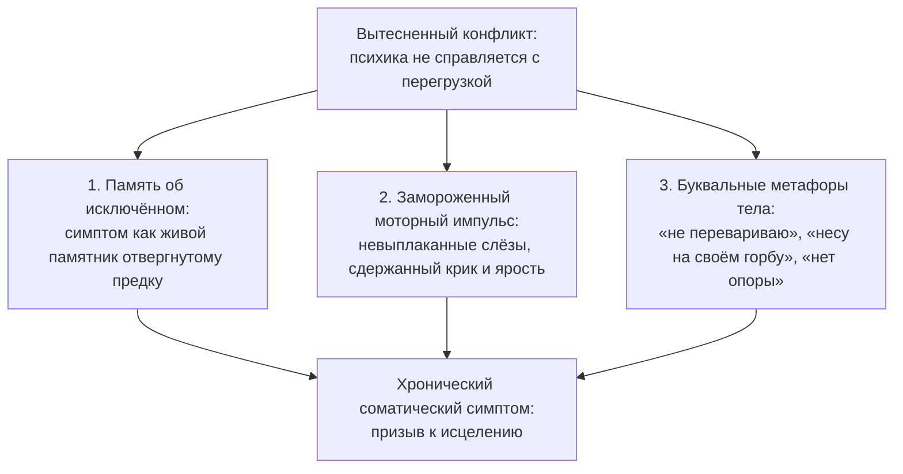

# Тело: оно проживает то, от чего отказалась душа

> [!CAUTION]
> **Главное правило безопасности: сначала врач.**  
> Если у тебя воспалился сустав, ноет желудок, скачет давление или обострилась межпозвоночная грыжа — немедленно обратись к профильному врачу доказательной медицины.  
> Работа с внутренними психологическими причинами и телесными зажимами идёт **строго параллельно** с медицинским лечением. Пытаться лечить физические патологии одними медитациями или психологическими практиками — безответственная халатность. Сначала анализы, снимки и назначения врача. И лишь затем — глубинная расшифровка соматических сигналов.

Наше тело — самый верный, самоотверженный и терпеливый спутник, который сопровождает нас от первого вздоха в родильном зале до последнего удара сердца.

Оно никогда не спорит, не упрекает и не умеет лгать. Когда в жизни происходит нечто невыносимое — предательство близкого, смерть родного человека, унизительное насилие или многолетний токсичный брак, — наш рассудок часто включает спасительную анестезию. Ум услужливо шепчет: «Ничего страшного, я сильный, я справлюсь, проехали, надо жить дальше».

Но боль никуда не исчезает. Если сознание отказывается прожить, оплакать и отпустить травму, её принимает на себя физическое тело.

Оно не мстит тебе болезнью. Оно отчаянно спасает твою психику от распада, материализуя вытесненный аффект в тканях: в мышечных панцирях, в спазмах сосудов, в хронических воспалениях. Орган зажигает тревожный маяк, буквально умоляя: *«Обрати внимание сюда! Здесь заперта твоя живая жизнь!»*

---

> [!NOTE]
> ## Психонейроиммунология: как эмоции становятся биохимией
>
> Революционные исследования профессора Роберта Адера и доктора Кэндис Перт (автора книги «Молекулы эмоций») доказали: нервная, эндокринная и иммунная системы человека объединены в единую информационную сеть. Их общий язык — нейропептиды и цитокины.  
> Рецепторы к «молекулам эмоций» расположены не только в головном мозге, но и на поверхности лейкоцитов, в стенках кровеносных сосудов и в клетках кишечника.
>
> Всемирно известный канадский врач Габор Матэ в фундаментальном труде «Когда тело говорит „нет“» показал: многолетнее подавление гнева, неумение выстраивать личные границы и вечное стремление быть «удобным» для окружающих держат гипоталамо-гипофизарно-надпочечниковую ось в состоянии постоянной боевой тревоги.  
> Хронический избыток кортизола и адреналина спазмирует капилляры, подавляет работу натуральных клеток-киллеров (NK-лимфоцитов) и прокладывает прямую дорогу к аутоиммунным заболеваниям.
>
> Тело кричит о беде задолго до появления клинического диагноза. Исцеление соматического кода восстанавливает внутренний покой, а медицина помогает восстановить физические ткани.

---

## Три пути соматизации: как невидимая боль прорастает в плоти

### 1. Симптом как живой памятник исключённому
Если в семейной истории был отвергнутый, «постыдный» родственник — репрессированный, погибший в тюрьме, покончивший с собой или умерший в нищете от алкоголизма, — семейная система стремится восстановить свою целостность. Младший потомок бессознательно перенимает физические страдания предка, словно говоря своему телу: «Ты вычеркнут памятью семьи, но я буду помнить тебя своей болью».

### 2. Заблокированный мышечный заряд
Любая сильная эмоция — это прежде всего биологическая программа к действию: бежать, защищаться, кричать или плакать в голос. Если ребёнку запрещали проявлять чувства («Не смей реветь!», «Злиться нельзя!»), моторный импульс застывает в тканях.  
Проглоченные детские слёзы десятилетиями душат горло спазмом щитовидной железы. Подавленная ярость крошит эмаль зубов ночным бруксизмом. А непосильная ответственность за несчастную мать цементирует трапециевидные мышцы шеи в сплошной камень.

### 3. Буквальные метафоры нашего подсознания
Древние структуры мозга не понимают иронии — они воспринимают метафоры буквально:
- **«Я не перевариваю эту обстановку / этого начальника»** — тело послушно откликается хроническим гастритом, язвенной болезнью или расстройством кишечника.
- **«Я всё тащу на своём горбу»** — межпозвоночные диски поясницы теряют амортизацию и стираются под непосильной воображаемой ношей.
- **«У меня земля уходит из-под ног»** — суставы коленей и стопы теряют стабильность, отзываясь постоянными вывихами и артрозами.

---

## История Сергея: стальной трос на пояснице

Сергею исполнилось сорок три года. Руководитель крупной межрегиональной транспортной компании. Мужчина несгибаемой, титанической воли: безупречный костюм, тяжелый властный взгляд, абсолютный контроль над сотнями подчиненных и миллионными контрактами.

Но последние два года его жизнь превратилась в ад: острая, простреливающая боль в пояснице отдавала в правую ногу до кончиков пальцев, превращая каждый шаг в пытку. На МРТ светилась крупная грыжа диска L5-S1 с компрессией нервного корешка. Сергей добросовестно прошёл всё: блокады, курсы капельниц, физиотерапию, иглоукалывание. Наступало краткое облегчение — и боль возвращалась с удвоенной силой.

Когда Сергей лёг на кушетку, продольные мышцы его спины вдоль позвоночника напоминали два натянутых стальных троса. Они не проминались под пальцами ни на миллиметр.

— Сергей, вспомни, когда в твоём теле впервые закрепился этот закон: «сгибаться и жаловаться нельзя ни при каких обстоятельствах»?

В комнате повисла тишина. Сергей неотрывно смотрел в окно на кружащиеся хлопья снега, и вдруг его челюсть дрогнула:

— Мне четырнадцать лет. Лютая зима, полузаброшенные гаражи. Мы с отцом вручную разгружали бортовой грузовик с мешками цемента. На улице минус двадцать. Я схватил пятидесятикилограммовый мешок, поскользнулся на наледи, спину прошило дикой молнией, и я рухнул на колени в грязный снег. В глазах потемнело от боли. Я не мог дышать.

Он сглотнул вязкую слюну:

— Отец подошёл, схватил меня за шиворот куртки и встряхнул так, что зубы клацнули: «Вставай, сукин сын! Настоящий мужик не скулит! Если уронишь мешок и размажешь сопли — ты мне больше не сын». Я встал. У меня хрустело в пояснице, искры летели из глаз, но я дотащил этот проклятый мешок до склада. И следующие тридцать лет я больше никогда ни у кого не просил помощи.

— А мама?

— Мама плакала на кухне, хотела вызвать скорую помощь. Отец стукнул кулаком по столу: «Сам выдюжит! Нечего растить слюнтяя и бабника». И я выдюжил. Я стал железным человеком.

Сергей тридцать лет нёс на своей пояснице непосильный чугунный вес: бизнес, долги родственников, проблемы партнёров. Его спина была арматурой, заменяющей любовь. И тело не выдержало усталости металла.

— Положи ладонь на свою поясницу, Сергей. Посмотри на своего строгого, испуганного отца из сегодняшнего дня. И скажи ему вслух то, что четырнадцатилетний мальчик не посмел прокричать в снегу:

> *«Папа. Я услышал твой закон: выживать и терпеть любой ценой.  
> Ты воспитывал во мне стойкость так, как умел сам.  
> Но мне было четырнадцать лет, и мне было невыносимо больно.  
> Я с уважением возвращаю тебе твою беспощадность и твой страх слабости.  
> Моё мужское достоинство больше не измеряется тем, могу ли я сломать свой позвоночник ради чужого одобрения.  
> Мне можно просить о помощи. Мне можно лечить своё тело.  
> Я разрешаю себе быть живым, гибким и бережным к себе».*

Широкая грудная клетка Сергея тяжело содрогнулась. Из его горла вырвался глухой, сдавленный рык, перешедший в громкие, судорожные рыдания. Он закрыл лицо огромными ладонями и плакал — впервые за тридцать долгих лет. Это были слёзы не слабости, а великого освобождения: из его нервной системы выходил вековой парализующий спазм страха быть отвергнутым отцом.

И прямо под руками напряжённые стальные канаты на его спине начали медленно размягчаться, наполняясь живым, горячим притоком крови.

Спустя две недели лечащий невролог удивлённо развёл руками: отёк нервного корешка полностью сошёл, физиотерапия и лечебная гимнастика дали стойкий терапевтический эффект, а боли при ходьбе отступили. Психика перестала использовать тело как таран для доказательства своей силы.

---

## Практика: бережный диалог со своим телом

*(Выполняется строго как дополнение к медицинскому лечению)*

Выбери орган или зону тела, которая беспокоит тебя хроническим напряжением или болью (и которая уже обследована врачом). Сядь удобно, положи на это место тёплую ладонь, закрой глаза и задай своему телу четыре искренних вопроса:

1. **«Что ты несёшь вместо меня?»**  
   Какое чувство заперто в этой ткани? Задавленный гнев? Невыплаканное горе? Чужая вина? Страх будущего?
2. **«О чём кричит твоя метафора?»**  
   Какими словами ты привык описывать эту боль в жизни? «Связали по рукам и ногам», «не продохнуть», «несу на своих плечах весь мир»? Что из этого происходит в твоей повседневности прямо сейчас?
3. **«Память о ком ты хранишь?»**  
   Кто в твоём роду пережил похожую боль, лишения или тяжесть? Кому ты бессознательно сохраняешь верность этим симптомом?
4. **«Какую спасительную паузу ты мне даёшь?»**  
   От чего эта болезнь тебя защищает? Позволяет ли она наконец лечь в постель, отказаться от непосильной работы или попросить близких о нежности?

После честных ответов сделай глубокий вдох и произнеси слова признания:

> «Я слышу тебя, моё дорогое тело. Я наконец вижу твою верность и твоё терпение.  
> Я забираю на себя ответственность за проживание своих чувств.  
> Я снимаю с твоих мышц и органов непосильную ношу прошлого.  
> Я выбираю заботиться о тебе — покоем, теплом, здоровым сном и грамотной помощью врачей.  
> Живи. Дыши. Мы в безопасности».

Почувствуй, как тепло от твоей ладони проникает в глубину тканей, принося облегчение и покой.

---

> [!IMPORTANT]
> **Главная мысль главы**  
> Болезнь — это не враг, которого нужно уничтожить хлыстом воли, а крик тела о заблокированной любви и непрожитой боли. Исцеление соматического узора души и доказательная медицина действуют рука об руку, возвращая человеку полноту жизни.

---

> [!TIP]
> **Интерактивный помощник**  
> Если хронический телесный зажим или психосоматический симптом годами забирает твои силы — поделись своими ощущениями в строке диалога. Мы поможем расшифровать послание твоего тела и бережно подготовить пространство для выздоровления.
