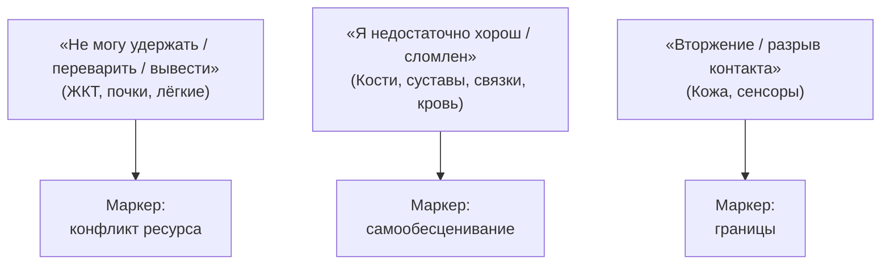

# Тело: оно отрабатывает то, что ты не услышал

> [!CAUTION]
> **Сначала врач.**
> Воспалился сустав, болит желудок, сбоит сердце, обострилась грыжа — иди к профильному врачу. ROOT не заменяет клиническую терапию. Не биоэнергетика. Не «исцеление мыслью». Работа с кодом — **строго параллельно** с лечением. Лечить соматику одной медитацией — халатность. Сначала диагностика и протокол врача. Потом — эта глава.

Зафиксировал? Держи это. Теперь тело — железо. Через него процессор пропускает всё, от чего сознание годами отворачивалось.

Конфликт внутри, который психика не выдерживает или не признаёт, — тело берёт на себя. Не мстит. Не наказывает. Просто исполняет скрипт выживания с высшим приоритетом. Мышца, сосуд, орган загораются маркером. Делают видимым то, что ум прятал.

---

## Психонейроиммунология и стресс железа

> [!NOTE]
> **PNI: эмоция как биохимия**
> Роберт Адер и Кэндис Перт показали: нервная, эндокринная и иммунная системы говорят на одном языке — нейропептиды и цитокины. Рецепторы «молекул эмоций» сидят по всей сосудистой и висцеральной ткани. Тело — распределённый процессор стресса. Габор Матэ: хроническое подавление протеста и отказ от границ держат ось HPA на боевой готовности. Кортизол и катехоламины сжимают микроциркуляцию, душат ткани, бьют по NK-лимфоцитам — дорога к аутоиммунке и дегенерации. Антонио Дамасио (соматические маркеры): через блуждающий нерв тело орёт об угрозе раньше, чем кора успеет подумать. В инженерии это bare metal: игнорируешь перегрузку шины — чип уходит в троттлинг или сгорает. ROOT чинит код управления. Повреждённое железо чинит доказательная медицина.

---

## Как невидимое прорастает в теле

Замороженный разрыв вылезет наружу. Три магистрали:

**1. Орган в память об исключённом.** Семья вычеркнула предка — репрессированного, спившегося, ушедшего из жизни. Младший бессознательно становится живым памятником. Тело ломает контур, имитируя судьбу отвергнутого — чтобы сеть не рассыпалась.

**2. Заблокированный заряд.** Аффект — импульс к действию. Проглоченные слёзы каменеют в глотке. Задавленная ярость годами стискивает челюсти, крошит эмаль во сне. Чужая ответственность цементирует трапеции.

**3. Буквальные фразы.** Тело без чувства юмора. «Не перевариваю этого человека» — дискинезия желчных, гастрит. «Всё тащу на горбу» — диски поясницы.

---

## Топография сигналов

* **«Не могу переварить, вывести, удержать».** ЖКТ, дыхание, почки. Не можешь присвоить доход, территорию, безопасность — или избавиться от отравляющего контакта. Страх потери опоры — почки держат жидкость, отёки. Древний рефлекс: кораблекрушение, консервируй ресурс.
* **«Я не справляюсь, я ущербен».** Суставы, кости, связки, мышцы спины. Глубокое обесценивание. Часто ткань теряет плотность бессимптомно в острой фазе; боль и отёк приходят, когда конфликт завершён и тело чинит. Боль здесь — старт ремонта.
* **«Вторжение или утрата контакта».** Кожа, слизистые, слух, зрение. Дерматит: «не трогайте» или «меня больше не обнимают». Сенсоры тупеют, когда входящее разрушает психику.

---

## Павел: достоинство, не поместившееся в плоть

Павел родился с тяжёлой деформацией скелета. Железо искажено с первого дня: гипертрофия черепа, дисплазия шеи. Для невежественного взгляда — ярмарочный монстр. В викторианской Англии его выставляли в цирке уродцев за пенни.

За костным панцирем — аристократический ум. Шекспир наизусть без ошибки. Органные партии. Макеты готических соборов из шёлка и бумаги — аркбутаны и шпили. Единственный язык, на котором он говорил со вселенной.

Перелом — на закрытом приёме. Дама, поражённая его умом, протянула руку. Коснулась узловатой кисти — и отпрянула с гримасой брезгливости. Одного мига хватило. Мир никогда не признает его равным.

Тайная мечта — поспать как обычные люди. Голова на подушке, во весь рост. Вес черепа грозил асфиксией: двадцать семь лет он спал сидя на табурете, лоб в колени.

В ту ночь он убрал опоры. Лёг на спину. Опустил затылок на подушку.

Утром его нашли лежащим прямо. Лицо безмятежное. Черты разгладились. Он выбрал минуту человеческого достоинства вместо десятилетий унизительного выживания в клетке.

Это не призыв к гибели. Это напоминание: тело отражает боль, когда живую суть лишают права на признание. Слушай сигналы **до** необратимого.

---

## История: стальной трос

Сергей — логистика региона. Сорок три. Железная воля. Два года — стреляющая боль в пояснице, в правую стопу. МРТ: экструзия L5-S1. Блокады, хондропротекторы, ЛФК — облегчение, потом снова. Договорились: смысловой слой — только вместе с лечащим врачом.

Длиннейшие мышцы спины — как стальные тросы.

— Когда впервые прошилось «не сгибаться ни при каких»?

Взгляд застыл на пылинках в луче солнца.

— Мне четырнадцать. Зима, гаражи. С отцом разгружали цемент. Сорвал спину, упал на колени в снег, искры из глаз. Отец сжал плечо до синяка: «Встал. Мужик не ноет. Уронишь мешок — ты мне не сын». Я поднялся. Зубы крошились. Мешок дотащил. Больше не скулил.

— А мать?

— Хотела в больницу, плакала. Отец: «Сам выдюжит, не делай слюнтяя». Я выдюжил. Стал железом.

Тридцать лет запрета на слабость. Поясница — арматура под бизнес, семью, чужие проблемы. Тело орёт: металл на пределе усталости.

Диалог с отцом:

— Посмотри на него из своих сорока трёх. Ладонь на крестец. Вслух:

*«Отец. Я услышал твой закон: выживай любой ценой. Ты учил стойкости, как умел. Мне было четырнадцать, и мне было невыносимо больно. Я возвращаю тебе твою беспощадность. Моя сила больше не измеряется тем, могу ли я сломать себе позвоночник. Мне можно просить поддержки. Мне можно лечить тело. Я разрешаю себе быть живым, гибким и уязвимым».*

Грудная клетка содрогнулась. Рваный хрип. Голова в ладони. Первый плач за тридцать лет. Не жалость — сброс адреналинового блока. Тросы под ладонями теплели, теряли камень.

Невролог на следующем приёме: спазм снят, кровоток к корешку восстановлен, физиотерапия впервые дала стойкую ремиссию. Софт перестал насиловать железо.

---

## Практика: диалог с телом (только вместе с врачом)

Вспомогательный слой. Параллельно назначениям.

Выбери зону с хроническим дискомфортом — уже проверенную врачом. Сядь устойчиво. Ладонь на участок. Четыре вопроса:

1. **«Что ты держишь вместо меня?»** Гнев? Невыплаканный траур? Чужая вина?
2. **«На каком языке ты орёшь?»** «Задыхаюсь», «ноги не идут», «тяжесть на шее», «в печёнках сидит» — как это описывает твою жизнь?
3. **«Чьё место ты хранишь?»** Не чужое ли страдание предка?
4. **«Какую передышку ты мне даёшь?»** Право остановиться? Сбросить груз? Попросить ласки?

Потом — формула:

> «Я слышу тебя, тело. Я вижу послание в этом симптоме. Забираю на себя то, что предстоит прожить. Снимаю нагрузку с твоих тканей. Спасибо за верность. Я выбираю беречь тебя — покоем, заботой и помощью врачей».

Зафиксируй сдвиги. И выполняй врачебный протокол. Код и медицина — один союз.

> [!IMPORTANT]
> **Закон главы**
> Тело материализует непрожитые сбои. Глубинная работа — параллельно с доказательной медициной. Никогда вместо неё.

> [!TIP]
> **Живой AI-психолог**
> Нужно сопровождение для безопасного снятия блоков — виджет диалога в нижней части экрана.
