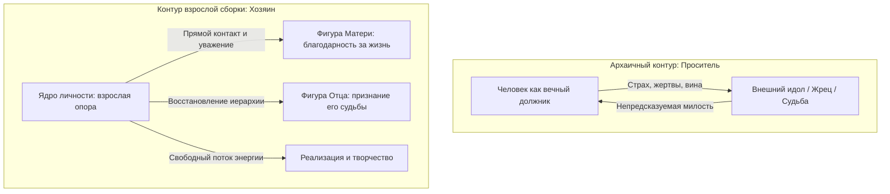

# Сборка узлов: возвращение себе прав хозяина

Закрой глаза и мысленно произнеси всего одно слово: «Мама». Или «Отец». Или «Деньги».

Твоё тело откликается мгновенно. Без пауз, без долгих размышлений и без переводчиков: внезапным сжатием под рёбрами, тёплой волной в ладонях или тупым спазмом в затылке.

В этом соматическом резонансе нет никакой эзотерической магии. На протяжении десятков тысяч лет наши предки интуитивно выносили фигуры рода во внешний мир: шаманские камлания у ночного костра, античные храмовые мистерии, средневековые исповеди, современные системные расстановки. Но во всех этих древних формах человек почти всегда занимал одну и ту же униженную позу: согнутая шея, прерывистое дыхание, колени в поклоне, умоляющий взгляд снизу вверх.

Человек приходил к чужим алтарям как вечный должник и проситель. Он вымаливал у духов или предков крохи снисхождения, приносил жертвы и соглашался на самоуничижение.

Здесь мы совершаем фундаментальный шаг: **всё родовое поле уже развёрнуто внутри твоего собственного тела**.  
Твоя нервная система — единственный прибор во Вселенной, который невозможно подкупить или обмануть. Ты больше не стоишь на коленях перед чужими идолами. Ты занимаешь законное место хозяина своей жизни и смотришь на ключевые фигуры рода из точки зрелого, спокойного присутствия.

Эта глава — кульминационная точка сборки. Всё, что мы исследовали на предыдущих страницах книги, соединяется здесь в единое целое.

---

## Просить о милости — или войти на правах хозяина

Веками архаичный подход к судьбе строился на чувстве собственной изначальной дефектности:
- **Сакральное место:** капище, закрытый монастырь или кабинет всемогущего гуру.
- **Ритуал унижения:** страх, покаянные поклоны, откуп и заслуживание прощения.
- **Внешняя проекция:** фигуры отца и матери переносились на деревянных идолов, духов или живых заместителей, чью загадочную волю нужно было мучительно угадывать.

Тело человека в таком контуре моментально каменело: грудная клетка скована страхом, диафрагма заблокирована, в позвоночнике — тяжёлое рабское напряжение. Это была попытка договориться с судьбой ценой отказа от собственного достоинства.

Мы выбираем другой путь — прямой, взрослый доступ к собственному бессознательному. Ты проверяешь правду не авторитетом жрецов, а живым откликом собственных тканей и наводишь порядок в своём сердце самостоятельно.

---

> [!NOTE]
> ## Метакогниция и позиция «Я-как-контекст»: нейробиология суверенитета
>
> Пионер исследований метакогнитивного мониторинга Джон Флейвелл и создатель терапии принятия и ответственности (ACT) Стивен Хейс описали переход к позиции **«Я-как-контекст»** (Self-as-Context).  
> Когда человек проваливается в детскую вину, в его мозге гиперактивна сеть пассивного режима (DMN), пережёвывающая токсичные воспоминания, а миндалина удерживает вегетативную нервную систему в ступоре или панике.
>
> Но стоит включить спокойное, безоценочное наблюдение за своими телесными сигналами, как активируется **сеть значимости** (salience network, описанная Винодом Меноном и Лусиной Уддин) и передняя островковая кора. Управление переходит к исполнительным долям мозга.  
> Страх не исчезает по щелчку пальцев, но кора перестаёт трактовать соматический спазм как катастрофу. Человек выходит из роли испуганного ребёнка и становится спокойным капитаном на собственном мостике.

---

## История Георгия: перелом на станции метро

Георгий проектировал архитектуру распределённых баз данных с виртуозной лёгкостью гроссмейстера. Восемь лет в разработке высоконагруженных систем: он за доли секунды вычислял критические гонки процессов в терабайтных кластерах серверов. Но в отношениях с живыми людьми Георгий оставался абсолютно глух. Он жил в несокрушимой броне собственной логической непогрешимости.

Его жена Кристина ушла полгода назад. Тихо, без криков и битья посуды, в один из промозглых ноябрьских вечеров:  
— Жора, ты стал абсолютно стеклянным. Я просто задыхаюсь рядом с твоей стерильной идеальностью. Я больше не могу жить с роботом.

За ней щёлкнул дверной замок.

С того дня Георгий ночами напролёт читал психологическую литературу: анализировал детскую травму брошенности, холодность сбежавшего отца, материнское требование «всегда держать лицо». Головой он понял абсолютно всё. Но каждую ночь ложился в ледяную пустую постель, сжимая кулаки до белых костяшек.

---

Четверг. 18:40. Станция метро «Парк культуры», Кольцевая линия. Час пик, влажный гул многотысячной толпы, запах мокрой шерсти пальто и грохот приближающегося поезда. Георгий стоял у массивной гранитной колонны, механически пролистывая экран смартфона.

Случайно поднял глаза.

В пяти метрах от него в толпе двигалась Кристина. Та самая тёмно-синяя парка с памятной серебристой царапиной на замке кармана. Рядом с ней шёл высокий плечистый мужчина в расстёгнутом сером пальто. Его широкая ладонь лежала на её пояснице — тепло, уверенно, оберегающе.

Кристина запрокинула голову и звонко, заливисто рассмеялась. Её глаза сияли неподдельным, живым светом. За четыре года брака Георгий ни разу не видел её такой открытой и счастливой.

В груди Георгия что-то оборвалось с глухим треском.

Воздух застрял в лёгких. Пальцы судорогой впились в грани телефона. Зубы сжались так, что заломило виски. Древняя мышечная память взорвалась яростным импульсом: сделать два шага вперёд, схватить мужчину за воротник, оттолкнуть его, закричать, потребовать, доказать своё право!

И в ту же долю секунды внутри вспыхнула тридцатилетняя родительская директива:  
*«Держи себя в руках! Не смей устраивать публичных сцен! Будь выше этого! Ты же интеллигентный, воспитанный мальчик!»*

Мать кричала в его височных костях. Лицо Георгия мгновенно превратилось в неподвижную гипсовую маску. Плечи безвольно опустились. Дыхание замерло. Снаружи перед толпой стоял вежливый, безупречный горожанин.

Поезд с визгом затормозил. Двери с шипением распахнулись. Кристина со своим спутником вошли в вагон, ни разу не повернув головы. Состав тронулся и унёсся в темноту туннеля.

Георгий остался стоять на сквозняке пустеющей платформы. Под его идеальным фасадом «я в полном порядке» трещали вековые латы.

Он не побежал вслед за поездом. Но на этот раз — не из высокомерной гордыни. Новая, рождающаяся в нём взрослая суть подсказала: броситься к ней сейчас — значит снова включить дешёвый театр, снова надеть маску уязвлённого спасателя и попытаться замазать живую боль дешёвыми логическими уговорами.

Он медленно поднялся по эскалатору наверх. На улице Садового кольца в лицо ударил морозный февральский ветер. Георгий впервые за тридцать лет шёл без защитного панциря. Ему было невыносимо холодно. Дико, мучительно больно. Но это была его собственная, подлинная человеческая жизнь.

---

## Звонок, который расставил границы

В воскресенье ровно в восемь вечера зазвонил телефон. Мать.  
В трубке звучал привычный, выверенный до интонации коктейль из тревоги и упрёка:  
— Жорочка, сынок… Как ты там совсем один? Ты поел горячего супа? Ох, а у меня с утра так сильно покалывает в боку, даже не знаю, доживу ли до утра…

Раньше Георгий немедленно бросался на амбразуру: вызывал платных врачей, часами успокаивал мать по телефону, заваливал её доставками лекарств и продуктов. Он завершал этот ритуал идеальным сыном: абсолютно опустошённым, выжатым, виноватым — и безупречным.

Но в этот вечер старый сценарий дал сбой.

Георгий глубоко выдохнул животом, почувствовал твёрдый пол под ногами и заговорил спокойным, бархатным голосом взрослого мужчины:

— Мама. Я слышу, как тебе тревожно и одиноко. Но это твоё собственное состояние и твоя жизнь. Я оставляю их тебе. Я очень люблю тебя, мама. Но я больше не буду обслуживать твою тревогу и лечить твою тоску своими жизненными силами.

В трубке повисла мертвенная, леденящая тишина. Слышно было, как на её кухне монотонно капает неисправный кран — точь-в-точь как в тот день, когда отец собрал чемодан и ушёл, оставив десятилетнего Жору заложником материнского горя.

— Ты стал совершенно чужим, Георгий, — ядовито и сухо процедила мать. — Ты стал точной копией своего бессердечного отца. Такой же ледяной эгоист.

Слово «отец» обожгло солнечное сплетение Георгия калёным железом. Желудок привычно скрутило спазмом вины. Старая программа шептала: «Упади на колени, извинись, согрей её!»

Но Георгий посмотрел на свои ладони. Они были тёплыми и расслабленными. Пульс бился ровно.

— Я люблю тебя, мама. Доброй ночи. Я кладу трубку.

Он нажал красную кнопку отбоя.

В комнате повисла тишина. Никакой восторженной эйфории не было — была вязкая, горькая вина. Но под этой виной впервые проступил твёрдый титановый каркас его личной границы. Он оставил матери её судьбу. И впервые в жизни не предал самого себя.

---

## Неотправленное письмо в три часа ночи

Глубокая ночь. Комната, где когда-то звенел её смех и стоял запах её духов. Белый лист текстового редактора. Мигающий курсор.

Георгий набирал текст:  
*«Кристина, привет. Я наконец-то всё осознал. Я понял истинную причину своего молчания и эмоциональной глухоты…»*

Стер. Второй вариант — длинный, аналитический, с терминами о контрзависимости и детской травме отвержения. Стер.  
Третий вариант он писал сквозь душившие его слёзы, вбивая пальцы в клавиатуру:

*«Ты кричала от одиночества — а я прятался в монитор. Ты просила душевного тепла — а я предлагал графики и сухие алгоритмы. Ты ушла не от плохого человека, Кристина. Ты ушла от абсолютной внутренней пустоты. Прости меня за всё. Я научился чувствовать и быть живым слишком поздно для нас двоих».*

Палец замер над кнопкой «Отправить». Сердце колотилось в горле.

Георгий перечитал письмо в четвёртый раз. И вдруг кристально ясно осознал горькую истину:  
Каждое слово этого покаянного письма было написано **исключительно для него самого**. Ради того, чтобы снять с себя жгучий стыд, снова показаться благородным осознанным героем и поставить красивую точку в своём внутреннем гештальте.

Кристине это письмо было совершенно не нужно. Она шла в метро, смеясь и держась за руку другого мужчины. Её жизнь текла дальше. Отправить ей это покаяние — значило снова эгоистично использовать её как жилетку для своего облегчения.

Георгий нажал комбинацию клавиш `Ctrl+A`. Затем кнопку `Delete`.

Экран стал ослепительно белым. Он захлопнул крышку ноутбука. За окном спал огромный ночной город. В этом поступке не было пафоса — в нём была настоящая мужская зрелость.

---

## Сборка в тишине

Георгий опустился на ковёр посреди пустой комнаты. Сел прямо, скрестив ноги. Закрыл глаза.

— Я признаю и проявляю узел моего отца.

В груди отозвался старый детский холод. Но на этот раз — без обиды и без злости. Пришла тихая, светлая печаль по уставшему, сломленному человеку. Отец занял своё законное место позади правого плеча.

— Я признаю и проявляю узел моей матери.

В солнечном сплетении разлилось плотное тепло. Искренняя благодарность за подаренную жизнь. Глубокий поклон её женской доле. Без вины, без высокомерия спасателя. Мать встала на своё законное место позади левого плеча.

— Я проявляю самого себя. Своё собственное Я.

Мгновение абсолютной тишины. И вдруг стопы и ладони наполнились мощным, пульсирующим жаром. Кровь свободно и горячо хлынула по всему телу.

Георгий открыл глаза.

Комната была пуста. Но впервые в жизни это была не комната брошенного, несчастного мальчика. Это было суверенное пространство взрослого хозяина своей судьбы. Без долгов. Без чужих программ в голове.

На столе остывала чашка чая. На полке стояла прочитанная книга.

Для Кристины он опоздал навсегда.  
Для новых людей в его жизни — всё только начиналось.  
А для главной встречи — встречи с самим собой — время наконец пришло.

---

## Практика: сборка собственного контура силы

Выдели тридцать минут тишины. Сядь устойчиво на пол или стул с прямой спиной. Ощути опору в крестце и стопах. Расслабь нижнюю челюсть. Сделай три длинных выдоха через рот, отпуская напряжение в плечах. Прикрой глаза.

Поочередно пригласи во внутреннее пространство три ключевые фигуры:

1. **Образ Отца.** Посмотри на него без идеализации и без детского суда. Скажи ему:  
   *«Отец. Я принимаю от тебя мужскую силу и семя жизни по полной цене. Я оставляю тебе твои ошибки, слабости и твою судьбу. Ты — большой, а я — твой сын (дочь). Твоё место позади меня навсегда законно»*.  
   Отметь, как тепло наполняет правую сторону спины.
2. **Образ Матери.** Посмотри на неё без роли спасателя:  
   *«Мама. Я принимаю от тебя дар жизни и материнское тепло. Я больше не лечу твою душу своими силами и не несу твою печаль. Я с любовью оставляю тебе твою судьбу и беру свою собственную»*.  
   Почувствуй, как расслабляется левая сторона груди.
3. **Образ Себя Настоящего.** Положи ладони на низ живота:  
   *«Я занимаю своё законное место в жизни. Моё тело свободно. Моё сердце открыто. Я возвращаю себе право чувствовать, творить и любить в полную силу»*.
4. **Интеграция.** Сделай глубокий вдох животом и ощути, как устойчивая волна силы поднимается от стоп к макушке. Твой внутренний контур собран.

---

> [!IMPORTANT]
> **Главная мысль главы**  
> Сборка личности — это не униженная мольба о милости предков, а возвращение себе суверенных прав хозяина своей жизни. Твоё тело — самый чуткий и неподкупный компас, безошибочно указывающий путь к внутренней свободе.

---

> [!TIP]
> **Интерактивный помощник**  
> Если тебе трудно нащупать опору внутри, а сепарация от родителей или завершение старых отношений вызывают удушающую вину — напиши нам в окне внизу. Мы поможем бережно выстроить твою внутреннюю иерархию и вернуть покой твоему сердцу.
