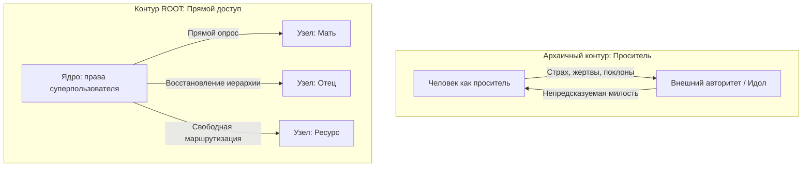

# Сборка узлов: древняя практика на новом языке

Закрываешь глаза. Называешь узел — «Мама», «Отец», «Деньги», «Дело». Тело отвечает сразу. Без переводчика.

Ничего нового. Тысячи лет люди выносили фигуры рода вовне: круги, камлания, храмовые мистерии, расстановки. Поза одна и та же: шея в плечах, короткое дыхание, колени в поклоне, взгляд снизу вверх.

Здесь сдвиг простой. Поле **внутри**. Тело — единственный прибор, который не врёт. Ты не проситель у чужого алтаря. Ты хозяин. Смотришь на свои узлы из нейтральной точки.

Эта глава — сборка. Всё, что было до, сходится здесь.

---

## Просить о милости — или иметь доступ

Старый контур веками один:

* **Место.** Капище, роща, закрытый зал.
* **Инициация.** Поклоны, жертвы, «заслужить контакт».
* **Внешняя проекция.** Фигуры рода на заместителях, идолах, тотемах. Угадывай их волю.

Слабое место: ты по умолчанию недостаточен. Входишь просителем. Молишь. Жертвуешь. Выпрашиваешь одобрение предков.

Тело отвечает сразу: каменеют плечи, замирает диафрагма, в спине — рабское напряжение. Договор с сетью ценой самоуничижения.

Здесь иначе. Прямой доступ к своей копии родовой сети. Проверяешь телом. Наводишь порядок сам — без гуру и ритуальных костылей.

---

## Почему старое и новое на одном железе

Законы не меняются тысячелетиями:

1. **Единое поле.** Закрыл глаза — не провалился в пустоту. Подключился к шине, где каждый узел оставил след в долговременной памяти.
2. **Имя как адрес.** Произнёс «Отец», «Деньги», «Право на жизнь» — нейросеть разворачивает массив. Тело выдаёт сырое: холод за грудиной, пульс в висках, волну тепла.
3. **Иерархия.** Потомок встаёт выше источника — «спасает» или судит родителей — магистраль блокируется. Тело платит усталостью и челюстным блоком.

---

## Наблюдатель и гипервизор

> [!NOTE]
> **Метакогниция и «я-как-контекст»**
> Джон Флейвелл (метакогнитивный мониторинг) и Стивен Хейс (Self-as-Context в ACT): переход от просителя к суверенному наблюдателю опирается на переключение сетей. В позе просителя DMN крутит вину и стыд, миндалина держит дорсальный коллапс или симпатический испуг. Наблюдатель без оценки включает сеть значимости (Менон, Уддин) и переднюю островковую долю — управление уходит в исполнительную сеть. Аффект не исчезает: кора наконец видит соматические маркеры без детской паники. Ощущение простое: был гостем, который на каждое действие просит разрешение. Стал тем, кто работает с оборудованием напрямую. Тело перестаёт быть полем боя за право существовать. Становится прибором.

---

## Позиция наблюдателя — это и есть root-доступ

Архаика оставляла тебя заложником образов. Предок — карающий исполин: тахикардия, ступор. Взрослый снова ребёнок.

В ROOT смотришь из покоя Ядра. Узлы без ярлыков «хороший / плохой». Из нейтрали видна топология: сбои — ошибки адресации, не кармические проклятия. На ровное внимание сеть выравнивает потенциалы сама.

---

## Метро, чужая рука

Жора проектировал распределённые базы так, как дышат мастера. Восемь лет в разработке. Race conditions в терабайтных кластерах ловил за доли секунды. Людей — нет. Был уверен в своей непогрешимости.

Кристина ушла полгода назад. Без истерик. В промозглый ноябрь: *«Жора, ты стал стеклянным. Я задыхаюсь рядом с твоей идеальностью. Устала жить с роботом»*. Щёлкнул замок. С тех пор он ночами читал ROOT: отца-беглеца, материнское «держи лицо». Головой понял. Постель всё равно пустая.

Четверг. 18:40. «Парк культуры». Кольцевая. Толпа, мокрая шерсть, грохот поезда. Жора у колонны, за экраном смартфона.

Поднял взгляд.

В пяти метрах — Кристина. Та же тёмно-синяя парка с серебристой царапиной на замке кармана. Рядом — высокий в расстёгнутом пальто. Ладонь на её пояснице: уверенно, спокойно, тепло. Она запрокинула голову и смеялась. Ключицы дрожали. Глаза искрились. Живая. Такой рядом с ним не была ни дня.

Грудь прошило. Не обидой — обрывом шины.

Воздух встал колом. Пальцы свело на гранях телефона. Челюсти до скрежета. Мышечная память рванулась: два шага, схватить за плечо, потребовать, доказать.

В ту же миллисекунду — родительская директива тридцати лет: *«Держи себя. Не устраивай сцену. Будь выше. Улыбайся. Ты же интеллигентный мальчик»*.

Голос громко в височных костях. Лицо — гипсовая маска. Плечи опустились. Дыхание замерло. Снаружи — безупречный горожанин.

Поезд завизжал. Двери. Кристина со спутником вошли, не повернув головы. Состав унёсся в туннель.

Жора на сквозняке пустеющей платформы. Под фасадом «я в порядке» трескалась броня.

Он не побежал. Не из гордыни. Новая сборка сказала: подойти сейчас — снова выкатить «рациональное решение», снова маска спасателя поверх живой боли.

Эскалатор. Февральский воздух полоснул по лицу. Впервые за годы — без лат. Нестерпимо холодно. Дико больно. И это была его собственная ткань.

---

## Звонок, который не чинит

Мать звонила по воскресеньям в 20:00. Привычная тревога: *«Жорочка… Как ты один? Поел горячего? У меня покалывает в боку…»*

Раньше — сразу на амбразуру: продукты, врачи, часы заверений. Закрывал сессию идеальным сыном. Выпотрошенным. Уставшим. Безупречным.

В это воскресенье сценарий рухнул.

— Мама. Я слышу твою тревогу. Это твоё состояние. Я оставляю его тебе. Я люблю тебя. Но прекращаю тебя обслуживать и лечить своими ресурсами.

Ледяная тишина. На кухне в панельном доме капает кран — эхо того дня, когда отец ушёл, оставив десятилетнего заложником материнского горя.

— Ты стал чужим, Георгий, — сухая горечь. — Совсем как твой отец. Холодный и бессердечный.

Слово «отец» обожгло диафрагму. Желудок скрутило. Старая программа: на колени, извиняйся, утешай.

Жора посмотрел на ладони. Прямые. Тёплые. Пульс ровный.

— Я люблю тебя, мама. Сейчас я завершаю разговор.

Красная кнопка.

Тяжёлая тишина. Не эйфория — вязкая вина. Под ней впервые — каркас границы. Он оставил матери её судьбу. И не предал себя.

---

## Черновик, который не для неё

Глубокая ночь. Комната, где когда-то пахло её духами. Пустой лист. Курсор мигает.

*«Кристина, привет. Я наконец понял корень своего молчания…»*

Стирает. Второй вариант — длинный, зрелый, про контрзависимость. Стирает. Третий — короткий, без фильтра, со спазмом в горле и слезами на пробеле:

*«Ты кричала от боли — а я уходил в расчёты. Ты просила тепла — а я приносил алгоритмы. Ты ушла не от плохого человека. Ты ушла от пустого места. Прости. Я научился быть живым слишком поздно для нас двоих».*

Палец над отправкой. Сердце у горла.

Перечитал в четвёртый раз.

Правда: каждое слово — **для него**. Ради разрядки. Ради того, чтобы снова выглядеть осознанным героем и закрыть тикет.

Кристине это не нужно. Её жизнь течёт иначе. Отправить — снова использовать её как инструмент снятия дискомфорта.

`Ctrl+A`. Удалить. Белый экран.

Закрыл крышку. За окном спал город. Без фанфар. Только мужество взрослого.

---

## Пустая комната

Сел на ковёр. Скрестил ноги. Закрыл глаза.

— Проявляю узел отца.

В груди — старый детский холод. Без обиды. Светлая печаль по уставшему человеку. Отец на своём месте.

— Проявляю узел матери.

Плотное тепло. Благодарность за жизнь. Поклон её доле. Без вины. Без желания быть её родителем. Мать на своём месте.

— Проявляю узел собственного Я.

Секунда тишины. Ладони и стопы наполнились жаром. Кровь и импульсы пошли по периферии.

Открыл глаза.

Комната пуста. Впервые — не комната покинутого мальчика. Пространство хозяина. Без долгов. Без чужих процессов в автозагрузке.

На столе остывал чай. На полке — прочитанная книга.

Для Кристины он опоздал навсегда.
Для новых встреч — впереди жизнь.
Для встречи с собой — наступило время.

`[Сборка узлов завершена]`

---

## Практика: собрать свой контур

Сядь устойчиво. Опора позвоночнику. Расслабь челюсть. Длинный выдох. Плечи вниз. Прикрой веки.

По очереди вызови: мать, отца, свою реализацию. На каждом — сырая телеметрия. Не чини образы. Не приукрашивай. Из нейтрали произнеси:

> «Я вижу каждого из вас в поле моей сети. Признаю ваше присутствие и ваше законное место. Возвращаю вам ваш груз, тревоги и судьбу. Занимаю своё место в иерархии. Удерживаю порядок».

Выдох в живот. Мышцы отпускают. Тепло в стопах.

Маршрут от диагностики до сборки пройден. Архитектура держится, пока ты сознательно слушаешь свои датчики.

> [!IMPORTANT]
> **Закон главы**
> Сборка узлов — не мольба о снисхождении. Это возврат прав суперпользователя. Тело — единственный датчик, который не купишь и не обманешь.
