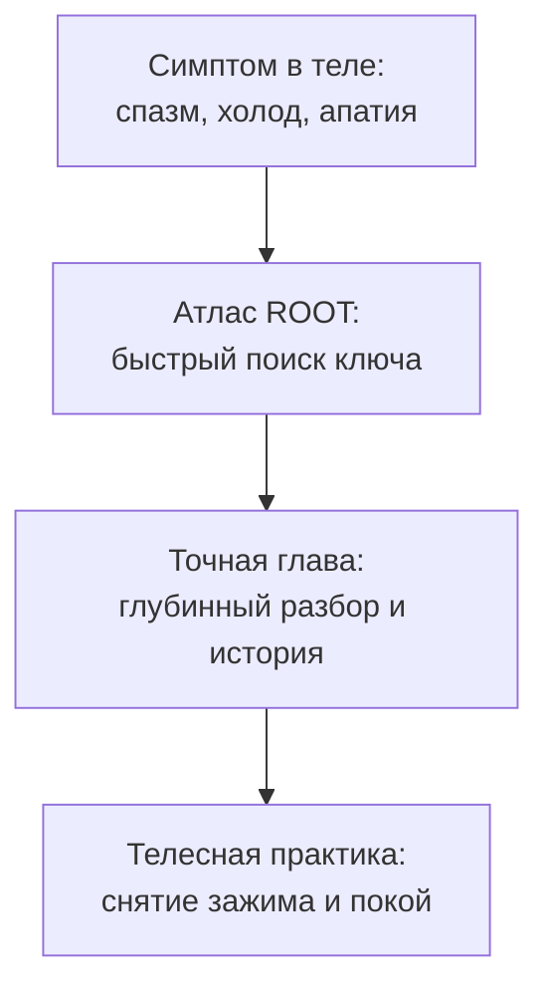

# Атлас ROOT: скорая помощь и навигатор по книге

Если ты последовательно читал эту книгу от первой до сорок девятой главы, сделай глубокий вдох и выдох. Основной путь пройден.

Эту главу не нужно читать запоем. Воспринимай этот Атлас как **домашнюю соматическую аптечку первой помощи**.

В реальной жизни трудности всегда настигают внезапно: неожиданный конфликт с любимым человеком сжимает горло ледяным обручем, внезапный кассовый разрыв вызывает приступ паники среди ночи, или вдруг на ровном месте накатывает липкая, необъяснимая апатия, когда не хочется даже вставать с кровати.

В такие минуты наш рассудок теряется и начинает лихорадочно метаться.  
Открой этот раздел. Не пытайся анализировать текст холодным умом — **сканируй строчки телом**.  
Там, где твоё дыхание споткнётся, где по коже побегут мурашки или отзовётся болью застарелый спазм — именно туда указывает стрелка твоего внутреннего компаса. Переходи по ссылке в указанную главу и возвращай себе целостность.

---

> [!NOTE]
> ## Ассоциативная память тела: почему симптом точнее логики
>
> Классическая когнитивная теория распространяющейся активации (Spreading Activation Theory Коллинза и Лофтуса) доказала: в долговременной эмоциональной памяти информация хранится не по алфавиту, а в виде ассоциативных нейронных кластеров.  
>
> Когда ты фокусируешься на конкретном телесном маркере — сжатии челюстей, ледяных стопах, коме в горле, — вентромедиальная префронтальная кора головного мозга мгновенно поднимает из архивов памяти именно то биографическое событие, в котором этот телесный паттерн закрепился впервые.  
> Тело работает как сверхбыстрый поисковый индекс: физический симптом безошибочно указывает на повреждённый закон семейной системы.

---

## Раздел I. Карантин: когда жизнь застряла в коконе

Бывают периоды, когда окружающий мир словно отделён от тебя толстым пуленепробиваемым стеклом: ты всё видишь, всё понимаешь, но не можешь ни к чему прикоснуться. Сил нет, желания выгорели, внутри царит глухая фантомная невидимость. Это состояние **Карантина**: аварийный режим психики, спасающей тебя от воображаемой смертельной перегрузки.

### Ранние травмы безопасности
* **Кокон отчуждения.** *В теле:* ощущение глухого саркофага вокруг груди, дыхание только верхушками лёгких, страх любого взгляда.  
  → Перечитай [«Границы и оборона»](/16-boundaries-safekeeping-defense-isolation) и [«Вторичные процессы»](/11-secondary-processes).
* **Паралич старта.** *В теле:* ледяной пот, дрожь в коленях и внезапная тошнота при мысли о первом шаге или публичном заявлении о себе.  
  → Перечитай [«Прерванное движение»](/24-bug-08-interrupted-movement).
* **Ожог близости.** *В теле:* приступ раздражения и телесного онемения в ответ на ласку, спазм в яремной вырезке.  
  → Перечитай [«Принцип открытого порта»](/27-open-port-principle).
* **Слияние с партнёром.** *В теле:* потеря ощущения своих ног и таза, пульсирующее сжатие в висках при чужом плохом настроении.  
  → Перечитай [«Симбиоз процессов»](/28-process-symbiosis).
* **Невидимый хомут чужого авторитета.** *В теле:* скованность в плечах, ком в горле, ощущение, что ты живёшь не свою жизнь.  
  → Перечитай [«Чужой процесс»](/26-foreign-background-process) и [«Лишний элемент»](/17-bug-01-extra-element).

### Травмы проявления в социуме
* **Поклонение кумирам вместо своего пути.** *В теле:* зияющая сквозная пустота в центре грудины, привычная защитная сутулость.  
  → Перечитай [«Лишний элемент»](/17-bug-01-extra-element).
* **Годовщины трагедий и календарные провалы.** *В теле:* внезапная свинцовая слабость, депрессивный провал в одни и те же даты года без видимых причин.  
  → Перечитай [«Замещение»](/21-bug-04-substitution).
* **Страх сцены и видимости.** *В теле:* пересохшее горло, ватные ноги, ледяные ладони, желание провалиться сквозь землю.  
  → Перечитай [«Состояния нервной системы»](/13-os-background-states) и [«Открытый порт»](/27-open-port-principle).

### Родовые узлы и переплетения
* **Раздвоение отцовской фигуры.** *В теле:* острое чувство, что ты сидишь не на своём месте, стреляющая боль в крестце.  
  → Перечитай [«Базовые узлы: Мать и Отец»](/08-basic-nodes-mother-father).
* **Искупление вины предков.** *В теле:* безотчётное чувство себя вечным должником мира, чугунная плита на грудной клетке.  
  → Перечитай [«Чужой профиль»](/22-bug-06-identification) и [«Унаследованные данные»](/12-inherited-data).
* **Бедность как условие выживания.** *В теле:* приступ панической тревоги и желание немедленно всё спустить при получении крупной суммы.  
  → Перечитай [«Деньги: куда утекает достаток»](/44-resources-in-network) и [«Виды политик доступа»](/09-access-policy-types).

### Тяжёлые кризисные состояния
* **Тяга вслед за умершим близким.** *В теле:* пепельный оттенок лица, постоянный глубокий холод в костях, тоска по кладбищу.  
  → Перечитай [«Прерванное движение»](/24-bug-08-interrupted-movement).
* **Бегство в болезнь.** *В теле:* повторяющиеся воспаления, хронические мышечные спазмы, когда нужно принять сложное решение.  
  → Перечитай [«Тело»](/48-body-interface) и [«Вторичные выгоды»](/15-secondary-benefits-firewall).
* **Смертельные детские клятвы.** *В теле:* ощущение невидимой бетонной стены перед собой, окаменение фасций.  
  → Перечитай [«То, что нельзя переписать»](/35-irreversible-commit).

> **Слова освобождения при соматическом отклике:**  
> Положи руку на зону дискомфорта и произнеси:  
> *«Я отделяю себя и свою сегодняшнюю жизнь от этой старой боли.  
> Я забираю свои силы, своё тело, свои деньги и своё время в сегодняшний день.  
> Я признаю право этой трагедии быть в истории моей семьи — по той цене, что уже была уплачена. Но она завершена.  
> Я выбираю жить в настоящем»*.

---

## Раздел II. Деньги: исцеление заблокированного достатка

Если в твоей жизни деньги не задерживаются, сгорают в непредвиденных поломках или достаются каторжным трудом на износ — разберись, где нарушен природный закон обмена.

### Шесть корневых причин денежных утечек

1. **Токсичные склейки смыслов:**  
   «Деньги — это грязь», «Богатство привлекает зависть и смерть», наивная детская надежда на чудо.  
   → Перечитай [«Битая ссылка»](/20-bug-05-broken-link) и [«Чужой профиль»](/22-bug-06-identification).
2. **Саботаж собственных проектов:**  
   Панический страх повторить прошлую неудачу, слив всей прибыли на решение проблем родственников.  
   → Перечитай [«Цели»](/46-goal-living-rhythm) и [«Долги: аренда чужой опоры»](/45-debts-and-survival-strategies).
3. **Родовая боль раскулачивания и нищеты:**  
   Бессознательная лояльность голодавшим предкам: «Если я буду жить в изобилии, я предам память деда».  
   → Перечитай [«Унаследованные данные»](/12-inherited-data) и [«Сеть»](/03-network).
4. **Сломанный цикл своего дела:**  
   Разрыв связки: *творец → качественный труд → достойная цена → уважительный обмен → радость достатка*.  
   → Перечитай [«Деньги»](/44-resources-in-network).
5. **Страх перед людьми и клиентами:**  
   Панический ужас критики, страх выставить чек, стыд называть реальную стоимость часа.  
   → Перечитай [«Границы»](/16-boundaries-safekeeping-defense-isolation) и [«Отношения»](/47-connections-in-network).
6. **Тайные обеты самопожертвования:**  
   Убеждённость, что духовность несовместима с сытостью, гордость своей нищетой.  
   → Перечитай [«Вторичные выгоды»](/15-secondary-benefits-firewall).

---

## Раздел III. Маски: с кем ты воюешь на самом деле

Когда ты кричишь на мужа, требуешь идеальности от ребёнка или трепещешь перед начальником — посмотри правде в глаза: ты разговариваешь не с живым человеком. Твоя психика натянула на него маску из детства.

### Каталог проекций

* **Маска исключённого родственника:** когда от партнёра требуют искупить грехи пропавшего деда. → [«Недостающий элемент»](/18-bug-02-missing-element).
* **Маска нерождённого брата или сестры:** ощущение, что ты живёшь за двоих. → [«Процесс в диспетчере»](/37-process-in-task-manager).
* **Маска родителя на партнёре:** ожидание безусловного обожания и страх отвержения от супруга. → [«Отношения»](/47-connections-in-network).
* **Маска жертвы, агрессора или спасателя:** бег по драматическому треугольнику манипуляций. → [«Триангуляция»](/23-bug-07-triangulation).
* **Маска вечного должника:** готовность бесплатно работать сутками из страха наказания. → [«Долги»](/45-debts-and-survival-strategies).

> **Слова снятия проекции:**  
> Посмотри мысленно на человека и скажи:  
> *«Я осознаю, что смотрел на тебя сквозь маску моего прошлого.  
> Я снимаю с тебя это чужое лицо.  
> Ты — отдельный живой человек со своей судьбой.  
> Я забираю свои детские претензии и страхи обратно в своё сердце.  
> Я хочу встретиться с тобой настоящим»*.

---

## Раздел IV. Экспресс-диагностика за семь шагов

Если тебя накрыла острая эмоциональная буря — пройди этот короткий маршрут самопомощи:

1. **Осознай симптом:** не давай ему оценок («я плохой»), просто констатируй факт: тревога, гнев, паника.
2. **Найди точку в теле:** где живёт это чувство прямо сейчас? Горло, диафрагма, затылок, колени?
3. **Вспомни самый ранний кадр:** когда твоё тело впервые испытало точно такое же сжатие?
4. **Дай место слезам и разрядке:** подыши глубоко, согрей эту зону ладонью, позволь застрявшему всхлипу или вздоху выйти наружу.
5. **Произнеси слова разделения:** отдели своё сегодняшнее взрослое «Я» от испуганного ребёнка из воспоминания.
6. **Ощути опору под стопами:** вернись в физическую комнату, почувствуй вес тела и устойчивость пола.
7. **Сделай одно простое действие:** выпей стакан тёплой воды, умойся, выйди на свежий воздух.

---

> [!IMPORTANT]
> **Главная мысль главы**  
> Атлас ROOT — это твоя верная путеводная карта. Законы человеческой души не переиграть упрямством или насилием над собой. Но стоит тебе прислушаться к живому голосу своего тела — и любая боль превратится в ступень к зрелой свободе.

---

> [!TIP]
> **Интерактивный помощник**  
> Если ты запутался в своих телесных симптомах или не можешь понять, какая именно глава нужна тебе прямо сейчас — напиши в окне диалога о своих ощущениях. Мы поможем бережно расшифровать сигнал твоего тела и подскажем точный шаг к исцелению.
