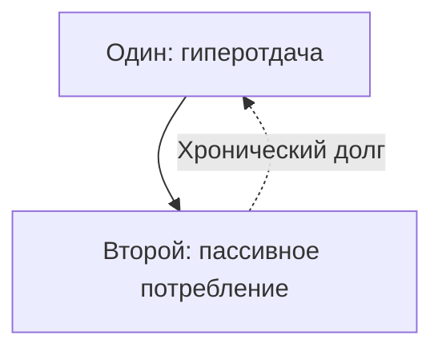

# Атлас ROOT: карта сбоев и масок

Если шёл по главам по порядку — можно сделать паузу на [сборке узлов](/49-node-assembly-in-network) и сразу к эпилогу. Этот раздел — аптечка. Открывай, когда тело внезапно сжалось, а ум буксует и не понимает, что случилось.

Сканируй пункты через тело. Отклик — сигнал: иди в ту главу. Не заучивай список. Доверяй живой телеметрии.

---

## Как тело находит нужную ячейку

> [!NOTE]
> **Ассоциативная память и lookup-таблицы**
> Атлас работает как контентно-адресуемая память. Коллинз и Лофтус: в долговременной памяти поиск идёт не линейным перебором, а через активацию узлов по сходству (spreading activation). Фокус на маркере — сжатие челюсти, холод в пояснице, ком в горле — и вентромедиальная префронтальная кора поднимает релевантный кластер биографии. В низкоуровневом коде это LUT и хэш-индекс: адрес ячейки за константное время по ключу. Здесь ключ — физический симптом. Он указывает на повреждённый протокол.

---

## I. Карантин: когда жизнь застряла

Мир виден чётко, а коснуться нельзя. Апатия. Фантомная невидимость. Внутри активен **Карантин**: аварийная изоляция портов. Ядро защищается от мнимой перегрузки.

**Ключевые главы:** [«Границы»](/16-boundaries-safekeeping-defense-isolation) · [«Открытый порт»](/27-open-port-principle) · [«Симбиоз процессов»](/28-process-symbiosis) · [«Унаследованные данные»](/12-inherited-data) · [«Деньги: где утекает поток»](/44-resources-in-network)

### Ранние сбои

* **Приём-саркофаг.** *Тело:* ощущение капсулы, поверхностное дыхание верхушками легких. → [«Границы»](/16-boundaries-safekeeping-defense-isolation), [«Вторичные процессы»](/11-secondary-processes)
* **Тяжёлый старт.** *Тело:* ледяной пот и тремор при мысли о первом публичном шаге. → [«Прерванное движение»](/24-bug-08-interrupted-movement)
* **Обжёгся на близости.** *Тело:* онемение в тазу, спазм в яремной вырезке. → [«Принцип открытого порта»](/27-open-port-principle)
* **Растворение в партнёре.** *Тело:* опора уходит из стоп, пульсирующее сжатие в висках. → [«Симбиоз процессов»](/28-process-symbiosis)
* **Чужой авторитет.** *Тело:* ощущение фальши, невидимый хомут на шее. → [«Чужой фоновый процесс»](/26-foreign-background-process), [«Лишний элемент»](/17-bug-01-extra-element)

### Сбои на выходе в люди

* **Кумир вместо себя.** *Тело:* сквозная пустота в грудине, защитная сутулость. → [«Лишний элемент»](/17-bug-01-extra-element)
* **Календарные провалы.** *Тело:* внезапная свинцовая тяжесть в ногах без соматических причин. → [«Замещение»](/21-bug-04-substitution)
* **Страх сцены.** *Тело:* ватные колени, холодный пот ладоней. → [«Фоновые состояния ОС»](/13-os-background-states), [«Открытый порт»](/27-open-port-principle)

### Круг Рода

* **Раздвоение отца.** *Тело:* соматическое чувство чужого места, острая боль в крестце. → [«Базовые узлы»](/08-basic-nodes-mother-father)
* **Долг за вину предка.** *Тело:* безотчетная вина перед миром, чугунная плита на грудной клетке. → [«Чужой профиль»](/22-bug-06-identification), [«Унаследованные данные»](/12-inherited-data)
* **Бедность как безопасность.** *Тело:* приступ паники при поступлении крупной суммы на счет. → [«Деньги»](/44-resources-in-network), [«Виды политик доступа»](/09-access-policy-types)

### Тяжёлые состояния

* **Уход за ушедшим.** *Тело:* пепельный оттенок кожи, глубокий холод в костях. → [«Прерванное движение»](/24-bug-08-interrupted-movement)
* **Сброс в болезнь.** *Тело:* рецидивирующие воспаления, хронические спазмы. → [«Тело»](/48-body-interface), [«Вторичные выгоды»](/15-secondary-benefits-firewall)
* **Старые клятвы.** *Тело:* глухая невидимая стена, скованность фасций. → [«То, что не переписать»](/35-irreversible-commit)

### Протокол при отклике

> «Я отделяю себя и свою сегодняшнюю жизнь от этого [назови сбой].
> Я отделяю свои силы, тело, деньги и время от этого процесса.
> Я признаю право события быть в моей истории — по той цене, что была заплачена. Но это завершено и навсегда осталось в прошлом.
> Моя система чиста».

---

## II. Деньги: что блокирует поток

Сжатый классификатор. Развёрнуто — в [гл. 44](/44-resources-in-network), [гл. 45](/45-debts-and-survival-strategies), [гл. 46](/46-goal-living-rhythm).

### Шесть групп блоков

**Склейки:** «деньги = собственная ценность», «деньги = смертельная опасность», оцепенение, надежда на чудесный клад. → [«Битая ссылка»](/20-bug-05-broken-link), [«Чужой профиль»](/22-bug-06-identification)

**Проекты:** фиксация на прошлых неудачах, склейка «я равен продукту», аварийный слив маржи на обслуживание чужих долгов. → [«Цели»](/46-goal-living-rhythm), [«Долги»](/45-debts-and-survival-strategies)

**Род:** каторжный надрыв предков, токсичная верность репрессированным, серые криминальные схемы выживания. → [«Унаследованные данные»](/12-inherited-data), [«Сеть»](/03-network)

**Цикл дела:** разрыв магистрали *создатель → продукт → справедливая цена → эквивалентный обмен → чистый остаток*. → [«Деньги»](/44-resources-in-network), [«Цели»](/46-goal-living-rhythm)

**Люди:** глухой карантин от клиентской базы, панический страх критики сообщества. → [«Границы»](/16-boundaries-safekeeping-defense-isolation), [«Отношения»](/47-connections-in-network)

**Искажения:** искусственное сжатие масштаба, невыплаканный траур, компульсивная жертвенность, скрытые обеты нищеты. → [«Деньги»](/44-resources-in-network), [«Вторичные выгоды»](/15-secondary-benefits-firewall)

### Четыре поломки вектора цели

1. Из животного страха выживания (дефицитарный запуск).
2. Ради покупки чужого одобрения (интроекция).
3. В жестких рамках родового «безопасного минимума».
4. Фальшивая цель — скопированная из чужой социальной ленты.

### Готовые формулы деактивации

> «Я вижу тебя и твой опыт. Спасибо за жизнь. Я — это я, ты — это ты. Я отделяю свою жизнь от твоей боли».

> «Я вижу этот образ и признаю его законное право быть в моей истории. Я отделяю себя и свои деньги от того процесса. Тот процесс завершён».

> «Я возвращаю себе права на управление своим временем, телом и ресурсами. Моя воля свободна».

### Перекос обмена

Один только отдаёт — второй только берёт. Готовность принимать не открывает встречный поток, если второй порт закрыт.

Маршрут: диагностика пропорций → способен ли партнёр отдавать → свернуть гиперопеку / перекрыть слив в пустой бак → вместе чинить или цивилизованно закрыть сокет. Разбор — [«Дисбаланс обмена»](/25-bug-09-exchange-disbalance), [«Отношения»](/47-connections-in-network).

### Расширенная аптечка (из гл. 39)

**Род и верность**

7. **Разрыв слепой лояльности.** Саботаж изобилия ради сохранения связи с бедным родом. → *«Дорогие предки, я остаюсь вашим потомком, даже если буду жить в радости и достатке»*.
8. **Восстановление исключённого узла.** → *«Ты вошел в систему раньше меня. Твое место священно. Я возвращаю его тебе»*.

**Партнерство**

9. **Локализация утечки.** → *«Я сочувствую твоей боли, но не сливаюсь с ней. Твой процесс принадлежит тебе. Я перекрываю утечку»*.
10. **Завершение невалидного контакта.** → *«Счёт обнулён. Ты на своём месте, я — на своём»*.

**Освобождение ядра**

11. **Аннулирование долговых претензий.** → *«Я обнуляю баланс взаимных счетов. Никто никому ничего не должен»*.
12. **Возврат инвестированной энергии.** → *«Я отзываю вложенный ресурс себе. Твою долю оставляю тебе»*.
13. **Согласие с ценой прошлого.** → *«Я принимаю прошлое по полной цене, которая была уплачена. Война завершена»*.
14. **Снятие защитной маски.** Вторичная выгода болезни или слабости. → *«Я снимаю маску беспомощности»*.

**Суверенный ресурс**

15. **Принятие родового потока.** → *«Я принимаю жизнь во всем ее объеме и передаю ее дальше»*.
16. **Автономное решение.** → *«Старый алгоритм деактивирован. Я действую из взрослой опоры на себя»*.

---

## III. Маски: с кем в действительности ведется диалог

Мозг накладывает на живых людей **маски** — слепки из детской памяти. Полный разбор — [«Снять чужое лицо»](/43-render-removal).

### Родовые маски

* **Исключённый** → [«Недостающий элемент»](/18-bug-02-missing-element)
* **Нерождённый** → [«Недостающий элемент»](/18-bug-02-missing-element), [«Процесс в диспетчере»](/37-process-in-task-manager)
* **Тот, кто смотрит в могилу** → [«Прерванное движение»](/24-bug-08-interrupted-movement)
* **Супруг вместо родителя** → [«Отношения»](/47-connections-in-network)
* **Тяжёлая женская доля** → [«Замещение»](/21-bug-04-substitution)

### Драматические амплуа

* **Жертва**, **Агрессор**, **Спасатель**, **Судья** → [«Гигиена оператора»](/34-operator-safety-hygiene), [«Триангуляция»](/23-bug-07-triangulation)

### Детские фиксации

* **Брошенный ребенок** → [«Прерванное движение»](/24-bug-08-interrupted-movement)
* **Бунтующий подросток** → [«Инверсия»](/19-bug-03-inversion)
* **Отвергнутый** → [«Базовые узлы»](/08-basic-nodes-mother-father), [«Снять чужое лицо»](/43-render-removal)
* **Вечный должник** → [«Долги»](/45-debts-and-survival-strategies)
* **Суровый кредитор** → [«Дисбаланс обмена»](/25-bug-09-exchange-disbalance)

### Абстрактные маски

* **Пустота** → [«Пустота и откат»](/42-resource-loading)
* **Идеальный родитель** → [«Чужой фоновый процесс»](/26-foreign-background-process)
* **Монстр** (деньги / проявление) → [«Битая ссылка»](/20-bug-05-broken-link)
* **Болезнь как субъект** → [«Тело»](/48-body-interface)
* **Предатель** → [«Битая ссылка»](/20-bug-05-broken-link), [«Снять чужое лицо»](/43-render-removal)

### Формула снятия маски

> «Я осознаю, что закрываю тебя проекцией [назови маску]. Я снимаю этот рендер. Ты — отдельный человек [кто на самом деле]. Я забираю свою проекцию обратно себе».

---

## IV. Сборка узлов

Закрой глаза. Назови узел — «Мама», «Отец», «Деньги». Тело выдаст сырой ответ без посредников. Веками эти фигуры выносили наружу через обряды и поклоны. В той позе мышцы дрожали от подчинения, дыхание цепенело.

ROOT меняет полярность: поле **внутри**. Тело — датчик. Ты — **хозяин**, сканируешь сеть из нейтрали ядра. Точное имя открывает телеметрию. Иерархия на месте — перегрузка спадает.

Финальный протокол — [«Сборка узлов»](/49-node-assembly-in-network).

---

## V. Диагностика: семь шагов

Маршрут: жалоба → заряженная точка в теле → архивный кадр → разрядка → сепарация → проверка телом → действие в реальности.

Все шаги с разбором — в главе [«Диагностика»](/36-diagnosis).

---

## Зачем эта карта

ROOT — про то, что нарушить нельзя. Законы поля не обсуждаются и не переигрываются силой воли: либо учтены, либо платишь.

Если после этих страниц в груди не фоновая тревога, а спокойное любопытство — карта легла.

> [!IMPORTANT]
> **Закон атласа**
> Атлас — аптечка быстрого доступа: отклик тела ведёт к нужной главе, а не к пассивному зачитыванию списков.
