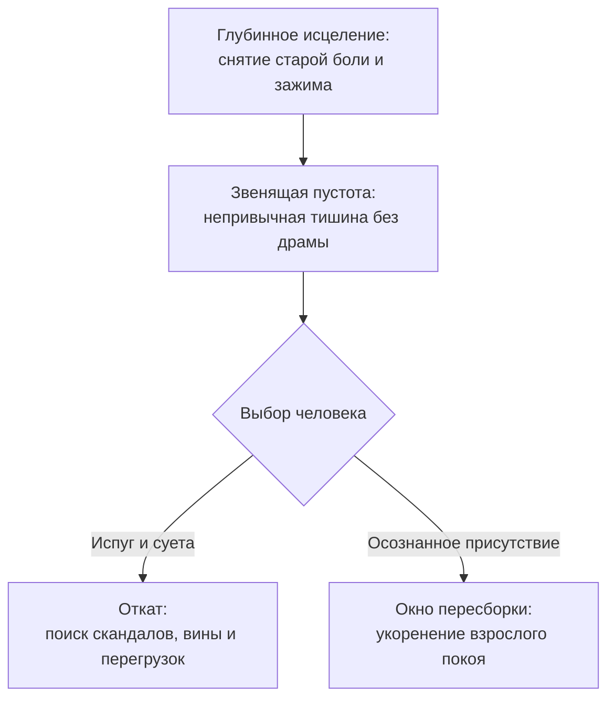

# Пустота после исцеления: почему старая боль пытается вернуться

В дешёвых книгах по популярной психологии перемены описывают как волшебную сказку: ты осознал детскую травму, поплакал на сессии, и с понедельника начинается идеальная, безоблачная жизнь под радугой.

Реальность человеческой души устроена куда глубже, тоньше и требовательнее.

Когда тяжёлый многолетний узел наконец распутан, когда выплаканы детские обиды на отца и мать, в теле наступает непривычная, почти пугающая тишина. Исчезает привычный чугунный ком в горле. Разжимается диафрагма. Челюсти больше не стиснуты в ночной судорогой.

И вдруг человек сталкивается со странным феноменом: **пустотой**.

Внутри нет драмы. Не с кем воевать. Не перед кем оправдываться. Никто не обвиняет, и не нужно никому ничего доказывать. И эта звенящая тишина нередко вызывает панику: наш древний мозг привык десятилетиями существовать в окопах боевой тревоги. Адреналин был его привычным топливом. И теперь нервная система мечется: *«Где знакомая боль? Где катастрофа? Да, нам было плохо, но в том аду мы хотя бы знали, как выживать!»*

Здесь вступает в силу фундаментальный закон: **душевная пустота долго пустой не остаётся**. Если ты не научишься бережно обживать это пространство новой любовью, покоем и творчеством, в него с бешеной силой хлынет прежний токсичный мусор.

---

---

> [!NOTE]
> ## Почему старое пытается вернуться: нейробиология рецидива
>
> Профессор Массачусетского технологического института (MIT) Энн Грейбил долгие годы исследовала базальные ганглии и полосатое тело (стриатум). Она выяснила, что устойчивые эмоциональные автоматизмы упаковываются мозгом в прочные нейронные блоки — так называемые «чанки».  
> Даже когда префронтальная кора принимает осознанное решение жить по-новому, базальные ядра не стирают старую тропинку за один день. Они держат её в резерве на случай опасности.
>
> В поведенческой психологии известен феномен **вспышки угасания** (extinction burst): перед тем как окончательно исчезнуть, старый рефлекс делает мощную, пиковую попытку вернуть привычный спазм. Лимбическая система устраивает провокацию — всплеск беспричинной ярости, паники или чувства вины, проверяя прочность новых границ.  
> Если человек пугается этого отката, мозг восстанавливает старую нейронную колею. Но если удержать паузу и просто продышать эту волну — старый шаблон распадается навсегда.

---

## Три опасные ловушки на пороге новой жизни

Когда спадает первый восторг от освобождения, на пути встают три коварных искушения:

### 1. Катастрофизация естественного отката: «Я снова всё разрушил»
Через неделю после глубокого прорыва ты вдруг срываешься на ребёнка или чувствуешь знакомый ком в желудке. Ум немедленно включает палача: «Ничего не сработало! Я безнадёжен, терапия — шарлатанство, я обречён страдать вечно».  
Остановись. Это не крах. Это та самая «вспышка угасания». Твоя нервная система проверяет: действительно ли ты готов оставаться спокойным взрослым, когда штормит?

### 2. Судорожный побег от тишины в новую драму
Человек не выдерживает чистого покоя. Ему кажется, что если он не страдает, то он «не развивается». И он немедленно взваливает на себя пять непосильных проектов, вступает в сомнительные отношения или записывается на изнуряющий марафон. Лишь бы заглушить тишину внутри.

### 3. Интеллектуальное зазнайство
«Я всё понял про своего отца и мать, я прочитал всю книгу, я теперь просветлённый». Но стоит матери сделать ядовитое замечание по телефону — как горло перехватывает спазмом, а в трубку летят детские оправдания. Понимание умом ничего не стоит без ежедневного телесного присутствия.

---

## Живая история: Виктория и четверг в офисе

Виктория тридцать два года носила в солнечном сплетении то, что сама называла «чугунным ежом» — раскалённый, колючий спазм фоновой тревоги. Ей казалось, что если она хоть на секунду расслабится, случится непоправимое.

Когда на сессии она наконец разрешила себе прожить и выплакать детское горе от постоянных придирок матери, чугунный ком в груди растаял. Первые три дня она летала как на крыльях: воздух казался сладким, цвета на улице — яркими.

Но к полудню четверга внутри наступила гулкая, сосущая тишина. Словно из живота вынули привычный фундамент, пусть даже он был сделан из колючей проволоки.

Виктория пошла к кофемашине в офисе. Рядом стояла её коллега Елена — взвинченная, с красными от бессонницы глазами. Елена с грохотом швырнула на стойку кипу документов:

— Вика, ты опять влезла в мою сводную таблицу по поставщикам?! Я же просила тебя только посмотреть формулы в шапке, а ты переписала половину строк! Из-за тебя всё поехало!

Интонация Елены — резкая, визгливая, с нотками плохо скрытого презрения — была до боли, до микрона похожа на голос покойной матери Виктории:  
*«Вечно ты лезешь куда не просят, безрукая! Всё только портишь!»*

По шее Виктории полоснула волна обжигающего жара. Древний мышечный рефлекс взорвался внутри криком:  
*«Упади на колени! Извиняйся! Схвати эти бумаги, сиди всю ночь, переделывай заново, заслужи прощение, иначе тебя уничтожат!»*

Виктория застыла. Её пальцы уже потянулись к бумагам.

Но в этот момент она вспомнила своё обещание быть бережной к себе. Она сделала медленный, протяжный выдох. Опустила внимание в стопы, почувствовав холодную твёрдость керамогранита под подошвами туфель. Расправила плечи. Посмотрела прямо в разгневанные глаза коллеги — спокойно и твёрдо:

— Нет, Лена. Я проверила формулы ровно в двух ячейках, о которых мы договаривались с утра. Ни одной строчки твоих данных я не трогала. Твой отчёт — это твоя ответственность. Я не стану переделывать его за тебя.

Елена осеклась на полуслове, гневно фыркнула, схватила свою чашку и стремительно ушла в коридор.

Виктория вернулась за свой рабочий стол. Её колени мелко дрожали от схлынувшего адреналина. Рука по привычке метнулась к корпоративной почте: открыть двадцать входящих писем, утонуть в чужих авралах, заглушить липкий страх отвержения!

Она остановила руку. Положила ладонь на солнечное сплетение. Там было пусто и зябко.

— Эта пустота — не рана, — тихо, одними губами прошептала Виктория. — Это чистое место для моей собственной жизни.

Она встала из-за стола, подошла к панорамному окну и просто постояла десять минут, глядя на проплывающие над крышами города облака. Холод в животе медленно, мягко сменился ровным, ласковым теплом. Она не предала себя. Она не пустила старых призраков в свой чистый дом.

---

## Практика: двухминутная калибровка тишины

Когда в течение дня ты ловишь себя на привычном импульсе — вспышке ярости, желании срочно угодить обидчику или тревожно уткнуться в ленту новостей:

1. **Стоп-кадр.** Замри физически ровно на десять секунд. Не двигай ни руками, ни ногами.
2. **Сканирование тела.** Где прямо сейчас зарождается спазм?  
   - Сжались ли зубы?  
   - Поднялись ли плечи к ушам?  
   - Затаилось ли дыхание в груди?
3. **Отказ от старой платы.** Сделай глубокий вдох через нос и плавный, свободный выдох через рот. Скажи себе мысленно:  
   > «Я вижу эту провокацию. Мой старый страх пытается вернуть меня в прошлое.  
   > Но я больше не живу в окопе. Мой внутренний дом свободен.  
   > Я остаюсь здесь — в безопасности, достоинстве и тишине».
4. **Возврат в реальность.** Ощути прикосновение одежды к коже, тяжесть стоп на полу, звук ветра за окном. Ты здесь. Ты взрослый. Всё хорошо.

---

> [!IMPORTANT]
> **Главная мысль главы**  
> Душевная устойчивость — это не отсутствие испытаний и не застывший памятник непогрешимости. Это твой ежедневный, спокойный выбор: не отдавать освободившееся пространство сердца старой пыли и чужим обидам.

---

> [!TIP]
> **Интерактивный помощник**  
> Если после глубоких перемен тебя накрывает чувство вины, тревоги или страх пустоты — напиши нам в окне диалога. Мы поможем бережно пройти этот период адаптации и укрепить твою новую опору.
