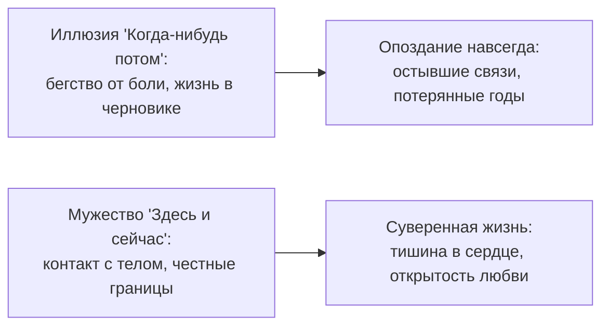

# Эпилог: не опоздай со своей жизнью

Вот и перевёрнута последняя страница.

Большинство людей, открывающих подобные книги, бросают чтение на третьей главе. Они бегло проглядывают текст, вежливо кивают головой и спешат вернуться в привычный, безопасный омут повседневности: «У меня всё нормально. Я просто немного устал. Разберусь с этим когда-нибудь потом».

Но ты дошёл до конца. Ты не отвёл взгляда.

За этими пятьюдесятью двумя главами остался огромный, честный и порой мучительный путь: от первого робкого взгляда на переплетения семейной системы до исцеления застарелых обид, снятия чужих масок с близких людей, наведения порядка в деньгах и возвращения контакта с собственным телом.

Где-то на этих страницах твоё сердце наверняка сжалось от боли, вспоминая историю **физика Льва и его дочери Маши**. Человек двадцать один год возил во внутреннем кармане кашемирового пальто французскую фарфоровую куклу, наивно веря, что украденную детскую любовь можно привезти в чемодане спустя десятилетия. И рухнул на колени перед умирающей женщиной, которая тихо сказала: «Мне не нужна ваша кукла. И вы мне больше не нужны».

Их трагедия заключалась вовсе не в том, что между ними угасла любовь. Невидимая нить между отцом и дочерью вибрировала каждую секунду их разлуки: Лев тосковал по ней на Лазурном берегу, Маша плакала от бессилия в сыром подвале. Их беда была в другом: **они оба жили в иллюзорном «потом»**.

Лев откладывал живую встречу на «когда откроют границы», на «когда я совершу великое открытие». А время — единственный невосполнимый ресурс человеческой жизни — текло неумолимо. То, что ты не дал живому ребёнку сегодня, невозможно компенсировать миллионами долларов двадцать лет спустя. На том конце провода воцарилась ледяная тишина.

---

---

Книга ROOT никогда не обещала тебе лёгкой жизни или мгновенного чуда. Она даёт нечто неизмеримо более ценное:

- **Живой язык**, на котором ты наконец можешь честно разговаривать со своим телом, не обманывая себя красивыми оправданиями.
- **Внутренний компас**, помогающий мгновенно обнаружить, где ты снова провалился в детскую вину или надел маску спасателя.
- **Суверенные права**, в которых ты годами отказывал самому себе: право на собственные деньги, право на усталость, право не быть идеальным сыном или дочерью, и великое право жить свою собственную, никем не утверждённую судьбу.

Ты уже знаешь: исцелить можно исключительно **свою сторону провода**. Ты не можешь переписать прошлое своих родителей, не можешь спасти тех, кто выбрал страдать, и не можешь заставить другого человека любить тебя насильно. Но ты можешь с глубоким поклоном оставить им их судьбу — и сделать шаг в собственную взрослую жизнь.

В ту страшную и благословенную ночь Георгий сидел на полу пустой прихожей, где ещё витал тонкий аромат духов ушедшей Кристины. Он не знал, что эта тишина станет началом его настоящего возрождения.

Впервые в жизни блестящий математик не бросился к компьютеру, не стал чертить графики и не заглушил боль алкоголем. Он просто сидел на ковре в темноте и безутешно плакал. В этих горьких мужских слезах умер холодный, стеклянный робот. И родился живой, чувствующий, уязвимый и по-настоящему сильный человек.

Та ночь на полу стала его истинной точкой входа. Его подлинным ROOT-доступом к собственной душе.

Твоя точка входа, возможно, уже позади. А возможно, она разворачивается прямо в эту секунду.  
Не закрывай доступ к себе, когда закроешь эту книгу. Позвони тому, кого любишь. Обними своего ребёнка. Выйди на улицу, вдохни сырой ночной воздух полной грудью. Почувствуй живое тепло в своих ладонях.

И самое главное: **пожалуйста, никогда больше не опаздывай со своей жизнью**.

---

## Краткий компас сердца: куда смотреть, когда сжимается тело

Если привычная тревога снова попытается постучать в твою дверь — сверься с этой памяткой:

| Что происходит в теле | Где корень проблемы | Какая глава поможет | Первое действие для исцеления |
|---|---|---|---|
| Острый спазм перед важным разговором | Первичный живой страх уязвимости | [Глава 10: Первичные сигналы](/10-primary-signals) | Замри и спокойно продыши эту волну 90 секунд |
| Язвительный сарказм, ярость и броня | Вторичная защита от старой боли | [Глава 11: Вторичные процессы](/11-secondary-processes) | Сними маску агрессора и признай, где на самом деле больно |
| Беспричинная ночная паника и тоска | Неосознанная верность трагедиям предков | [Глава 12: Унаследованные данные](/12-inherited-data) | Положи руку на грудь: *«Это ваша судьба, я оставляю её вам»* |
| Заражение чужой истерикой на работе | Потеря собственного центра устойчивости | [Глава 13: Фоновые состояния](/13-os-background-states) | Верни внимание в стопы и не включайся в чужой пожар |
| Стеклянный потолок в финансах | Бессознательный страх: «быть богатым = смерть» | [Глава 44: Деньги](/44-resources-in-network) | Сними родовую клятву бедности и разреши себе сытость |
| Непосильный долг и жизнь на износ | Аренда строгого отца у банка | [Глава 45: Долги](/45-debts-and-survival-strategies) | Признай пустоту за спиной и обопрись на собственные ноги |
| Срыв планов к середине недели | Тело саботирует навязанные чужие цели | [Глава 46: Цели и живой ритм](/46-goal-living-rhythm) | Снизь нажим, уполовинь шаг и спроси: *«Чья это цель?»* |
| Тяга к холодным, ранящим партнёрам | Попытка достучаться до родителей через любимых | [Глава 47: Отношения](/47-connections-in-network) | Сними с любимого человека лицо отца или матери |
| Опустошение после разговора с родными | Нарушение иерархии: игра в родителя для матери | [Глава 28: Симбиоз процессов](/28-process-symbiosis) | Вернись на место младшего: перестань поучать родителей |
| Хронический телесный симптом или зажим | Тело материализует заблокированные слёзы | [Глава 48: Тело](/48-body-interface) | Пройди обследование у врача и начни бережный диалог с телом |

---

> [!IMPORTANT]
> **Главная мысль эпилога**  
> ROOT не обещает безоблачного неба. Он возвращает тебе святое право быть единственным и суверенным хозяином своего сердца. Всё, что тебе нужно для счастья, уже дышит внутри тебя прямо сейчас.

---

> [!TIP]
> **Мы остаёмся на связи**  
> Твой путь только начинается. Если на этом пути возникнут сомнения, если старая боль попробует взять реванш или тебе просто понадобится бережная поддержка — напиши в окне диалога внизу экрана. Мы всегда рядом, чтобы помочь тебе сохранить контакт с собой настоящим.
