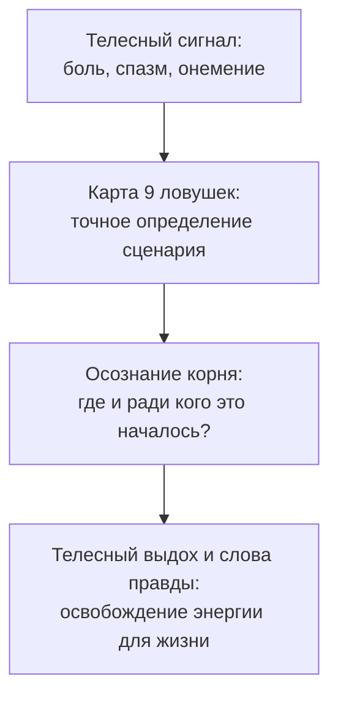

# Карта душевных ран: 9 системных ловушек

Перед тобой не абстрактная сухая теория. Это честное зеркало твоей жизни.

Каждая из девяти ловушек, описанных в этой книге, возникла не от глупости или слабости. Каждая из них когда-то была единственным способом, с помощью которого испуганный маленький ребёнок пытался выжить, защитить семью или сохранить связь с холодными, страдающими родителями.

Пройди по этому списку медленно, без спешки.  
Не пытайся оценивать себя холодным умом. Прислушивайся к телу: ком в горле, внезапная тяжесть в затылке, сжатие под ложечкой или волна жара в груди подскажут правду точнее любых тестов.

---

> [!NOTE]
> ## Точное имя исцеляет: нейробиология маркирования чувств
>
> Профессор Калифорнийского университета в Лос-Анджелесе (UCLA) Мэттью Либерман в серии экспериментов с функциональной МРТ открыл феномен **маркирования аффекта** (affect labeling).  
>
> Когда человек испытывает смутную, безымянную тревогу, его миндалевидное тело бьёт непрерывную тревогу, отравляя организм гормонами стресса. Но стоит человеку точно и честно назвать суть происходящего словами — «я несу вину за своего деда», «я стал родителем для собственной матери», «моё движение к нежности было заморожено в детстве», — как активируется вентролатеральная префронтальная кора.  
> Она мягко тормозит панику миндалины. Вегетативный дистресс снижается на глазах. Точное имя возвращает тебе контроль над ситуацией.

---

## Девять системных ловушек и их соматические маркеры

| № | Название ловушки | Глава | Как это ощущается в теле и в жизни |
|---|---|---|---|
| 1 | **Чужой груз (Лишний элемент)** | [Гл. 17](/17-bug-01-extra-element) | Мучительное чувство, что ты проживаешь не свою жизнь. Внутренняя сосущая пустота. Ты достигаешь навязанных родителями целей, но они не приносят ни капли радости. |
| 2 | **Тоска по отвергнутому (Недостающий элемент)** | [Гл. 18](/18-bug-02-missing-element) | Экзистенциальное одиночество среди людей. Ощущение: «я здесь лишний, я занимаю чужое место». Бессознательная тяга к саморазрушению или уходу в глухой затвор. |
| 3 | **Перевёрнутая иерархия (Инверсия)** | [Гл. 19](/19-bug-03-inversion) | Попытка быть «родителем» для своей матери или отца. Каменный спазм плеч и поясницы. Хроническая смертельная усталость, ощущение себя спасателем всего мира. |
| 4 | **Родовой сценарий (Замещение)** | [Гл. 21](/21-bug-04-substitution) | Мистическое повторение кризисов предков: банкротство ровно в сорок лет (как у отца), развод в тридцать три (как у матери). Чужой сценарий управляет судьбой. |
| 5 | **Склейка боли (Битая ссылка)** | [Гл. 20](/20-bug-05-broken-link) | Парализующий конфликт «хочу, но убегаю». Деньги бессознательно равны раскулачиванию и смерти. Любовь равна предательству и унижению. Успех равен расплате. |
| 6 | **Чужая вина (Чужой профиль)** | [Гл. 22](/22-bug-06-identification) | Иррациональный пожизненный стыд за то, что ты живёшь лучше своих нищих или страдающих родственников. Необъяснимый страх наказания за счастье и достаток. |
| 7 | **Громоотвод (Триангуляция)** | [Гл. 23](/23-bug-07-triangulation) | Роль буфера между ссорящимися родителями или партнёрами. Болезни и проблемы обостряются ровно тогда, когда семья на грани распада. Жизнь заложника чужих ссор. |
| 8 | **Замороженная нежность (Прерванное движение)** | [Гл. 24](/24-bug-08-interrupted-movement) | Ледяной панцирь в груди и ком в горле при любой попытке открыться и пойти в близость. Отталкивание любящих людей, бегство в холодное одиночество. |
| 9 | **Сломанный баланс (Дисбаланс обмена)** | [Гл. 25](/25-bug-09-exchange-disbalance) | Перекос: либо жертвенная отдача последних сил до выгорания, либо капризное потребительство. Страх назвать честную цену за свой труд, спазм в горле. |

---

## Как читать связки: почему ловушки приходят парами

В реальной жизни системные раны редко ходят поодиночке. Они поддерживают друг друга, образуя устойчивые психологические узлы:

* **Чужой груз + Перевёрнутая иерархия:**  
  Ты встаёшь выше матери, пытаясь её осчастливить, и заодно взваливаешь на себя её нереализованные амбиции. Итог — сорванная спина и потеря личной жизни.
* **Склейка боли + Замороженная нежность:**  
  В детстве проявление любви обернулось жестоким отвержением. Теперь твоё тело парализует ужас всякий раз, когда партнёр делает шаг навстречу.
* **Громоотвод + Сломанный баланс:**  
  Привычка с детства спасать родителей от развода превращает взрослого человека в вечного донора чужого комфорта на работе и в семье.

---

## Если ты обнаружил у себя сразу несколько ран

Сделай глубокий вдох и медленный, спокойный выдох. В этом нет трагедии. Человеческая душа сложна, и наш опыт редко бывает линейным.

Не пытайся «исправить всё разом» за один вечер.  
Выбери **одну-единственную точку** — ту, где твоё тело отзывается сильнее всего прямо сейчас. Перейди в соответствующую главу. Прочитай живую историю, побудь с мыслями героев, выполни телесную практику.

Когда разжимается один ключевой спазм, соседние узлы начинают ослабевать сами собой. Гармония возвращается в тело шаг за шагом.

---

> [!IMPORTANT]
> **Главная мысль главы**  
> Душевную рану невозможно исцелить, пока ты боишься посмотреть ей в лицо. Назови свою боль её подлинным именем, верни чужой груз в прошлое — и твоё тело подарит тебе долгожданный покой.

---

> [!TIP]
> **Интерактивный помощник**  
> Если ты узнал себя в нескольких сценариях и не знаешь, с чего начать распутывать клубок — напиши об этом в диалоговом окне. Мы поможем бережно определить корневой узел и подскажем самый безопасный первый шаг.
